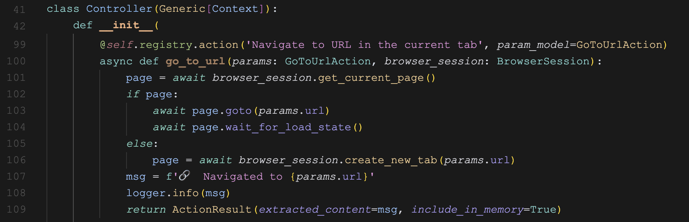
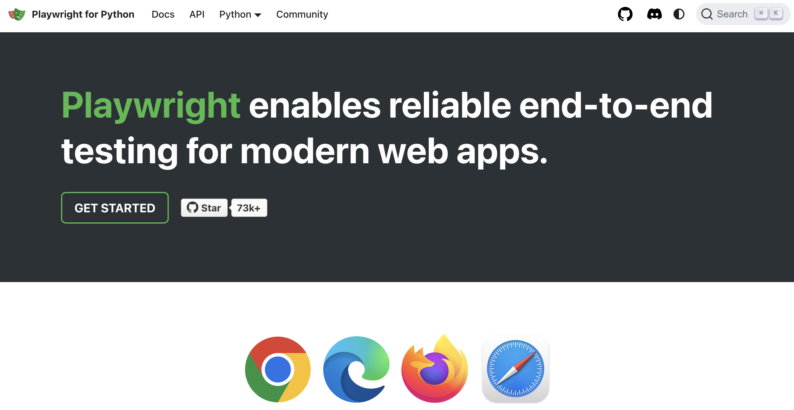

# 再学 Browser Use 的工具使用

昨天我们学习了 Browser Use 是如何利用大模型的结构化输出能力实现工具调用的，通过 `AgentOutput` 模式定义与动态的 `ActionModel` 的结合，实现了智能体在执行网页任务时灵活选择和使用不同浏览器工具。

今天我们将继续探讨浏览器操作的具体实现以及如何自定义工具，以扩展 Browser Use 的功能。

## 工具调用流程

现在我们再次回顾下 Browser Use 智能体循环中的 `step()` 方法，调用大模型得到下一步动作后，接着通过 `multi_act()` 方法对每一个动作进行执行：

```python
model_output = await self.get_next_action(input_messages)
result: list[ActionResult] = await self.multi_act(model_output.action)
```

接着通过 `controller.act()` -> `registry.execute_action()` 等方法，最后从 `registry.actions` 数组中找到对应的动作：

```python
action = self.registry.actions[action_name]
return await action.function(params=validated_params, **special_context)
```

这里的 `registry.actions` 表示 Browser Use 支持的所有工具，那么这个数组是怎么来的呢？我们可以在 `Controller` 的初始化函数中找到答案：



截图中是 `go_to_url` 的实现，注意函数上有一个 `@self.registry.action` 装饰器，这个装饰器的作用就是将这个函数实现添加到 `registry.actions` 数组中。

## 内置浏览器动作

`Controller` 是 Browser Use 工具调用的核心，这个类定义在 `browser_use/controller/service.py` 文件中，除了上面截图中的 `go_to_url` 动作，Browser Use 一共内置了 20 个操作浏览器的动作，如 `open_tab`、`scroll_down`、`extract_content` 等，我将其整理成表格如下：

| Action 名称                  | 描述（中文）                                                                                      |
|------------------------------|---------------------------------------------------------------------------------------------------|
| done                         | 完成任务 - 返回文本，并指明任务是否完成（success=True 表示已完成，否则未完全完成）                |
| search_google                | 在 Google 中搜索查询，查询应像人类在 Google 搜索时一样具体，不要太模糊或太长                      |
| go_to_url                    | 在当前标签页导航到指定 URL                                                                         |
| go_back                      | 后退                                                                                              |
| wait                         | 等待指定秒数，默认 3 秒                                                                           |
| click_element_by_index        | 通过索引点击元素                                                                                  |
| input_text                   | 向输入交互元素输入文本                                                                            |
| save_pdf                     | 将当前页面保存为 PDF 文件                                                                         |
| switch_tab                   | 切换标签页                                                                                        |
| open_tab                     | 在新标签页打开指定 URL                                                                            |
| close_tab                    | 关闭已有标签页                                                                                    |
| extract_content              | 提取页面内容以获取特定信息，例如所有公司名、特定描述、所有关于 xyc 的信息、带结构的公司链接等      |
| get_ax_tree                  | 获取页面的可访问性树，格式为“role name”，返回指定数量的元素                                      |
| scroll_down                  | 页面向下滚动指定像素数，未指定则滚动一页                                                          |
| scroll_up                    | 页面向上滚动指定像素数，未指定则滚动一页                                                          |
| send_keys                    | 发送特殊按键字符串，如 Escape、Backspace、Insert、PageDown、Delete、Enter，支持快捷键组合          |
| scroll_to_text               | 如果找不到想要交互的内容，则滚动到该文本位置                                                      |
| get_dropdown_options         | 获取原生下拉框的所有选项                                                                          |
| select_dropdown_option       | 通过选项文本为交互元素选择下拉选项                                                               |
| drag_drop                    | 拖放页面上的元素或坐标，适用于画布绘图、可排序列表、滑块、文件上传和 UI 重排等                    |

另外还内置了 6 个操作 `Google Sheets` 的动作，这些动作仅对 `https://docs.google.com` 域名生效：

| Action 名称                  | 描述（中文）                                                               |
|-------------------------------------------------|------------------------------------------------------|
| read_sheet_contents                             | 获取整个工作表的内容                                    |
| read_cell_contents                              | 获取一个单元格或单元格范围的内容                          |
| update_cell_contents                            | 更新一个单元格或单元格范围的内容                          |
| clear_cell_contents                             | 清除当前选定的任意单元格                                |
| select_cell_or_range                            | 选择特定的单元格或单元格范围                             |
| fallback_input_into_single_selected_cell        | 备用方法在（仅一个）当前选定的单元格中输入文本              |


## Playwright 介绍

分析上面内置的 20 个浏览器动作源码后你会发现，绝大多数动作都是通过 `Playwright` 库实现的，比如上面的 `go_to_url` 动作就是通过 Playwright 的页面对象完成的：

```python
page = await browser_session.get_current_page()
if page:
  await page.goto(params.url)
  await page.wait_for_load_state()
```

[Playwright](https://playwright.dev/) 本身是一个现代网页应用的端到端测试库，支持多种浏览器和平台，并提供丰富的功能和工具，帮助开发者进行高效的 Web 测试。



它具备如下特性和亮点：

- **跨平台、跨浏览器、跨语言**：支持 Chromium、WebKit 和 Firefox 等现代渲染引擎，可在 Windows、Linux 和 macOS 等平台上进行测试，支持 Python、TypeScript、.Net、Java 等主流语言；
- **可靠性、稳定性**：它的 *自动等待功能（Auto-wait）* 无需开发者人为设置超时；*专为网页设计的断言（Web-first assertions）* 会自动重试直至条件满足；支持配置重试策略，捕获执行轨迹、视频和截图，确保测试的可靠性和稳定性；
- **无需权衡、没有限制**：和现代化浏览器架构保持一致，通过在进程外运行测试，摆脱了进程内测试运行器的限制。支持跨多个标签页、多个来源和多个用户的测试场景，并能够创建不同用户的不同上下文。此外，Playwright 产生真实用户无法区分的信任事件，并能够穿透 Shadow DOM 进行帧测试；
- **完全隔离、高效测试**：Playwright 为每个测试创建一个浏览器上下文，相当于一个新的浏览器配置文件，实现无开销的完全测试隔离。此外，它允许保存并重用上下文的认证状态，避免了每个测试重复登录，同时保持独立测试的完整隔离；
- **强大的工具和功能**：例如 [代码生成器](https://playwright.dev/python/docs/codegen) 通过记录操作来生成测试代码，以及 Playwright 检查器和追踪查看器等 [调试工具](https://playwright.dev/python/docs/debug) 方便开发者诊断问题；

我们在前面安装 Browser Use 的时候，已经安装过 Playwright，其实就两步：

第一步，下载 Playwright 依赖包和命令行工具：

```
$ pip install playwright
```

第二步，[安装 Chromium、Firefox 和 WebKit 的浏览器二进制文件](https://playwright.dev/python/docs/browsers)：

```
$ playwright install
```

注意，每个版本的 Playwright 需要特定版本的浏览器二进制文件才能运行，所以每次更新 Playwright 版本时，记得重新运行 `playwright install` 命令。

默认情况下，浏览器被下载到如下位置：

* Windows: `C:\Users\<YourUsername>\AppData\Local\ms-playwright`
* macOS: `/Users/<YourUsername>/Library/Caches/ms-playwright`
* Linux: `~/.cache/ms-playwright`

一切就绪后，就可以和 Browser Use 一样，通过 Playwright 的 API 来操作浏览器了：

```python
import asyncio
from playwright.async_api import async_playwright

async def main():
  async with async_playwright() as p:
    browser = await p.chromium.launch()
    page = await browser.new_page()
    await page.goto("https://playwright.dev")
    print(await page.title())
    await browser.close()

asyncio.run(main())
```

具体用法参考 Playwright 的文档：

* https://playwright.dev/python/docs/library

## 用户自定义工具

上面提到 `Controller` 是 Browser Use 工具调用的核心，所有的内置工具都注册在 `controller.registry` 里面。用户如果要自定义工具，也是通过它来注册的，下面是用户自定义工具的示例：

```python
from browser_use import Controller, ActionResult

controller = Controller()

@controller.action('Ask human for help with a question')
def ask_human(question: str) -> ActionResult:
  answer = input(f'{question} > ')
  return ActionResult(
    extracted_content=f'The human responded with: {answer}',
    include_in_memory=True
  )
```

可以看到注册一个自定义工具非常简单，只需要在函数上面加一个 `@controller.action` 装饰器即可，函数入参任意，出参必须是 `ActionResult` 类型。通过自定义工具，用户可以实现额外的自定义行为、与其他应用的集成、或者像上面例子中那样，与人类进行交互。

然后将这个增强版的 `controller` 传入 `Agent` 即可：

```python
agent = Agent(
  task='...',
  llm=llm,

  # 自定义工具
  controller=controller,
)
```

关于自定义工具的函数入参，还可以通过 Pydantic 来定义类型、默认值、校验规则、以及详细描述等：

```python
class MyParams(BaseModel):
  field1: int
  field2: str = 'default value'
  field3: Annotated[str, AfterValidator(lambda s: s.lower())]  # example: enforce always lowercase
  field4: str = Field(default='abc', description='Detailed description for the LLM')

@controller.action('My action', param_model=MyParams)
def my_action(params: MyParams) -> ActionResult:
  ...
```

另外，自定义工具中还可以使用一些框架提供的参数，这些特殊的参数是由 `Controller` 注入的，例如 `page` 或 `browser_session` 等，这样我们的自定义工具也可以运行 Playwright 代码与浏览器进行交互：

```python
@controller.action('Click element')
def click_element(css_selector: str, page: Page) -> ActionResult:
  await page.locator(css_selector).click()
  return ActionResult(extracted_content=f"Clicked element {css_selector}")
```

可用的框架提供参数如下：

- `page`: 当前 Playwright 页面；
- `browser_session`: 当前浏览器会话；
- `context`: 用户自定义的上下文对象；
- `page_extraction_llm`: 用于页面内容提取的语言模型实例；
- `available_file_paths`: 可用于上传或处理的文件路径列表；
- `has_sensitive_data`: 表示操作内容是否包含敏感数据标记，用于避免意外地将敏感数据日志记录到终端。

## 小结

至此，我们全面学习了 Browser Use 的三大核心功能：任务规划、记忆管理以及工具使用：

1. **任务规划**：大模型是如何组织提示词，对目标任务进行分析，确定下一步的动作；
2. **记忆管理**：如何存储和更新智能体的历史操作，以保持上下文的连贯性，提高任务执行的效率；
3. **工具使用**：通过大模型的格式化输出功能，让智能体灵活地选择工具，通过 Playwright 执行不同的浏览器操作，并支持用户自定义工具，以增强系统的扩展性和适应性。

通过详细剖析相关代码，相信大家对 Browser Use 的架构设计和运作机制有了更深入的理解，在后面的学习中，我将集中于 Browser Use 的实际用法，以及如何通过其强大的浏览器操作能力，去完成更多复杂的自动化任务。