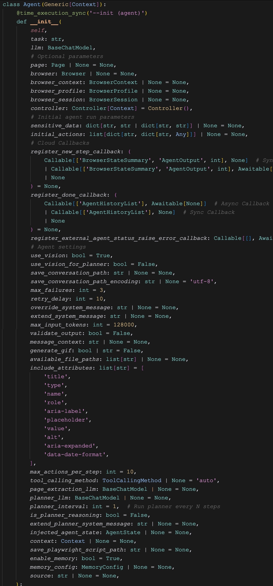

# 详解 Browser Use 的 Agent 用法（一）

经过这几天的学习，我们已经对 Browser Use 的 “任务规划”、“记忆管理” 和 “工具使用” 都有了更深入的理解，不过这些内容主要是围绕源码展开，偏理论，在实战中很难用上。所以，我们今天再来看下 Browser Use 的实际用法。

在入门篇里，我们已经介绍过 Browser Use 的基本用法，如下：

```python
agent = Agent(
  task="Compare the price of gpt-4.1-mini and DeepSeek-V3",
  llm=llm,
)
result = await agent.run()
```

通过 `Agent` 初始化一个智能体，传入 LLM 实例和我们的任务，然后调用 `agent.run()` 启动智能体，得到结果。这里有三个点可以展开学习：

1. `Agent` 类的初始化函数，除了 `task` 和 `llm` 这两个必填参数之外，还有哪些选填参数？
2. `agent.run()` 方法还有哪些额外参数？
3. `agent.run()` 的结果 `result` 是什么类型？

## `Agent` 参数概览

`Agent` 类是 Browser Use 的核心组件，它除了 `task` 和 `llm` 两个必填参数之外，还有很多其他的配置参数：



别看这里的参数列表这么长的一串，其实有不少参数在之前的学习中已经介绍过。今天就对所有参数做一个汇总介绍。

## 浏览器设置

```python
page: Page | None = None,
browser: Browser | None = None,
browser_context: BrowserContext | None = None,
browser_profile: BrowserProfile | None = None,
browser_session: BrowserSession | None = None,
```

这 5 个参数都是和浏览器有关，我们知道 Browser Use 基于 Playwright 实现浏览器操作，这里的 `Page`、`Browser`、`BrowserContext` 都是 Playwright 内置的类，是三个层次不同的概念：

* **Browser（浏览器实例）**
    * 代表整个浏览器进程
    * 是最顶层的对象，包含所有的浏览器上下文
    * 通过 `playwright.chromium.launch()` 等方法创建
    * 一个 Browser 可以包含多个 BrowserContext
* **BrowserContext（浏览器上下文）**
    * 相当于一个隔离的浏览器会话，类似于浏览器的 “无痕模式”
    * 每个 BrowserContext 都有独立的 `cookies`、`localStorage`、`sessionStorage` 等存储
    * 不同 BrowserContext 之间完全隔离，互不影响
    * 一个 BrowserContext 可以包含多个 Page
    * 可以设置独立的用户代理、视口大小、权限等
* **Page（页面/标签页）**
    * 代表浏览器中的一个标签页
    * 是实际进行页面操作的对象（点击、输入、导航等）
    * 每个 Page 属于一个 BrowserContext
    * 包含页面的 DOM、JavaScript 执行环境等

Browser 和 Page 比较好理解，BrowserContext 作为他们之间的介质，形成类似下面这样的分层结构：

```
Browser
├── BrowserContext 1
│   ├── Page 1
│   └── Page 2
└── BrowserContext 2
    ├── Page 3
    └── Page 4
```

BrowserContext 主要用于隔离不同的测试场景，比如登录不同的用户或者使用不同的配置，这种分层设计既能高效复用浏览器资源，又能保证测试之间的隔离性。

`BrowserProfile` 和 `BrowserSession` 是 Browser Use 内置的类，它们两的概念如下：

* **BrowserProfile（浏览器配置）**
    * 静态的配置信息，包括浏览器的启动参数、连接参数、视图信息等
    * Browser Use 根据这些配置创建浏览器会话
* **BrowserSession（浏览器会话）**
    * 表示一个活跃的浏览器会话，对应一个正在运行的浏览器进程
    * 这是 Browser Use 管理浏览器的核心，在构造记忆时，其中的浏览器状态就是通过它实现的
    * 上面的所有参数，最终都是转换为浏览器会话

浏览器设置是一个复杂的话题，后面我们单开一篇来介绍，目前先了解下这些概念。通过不同的浏览器设置，我们可以实现一些有趣的功能，比如我们先通过 Playwright 做一些固定的操作，比如打开某个页面，然后再让 Browser Use 基于这个页面完成某个任务（这样可以省去打开页面这一步消耗的 token）：

```python
async with async_playwright() as p:
    
  # 手动打开页面
  browser = await p.chromium.launch(headless=False)
  page = await browser.new_page()
  await page.goto("https://playwright.dev")

  agent = Agent(
    task="这个页面讲的是内容？",
    llm=llm,

    # 使用已有页面
    page=page
  )
  result = await agent.run()
```

## 自定义工具

```python
controller: Controller[Context] = Controller(),
context: Context | None = None,
```

这两个参数在学习 Browser Use 的 “工具使用” 时已经学过，只要在函数上面加一个 `@controller.action` 装饰器就可以注册一个自定义工具：

```python
from browser_use import Controller, ActionResult

controller = Controller()

@controller.action('查询某个城市的天气')
def weather(city: str) -> ActionResult:
  return ActionResult(
    extracted_content=f'{city}今天的天气晴，气温28摄氏度'
  )
```

然后将这个增强版的 `controller` 传入 `Agent` 即可：

```python
agent = Agent(
  task="使用 weather 工具查下合肥的天气",
  llm=llm,
  
  # 自定义工具
  controller=controller
)
```

另外，自定义工具中还可以使用一些框架提供的参数，例如 `page` 或 `browser_session` 等，这样我们在工具里也可以运行 Playwright 代码与浏览器交互；还可以传入一个用户提供的上下文对象：

```python
class MyContext:
  ...
```

这个对象可以包含任意内容，比如：数据库连接、文件句柄、队列、运行时配置等，然后通过 `context` 参数传递给 `Agent`：

```python
agent = Agent(
  task="使用 weather 工具查下合肥的天气",
  llm=llm,
  
  # 自定义工具
  controller=controller,
  context=MyContext()
)
```

Browser Use 并不会使用这个对象，它只是将其透传到用户自定义的工具里：

```python
@controller.action('The description of action 1')
def custom_action_1(arg: str, context: MyContext) -> ActionResult:
  return ActionResult(...)

@controller.action('The description of action 2')
def custom_action_2(arg: str, context: MyContext) -> ActionResult:
  return ActionResult(...)
```

更多内容参考官方的 Custom Functions 文档：

* https://docs.browser-use.com/customize/custom-functions

## 自定义提示词

```python
override_system_message: str | None = None,
extend_system_message: str | None = None,
max_actions_per_step: int = 10,
message_context: str | None = None,
```

参数 `override_system_message` 用于重写 Browser Use 默认的系统提示词，我们在之前学习 Browser Use 的 “任务规划” 时介绍过提示词的内容，重写的时候可以参考下。不过这种做法并不推荐，最好是通过 `extend_system_message` 往默认的提示词后面追加内容。

```python
extend_system_message = """
REMEMBER the most important RULE:
ALWAYS open first a new tab and go first to url wikipedia.com no matter the task!!!
"""
```

默认的提示词中有一个参数 `{max_actions}` 用于控制大模型一次最多生成多少动作，默认是 10 个，可以通过 `max_actions_per_step` 参数修改：

```python
agent = Agent(
  task="your task",
  llm = llm,

  # 一次最多执行多少个动作
  max_actions_per_step=3
)
```

我们还可以通过 `message_context` 参数对你的任务增加一些额外描述，以帮助大模型更好地理解任务：

```python
agent = Agent(
    task="your task",
    message_context="Additional information about the task",
    llm = llm,
)
```

## 大模型相关配置

```python
max_input_tokens: int = 128000,
tool_calling_method: ToolCallingMethod | None = 'auto',
use_vision: bool = True,
```

这几个是和大模型相关的一些配置。其中参数 `max_input_tokens` 表示大模型支持的最大输入 token 数，默认是 128K，根据你使用的模型来填即可，比如 DeepSeek V3 支持 64K，Gemini-2.5 支持 1024K 等。每次 Browser Use 往消息管理器中新增消息时，会计算消息的 token 数，当超出限制后，会调用 `_message_manager` 的 `cut_messages()` 方法，将消息裁剪成不超过 `max_input_tokens`。

参数 `tool_calling_method` 表示大模型工具调用的方式，支持下面几种：

```python
ToolCallingMethod = Literal[
  'function_calling', 
  'json_mode', 
  'raw', 
  'auto', 
  'tools'
]
```

当配置为 `auto` 时，Browser Use 会根据已知的模型名字返回工具调用方式，比如 `gpt-4` 会使用 `function_calling`，`claude-3` 会使用 `tools`，`deepseek-r1` 会使用 `raw` 等；如果模型名字未知，会通过一个内置的方法来测试大模型支持哪种方式。

无论是 `function_calling`、`tools` 还是 `json_mode` 方式，本质上都是大模型直接返回结构化响应，通过 LangChain 的 `with_structured_output()` 方法，可以自动解析，用来起非常方便；对于不支持结构化输出的模型，只能使用 `raw` 方式，Browser Use 会将所有的工具列表拼到 Prompt 里，让大模型返回 JSON 格式再解析。

参数 `use_vision` 表示是否开启视觉能力，如果模型不支持可以禁用，比如 DeepSeek 暂时不支持图片。当开启视觉能力时，Browser Use 会将网页的截图也添加到消息中，可以让大模型更好地理解网页内容和交互。但要注意的是，开启视觉能力对 token 的消耗非常大，对于 GPT-4o 来说，一张图片大约消耗 800-1000 个 token（约 0.002 美元），可以禁用降低成本。

## 未完待续

`Agent` 的配置参数实在是太多了，上面介绍的还不到一半，还有很多有意思的参数，比如敏感数据的处理，注册回调，失败重试，输出校验，生成 GIF 动画，程序性记忆，等等等等，我们明天继续学习。
