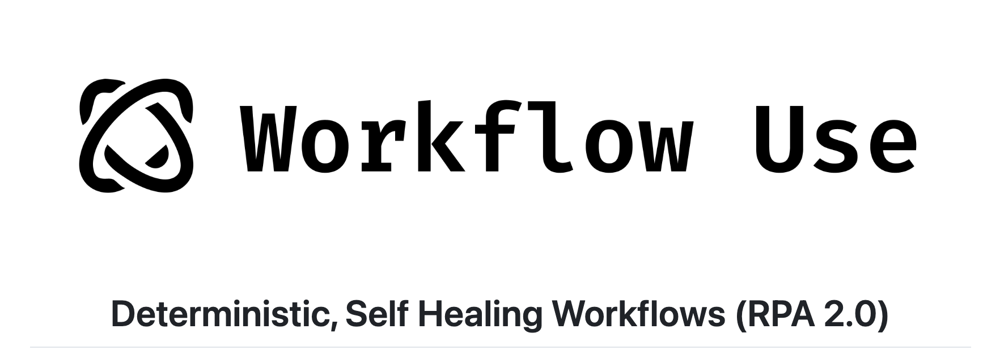

# 详解 Browser Use 的 Agent 用法（二）

话不多说，我们今天继续来学习 Browser Use 的 `Agent` 配置参数。

## 开启规划模型

```python
planner_llm: BaseChatModel | None = None,
use_vision_for_planner: bool = False,
planner_interval: int = 1,
is_planner_reasoning: bool = False,
extend_planner_system_message: str | None = None,
```

为了更好地处理复杂的多步骤任务，Browser Use 支持配置单独的 **规划模型（Planner model）** 对任务进行高层规划，上面这些参数都是和规划模型相关的参数。

参数 `planner_llm` 是 LangChain 的 ChatModel，表示规划时使用的模型，可以是一个比主模型更小或更便宜的模型；参数 `planner_interval` 用于控制每隔多少步规划一次，默认是每步都规划；参数 `use_vision_for_planner` 表示是否开启视觉能力，如果模型不支持可以禁用，和 `use_vision` 一样，如果开启视觉能力，Browser Use 会将网页的截图也添加到消息中，可以让大模型更好地理解网页内容，但是同时也会提高成本。

```python
agent = Agent(
  task="your task",
  llm=llm,

  # 开启规划模型
  planner_llm=planner_llm,
  # 规划时禁用视觉，默认是开启的
  use_vision_for_planner=False,
  # 每 4 步规划一次，默认是每步都规划
  planner_interval=4
)
```

当 Browser Use 开启规划模型时，会使用一段默认的规划提示词，将任务分解为更小的步骤（我们在 “记忆管理” 篇学习过），可以使用 `extend_planner_system_message` 在默认的提示词后面追加内容；另外，这段规划提示词默认是通过 `SystemMessage` 传给大模型的，但是有些推理模型不支持 `SystemMessage`，比如 o1、o1-mini 等，可以设置 `is_planner_reasoning=True` 参数，这时规划提示词是通过 `HumanMessage` 传给大模型。

### 内容提取模型

```python
page_extraction_llm: BaseChatModel | None = None,
```

在 Browser Use 内置的 20 个工具里，有一个叫 `extract_content`，它的实现如下：

```python
@self.registry.action(
  '提取页面内容以获取特定信息，并以结构化格式呈现',
)
async def extract_content(
  goal: str,
  page: Page,
  page_extraction_llm: BaseChatModel
):

  # 将页面内容转为 Markdown 文本
  content = markdownify.markdownify(await page.content(), strip=strip)

  # 内容提取提示词
  prompt = '''
  您的任务是提取页面的内容。
  您将获得一个页面和一个目标，您应该从页面中提取与此目标相关的所有信息。
  如果目标模糊，请总结页面。
  请以 JSON 格式响应。
  提取目标：{goal}，页面：{page}'''
  template = PromptTemplate(input_variables=['goal', 'page'], template=prompt)

  # 调用内容提取大模型
  output = await page_extraction_llm.ainvoke(
    template.format(goal=goal, page=content))
  msg = f'📄  Extracted from page\n: {output.content}\n'
  return ActionResult(extracted_content=msg, include_in_memory=True)
```

它使用内容提取模型，从页面中提取特定的内容，并返回 JSON 格式。参数 `page_extraction_llm` 用于配置内容提取使用的模型，如果不配置，默认使用的是主模型。

## 初始动作

```python
initial_actions: list[dict[str, dict[str, Any]]] | None = None,
```

昨天在学习浏览器设置时，我们介绍了一个有趣的例子，先通过 Playwright 做一些固定的动作，比如打开某个页面，然后再让 Browser Use 基于这个页面完成某个任务。其实，还有一种更简单的方法来完成这个过程：

```python
initial_actions = [
  {'open_tab': {'url': 'https://playwright.dev'}},
]

agent = Agent(
  task="这个页面讲的是内容？",
  llm=llm,

  # 初始化动作
  initial_actions=initial_actions
)
result = await agent.run()
```

通过 `initial_actions` 参数，我们可以在没有大模型的情况下运行初始动作，对于一些初始动作相对固定的场景，这样做可以节省大量 token。参考 [Controller 源码](https://github.com/browser-use/browser-use/blob/main/browser_use/controller/service.py) 找到所有可用的动作以及对应的参数。

## 保存会话记录

```python
save_conversation_path: str | None = None,
save_conversation_path_encoding: str | None = 'utf-8',
```

这个参数一般用于调试和研究，我们知道 Browser Use 通过不断的调用大模型获取下一步动作，如果对这个过程感兴趣，可以在初始化 `Agent` 时加上这个参数：

```python
agent = Agent(
  task="Compare the price of gpt-4.1-mini and DeepSeek-V3",
  llm=llm,

  # 保存会话记录
  save_conversation_path="logs/conversation",
  # 会话记录文件编码
  save_conversation_path_encoding="utf-8",
)
```

运行结束后会在 `logs/conversation` 目录下生成每一步使用的 Prompt 以及大模型输出的结果，方便定位哪一步出了问题。不过要注意的是，文件中只包含文本类型的消息，不包含 functions 参数或图片类型。

## 保留关键的元素属性

```python		
include_attributes: list[str] = [
  'title',
  'type',
  'name',
  'role',
  'aria-label',
  'placeholder',
  'value',
  'alt',
  'aria-expanded',
  'data-date-format',
  'checked',
  'data-state',
  'aria-checked',
],
```

这是一个高级参数，并不常用，大多数场景下使用默认值即可。但是我们可以通过该参数看看 Browser Use 的一些底层细节。

Browser Use 在调用大模型决定下一步动作时，会将当前网页的源码也作为上下文一起传过去。在这里 Browser Use 并没有使用完整的 HTML 源码，而是只保留了一些可点击的关键元素（并为每个元素标上序号，方便大模型点击或输入），而且只保留这些元素的部分属性，这也是一种巧妙的节省 token 的做法。

默认保留的属性如上所示，可以看到这些属性多少都带点语义信息。其中以 `aria-` 开头的属性是 **Accessible Rich Internet Applications (ARIA)** 的一部分，用于改善 Web 应用程序和网站的可访问性。这些属性提供了额外的信息，使得无障碍辅助技术（如屏幕阅读器）能够更好地理解和描述页面上的动态内容和用户界面元素的功能。

如果通过 `save_conversation_path` 参数开启会话记录，可以在会话记录文件中看到页面内容是这样的：

```
[Start of page]
[0]<a >Gmail />
[1]<a aria-label='搜索图片 '>图片 />
[2]<a aria-label='Google 应用' aria-expanded='false' role='button' />
[3]<a >登录 />
[4]<textarea title='Google 搜索' value='' aria-label='搜索' placeholder='' aria-expanded='false' name='q' role='combobox' />
[5]<div  />
[6]<div aria-label='按图搜索' role='button' />
[7]<input value='Google 搜索' aria-label='Google 搜索' name='btnK' role='button' type='submit' />
[8]<input value=' 手气不错 ' aria-label=' 手气不错 ' name='btnI' type='submit' />
Google 提供：
[9]<a >繁體中文 />
[10]<a >English />
香港
[11]<a >关于 Google />
[12]<a >广告 />
[13]<a >商务 />
[14]<a >Google 搜索的运作方式 />
[15]<a >隐私权 />
[16]<a >条款 />
[17]<div aria-expanded='false' role='button'>设置 />
[End of page]
```

如果调试时发现页面内容中丢失了部分关键信息，可以通过 `include_attributes` 参数来调整。

## 开启输出校验

```python
validate_output: bool = False,
```

这个参数对最终的输出结果进行校验，确保输出的准确性，默认不开启。当开启后，Browser Use 会在完成任务之前再调用一次 `_validate_output()` 方法，该方法通过调用大模型判断用户任务是否真的完成：

```python
if self.state.history.is_done():
  if self.settings.validate_output and step < max_steps - 1:
    if not await self._validate_output():
      continue

  await self.log_completion()
  break
```

校验的结果为 JSON 格式，包含 `is_valid` 和 `reason` 两个字段：

```json
{
  "is_valid": false, 
  "reason": "The user wanted to search for 'cat photos', but the agent searched for 'dog photos' instead."
}
```

如果校验通过，则跳出循环；如果不通过，则将不通过的原因添加到消息中，继续下一轮。

### 失败重试

```python
max_failures: int = 3,
retry_delay: int = 10,
```

Browser Use 在遇到异常情况时能自动重试，参数 `max_failures` 表示最大重试次数。它能处理下面这些异常情况：

* **浏览器被异常关闭**：直接返回 `浏览器被关闭，无法处理` 的错误，Browser Use 会重新打开浏览器重试；
* **达到 token 上限**：调用消息管理的 `cut_messages()` 方法，将消息裁剪成不超过 `max_input_tokens` 值；
* **大模型响应无法解析**：返回错误信息，并在后面增加一段提示，`请返回一个包含所需字段的有效 JSON 对象`；
* **接口限流错误**：访问 OpenAI 或 Anthropic 接口过快时可能会遇到这个错误，Browser Use 会根据 `retry_delay` 参数等待一段时间，默认是 10 秒，然后重试；
* **其他异常**：直接返回错误信息；

## 生成 GIF 动画

```python
generate_gif: bool | str = False,
```

这是一个很有 Browser Use 特色的功能，Browser Use 在每次操作浏览时都会对页面进行截屏，这个参数的作用是将这些截屏拼接成一个 GIF 动画，动画中还会加入用户的任务和每一步的目标，可以非常形象地演示 Browser Use 的运行过程。比如下面这个例子：

```python
agent = Agent(
  task="查询《哪吒2魔童闹海》的豆瓣评分",
  llm=llm,

  # 生成 GIF 动画
  generate_gif=True
)
```

运行结束后，会在当前目录下创建一个 `agent_history.gif` 文件，如下所示：


注意，如果你生成的动画里中文显示乱码，大概率是没找到字体文件导致的。Browser Use 使用 PIL 库的 `ImageDraw` 在图片上绘制文本，按顺序检测下面这些字体是否存在（参考 `browser_use/agent/gif.py` 文件中的 `font_options` 数组）：

```python
font_options = [
  'Microsoft YaHei',  # 微软雅黑
  'SimHei',  # 黑体
  'SimSun',  # 宋体
  'Noto Sans CJK SC',  # 思源黑体
  'WenQuanYi Micro Hei',  # 文泉驿微米黑
  'Helvetica',
  'Arial',
  'DejaVuSans',
  'Verdana',
]
```

前几个是中文字体，不过在 macOS 上默认是没有的，加上 macOS 内置的中文字体 `STHeiti Light` 或 `STHeiti Medium` 即可。

## 生成 Playwright 脚本

```python
save_playwright_script_path: str | None = None,
```

这也是一个非常有趣的功能，Browser Use 在运行结束后，可以将操作历史转存成一个 Playwright 脚本，这个脚本其实就是一个 Python 文件，里面的代码是调用 Playwright 的各个方法，重放 Browser Use 的整个操作过程。这个功能适用于下面这些应用场景：

* **自动化前端测试**：通过让智能体自动探索应用功能，快速生成 Playwright 测试脚本，大幅减少手动编写脚本的时间。这些标准化脚本可以在 CI/CD 中执行，用于回归测试；
* **可靠的任务自动化**：将智能体执行的任务（例如填写表单、导航复杂流程、下载文件等）转换为确定性的脚本，以进行重复执行，避免使用大模型带来的成本和结果波动；
* **调试与回放**：通过执行生成的脚本，轻松重现智能体的具体运行过程，用于调试目的；

不过值得注意的是，这个参数在最新版本中已经被移除了。我之所以介绍它，是因为这个参数直接派生了一个新的开源项目 [Workflow Use](https://github.com/browser-use/workflow-use)，专门用来创建和执行确定性的工作流脚本，目前这个项目还处于很早期的阶段，感兴趣的朋友可以关注一波。



## 未完待续

今天的学习就到这了，又收获一堆 Browser Use 的小技巧，关于 `Agent` 的配置参数还剩一些，我们明天继续。
