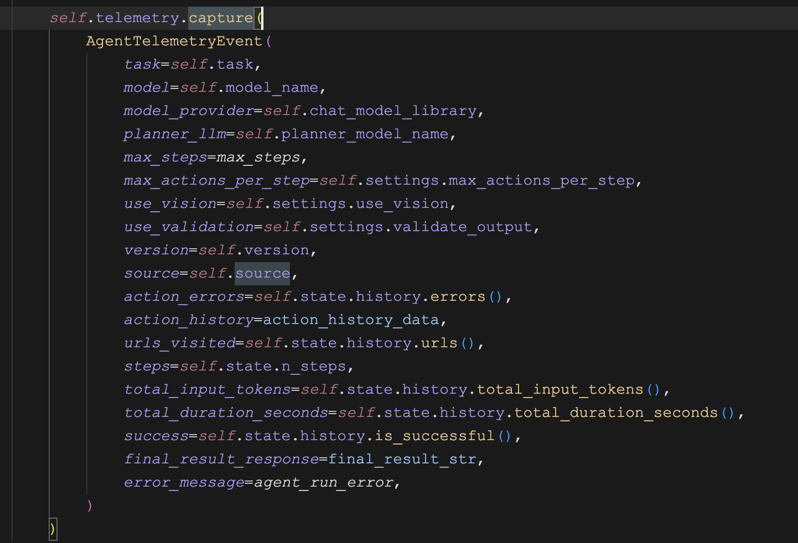

# 详解 Browser Use 的 Agent 用法（三）

关于 Browser Use 的 `Agent` 配置参数还剩一些，我们今天继续学习。

## 注册回调

```python
register_new_step_callback: (
    Callable[['BrowserStateSummary', 'AgentOutput', int], None]  # Sync callback
    | Callable[['BrowserStateSummary', 'AgentOutput', int], Awaitable[None]]  # Async callback
    | None
) = None,
register_done_callback: (
    Callable[['AgentHistoryList'], Awaitable[None]]  # Async Callback
    | Callable[['AgentHistoryList'], None]  # Sync Callback
    | None
) = None,
register_external_agent_status_raise_error_callback: Callable[[], Awaitable[bool]] | None = None,
```

在上一篇中，我们介绍了一个 Browser Use 的有趣功能，通过 `generate_gif=True` 参数可以在任务运行结束时生成一个 GIF 动画。但是想象一下，如果我们想基于 Browser Use 开发一款 Web 版的智能体应用，用户希望实时的看到每一步对浏览器的操作，就像 Manus 演示的那样，又该如何实现呢？

为此，Browser Use 提供了一些回调机制，允许我们在智能体执行的特定时刻访问其状态数据，并执行自定义代码：

* `register_new_step_callback` - 该回调函数在每次调用大模型获取下一步动作之后触发，函数中可以访问当前的浏览器状态和大模型的输出；
* `register_done_callback` - 该回调函数在整个任务完成之后触发，函数中可以访问智能体运行的所有历史数据；
* `register_external_agent_status_raise_error_callback` - 这个回调函数有点意思，它并不是在出现异常时触发，而是让用户自定义是否触发异常，如果这个函数返回 `True`，就会触发 `InterruptedError`；

其中最有用的应该是第一个回调函数，我们可以监听 Browser Use 的每一步执行，从浏览器状态中获取屏幕截图，实时地返回给 Web 前端：

```python
from browser_use.agent.views import AgentOutput
from browser_use.browser.views import BrowserStateSummary
def register_new_step_callback(browser_state_summary: BrowserStateSummary, agent_output: AgentOutput, n_steps: int):
  print(f'========== STEP {n_steps} BEGIN ==========')
  print("BrowserStateSummary:")
  print(f'  Title: {browser_state_summary.title}')
  print(f'  Url: {browser_state_summary.url}')
  print(f'  Screenshot: {browser_state_summary.screenshot[:80]}...')
  print("AgentOutput:")
  print(f'  Previous Goal: {agent_output.current_state.evaluation_previous_goal}')
  print(f'  Next Goal: {agent_output.current_state.next_goal}')
  print(f'========== STEP {n_steps} END ==========')

from browser_use import Agent
async def main():
  agent = Agent(
    task="Compare the price of gpt-4.1-mini and DeepSeek-V3",
    llm=llm,
    
    # 监听每一步执行
    register_new_step_callback=register_new_step_callback,
  )
  result = await agent.run()
```

其中 `browser_state_summary.screenshot` 就是屏幕截图，注意它的格式是 BASE64 编码。

## 初始状态

```python
injected_agent_state: AgentState | None = None,
```

在介绍这个参数之前，我们先学习 Browser Use 的一个新特性：**单步运行**，下面是示例代码：

```python
agent = Agent(
  task="Compare the price of gpt-4.1-mini and DeepSeek-V3",
  llm=llm,
)

for i in range(100):
  done, valid = await agent.take_step()
  print(f'Step {i}: Done: {done}, Valid: {valid}')
  if done and valid:
    break

result = agent.state.last_result
print(result)
```

在这个例子中，我们通过 `take_step()` 方法，一次只运行一步，而不像 `run()` 方法那样一次性把任务跑完。这种运行方式让我们可以更灵活的控制和调试智能体，就像调试代码一样，每走一步就停下来，对智能体的状态做深入洞察。通过这种方式，我们不仅可以轻松实现上面那个实时返回网页截图的功能，而且可以做很多更有想象力的事，比如当用户观察到智能体的行为和自己预期有偏差时，可以通过 `add_new_task()` 方法来插入新的指令，及时纠正智能体的错误。

另一个用例是，在运行过程中我们可以将智能体的状态保存到持久化存储中，比如数据库或本地文件：

```python
for i in range(100):
  done, valid = await agent.take_step()
  print(f'Step {i}: Done: {done}, Valid: {valid}')

  # 持久化状态
  async with await anyio.open_file('agent_state.json', 'w') as f:
    serialized = agent.state.model_dump_json(exclude={'history'})
    await f.write(serialized)

  if done and valid:
    break
```

这样做的好处是，就算智能体运行到一半崩掉了也不用担心，我们可以通过 `injected_agent_state` 参数将持久化的状态注入到一个新智能体里重新运行，Browser Use 会从之前断掉的地方恢复并继续后面的步骤：

```python
# 加载状态
async with await anyio.open_file('agent_state.json', 'r') as f:
  loaded_json = await f.read()
  agent_state = AgentState.model_validate_json(loaded_json)

agent = Agent(
  task="Compare the price of gpt-4.1-mini and DeepSeek-V3",
  llm=llm,

  # 注入已有状态
  injected_agent_state=agent_state
)
```

## 开启程序性记忆

```python
enable_memory: bool = True,
memory_config: MemoryConfig | None = None,
```

我们在 “记忆管理” 篇中介绍过，Browser Use 内置了一个基于 [Mem0](https://mem0.ai/) 的程序性记忆系统，该系统会每隔几步，对智能体的消息历史进行总结压缩，可以显著改善长任务的性能。这个功能默认是开启的，但是需要安装相关的依赖：

```
$ uv pip install "browser-use[memory]"
```

Browser Use 默认是每隔 10 步总结一次，可以通过 `memory_config` 参数进行修改：

```python
agent = Agent(
  task="your task",
  llm=llm,

  # 开启程序性记忆
  enable_memory=True,
  # 记忆相关配置
  memory_config=MemoryConfig(
    llm_instance=llm,
    agent_id="my_custom_agent",
    memory_interval=15
  )
)
```

记忆相关的配置除了上面这三个，还有一些嵌入模型和向量数据库相关的配置，如下：

```python
# 嵌入模型
embedder_provider: Literal['openai', 'gemini', 'ollama', 'huggingface'] = 'huggingface'
embedder_model: str = Field(min_length=2, default='all-MiniLM-L6-v2')
embedder_dims: int = Field(default=384, gt=10, lt=10000)

# 向量数据库
vector_store_provider: Literal[
  'faiss', 'chroma', 'qdrant', 'pinecone',
  'supabase', 'elasticsearch', 'redis',
  'weaviate', 'milvus', 'pgvector', 'upstash_vector',
  'vertex_ai_vector_search', 'azure_ai_search',
] = Field(default='faiss')
vector_store_collection_name: str | None = Field(default=None)
vector_store_base_path: str = Field(default='/tmp/mem0')
vector_store_config_override: dict[str, Any] | None = Field(default=None)
```

这些配置和 Mem0 的配置很像，但是略微有些区别，是 Mem0 的子集，具体解释参考官方文档：

* https://docs.browser-use.com/customize/agent-settings#memory-parameters

## 文件处理

```python
available_file_paths: list[str] | None = None,
```

这个参数用来告诉大模型它可以使用哪些文件，一旦设置，会在系统提示词中加一句话：

```
Here are file paths you can use: ['./test.md']
```

不过 Browser Use 并没有内置和文件处理相关的工具，需要我们自己实现。有两种比较常见的场景，一种是对用户文件进行读取、修改、处理等操作，下面是文件读取的示例：

```python
@controller.action('根据文件路径读取文件内容')
async def read_file(path: str, available_file_paths: list[str]):

  async with await anyio.open_file(path, 'r') as f:
    content = await f.read()
  msg = f'文件内容：{content}'
  return ActionResult(extracted_content=msg, include_in_memory=True)
```

注意 `available_file_paths` 也是个框架参数，我们可以对 `path` 做个校验：

```python
if path not in available_file_paths:
  return ActionResult(error=f'File path {path} is not available')
if not os.path.exists(path):
  return ActionResult(error=f'File {path} does not exist')
```

另一种场景是上传文件，可以通过另一个框架参数 `browser_session` 提供的几个辅助方法，在页面上定位到文件上传的按钮，然后上传即可，示例代码如下：

```python
@controller.action('将指定路径的文件上传到某个可交互的元素',)
async def upload_file(index: int, path: str, browser_session: BrowserSession, available_file_paths: list[str]):

  file_upload_dom_el = await browser_session.find_file_upload_element_by_index(index)
  file_upload_el = await browser_session.get_locate_element(file_upload_dom_el)
  await file_upload_el.set_input_files(path)
  msg = f'成功上传文件到指定元素 {index}'
  return ActionResult(extracted_content=msg, include_in_memory=True)
```

然后在当前目录下创建一个测试文件 `test.md`，将自定义的 `controller` 和文件路径传给智能体：

```python
agent = Agent(
  task="打开网页 https://kzmpmkh2zfk1ojnpxfn1.lite.vusercontent.net/ 并上传 test.md 文件",
  llm=llm,

  controller=controller,
  available_file_paths=["./test.md"]
)
result = await agent.run()
```

## 敏感数据

```python
sensitive_data: dict[str, str | dict[str, str]] | None = None,
```

敏感数据处理是 Browser Use 的另一项特色功能，可以将敏感数据，如个人身份信息（PII）、银行卡号、密码或密钥等，使用占位符代替，防止敏感信息暴露给大模型。敏感数据通过 `sensitive_data` 参数来定义，支持两种格式，一种是 key value 形式，对所有站点生效（不推荐）：

```json
{
  "key": "value"
}
```

一种是带域名的 key value 形式，只对特定站点生效：

```json
{
  "domain": {
    "key": "value"
  }
}
```

下面是官网的一个示例：

```python
agent = Agent(
  task = """
    访问 https://travel.example.com
    并使用会员号 x_member_number 和访问码 x_passphrase 登录
  """
  llm=llm,

  # 传入敏感数据
  sensitive_data = {
    'https://*.example.com': {
      'x_member_number': '123235325',
      'x_passphrase': 'abcwe234',
    },
  },
  browser_session=BrowserSession(
    allowed_domains=['https://*.example.com']
  ),
  use_vision=False,
)
```

这个示例展示了在处理敏感数据时的几个要点：

* 在用户任务里，使用占位符描述敏感数据；
* 使用 `sensitive_data` 定义敏感数据，`https://*.example.com` 限定只在符合规则的网址下使用这些敏感数据；
* 使用 `browser_session` 的 `allowed_domains` 限定浏览器只能访问这些网址；
* 关闭视觉能力，防止大模型在屏幕截图中看到敏感数据；

不过要注意的是，不建议使用 `sensitive_data` 作为登录凭据，官方的建议是提前登录好网站，可以人工登录，也可以用程序自动登录。比如通过下面的命令打开浏览器：

```
$ playwright open https://www.aneasystone.com/admin --save-storage auth.json
```

人工登录后，认证信息将保存到 `auth.json` 文件中，然后使用 `storage_state` 或 `user_data_dir` 来复用 Cookie 数据：

```python
agent = Agent(
  task="打开 https://www.aneasystone.com/admin",
  llm=llm,

  # 复用已有的 Cookies
  browser_session=BrowserSession(
    storage_state='./auth.json',
    user_data_dir=None
  )
)
```

## 数据收集来源

```python
source: str | None = None,
```

这是一个几乎绝大多数用户都用不到的参数，用于告诉 Browser Use 我们是在什么场景下使用它的，如果不设置，默认值取决于你运行它的环境：

* `git` - 通过源码运行
* `pip` - 通过 `pip` 安装运行
* `unknown`

我给大家介绍这个参数并不是想让大家使用它，而是想告诉大家一个事实，Browser Use 在运行的过程中默认会收集一些我们的使用数据，包括用户的任务、模型相关的配置、访问过的 URL 地址、执行过的动作以及报错信息等，如下：



Browser Use 使用 [PostHog](https://github.com/PostHog/posthog) 收集这些数据，通过收集并分析这些数据，Browser Use 团队可以实时地了解库的使用情况，及时发现并修复错误，改善用户体验。

收集的数据是完全匿名的，并且不包含任何个人可识别信息。尽管如此，如果你对数据问题比较敏感，可以通过 `ANONYMIZED_TELEMETRY` 环境变量关闭该功能：

```sh
export ANONYMIZED_TELEMETRY=false
```

## 未完待续

至此，关于 `Agent` 的配置参数终于介绍完了，通过这几天的学习，相信大家对 Browser Use 的功能有了大概的了解，这些功能足够满足大多数用户的需求场景了。还记得我们之前从示例代码引出的三个问题吗？除了 `Agent` 的配置参数之外，还有 `agent.run()` 方法的入参和返回值，我们明天就来看看它们吧。
