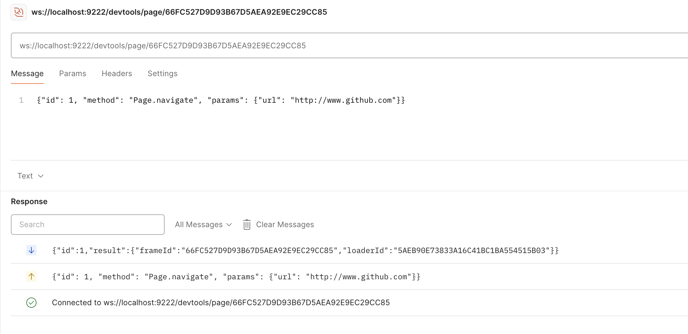
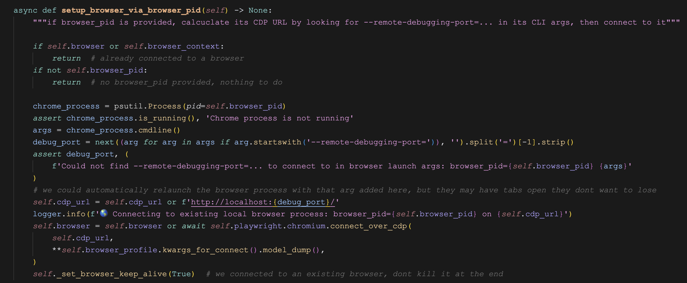

# 使用 Browser Use 连接你的浏览器

浏览器是我们日常生活和工作中不可或缺的重要工具，Browser Use 的本质就是模拟人类对浏览器进行各种操作以完成用户任务。在之前的示例中，默认使用的是 Playwright 内置的 Chromium 浏览器，Browser Use 还支持多种启动或连接其他浏览器的方法，我们今天来学习这方面的内容。

## 通过 `executable_path` 启动本地浏览器

在之前介绍 `Agent` 配置时，我们曾学过 `BrowserSession` 参数的概念，它是 Browser Use 配置浏览器的核心类，它有一个 `executable_path` 参数，可以指定用户电脑上已安装的浏览器路径。当我们设置 `executable_path` 参数时，Browser Use 就会启动该浏览器，而不使用 Playwright 内置的浏览器：

```python
from browser_use import Agent, BrowserSession

browser_session = BrowserSession(    
  executable_path='/Applications/Google Chrome.app/Contents/MacOS/Google Chrome',
  # executable_path='C:\\Program Files\\Google\\Chrome\\Application\\chrome.exe',
  # executable_path='/usr/bin/google-chrome',
  user_data_dir='~/.config/browseruse/profiles/default',
)

agent = Agent(
  task="Your task here",
  llm=llm,
  browser_session=browser_session,
)
```

上面的代码使用的是用户已安装的 Chrome 浏览器，注意不同的操作系统下安装路径也不同。Browser Use 只支持基于 Chromium 内核的浏览器，比如 [Brave](https://brave.com/)、[Patchright](https://github.com/Kaliiiiiiiiii-Vinyzu/patchright)、[Rebrowser](https://rebrowser.net/)、[Microsoft Edge](https://www.microsoft.com/edge) 等，暂时不支持 Firefox 或 Safari 浏览器。

## 自定义 Chrome 启动参数

鉴于安全原因，[从 v136 开始](https://github.com/browser-use/browser-use/issues/1520)，Chrome 不再支持使用默认的配置文件来驱动浏览器，所以无法复用你已有的浏览器配置，如登录凭据，收藏夹，扩展程序等。Browser Use 为此创建了一个新的专用配置文件，位于 `~/.config/browseruse/profiles/default`，可以在启动 Chrome 浏览器时，将配置文件设置成这个（注意使用全路径）：

```
$ cd /Applications/Google\ Chrome.app/Contents/MacOS
$ ./Google\ Chrome --user-data-dir=/Users/aneasystone/.config/browseruse/profiles/default
```

在 macOS 上，还有一种更简单的方式启动应用：

```
# 以应用名称启动
$ open -a <应用名称> --args <参数>

# 以应用路径启动
$ open <应用路径> --args <参数>
```

比如：

```
$ open -a "Google Chrome" --args \
    --user-data-dir=/Users/aneasystone/.config/browseruse/profiles/default
```

或：

```
$ open "/Applications/Google Chrome.app" --args \
    --user-data-dir=/Users/aneasystone/.config/browseruse/profiles/default
```

> 需要注意的是，**启动之前最好先退出所有的 Chrome 实例，不然参数可能无效**。

通过这种方式打开浏览器后，所有的用户数据会持久化到 Browser Use 的专用配置文件中，所以当我们再次用 Browser Use 启动浏览器时，就可以访问这些用户数据，包括且不限于下面这些：

- 所有已登录的会话和 Cookies
- 如果启用了自动填充，则可访问保存的密码
- 浏览器历史记录和书签
- 扩展程序及其数据

所以务必检查分配给智能体的任务，确保符合你的安全要求！对于任何敏感数据，请使用 `Agent(sensitive_data=...)`，并使用 `BrowserSession(allowed_domains=...)` 限制浏览器访问。

## 使用现有的 Playwright 对象连接浏览器

我们之前学习过 `Browser`、`BrowserContext` 和 `Page` 参数的概念，这三个都是 Playwright 内置的类：`Browser` 表示浏览器实例，代表整个浏览器进程，通常使用 `playwright.chromium.launch()` 等方法创建；`BrowserContext` 表示浏览器上下文，相当于一个隔离的浏览器会话，类似于浏览器的 “无痕模式”，不同 BrowserContext 之间完全隔离，互不影响；`Page` 表示一个页面，代表浏览器中的一个标签页，是实际进行页面操作的对象（点击、输入、导航等）。

它们之间的关系，类似下面这样的分层结构：

```
Browser
├── BrowserContext 1
│   ├── Page 1
│   └── Page 2
└── BrowserContext 2
    ├── Page 3
    └── Page 4
```

我们可以将现有的 `Browser`、`BrowserContext` 或 `Page` 对象传递给 `BrowserSession` 类，让 Browser Use 连接并复用已有的浏览器实例：

```python
async with async_playwright() as p:
    
  # 手动打开页面
  browser = await p.chromium.launch(headless=False)
  context = await browser.new_context()
  page = await context.new_page()
  await page.goto("https://playwright.dev")

  browser_session = BrowserSession(
    browser=browser,
    browser_context=context,
    page=page,
  )

  agent = Agent(
    task="这个页面讲的是什么？",
    llm=llm,

    # 复用浏览器会话
    browser_session=browser_session
  )
  result = await agent.run()
```

或者使用简写形式，直接将这三个对象传给 `Agent` 类：

```python
agent = Agent(
  task="这个页面讲的是什么？",
  llm=llm,

  browser=browser,
  browser_context=browser_context,
  page=page,
)
```

这种连接方式可以将其他基于 Playwright 的项目非常容易地集成到 Browser Use 中，比如 [Patchright](https://github.com/Kaliiiiiiiiii-Vinyzu/patchright)、[Stagehand](https://github.com/browserbase/stagehand) 等：

```python
stagehand = Stagehand(
  config=config, 
  server_url=os.getenv("STAGEHAND_SERVER_URL"),
)
await stagehand.init()

agent = Agent(
  task='your task',
  page=stagehand.page
)
```

## 连接 Playwright 的 Browser Server

Playwright 的 Node.js 版本有一个 **浏览器服务器（Browser Server）** 的特性，我们可以通过 [BrowserType.launchServer](https://playwright.dev/docs/api/class-browsertype#browser-type-launch-server) 来启动，服务器会暴露一个 WebSocket 接口供其他应用连接，实现远程操作浏览器。

使用下面的 Node.js 代码启动 Browser Server：

```js
const { chromium } = require('playwright');  // Or 'webkit' or 'firefox'.

(async () => {
  // 启动服务器
  const browserServer = await chromium.launchServer();
  const wsEndpoint = browserServer.wsEndpoint();
  console.log(wsEndpoint);

  // 通过 ws 连接服务器
  const browser = await chromium.connect(wsEndpoint);
  browser.newPage("https://playwright.dev/");

  // 等待 600 秒
  await new Promise(resolve => setTimeout(resolve, 600 * 1000));

  // 关闭服务器
  await browserServer.close();
})();
```

其中 `wsEndpoint` 就是服务器的地址，可以通过 `wss_url` 参数传递给 `BrowserSession` 供 Browser Use 中使用：

```python
browser_session = BrowserSession(    
  wss_url="ws://localhost:55660/4b762d7e1b8b9a66d8c3ece7a5dd3b81"
)
agent = Agent(
  task="访问 https://playwright.dev 总结页面内容",
  llm=llm,
  browser_session=browser_session
)
```

> 注意 Browser Server 的服务端和客户端版本需要一致。

## 通过 CDP 连接本地 Chrome 浏览器

CDP 协议，全称 [Chrome DevTools Protocol](https://chromedevtools.github.io/devtools-protocol/)，这是一个允许工具对 Chromium、Chrome 和其他基于 Blink 的浏览器进行调试、检查和性能分析的协议。目前有 [很多项目](https://github.com/ChromeDevTools/awesome-chrome-devtools) 正在使用这个协议，包括  [Chrome 的开发者工具](https://chromedevtools.github.io/devtools-protocol/)。

在启动 Chrome 浏览器时加上 `--remote-debugging-port=9222` 参数即可开启 CDP 协议：

```
$ open -a "Google Chrome" --args \
    --remote-debugging-port=9222 \
    --user-data-dir=/Users/aneasystone/.config/browseruse/profiles/default
```

> 注意，调试模式必须指定自定义的用户数据目录。

浏览器会监听 9222 端口，使用 `curl` 检查是否能连接：

```
$ curl http://localhost:9222/json/version
```

如果一切正常，将返回类似下面这样的浏览器信息：

```json
{
  "Browser": "Chrome/137.0.7151.104",
  "Protocol-Version": "1.3",
  "User-Agent": "Mozilla/5.0 (Macintosh; Intel Mac OS X 10_15_7) AppleWebKit/537.36 (KHTML, like Gecko) Chrome/137.0.0.0 Safari/537.36",
  "V8-Version": "13.7.152.14",
  "WebKit-Version": "537.36 (@dd98cd04c723035396b6d301e1f196b29a14a0ff)",
  "webSocketDebuggerUrl": "ws://localhost:9222/devtools/browser/6dcde03c-cc5c-41b9-a7bf-64ebab62726d"
}
```

可以通过 `cdp_url` 参数传递给 `BrowserSession` 供 Browser Use 中使用：

```python
browser_session = BrowserSession(    
  cdp_url="http://localhost:9222"
)
agent = Agent(
  task="访问 https://playwright.dev 总结页面内容",
  llm=llm,
  browser_session=browser_session
)
```

## 学习 CDP 协议

上面使用 `curl` 访问的 `/json/version` 接口，就是 CDP 协议中的一个接口，像这样的接口还有很多。比如访问 `/json/list` 接口：

```
$ curl http://localhost:9222/json/list
```

将返回浏览器当前打开的所有页面信息：

```json
[ {
  "description": "",
  "devtoolsFrontendUrl": "...",
  "faviconUrl": "https://chromedevtools.github.io/devtools-protocol/images/logo.png",
  "id": "7C10F98B3BDCE163464F77ED2AC7948A",
  "title": "Chrome DevTools Protocol",
  "type": "page",
  "url": "https://chromedevtools.github.io/devtools-protocol/",
  "webSocketDebuggerUrl": "ws://localhost:9222/devtools/page/7C10F98B3BDCE163464F77ED2AC7948A"
}, {
  "description": "",
  "devtoolsFrontendUrl": "...",
  "faviconUrl": "https://mintlify.s3-us-west-1.amazonaws.com/browseruse-0aece648/_generated/favicon/favicon.ico?v=3",
  "id": "9624235768323EEEB7083FBD54748808",
  "title": "Connect to your Browser - Browser Use",
  "type": "page",
  "url": "https://docs.browser-use.com/customize/real-browser",
  "webSocketDebuggerUrl": "ws://localhost:9222/devtools/page/9624235768323EEEB7083FBD54748808"
} ]
```

访问 `/json/new?{url}` 接口：

```
$ curl -X PUT "http://localhost:9222/json/new?https://playwright.dev"
```

将打开一个新页面，并返回新页面的信息：

```json
{
  "description": "",
  "devtoolsFrontendUrl": "...",
  "id": "BB33A59C140BB527452DB607BFCE3A03",
  "title": "",
  "type": "page",
  "url": "https://playwright.dev/",
  "webSocketDebuggerUrl": "ws://localhost:9222/devtools/page/BB33A59C140BB527452DB607BFCE3A03"
}
```

接口里返回的 `webSocketDebuggerUrl` 是该页面的调试地址，我们可以通过 WebSocket 连接它，并发送 CDP 命令去操作该页面：



这里发送的 CDP 命令是 `Page.navigate`，将当前页面导航到一个新地址：

```json
{"id": 1, "method": "Page.navigate", "params": {"url": "http://www.github.com"}}
```

还可以访问 `/json/close/{targetId}` 接口：

```
$ curl http://localhost:9222/json/close/BB33A59C140BB527452DB607BFCE3A03
```

将关闭对应的页面：

```
Target is closing
```

如果你对 CDP 协议感兴趣，可以参考其官方文档：

* https://chromedevtools.github.io/devtools-protocol/

## 通过 PID 连接本地 Chrome 浏览器

Browser Use 还支持通过 PID 来连接 Chrome 浏览器：

```python
browser_session = BrowserSession(
  browser_pid=46543
)
agent = Agent(
  task="访问 https://playwright.dev 总结页面内容",
  llm=llm,
  browser_session=browser_session
)
```

注意 Chrome 浏览器启动时必须加上 `--remote-debugging-port=9222` 参数，以调试模式启动。可以看下 Browser Use 底层的实现，通过 PID 找到进程的启动参数，然后从参数中找到 `--remote-debugging-port` 端口号，最终还是通过 CDP 协议来连接：



## 在线浏览器服务

目前有很多在线浏览器服务，它们都支持 WS 协议或 CDP 协议，感兴趣的可以试下：

* ZenRows - https://www.zenrows.com/
* Anchor Browser - https://anchorbrowser.io/
* Browserless - https://www.browserless.io/
* Steel - https://steel.dev/
* Browserbase - https://www.browserbase.com/
* Oxylabs - https://oxylabs.io/
* Bright Data - https://brightdata.com/

## 小结

今天学习了 Browser Use 启动或连接浏览器的方法，包括通过 `executable_path` 启动本地浏览器、使用现有的 Playwright 对象连接浏览器、通过 Playwright 的 Browser Server 连接远程浏览器、通过 CDP 连接本地 Chrome 浏览器，以及通过 PID 连接本地 Chrome 浏览器等方法。这些技术使得 Browser Use 可以灵活地与不同的浏览器实例交互，从而更好地完成复杂的自动化任务。在使用这些功能时，需要注意安全性，确保不要无意中泄露敏感信息。
