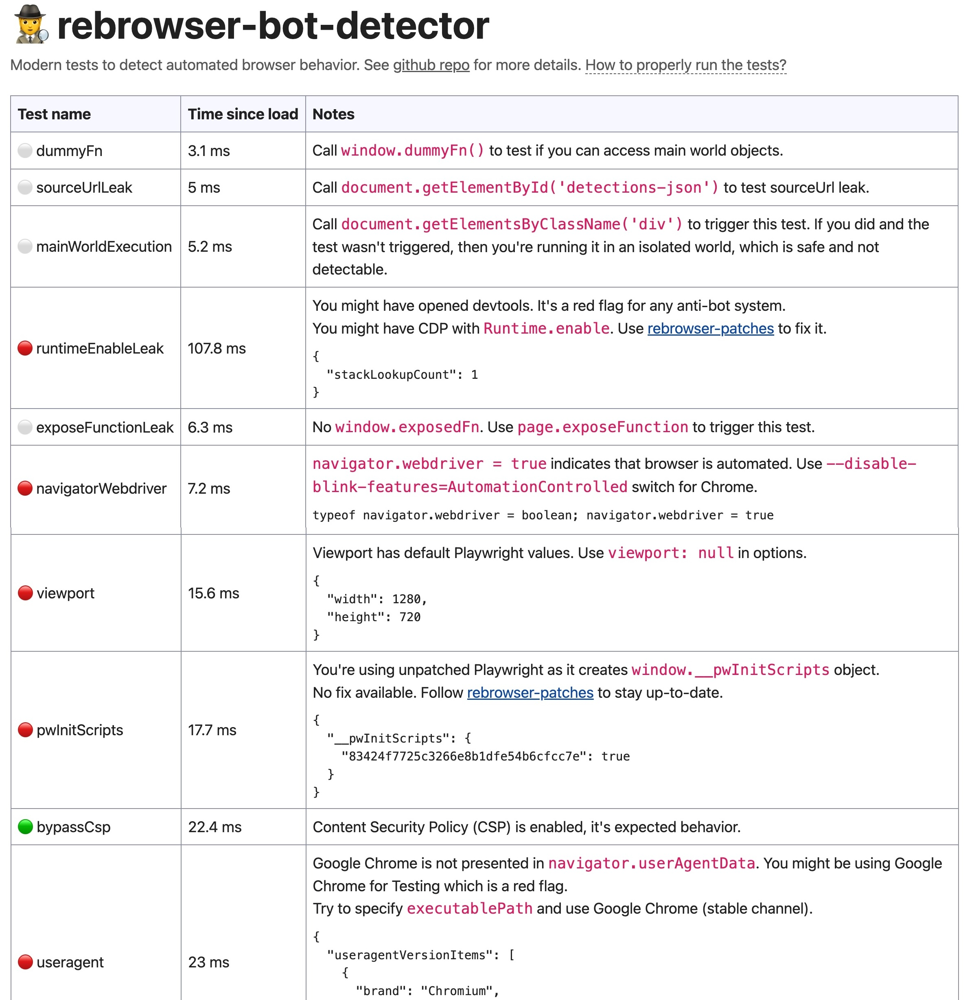

# 使用 Patchright 绕过浏览器机器人检测

我们知道，Browser Use 默认采用 [Playwright](https://playwright.dev/) 作为浏览器操作的基础工具。Playwright 原本是由微软开源推出的一款浏览器自动化测试工具，其设计初衷是方便开发人员进行跨浏览器测试。然而，由于其功能强大且使用简便，它逐渐被广泛应用于网络爬虫领域，这也引发了一些问题。许多网站为了保护自身信息安全，采取了封禁措施，试图阻止 Playwright 的访问。

浏览器自动化在运行过程中表现出的行为往往与普通用户操作有显著差异，这些差异使得具有反爬措施和网络应用防火墙（WAF）的网站能够有效识别和对抗 Playwright 驱动的爬虫行为。这也就导致了我们在使用 Browser Use 的时候，无法在一些网站上执行操作，大大限制了 Browser Use 的功能，如何绕过这些安全措施成为了 Browser Use 用户需要解决的问题。

道高一尺，魔高一丈，有反爬，就有反反爬。在使用 Playwright 的时候，也有一些方法绕过反爬机制，我们今天学习的 [Patchright](https://github.com/Kaliiiiiiiiii-Vinyzu/patchright) 就是基于 Playwright 改造的另一款浏览器自动化工具，它通过巧妙地模拟真实用户行为，使得浏览器操作可以绕过机器人检测。

## Patchright 初体验

我们先通过一个真实场景体验下 Patchright 的效果。

[Fingerprint.com](https://fingerprint.com/) 是一家专注于设备识别和反欺诈解决方案的企业，他们提供的浏览器机器人检测功能，通过 Smart Signal 技术实时检测自动化工具、搜索引擎爬虫等威胁，帮助网站保护自身免受机器人攻击。


可以点击下面的链接，进入产品页面体验该功能：

* https://fingerprint.com/products/bot-detection/

接下来我们使用 Playwright 和 Patchright 分别打开上面的产品页面，对比下两者有何不同。使用 Playwright 打开该页面：

```python
import asyncio
from playwright.async_api import async_playwright

async def main():
  async with async_playwright() as p:
    browser = await p.chromium.launch(headless=False)
    page = await browser.new_page()
    await page.goto("https://fingerprint.com/products/bot-detection/")
    input()
    await browser.close()

asyncio.run(main())
```

可以看到 Fingerprint.com 成功检测出我们是机器人，并且标识出我们是通过自动化工具访问的：


接下来我们换成 Patchright 打开该页面：

```python
import asyncio
from patchright.async_api import async_playwright

async def main():
  async with async_playwright() as p:
    browser = await p.chromium.launch(headless=False)
    page = await browser.new_page()
    await page.goto("https://fingerprint.com/products/bot-detection/")
    input()
    await browser.close()

asyncio.run(main())
```

Patchright 的使用和 Playwright 完全兼容，我们只需将上面的 `playwright.async_api` 换成了 `patchright.async_api` 即可。可以看到 Fingerprint.com 这次没有检测出来，我们成功绕过了它的机器人检测功能：


## 在 Browser Use 中使用 Patchright

我们昨天学习了 Browser Use 中关于浏览器的很多配置参数，包括会话相关参数和浏览器配置参数，通过 `BrowserSession` 传入，以调试模式启动并操作浏览器。在会话相关的参数中有一个 `playwright` 参数，表示 Playwright 或 Patchright API 客户端句柄，一般通过 `await async_playwright().start()` 得到，我们可以通过这个参数让 Browser Use 连接并复用已有的 Playwright 或 Patchright 浏览器实例：

```python
from playwright.async_api import async_playwright

async def main():
  playwright = await async_playwright().start()
  browser_session = BrowserSession(
    playwright=playwright
  )
  agent = Agent(
    task="""
      打开 https://fingerprint.com/products/bot-detection/
      检查你是否被检测为机器人
    """,
    llm=llm,
    browser_session=browser_session,
    generate_gif=True
  )
  result = await agent.run()
  print(result)

asyncio.run(main())
```

将上面的 `playwright.async_api` 换成 `patchright.async_api` 即可在 Browser Use 中使用 Patchright ，最终的输出结果如下：

```
Result: Visited the bot detection page on Fingerprint.com. 
The page indicates clearly that 'You are not a bot' under the section 'Am I a bot?'. 
Both Automation Tool and Search Engine statuses are 'Not detected'. 
Task is complete.
```

下面是运行的动画过程：


此外，Browser Use 在最新版本中（`browser-use >= 0.2.7`）还提供了一种使用 Patchright 的简便方式，只需要在 `BrowserSession` 中传入 `stealth=True` 即可：

```python
browser_session = BrowserSession(
    stealth=True
)
agent = Agent(
    task="your task here",
    llm=llm,
    browser_session=browser_session,
)
```

## 学习机器人检测技术

到这里，有些同学肯定会好奇，Fingerprint.com 到底是如何检测浏览器机器人的？而 Patchright 又是如何绕过它的检测的？知其然，知其所以然，我们接下来就来学习学习这里面的门道。

下面这个网站是 [Rebrowser](https://rebrowser.net/) 整理的一些常见的机器人检测技术，并在其 [项目首页](https://github.com/rebrowser/rebrowser-bot-detector) 对这些技术一一做了详细介绍，是个不错的入门资料：

* https://bot-detector.rebrowser.net/

正常打开这个网站是这个样子：


而用 Playwright 打开就是一堆报红：



这里列出了一些非常基本的测试项，这些测试在任何网站上都很容易实现。可以确定的是，所有这些测试在主流的机器人检测产品中都有使用，尽管每个产品都有自己专有的算法和检测方式，但在 90% 的情况下，当你被阻止或看到任何验证码时，都是因为这些测试不通过导致的。所以，在进行任何类型的浏览器自动化之前，务必先通过所有这些测试。

我们重点来看下这些报红的测试项：

### `runtimeEnableLeak`

默认情况下，Puppeteer、Playwright 和其他自动化工具依赖于 `Runtime.enable` 这个 CDP 方法来处理执行上下文。任何网站都可以通过几行代码检测到它：

```js
const testRuntimeEnableLeak = async () => {
  const e = new Error()
  Object.defineProperty(e, 'stack', {
    configurable: false,
    enumerable: false,
    get() {
      // 检测到 DevTools 打开，或使用了 Runtime.enable CDP 方法
      return ''
    },
  })
  console.debug(e)

  setTimeout(testRuntimeEnableLeak, 100)
}

testRuntimeEnableLeak()
```

这段代码非常巧妙，是一个相当高级和隐蔽的检测手段。正常情况下，`console.debug(e)` 只会简单输出错误对象，不会触发 `stack` 属性的 `getter` 方法，而一旦 Chrome DevTools 打开或 CDP 的 `Runtime.enable` 被调用时，浏览器会自动获取 Error 对象的 `stack` 属性来在控制台中显示更详细的错误信息，从而能被我们检测到。这种技术不仅用于浏览器机器人检测，也常用于检测是否有人在调试网页，防止别人对网站做逆向工程。

知道了检测原理，反检测也就很简单了，有几种不同的方法：

* 在页面载入之前注入一段 JS，重写 `console.debug` 方法，比如 `console.debug = {}`，或者为 `console` 创建一个代理，`window.console = new Proxy(origConsole, handler)`；
* 因为检测是每隔一段时间检测一次，可以在调用 `Runtime.enable` 之后立即调用 `Runtime.Disable`，大概率也能逃过程序的检测；

### `navigatorWebdriver`

这是一个老掉牙的检测手段，当 Chrome 浏览器正在由自动化软件驱动时，会将 `navigator.webdriver` 设置为 `true`，在正常的浏览器中该值应该为 `false`，检测代码如下：

```js
if (navigator.webdriver === true ||
    typeof navigator.webdriver === 'undefined' ||
    Object.getOwnPropertyNames(navigator).length !== 0 ||
    Object.getOwnPropertyDescriptor(navigator, 'webdriver') !== undefined) {
    // 检测到浏览器自动化
}
```

绕过方法很简单，启动 Chrome 时加一个 `--disable-blink-features=AutomationControlled` 开关即可，注意这个开关 Browser Use 默认已经加过了。

网上还有一些其他绕过方法，比如在加载页面前注入下面的脚本：

```python
await browser_context.add_init_script("""
  Object.defineProperty(navigator, 'webdriver', {
    get: () => undefined,  // or false
  });
""")
```

由于 `navigator.webdriver` 是只读的，所以直接设成 `false` 是不生效的，这里通过给 `navigator` 定义一个 `webdriver` 属性并重写其 `getter` 方法，使得 `navigator.webdriver` 的值变成 `undefined` 或 `false`。

这种方法也能绕过一些网站的检测，但是绕不过上面的检测代码。在上面的代码里，除了对 `navigator.webdriver` 的值进行判断，而且还对其类型是否为 `undefined` 以及是否存在自定义属性等进行判断，导致这种方法很容易被检测出来。因此最保险的做法还是 `--disable-blink-features=AutomationControlled` 开关。

### `viewport`

这也是一个简单的检测手段，当运行 Puppeteer 时，它默认使用 800x600 的视口大小，运行 Playwright 时，默认使用 1280x720 的视口大小。这个固定值非常明显，很容易被检测到，因为几乎没有哪个正常用户的浏览器会有这样的视口大小。

所以有些网站通过这两个固定值来检测 Puppeteer 和 Playwright 的使用。随便改一下视口大小就能绕过：

```python
browser = await p.chromium.launch(headless=False)
browser_context = await browser.new_context(viewport={"height":721,"width":1281})
page = await browser_context.new_page()
await page.goto("https://bot-detector.rebrowser.net/")
```

### `pwInitScripts`

这是一个 Playwright 特有的属性，默认会在每个页面的 `window` 对象上注入，还有一个 `playwright__binding` 方法也是一样的，检测代码如下：

```js
if (window.__pwInitScripts !== undefined || 
    window.__playwright__binding__ !== undefined) {
    // 检测到 Playwright 使用
}
```

要绕过检测，可以在页面载入之前注入一段 JS，将该属性删除：

```js
delete window.__pwInitScripts;
delete window.__playwright__binding__;
```

### `useragent`

这个测试项通过检查 `navigator.userAgentData` 里是否同时包含 `Chromium` 和 `Google Chrome` 两项，正常用户使用的 Chrome 浏览器应该两项都包含。但是 Puppeteer 和 Playwright 通常使用 Chromium 浏览器，数据里只有 `Chromium` 一项，这是一个警告信号：

```js
const fullVersionList = await navigator.userAgentData.getHighEntropyValues(['fullVersionList']);
const brands = fullVersionList.brands.map(item => item.brand);

if (fullVersionList.length &&
    brands.includes('Chromium') && 
    !brands.includes('Google Chrome')) {
    // 检测到你可能在用 Google Chrome 测试
}
```

可以使用 `executablePath` 启动用户自定义的浏览器绕过此检查，或者通过注入脚本，修改 `navigator.userAgentData` 的值。

## 小结

我们今天学习了如何使用 Patchright 在自动化浏览器操作中绕过机器人检测，通过在 Browser Use 中集成 Patchright，用户可以轻松地在复杂的反爬环境中执行浏览器自动化任务。我们还深入探讨了一些简单而有效的浏览器机器人检测技术，例如 `runtimeEnableLeak`、`navigatorWebdriver`、`viewport`、`pwInitScripts` 和 `useragent` 等，通过学习相应的检测和反检测策略，可以帮我们更好的理解 Patchright 的使用。

浏览器机器人的检测和反检测，是一个复杂的话题，涉及浏览器行为模拟、网络安全、反爬虫技术等多个领域。同时，这也是一场永无尽头的猫鼠游戏，作为网站管理员，需要持续更新技术以适应最新的爬虫技巧，而作为爬虫开发者，也需要不断学习以应对不断演进的检测机制。
