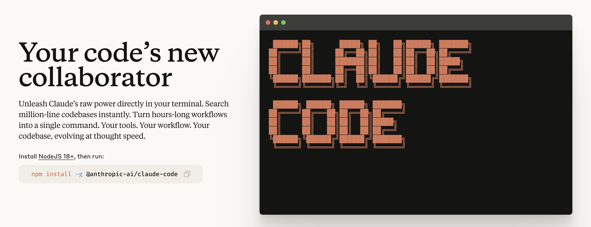
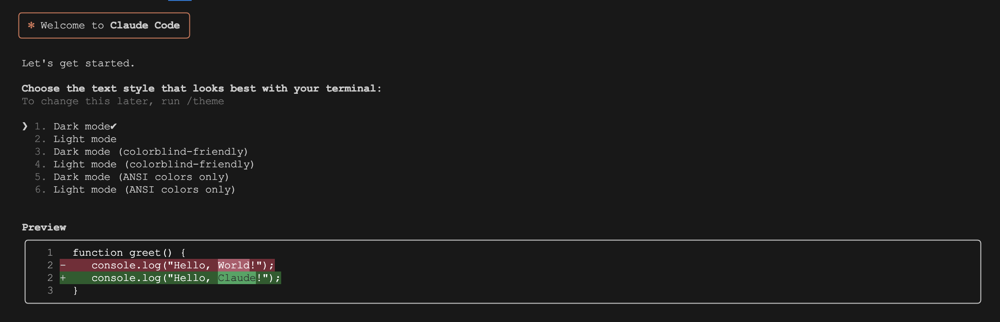
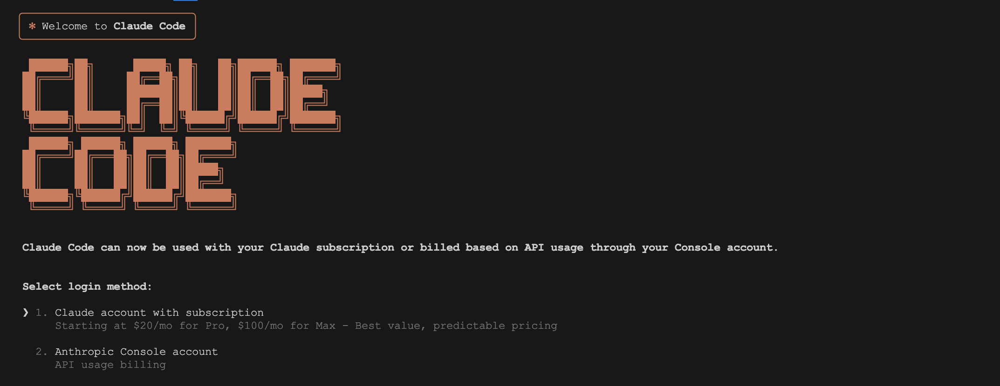
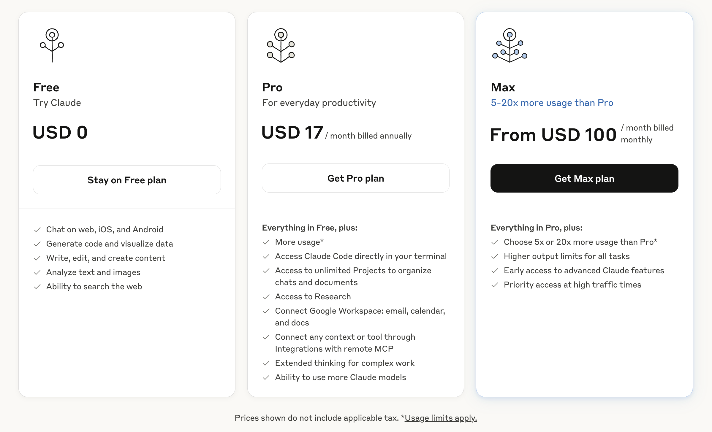
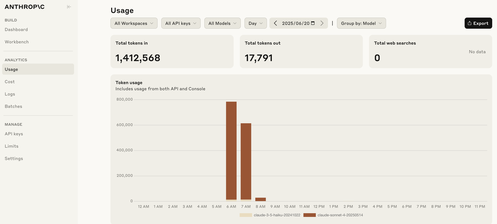
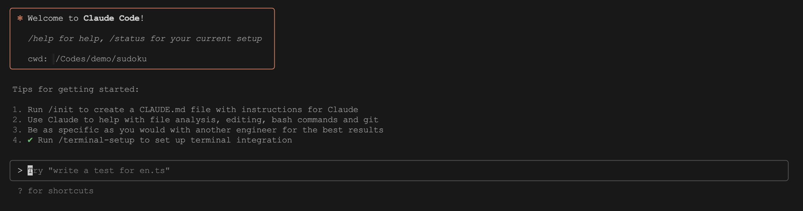
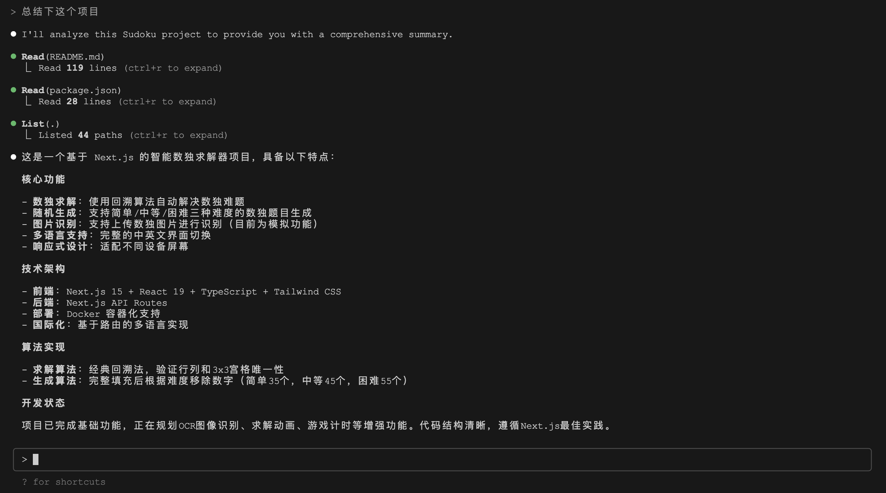
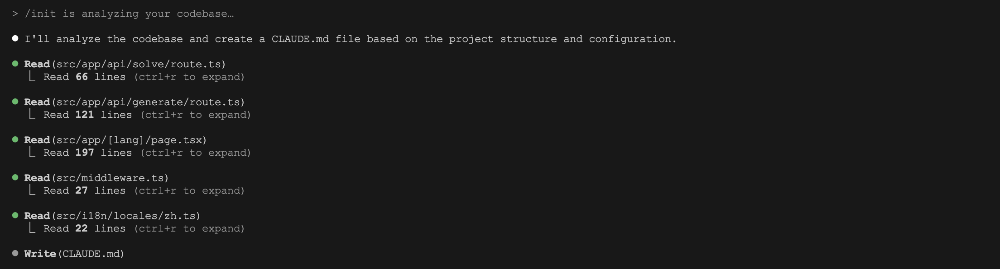
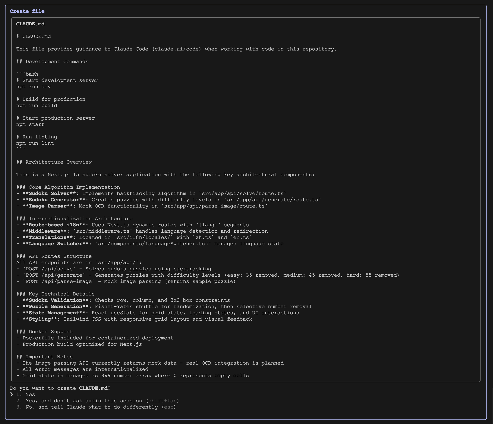
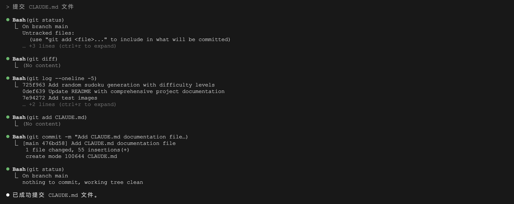

# Claude Code 介绍：一款运行在终端里的智能编程助手

[今年 2 月份](https://www.anthropic.com/news/claude-3-7-sonnet)，Anthropic 公司发布 Claude 3.7 Sonnet 混合推理模型，在编码和前端开发方面表现非常出色，一时之间成为所有 AI 代码编辑器的首推模型；同时，他们还推出了一款新的命令行工具 —— [Claude Code](https://www.anthropic.com/claude-code) ，这是一个智能编程助手，和 Cursor、 Windsurf 等传统 IDE 不同的是，它直接运行在你的终端中，能够深度理解你的代码库，并通过自然语言命令帮助开发者更高效地完成编程任务。



不过当时还只是预览版，并没有对所有用户开放，因此反响也不大。到了 [今年 5 月份](https://www.anthropic.com/news/claude-4)，Anthropic 发布了 Claude 4，其编码能力相对于 3.7 又有了很大的提升；与此同时，Claude Code 也正式 GA ，搭配 Claude 4 出色的编码能力，它的性能得以显著提升；它在处理大型代码库、复杂编程任务中的表现超越了 Cursor、 Windsurf 等一众顶尖的 AI 代码编辑器，惊艳了整个程序员社区。

这款基于 Claude 4 模型的智能编程助手，以其独特的终端集成方式和强大的代码库理解能力，正在重新定义开发者的编程体验。

## 核心特点

Claude Code 是一个 **代理式编程（Agentic Coding）** 工具，它具备以下核心特点：

* **终端集成**：通过终端作为通用入口，Claude Code 能直接在开发者熟悉的工作环境中执行任务，无需学习新工具或更换 IDE ，降低了使用门槛；
* **代码库理解**：能够快速分析和理解整个项目的代码结构和逻辑关系，尤其适用于大型复杂代码库；
* **自然语言交互**：得益于 Claude 4 强大的指令理解和任务执行能力，用户通过简单的自然语言命令就可以执行复杂的编程任务；
* **开发工具集成**：与现有的开发环境完美配合，兼容各种命令行工具，支持文件编辑、Git 操作等，与终端、IDE、GitHub Actions 等现有工具和平台无缝集成；

## 安装步骤

Claude Code 的安装非常简单，首先我们需要安装 Node.js，确保你的 Node.js 版本在 18 以上，然后运行：

```
$ npm install -g @anthropic-ai/claude-code
```

接着导航到你的项目目录：

```
$ cd /path/to/your/project
```

启动 Claude Code：

```
$ claude
```

第一次运行 Claude Code 会弹出一个框让你选择文本样式：



这是为了更好的适配你的终端显示，选择一个看起来最舒服的样式即可。

接下来要登录你的 Claude 账号：



Claude Code 提供了两种登录选项。第一种是使用 Claude 账号，也就是用于访问 Claude 的网页版、移动端或桌面版聊天界面的那个账号，使用 [Claude.ai](https://claude.ai/) 进行登录，你的账号至少是 Pro 或 Max 订阅：



Pro 订阅每月 17 美刀，Max 订阅每月 100 美刀，使用这种登录方式的好处是 **按月收费**，费用比较固定。

第二种是使用 Anthropic Console 账号，需要通过 [console.anthropic.com](https://console.anthropic.com) 登录，Anthropic Console 面向开发者，用于访问 Anthropic 的 API 服务，用户可以通过编程的方式调用 Claude 的能力，将 Claude 集成到自己的应用程序中。在这个平台上，用户可以管理 API 密钥、查看使用情况、计费信息等：



使用这种登录方式的好处是 **按调用量收费**，比较灵活，用多少付多少。

如果你只是想对 Claude Code 尝尝鲜，建议使用 Anthropic Console 账号，如果你是长期使用，则建议使用 Claude Pro 订阅。

## 初次使用

登录成功后，看到如下界面：



此时就可以使用 Claude Code 了，直接在 REPL 交互式会话中使用自然语言向 Claude Code 发出指令即可。初次使用时，建议先让 Claude Code 分析一下你的项目：

```
> 总结下这个项目
```

我这里使用了一个数独项目进行测试，这个项目是我用大模型为家里的小朋友开发的一款小游戏，比较简单，可以随机生成数独和自动解决数独：



可以看到 Claude Code 使用了 `Read` 和 `List` 两个工具，自动读取了 `README.md` 和 `package.json` 文件内容，并列出了当前目录下的文件列表，可以按下 `ctrl+r` 展开工具调用的详情。通过这些信息 Claude Code 很好的完成了总结任务。

接着运行 `/init` 命令：

```
> /init
```

Claude Code 会继续读取几个关键文件，并开始使用 `Write` 工具写入 `CLAUDE.md` 文件：



Claude Code 在执行一些关键操作时会让用户确认，只有得到用许可后，命令才会真正执行：



选择 Yes 生成 `CLAUDE.md` 文件。

`CLAUDE.md` 就是一个普通的 Markdown 文件（CLAUDE 全大写，md 小写），它可以做很多事，比如定义项目的编码风格、常用的 Bash 命令、重要的项目说明等等。它是 Claude Code 的 **记忆**，可以让 Claude Code 持续记住你对它的指令。我们一般将 `CLAUDE.md` 文件放在项目根目录，并提交到代码仓库，让这些指令在你的团队成员之间共享。

然后让 Claude Code 提交生成的 `CLAUDE.md` 文件：

```
> 提交 CLAUDE.md 文件
```

Claude Code 会自动执行 `git add` 和 `git commit` 等命令，将 CLAUDE.md 文件提交到代码仓库中：



可以看到 Claude Code 为我们自动生成了提交消息，整个过程非常丝滑，开发人员一直聚焦在终端中，只需要用自然语言下发指令即可。

## 接下来

通过今天的学习，我们已经成功安装并初步体验了 Claude Code 这款革命性的终端编程助手。从项目分析到文件提交，整个过程展现了它强大的代码理解能力和自然语言交互体验。

Claude Code 的能力远不止于此，它还可以帮助我们完成更多复杂的开发任务：

* **代码编辑与重构**：在大型代码库中快速定位并修复 bug，执行复杂的代码重构操作，保持代码风格的一致性；
* **项目架构分析**：深入理解项目的整体架构，解答关于代码逻辑和设计模式的问题，为技术决策提供支持；
* **自动化测试与质量保证**：运行单元测试和集成测试，执行代码静态分析和规范检查，自动修复常见的代码质量问题；
* **版本控制管理**：智能化的 Git 操作，包括搜索提交历史、解决合并冲突、创建规范的提交信息和拉取请求；
* **文档与资源整合**：通过网络搜索获取最新的技术文档，整合外部资源，为开发过程提供实时的技术支持；

随着我们对 Claude Code 使用的深入，你会发现它不仅仅是一个编程工具，更像是一位经验丰富的编程伙伴，能够理解你的意图，主动提供解决方案，让编程工作变得更加高效和愉悦。在接下来的实践中，我们将进一步探索这些高级功能，体验真正的智能化编程体验。
