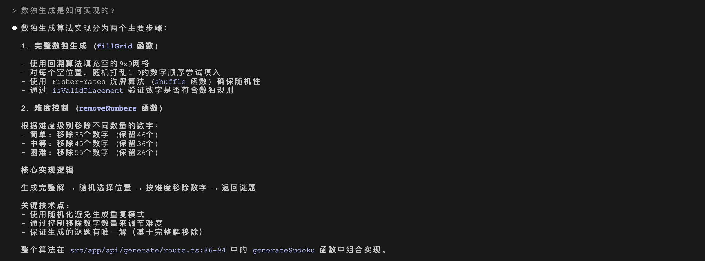
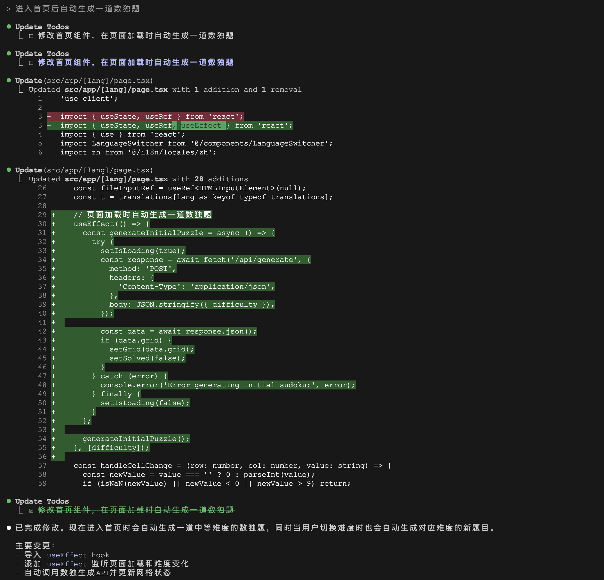
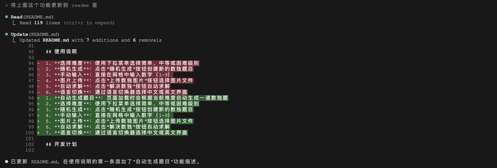
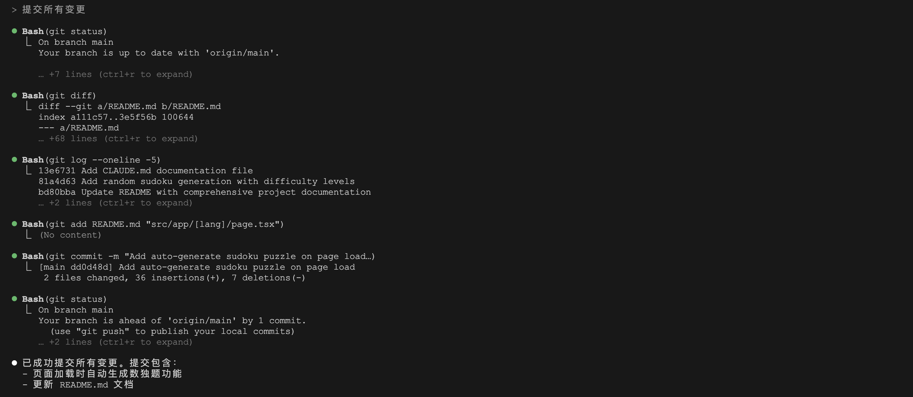
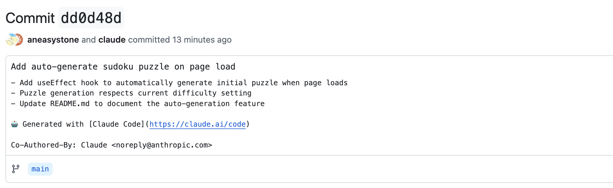

# 实践 Claude Code 的日常使用场景

昨天我们学习了 Claude Code 的安装和基本使用，通过自然语言命令完成项目分析到文件提交等任务。但 Claude Code 的能力远不止于此，它还可以帮助我们完成更多复杂的开发任务，比如代码重构、自动化测试、项目架构分析、版本控制管理等，我们今天就来进一步探索这些使用场景和高级功能，看下 Claude Code 对这些任务的表现。

## 新项目快速理解

Claude Code 最突出的特点之一是其强大的代码库理解能力。它能够在几秒钟内分析整个项目的结构，理解模块间的依赖关系，识别代码的架构模式，并回答关于代码逻辑和架构的复杂问题。

假设你刚加入一个新项目，需要快速了解它的结构，可以试试下面这些命令：

```
> 这个项目是做什么的？

> 给我概述下这个项目

> 这个项目使用了哪些技术？

> 这个项目的主入口在哪里？

> 解释下这个项目的目录结构
```

或者你也可以了解项目的特定功能：

```
> 项目是如何处理用户认证的？

> 查找和用户认证相关的文件

> 讲解从前端到数据库的整个登录过程
```

在面对新项目代码时，掌握一些提问的技巧也很重要，比如先从广泛的问题开始问起，然后缩小到特定领域；还可以询问项目使用了哪些特定术语，使用了哪些编码约定；这些信息都能很好的让 Claude Code 了解这个项目。

下面还是拿数独项目作为示例，让 Claude Code 讲解下数独生成是如何实现的：



可以看到 Claude Code 详细讲解了数独生成的算法，并准确地定位到了具体的代码位置。和 Cursor 等 AI 代码编辑器不同的是，我们不需要手动添加上下文，Claude Code 会根据需要自动查询并读取相关的文件。

## 添加和修改代码

基于对代码库的深度理解，Claude Code 能够进行跨文件的智能编辑，它能同时修改多个相关文件，并保持代码的一致性和最佳实践。常见的使用场景包括添加新功能和特性、问题诊断和修复、对代码进行重构或性能优化等：

```
> 使用 JWT 实现用户认证功能

> 解决这个编译报错问题

> 这里用户可以提交空表单，修复下这个 BUG

> 找到代码中使用的过期 API 并重构

> 使用 SQLAlchemy 重构数据库层代码

> 分析这里的代码逻辑是否存在性能问题，提出优化建议
```

在向 Claude Code 描述错误时，可以带上详细的错误堆栈、重现错误的任何步骤和命令、以及这个错误是偶现还是必现等信息，Claude 会尝试分析这些错误信息，找到问题源头并修复。另外，Claude Code 可以自动编写和运行测试，并从测试结果中识别和修复问题：

```
> 为计算器模块编写单元测试

> 找出 NotificationsService 中所有测试未覆盖的方法

> 为重构后的代码运行测试

> 修复这些失败的单元测试
```

现在我们来让 Claude Code 做一些实际的编程工作，尝试让它给我的数独项目加个小功能，我希望用户在进入首页时，自动生成一道数独题：



这里可以看到一个有趣的现象，Claude Code 首先生成了一个 Todo 列表，然后开始编写代码，结束编码后再将 Todo 列表更新为已完成。尽管这里只有一步，但是也让我们略窥到 Claude Code 的实现思路，这种方式可以让 Claude Code 解决比较复杂的多步任务。另外，Claude Code 在编辑文件时会以 diff 的形式显示出修改点，让用户确认，只有得到用户批准后才会真正执行。默认每次修改都会请求确认，如果嫌麻烦，可以为会话启用 ”全部接受” 模式。

实现效果如下：


## 生成文档和注释

程序员最怕写文档和注释，而 Claude Code 最擅长干这事：

```
> 更新 README 文档，添加安装步骤

> 为 auth.js 文件中的所有函数加上 JSDoc 注释
```

比如我们接着上面的例子，让 Claude Code 将增加的功能更新到 README 文件中：



## Git 集成和代码审查

Claude Code 与 Git 深度集成，使得我们可以用对话的方式来执行 Git 操作，比如智能提交、创建分支、解决冲突等：

```
> 提交刚刚的所有修改

> 提交 README.md 文件

> 创建一个新分支 feature/quickstart

> 用刚刚的修改创建一个 PR

> 解决合并冲突
```

Claude Code 在提交代码时会很智能的分析提交的内容，自动生成提交消息：



可以看到 Claude Code 先用 `git status` 检查变动的文件有哪些，然后使用 `git diff` 对比文件的修改点，这样它就知道了我们都改了什么内容；接着 Claude Code 执行 `git log --oneline -5` 命令，快速浏览最近的 5 次提交历史，这一步让它对项目最新的变化有个了解，我猜也是为了生成和历史更一致的提交消息；再然后 `git add` 和 `git commit` 提交代码，最后再用 `git status` 确认所有的变更是否都提交了。注意 `-m` 后面的注释非常全面，比我们自己写方便多了，另外，Claude Code 还会自动将 Claude 加到提交消息的作者里：



另外，Claude Code 还能查看 Git 历史，查看当前变更，并对用户的修改提出审查建议：

```
> 我改动了哪些文件？

> 查看最近 5 次提交

> 审查我最近做的修改，提出改进建议
```

Claude Code 就像是一个 AI 结对编程伙伴，你只需像和同事交谈一样，描述你想要的目标，它就会帮助你自动实现。

## 和 Cursor 的对比

经过几天的体验，Claude Code 给我的印象还是蛮深刻的。基于终端的交互方式，对于习惯命令行操作的开发者来说是一种享受 —— 纯粹的文本对话，无需面对复杂的界面元素，让开发者能够专注于核心任务，减少视觉干扰。更重要的是，这种交互方式让我们能够用自然语言描述目标，而不必纠结于具体的实现细节。

相比之下，Cursor 走的是另一条路线。它将 AI 能力深度集成到传统的 IDE 界面中，提供熟悉的可视化代码编辑体验。实时的代码建议、智能的 Tab 补全、直观的文件管理 —— 这些特性让 Cursor 的学习曲线更加平缓，对新手开发者更加友好。你可以看到代码的每一个变化，掌控每一个编辑操作。

两者各有优势：Claude Code 更像是一个无所不能的编程助手，你可以将复杂的多步骤任务完全委托给它；而 Cursor 则更像是一个智能的代码编辑器，在保持传统开发体验的同时增强了效率。

对于追求效率和敢于尝试新事物的开发者，Claude Code 提供了一种革命性的编程体验，这可能就是未来软件开发的模样：更少的手工操作，更多的意图表达，开发者角色将从 “手写代码” 转变成 “协调和审查” AI 代理编写代码，而这种转变，值得每一个开发者去亲身体验和探索。
