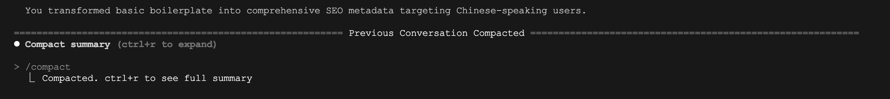

# 学习 Claude Code 的基本技巧

昨天我们折腾了一下 LiteLLM 网关，成功让 Claude Code 接入了其他大模型。这下好了，直接用 OpenRouter 的免费 DeepSeek 模型，再也不用担心 API 费用把钱包掏空了，可以放心大胆地体验 Claude Code 的各种功能。

前面我们已经学习了 Claude Code 的安装和基本用法，今天咱们继续深入挖掘一些实用的小技巧，让这个工具用起来更顺手。

## 提问的艺术

用 Claude Code 就像跟人聊天一样，你说话越清楚，它就越能帮到你。下面是几个建议：

* 第一，**指令越具体越好**，比如当你的页面出 BUG 时，不要这样问：

```
> 修复这个 BUG
```

这样问才对：

```
> 修复登录页面的 BUG，用户输错密码后看到的是空白页面而不是错误提示
```

第一种问法就像对着服务员喊"给我来个菜"，第二种才是正常人的沟通方式。

* 第二，**大任务拆成小步骤**，复杂的需求别一股脑全说出来，要学会拆解：

```
> 1. 给用户资料页面加个新的 API 接口

> 2. 添加必填字段的验证逻辑

> 3. 写几个测试用例验证功能
```

分步解决可以让 Claude Code 更了解用户的意图。

* 第三，**让 Claude Code 先摸清状况**，别上来就让它动手改代码，先让它了解一下你的项目：

```
> 帮我分析一下这个数据库的表结构

> 这个数据库查询异常是怎么回事？
```

## 使用扩展思考模式

以往的大语言模型，要么擅长快速响应，要么擅长深度推理，很难兼顾两者，比如 DeepSeek 的 V3 和 R1。Claude Sonnet 3.7 号称是业界首个 **混合推理（Hybrid Reasoning）** 模型，同时支持 [标准模式](https://docs.anthropic.com/zh-CN/docs/about-claude/models/extended-thinking-models) 与 [扩展思考模式](https://docs.anthropic.com/zh-CN/docs/build-with-claude/extended-thinking)：

* **标准模式**：对于一些事实性问题或简单指令，能迅速给出答案，快速回复用户；
* **扩展思考模式（Extended Thinking）**：模型会在回答之前进行自我反思，进行更深入的思考，并给出更全面、更准确的答案；

所有在 Claude Sonnet 3.7 之后发布的 Opus 和 Sonnet 模型都支持这两种模式。当我们面对下面这些复杂的任务时可以尝试使用扩展思考：

* 规划复杂的架构更改
* 调试复杂问题
* 为新功能创建实现计划
* 理解复杂的代码库
* 评估不同方法之间的权衡

Claude 官方出了一份关于扩展思考的高级策略和技巧指南，推荐阅读：

* https://docs.anthropic.com/zh-CN/docs/build-with-claude/prompt-engineering/extended-thinking-tips

我们在 Claude Code 中对话时，默认使用的是标准模式；如果要处理上面那些复杂的问题时，可以在指令中加上 “think” 或 “think harder” 等触发扩展思考模式：

```
> 我需要实现 OAuth2 认证，深入思考最佳方法

> 思考下，这种方法可能存在哪些潜在的安全漏洞？

> 更深入地思考我们应该处理的边缘情况
```

我试了下，无论是英文 “think” 还是中文 “思考” 都可以触发扩展思考模式，而且可以使用类似 “think more”、“think a lot”、“think harder” 或 “think longer” 这样的强化短语触发更深层的思考。

> Claude 的思考模式可以通过 `budget_tokens` 参数控制令牌预算，我猜测不同的提问方式会导致这个参数的值不同，更深层的思考消耗更多的思考令牌，感兴趣的朋友可以验证一下。

我这里还是拿数独项目为例，让它给我提一些 SEO 优化的建议：


和 DeepSeek R1 一样，Claude 的思考过程对用户也是可见的。在上图中，Claude 以斜体灰色文本显示了其思考过程，你可以看到它是如何一步步分析问题、得出结论的。Claude Code 对我的代码经过一番分析，最终输出如下：


经过思考后的输出要更详细。

## 处理图像

Claude 系列模型具有视觉能力，可以理解和分析图像。当我们遇到有些问题用文本描述不清或过于繁琐时，可以给 Claude 提供图像，效果会更好，比如错误截图、UI 设计或图表等，图像比文本包含更多的上下文信息。

我们可以通过下面几种方法向 Claude Code 对话中添加图像：

* 将图像拖放到 Claude Code 窗口中
* 复制图像并使用 `ctrl+v` 粘贴到命令行中（不要使用 `cmd+v`）
* 提供图像路径，例如：“分析图像: /path/to/your/image.png”

> 可以在对话中一次性添加多个图像。

下面是使用图像的一些常用场景：

* 让 Claude 分析图像

```
> 这张图片显示了什么？

> 描述截图中的用户界面元素

> 这张图中是否有任何问题元素？
```

* 使用图像提供上下文

```
> 这是错误的截图，分析是什么原因引起的？

> 这是我们当前的数据库模式，为了实现新增的功能，我们应该如何修改它？
```

* 从视觉内容获取代码建议

```
> 根据这个设计图生成 CSS

> 什么样的 HTML 结构可以重现这个组件？
```

## 处理文件和网址

我们还可以让 Claude Code 查看或处理仓库下的某个文件或目录，一般需要输入全路径，方便 Claude 找到正确的资源。使用 Tab 键自动补全，可以大大方便文件路径的输入：


也可以将某个网址丢给 Claude Code 让它分析或总结：


Claude Code 内置了一个 `Fetch` 工具，用于抓取网页内容。

## 会话管理

我们每次运行 `claude` 命令进入交互模式时，实际上都是创建一个新会话，如果我们希望继续之前的会话，可以使用 Claude Code 的会话管理功能。

参数 `-c` 或 `--continue` 用于继续最近一次对话：

```
$ claude -c
```

参数 `-r` 或 `--resume` 用于恢复某个历史会话：

```
$ claude -r
```

Claude Code 会弹出一个对话选择列表，列出最近的所有会话：


列表中显示了会话时间、消息条数、消息摘要等信息，你可以使用上下键导航并按 Enter 选择具体的会话，恢复后，你将看到该会话的整个对话历史。

此外，在交互模式下，还有一些 [斜杠命令（Slash Commands）](https://docs.anthropic.com/zh-CN/docs/claude-code/slash-commands) 也可以操作会话。比如当会话中消息过多时，可能会影响模型的效果和速度，这时我们可以执行 `/clear` 命令清除上下文：

```
> /clear
```

实际上 `/clear` 命令是创建了一个新会话，老的会话不动。

或者使用 `/compact` 命令压缩当前会话：

```
> /compact
```

压缩成功后，会显示如下信息：



之后的对话将从压缩后的会话开始。实际上 `/compact` 也是创建了一个新会话，将压缩后的会话作为新会话的第一条消息。

## 小结

我们今天简单学习了 Claude Code 的一些实用技巧，从提问的艺术，到处理图像，再到处理文件和网址。还学习了开启扩展思考模式的方法，遇到复杂问题时别忘了加个 "think" 或 "思考"，让 AI 先动动脑子再回答。

最后介绍了几个会话管理的小命令，像这样的小命令 Claude Code 还有很多，熟练掌握可以给我们省不少事儿，下一篇我们就来盘点下 Claude Code 的其他命令。
