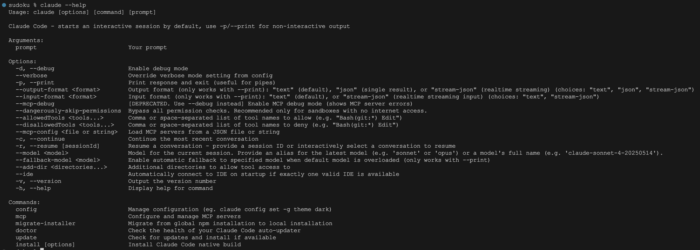
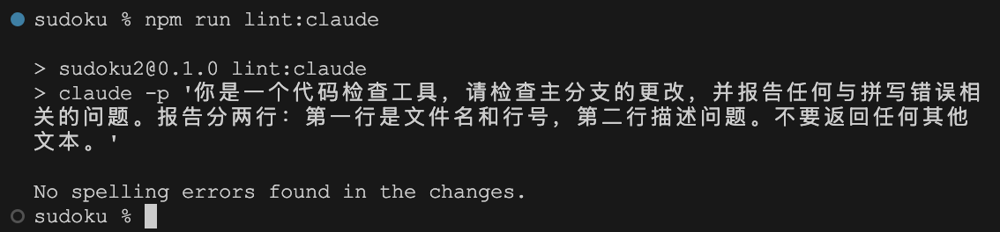
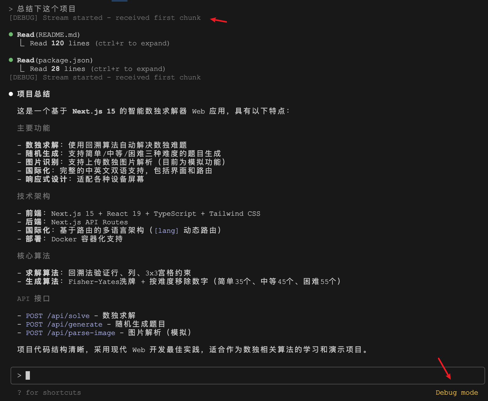
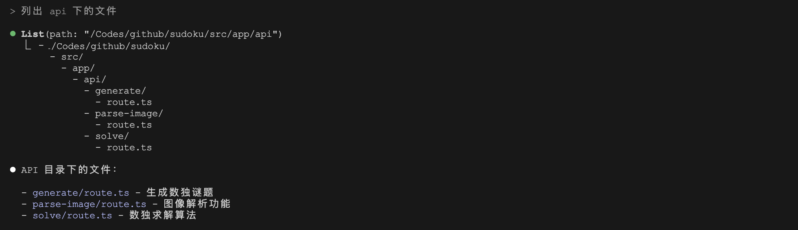
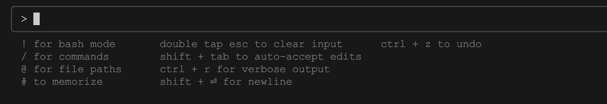
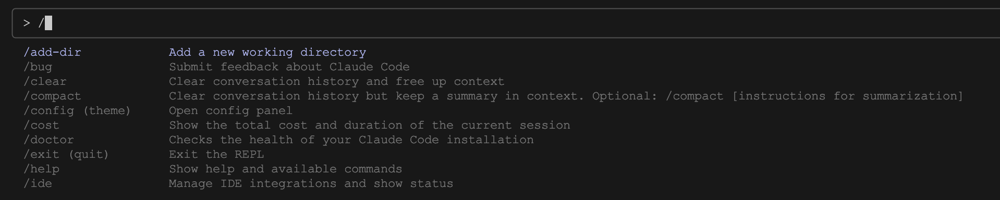
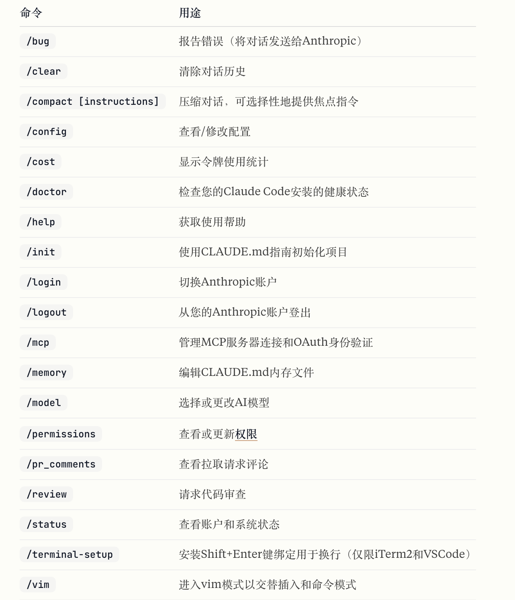
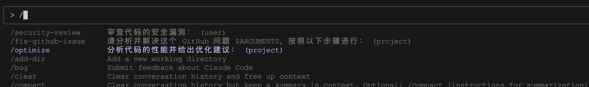

# 学习 Claude Code 的命令行操作

我们昨天学习了 Claude Code 的一些实用技巧，包括提问的艺术、图像的处理，文件和网址的处理、扩展思考模式等，还介绍了几个会话管理的小命令，Claude Code 还有不少实用的命令和参数，我们今天来盘点下。

使用 `claude --help` 查看 Claude Code 支持的所有命令和参数：



## 非交互模式

参数 `-p` 或 `--print` 可以让 Claude Code 直接打印响应，不进入交互模式，这对于脚本编写和自动化特别有用。比如下面的例子让 Claude Code 充当一个代码检查工具：

```
$ claude -p "你是一个代码检查工具，请检查主分支的更改，并报告任何与拼写错误相关的问题。报告分两行：第一行是文件名和行号，第二行描述问题。不要返回任何其他文本。"
```

非交互模式可以让我们很方便地将 Claude Code 无缝地集成到构建脚本或 CI/CD 工作流中。假如你在开发 Node.js 项目，可以将这个命令添加到 `package.json` 文件：

```
{
    ...
    "scripts": {
        ...
        "lint:claude": "claude -p '你是一个代码检查工具...'"
    }
}
```

然后运行 `npm run lint:claude` 来对提交的代码进行检查：



除了代码检查，你可以自定义提示词实现更多其他功能。为了防止非交互模式下 Claude Code 陷入死循环，可以使用 `--max-turns` 参数限制对话的轮数：	

```
$ claude -p --max-turns 3 "query"
```

非交互模式还可以让我们使用管道将 Claude Code 集成到现有的 Shell 脚本中，与其他 Unix 工具结合使用以实现强大的工作流程：

```
$ cat build-error.txt | claude -p '详细解释这个构建错误并分析可能的出错原因' > output.txt
```

默认 Claude Code 的输出为纯文本方式，可以考虑使用 `—output-format` 参数进行结构化输出：

```
$ cat package.json | claude -p '找出这个文件中可能存在的问题' --output-format=json > output.json
```

这种输出结构方便我们以编程方式解析 Claude 的响应，输出内容包含状态、结果、耗时、使用的 tokens 等元数据，如下：

```
{
    "type": "result",
    "subtype": "success",
    "is_error": false,
    "duration_ms": 14340,
    "duration_api_ms": 17037,
    "num_turns": 3,
    "result": "这个 package.json 文件有以下问题：...",
    "session_id": "ecb8aaf4-4fbe-44c1-a27a-c88f5d85f817",
    "total_cost_usd": 0.06880885,
    "usage": {
        "input_tokens": 9,
        "cache_creation_input_tokens": 15601,
        "cache_read_input_tokens": 14445,
        "output_tokens": 289,
        "server_tool_use": {
            "web_search_requests": 0
        },
        "service_tier": "standard"
    }
}
```

Claude Code 支持 JSON 和流式 JSON 两种结构化输出格式，当使用流式 JSON 时，Claude Code 会实时输出一系列的 JSON 对象，而不是一个 JSON 对象。可以根据需要来选择不同的输出格式：

* 对于只需要 Claude 响应的简单集成，使用 `--output-format=text`
* 当你需要完整的对话日志时，使用 `--output-format=json`
* 当你需要每个对话轮次的实时输出时，使用 `--output-format=stream-json`

我们除了可以控制输出格式，也可以使用 `--input-format` 参数指定输入格式，Claude Code 支持两种输入格式：

* 对于简单集成，使用 `--input-format=text`
* 当你需要实时流式输入时，使用 `--input-format=stream-json`

## 调试模式

参数 `-d` 或 `--debug` 用于开启调试模式：

```
$ claude --debug
```

调试模式右下角会显示 “Debug mode” 的标记，在交互过程中会打印出 Claude Code 中 DEBUG 级别的日志：



参数 `--verbose` 用于开启详细模式，或者叫做冗余模式：

```
$ claude --verbose
```

详细模式下会显示出工具的完整调用结果，和正常模式下按 `Ctrl + R` 效果是一样地：



这两个模式对于排查问题都很有帮助，当遇到报错时，比如调用 MCP Server 异常，可以试试这两个模式。

## 指定模型

参数 `--model` 用于指定当前会话的模型：

```
$ claude --model sonnet
```

可以提供最新模型的别名（例如 `sonnet` 或 `opus`）或模型的全名（例如 `claude-sonnet-4-20250514`）。

参数 `--fallback-model` 用于指定回退模型：

```
$ claude --model opus --fallback-model sonnet -p "query"
```

当默认模型超负荷时，将自动切换到指定的回退模型，注意，仅在非交互模式下有效。

## 交互模式

在交互模式下有不少键盘快捷键可供使用，输入 `?` 查看说明：



* `!` - 进入 Bash 模式，可直接运行 Bash 命令
* `/` - 输入快捷命令，在交互式会话中控制 Claude 的行为
* `@` - 我们知道在输入文件路径时可以按下 Tab 键自动补全，使用 `@` 也可以智能提示并引用文件
* `#` - 向 `CLAUDE.md` 文件中添加新的记忆
* `Ctrl + L` - 清空当前输入框的内容
* `Esc + Esc` - 当输入框有内容时，连按两次 `Esc` 键，清空输入框内容，和 `Ctrl + L` 一样；当输入框没有内容时，连按两次 `Esc` 键，可以回退到之前的对话记录
* `Ctrl + C` - 和 `Ctrl + L` 一样，也是清空输入框内容，但是如果连按两次 `Ctrl + C` 就会退出程序
* `Ctrl + Z` - 取消上一步操作，注意这个针对的仅仅是输入框中的操作，比如输入、删除、清空等
* `Shift + Tab` - 自动接受文件编辑，默认情况下，编辑文件前 Claude Code 会让用户确认
* `Ctrl + R` - 开启详细模式，将显示工具的完整调用结果，和上面的 `--verbose` 一样
* `Shift + Enter` - 多行输入，也可以手动输入 `\ + Enter` 换行，在 macOS 中也可以使用 `Option + Enter` 换行
* `/vim` - 启用 Vim 风格编辑，如果你是一个 Vim 党，在编辑大段文本时会很方便

## 斜杠命令

上面的 `/` 快捷键比较有意思，用于快速唤起某些命令，这些命令被称为 **斜杠命令（Slash Commands）**。我们在之前的学习中已经见过一些斜杠命令了，比如用 `/init` 创建 `CLAUDE.md` 记忆文件，用 `/clear` 清除对话历史，用 `/compact` 压缩对话等等。在交互式对话框中输入 `/` 可唤出所有可用的斜杠命令：



常用的斜杠命令如下所示：



## 自定义斜杠命令

关于斜杠命令的另一个有趣功能是，用户可以将经常使用的提示或指令放在特定位置的 Markdown 文件中，从而创建出属于自己独有的斜杠命令。自定义命令文件位于当前项目的 `.claude/commands` 目录下或者个人用户的 `~/.claude/commands` 目录下，项目目录下的命令叫做 **项目命令**，可以存储在仓库中并与你的团队共享；用户目录下的命令叫做 **用户命令**，只能你自己使用，而且可以在所有项目中使用。

自定义斜杠命令的语法如下：

```
> /<prefix>:<command-name> [arguments]
```

其中，`<prefix>` 表示命令作用域，可以是 `project` 项目命令，或者 `user` 用户命令；`<command-name>` 是命令的名称，也就是 Markdown 文件的名称（不包含 `.md` 扩展名），一个 Markdown 文件对应一个命令；`[arguments]` 表示传递给命令的可选参数。
​
下面是一个项目命令的例子，在 `.claude/commands` 目录下创建一个 `optimize.md` 文件：

```
$ mkdir -p .claude/commands
$ echo "分析代码的性能并给出优化建议：" > .claude/commands/optimize.md
```

然后就可以通过下面的斜杠命令来调用：

```
> /project:optimize
```

下面是一个用户命令的例子，在 `~/.claude/commands` 目录下创建一个 `security-review.md` 文件：

```
$ mkdir -p ~/.claude/commands
$ echo "审查代码的安全漏洞：" > ~/.claude/commands/security-review.md
```

然后就可以通过下面的斜杠命令来调用：

```
> /user:security-review
```

命令目录下还可以创建子目录，这些子目录被称为 **命名空间**，方便用户对不同类型的命令进行组织，比如对于一个全栈项目，我们可以将命令分为前端命令和后端命令，那么就可以在 `.claude/commands` 目录下创建 `frontend` 和 `backend` 两个子目录。命名空间命令的语法如下：

```
> /<prefix>:<namespace>:<command-name> [arguments]
```

另外，我们可以在 Markdown 文件中使用 `$ARGUMENTS` 占位符，表示传递给命令的参数，比如下面这个实际的例子：

```
请分析并解决这个 GitHub 问题 $ARGUMENTS，按照以下步骤进行：

1. 使用 `gh issue view` 获取问题详情
2. 理解问题中描述的问题
3. 在代码库中搜索相关文件
4. 实施必要的更改以解决问题
5. 编写并运行测试以验证修复
6. 确保代码通过 linting 和类型检查
7. 创建一个描述性的提交信息
8. 推送并创建一个 PR

请记住使用 GitHub CLI (`gh`) 进行所有与 GitHub 相关的任务。
```

将上面的内容保存到 `.claude/commands/fix-github-issue.md` 文件中，然后调用这个命令来修复 Github 上的问题：

```
> /project:fix-github-issue 1234
```

通过传入动态参数，可以创建出更加灵活的自定义命令，比如这些场景：

* 为指定函数生成测试用例
* 为指定组件创建文档
* 审查指定文件中的代码
* 将内容翻译为指定语言

所有自定义的斜杠命令也会显示在 `/` 快捷命令列表中：



## 小结

我们今天学习了不少和 Claude Code 命令行相关的技巧，比如使用非交互模式轻松将 Claude Code 集成到构建脚本或 CI/CD 工作流中，使用调试模式和详细模式快速定位和解决各种问题，交互模式下丰富的快捷键和斜杠命令让日常使用更高效，而自定义斜杠命令让我们可以根据项目需求创建专属的命令工具箱。

* CLI https://docs.anthropic.com/zh-CN/docs/claude-code/cli-reference
* 斜杠命令 https://docs.anthropic.com/zh-CN/docs/claude-code/slash-commands
* 交互模式 https://docs.anthropic.com/zh-CN/docs/claude-code/interactive-mode

关于 Claude Code 的命令行操作还有很多，比如关于工具权限的 `--allowedTools` 和 `--disallowedTools` 参数，关于 MCP 集成的 `claude mcp` 子命令，关于配置管理的 `claude config` 子命令等，我们将在后续的专题学习中逐一介绍。
