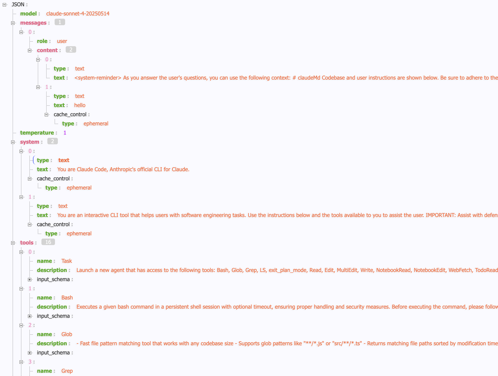
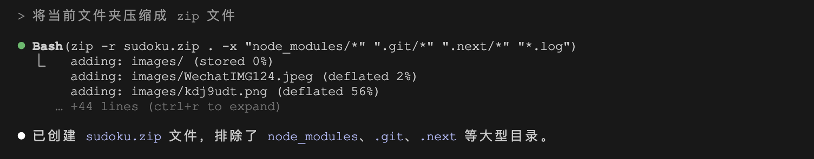
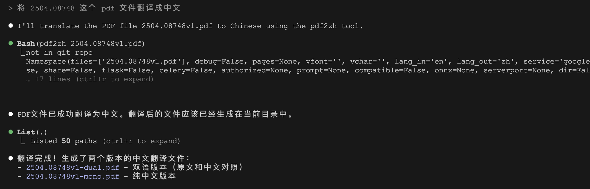
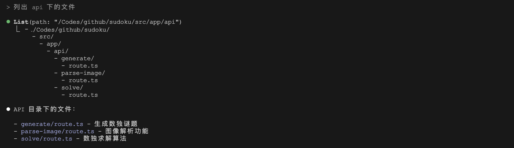
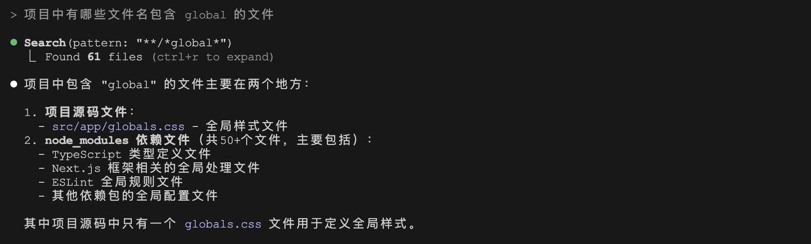
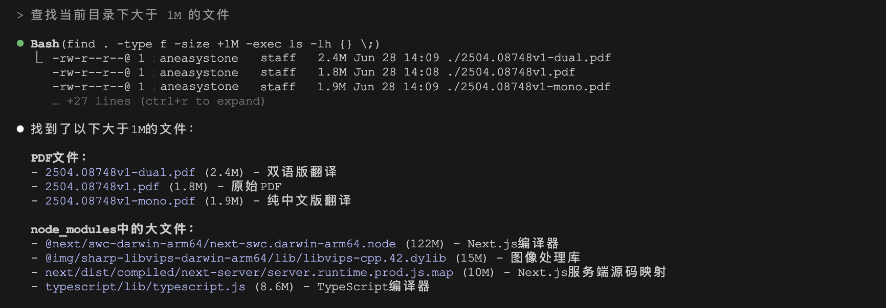
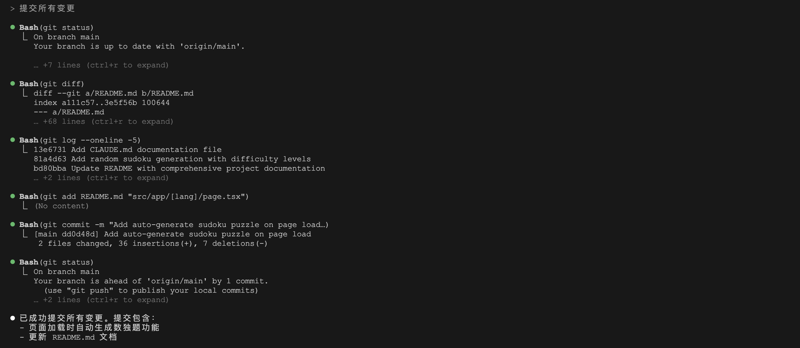

# 学习 Claude Code 的工具使用

在前面的学习中我们已经接触了不少 Claude Code 的工具，比如使用 `List` 工具列出文件列表，使用 `Read` 和 `Write` 工具对文件进行读写，使用 `Bash` 工具调用 `git add` 或 `git commit` 等命令。Claude Code 内置了不少工具，但是由于 Claude Code 并没有开源，除了官方文档，我们并没有太多工具相关的资料可参考。

因此我使用 Wireshark 对 Claude Code 的请求抓包分析，看到了它内置的提示词以及 `tools` 参数：



从上图可以看到，Claude Code 内置了 16 个工具，这些工具大致可以分为下面几类：

| 分类 | 分类描述 | 示例工具 |
| ---- | ------ | ------ |
| **命令执行** | 允许在 Shell 会话中执行 `Bash` 命令 | `Bash` |
| **文件查找** | 用于快速查找并匹配文件 | `LS`、`Glob` 和 `Grep` |
| **文件读写** | 用于读取或写入文件，允许进行文件编辑和内容替换 | `Read`、`Write`、`Edit` 和 `MultiEdit` |
| **Notebook 读写** | 用于读取和编辑 Jupyter Notebook（也就是 `.ipynb` 文件） | `NotebookRead` 和 `NotebookEdit` |
| **Web 检索** | 用于检索和分析 Web 内容的工具 | `WebFetch` 和 `WebSearch` |
| **复杂任务处理** | 通过子智能体或任务清单来执行复杂任务 | `Task`、`TodoWrite`、`TodoRead` 和 `exit_plan_mode` |

今天就来仔细学习一下这些工具。

## `Bash` 执行命令

Claude Code 是一款基于终端的 AI 编程助手，它继承了你的 Shell 环境，可以调用常用的 Unix 命令。比如调用 `du` 查看文件夹大小：


调用 `zip` 压缩文件夹：



甚至可以使用你安装的任何命令行工具，比如我们之前学过 PDFMathTranslate 这款开源的 PDF 文档翻译工具，让 Claude Code 来试试：



当然，默认情况下 Claude Code 并不知道这些命令，可以通过在 `CLAUDE.md` 中记录常用的命令，告诉 Claude 可以使用哪些命令以及每个命令的用法：

```
你可以使用下面这些 Bash 命令：

* pdf2zh - 一款免费开源的 PDF 文档翻译工具，支持多种语言和翻译服务，最大的特色是翻译后保持排版不变。

基本用法，默认将英文 PDF 文件翻译成中文：`pdf2zh example.pdf`
指定源和目标语言：`pdf2zh example.pdf -li en -lo ja`
查看命令文档：`pdf2zh --help`
```

Bash 命令几乎可以实现任何功能，但是不同的 Bash 命令参数迥异，有些命令的参数还特别复杂，为了防止大模型生成命令时误入歧途，Claude Code 内置了一些工具来替代常见的 Unix 命令。从抓包请求里可以看到 `Bash` 工具的描述，其中有几个点比较有意思：

- 含空格的路径必须用双引号包裹
- 严禁使用 `find` 和 `grep` 搜索命令，改用 `Grep` / `Glob` / `Task` 工具
- 避免使用 `cat` / `head` / `tail` / `ls` 等读取工具，改用 `Read` / `LS` 工具
- 如果你仍然要运行 `grep`，请停止，必须优先使用预装的 `rg` 来替代，所有 Claude Code 用户都已预安装此工具
- 尽量使用绝对路径，避免使用 `cd`，除非用户明确要求

这样做的好处是，大模型通过 function call 生成结构化的命令，比直接生成长长的命令行要可控的多。

## `LS` 列出文件和目录

从 `Bash` 的工具描述中可以看到，Claude Code 使用内置的 `LS` 工具替代 `ls` 命令：



内置 `LS` 的好处是它可以递归遍历子目录，如上图所示（使用 `Ctrl + R` 可以展开详情）。

## `Glob` 根据文件名查找文件

另一个内置的 `Glob` 工具用于替代 `find` 命令，可以基于模式匹配来查找文件：



它有点类似下面这个 `find` 命令：

```
$ find . -type f -name "*global*"
```

但比 `find` 命令强的地方在于它支持 Glob 模式匹配，比如 `**/*.js` 或 `src/**/*.ts` 这样。

尽管在 `Bash` 的工具描述里特别提到 *严禁使用 `find` 命令*，但是我验证下来发现，如果内置的工具不足以完成用户的任务，Claude Code 还是会使用这些被限制的命令：



## `Grep` 搜索文件内容

另外，从 `Bash` 的工具描述中我们还得知，Claude Code 预装了一个叫 `rg` 的工具用于替代 `grep` 命令，这个 `rg` 全名叫 [ripgrep](https://github.com/BurntSushi/ripgrep)，是一个现代的命令行搜索工具，相对于 `grep` 来说搜索效率更高。可以在 Claude Code 的安装目录下找到它：

* @anthropic-ai/claude-code/vendor/ripgrep

`ripgrep` 使用 Rust 编写，通过先进的搜索算法和内建的索引优化，可以递归地在当前目录中搜索正则表达式模式，它默认会遵循 `gitignore` 规则，并自动跳过隐藏文件和二进制文件。这些特性使得 `ripgrep` 成为许多开发者搜索大型代码库的常用工具之一，也是 Claude Code 能处理大型代码库的秘密武器之一。

当我们要搜索代码库中文件内容时，Claude Code 往往就会使用这个命令：


这里的 `Search` 其实就是 `Grep` 工具，类似于下面的命令：

```
$ rg "POST|post" **/route.ts
```

## 使用 Git 命令

除了执行上面的基本命令，Claude Code 还可以处理大多数的 Git 操作，比如下面几个常见的场景：

* 一、**搜索 Git 历史回答问题**，可以在指令中明确要求 Claude Code 查看 git 历史，这样效果会更好：

```
> v1.2.3 分支中包含哪些更改？

> 根据 git 提交历史，分析这个 API 为什么这样设计？
```

* 二、**编写提交消息**，Claude 会自动查看你的更改和最近历史，生成符合上下文的提交消息，我们在之间的文章中已经见识过：



在 `Bash` 的工具描述中，有一份详细的 Git 提交规范，可以对照着上面的截图，了解下 Claude Code 是如何处理 Git 提交的：

```
当用户要求您创建新的 Git 提交时，请仔细按照以下步骤操作：

1. 始终并行运行以下 Bash 命令：
   - 运行 git status 查看所有未跟踪的文件
   - 运行 git diff 查看将要提交的已暂存和未暂存的更改
   - 运行 git log 查看最近的提交消息，以便可以遵循此仓库的提交消息风格

2. 分析所有已暂存的更改（包括之前已暂存和新添加的）并起草提交消息：
   - 总结更改的性质（例如：新功能、功能增强、错误修复、重构、测试、文档等）
   - 检查是否有不应提交的敏感信息
   - 起草简洁的（1-2句话）提交消息，重点关注"为什么"而不是"什么"
   - 确保消息准确反映更改及其目的

3. 始终并行运行以下 Bash 命令：
   - 将相关的未跟踪文件添加到暂存区
   - 创建提交，消息以以下内容结尾：
   .... Generated with Claude Code
   Co-Authored-By: Claude noreply@anthropic.com
   - 运行 git status 确保提交成功

4. 若因 pre-commit 钩子失败：
   - 重试一次包含自动变更
   - 仍失败则终止
   - 成功但文件被钩子修改时必须 amend 提交
```

* 三、**处理复杂的 Git 操作**，如恢复文件、解决冲突以及比较和移植补丁等：

```
> 将 v1 合并到 v2 分支，并尝试解决冲突
```

## 未完待续

今天我们学习了 Claude Code 的命令执行和文件查找相关的工具：使用 `Bash` 运行 Unix 常见命令、用户安装的三方命令和 Git 命令等；使用 `LS` 列出文件和目录；使用 `Glob` 根据模式查找文件；使用 `Grep` 通过正则表达式快速搜索文件内容。文件的查找和搜索是通过 Claude Code 预装的一个叫 `rg` 的工具实现的，它相对于 `grep` 速度更快，效率更高，适用于任何规模的代码库。

Claude Code 的工具箱里还有不少其他好玩的工具，我们明天继续。
