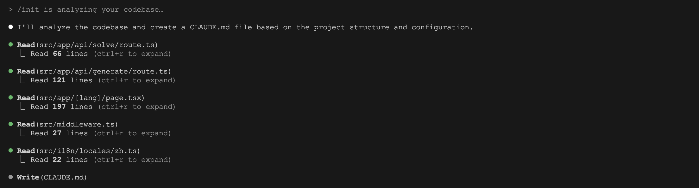
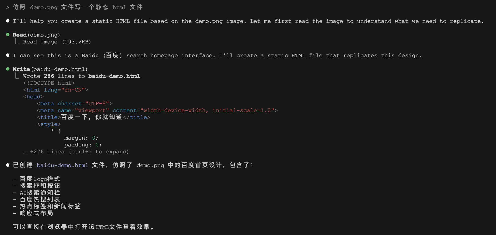
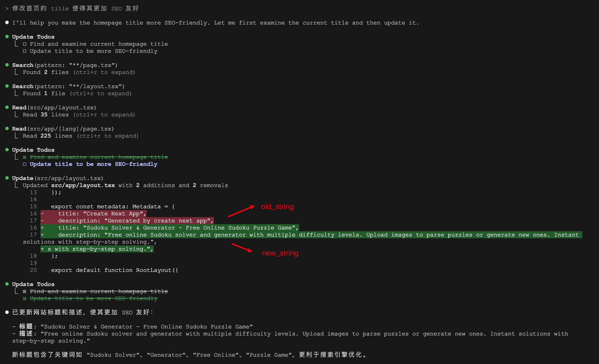
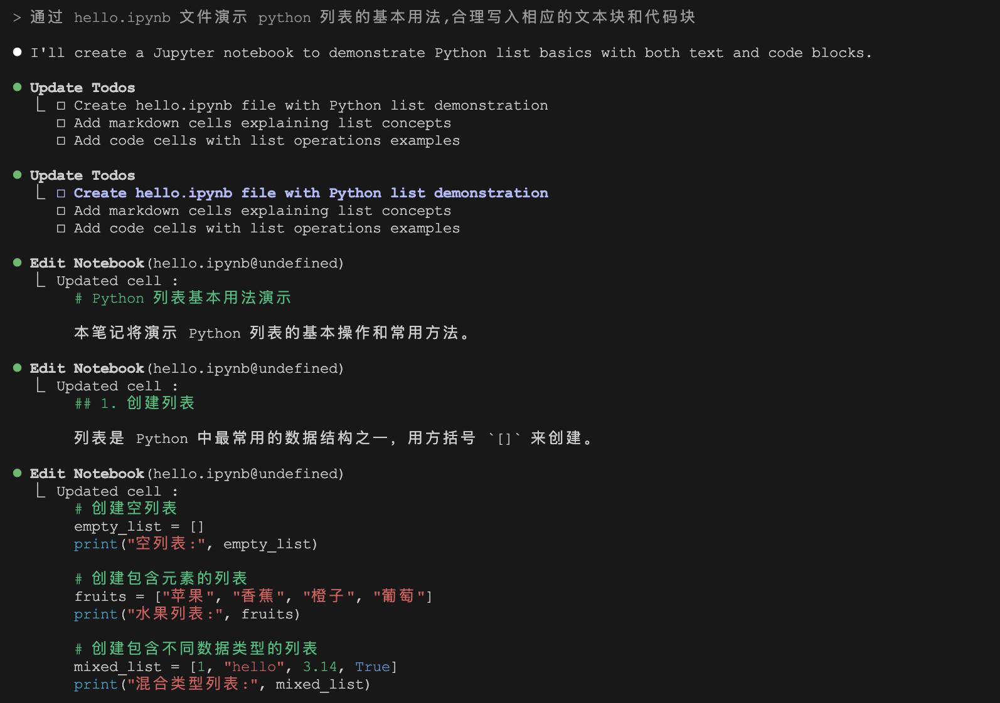
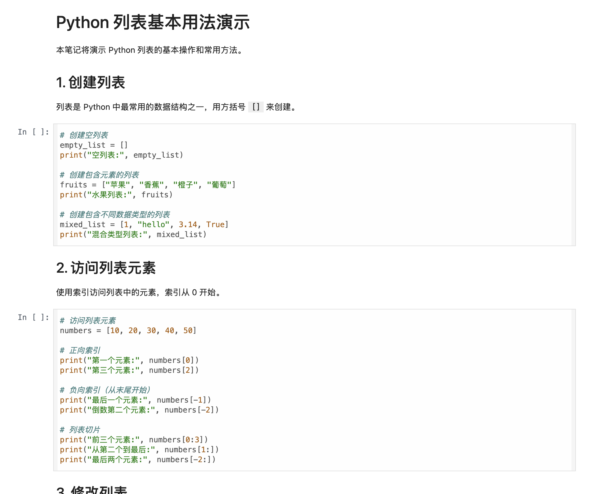
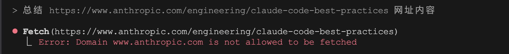
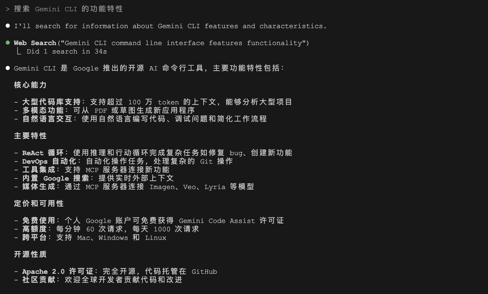

# 学习 Claude Code 的工具使用（二）

在上一篇中，我们学习了 Claude Code 的 `Bash`、`LS`、`Glob` 和 `Grep` 四个工具，用于命令执行和文件查找相关的任务，我们今天继续看下其他的工具。

## 文件读写

文件读取和文件写入应该是 Claude Code 最常做的事情了，我们在之前的学习中不止一次使用了这些工具。比如运行 `/init` 命令生成 `CLAUDE.md` 文件时，就是通过 `Read` 去读取文件内容，然后再用 `Write` 去写入新文件：



Claude Code 推荐使用 `Read` 工具去读取文件，而不是 `cat` 、 `head` 或 `tail` 等 Bash 命令，这是因为 `Read` 相对于这些命令来说有几个独特的优势，我们可以从 `Read` 的工具描述中看到：

- 默认情况下，最多读取 2000 行
- 可以指定行偏移量和限制，对于长文件特别有用
- 任何超过 2000 个字符的行都会被截断
- 结果使用 cat -n 格式返回，行号从 1 开始，便于大模型了解代码所在的行数
- 支持读取图像（如 PNG、JPG 等）

其中最大的优势是读取图像，因为 Claude Code 是一个多模态大模型，所以我们可以让 Claude 去分析错误截图或者按产品原型图去开发页面，比如这里将百度首页截图：


然后将它丢给 Claude Code 去仿照：



Claude Code 首先调用 `Read` 去读取图片，将其转换成 BASE64 格式，然后去调用 Claude 的[视觉能力](https://docs.anthropic.com/zh-CN/docs/build-with-claude/vision)：

```json
{
  "model": "claude-sonnet-4-20250514",
  "messages": [
    {
      "role": "user",
      "content": [
        {
          "type": "image",
          "source": {
            "type": "base64",
            "media_type": "image/png",
            "data": "iVBORw0KGgoAAAANSUhEUgAABx..."
          }
        },
        {
          "type": "text",
          "text": "仿照 demo.png 文件写一个静态 html 文件"
        }
      ]
    }
  ],
  "temperature": 1,
  "max_tokens": 32000,
  "stream": true
}
```

最终生成静态页面如下：


## 文件编辑

还有很多任务需要对代码文件进行编辑修改，这是通过 `Edit` 和 `MultiEdit` 两个工具实现的。这两个工具的本质是字符串替换，可以从工具的描述和 Schema 看出来：

```json
{
  "name": "Edit",
  "description": "Performs exact string replacements in files...",
  "input_schema": {
    "type": "object",
    "properties": {
      "file_path": {
        "type": "string",
        "description": "The absolute path to the file to modify"
      },
      "old_string": {
        "type": "string",
        "description": "The text to replace"
      },
      "new_string": {
        "type": "string",
        "description": "The text to replace it with (must be different from old_string)"
      },
      "replace_all": {
        "type": "boolean",
        "default": false,
        "description": "Replace all occurences of old_string (default false)"
      }
    },
    "required": [
      "file_path",
      "old_string",
      "new_string"
    ],
    "additionalProperties": false,
    "$schema": "http://json-schema.org/draft-07/schema#"
  }
}
```

这个工具有四个参数：

* `file_path` - 文件全路径
* `old_string` - 替换前的原字符串
* `new_string` - 替换后的新字符串
* `replace_all` - 是否全部替换，默认 false

当调用 `Edit` 工具时，原字符串和新字符串会以 diff 形式显示出来：



在调用 `Edit` 工具之前，必须先至少调用一次 `Read` 工具，方便 Claude Code 获得原字符串，`Edit` 工具一次只能替换一个字符串，如果要批量替换多个字符串，可以使用 `MultiEdit`  工具。

## Notebook 读写

Claude Code 内置了对 Jupyter Notebook 的读写工具，用于读取和编辑 `.ipynb` 文件：

* `NotebookRead` - 读取 Jupyter Notebook 中指定单元格的内容，如果不指定单元格，则返回所有单元格的内容；
* `NotebookEdit` - 编辑 Jupyter Notebook 中特定单元格的内容，支持插入、替换和删除三种编辑模式，并支持 `code` 和 `markdown` 两种单元格类型；

在下面的示例中，我们让 Claude Code 生成一个 Jupyter Notebook 文件，来演示 Python 列表的基本用法：



生成的 Jupyter Notebook 结构清晰，而且最大的好处是，它提供了交互式的环境方便我们进行研究和学习：



> Claude Code 通过 `NotebookEdit` 插入单元格有一个问题，每次都是在文件开头处插入，所以当我们连续生成多个单元格时，顺序就有问题。上面的截图是我倒序后的结果。

## 网页抓取

`WebFetch` 工具支持从指定 URL 获取内容并使用 AI 模型进行处理，它首先抓取 URL 内容，将 HTML 转换为 Markdown 格式，然后使用小型快速模型根据用户的提示进行处理。

不过我尝试下来，这个工具一直没有调用，不知道什么原因，总是报 `Domain xxx is not allowed to be fetched` 这样的错：



如果有知道原因的朋友，欢迎在评论区交流。

这个工具的描述里有几个点值得关注：

- 重要提示：如果有 MCP 提供的网页获取工具可用，请优先使用该工具，因为它可能限制更少。所有 MCP 提供的工具都以 "mcp__" 开头
- HTTP URL 将自动升级为 HTTPS
- 如果内容非常大，结果可能会被总结
- 包含自清理的 15 分钟缓存，以便在重复访问同一 URL 时获得更快的响应

所以如果有朋友也遇到和我一样的错误，建议使用 MCP 工具来抓取网页，关于 MCP 的内容，我们后面单独开一篇来介绍。

## 联网搜索

除了抓取特定网页的内容，Claude Code 还能够通过内置的 `WebSearch` 工具进行联网搜索，提供最新信息，回答实时问题。比如最近 Google 发布的 Gemini CLI 非常火，我就让它帮我搜一下：



联网搜索工具实际上调用的还是 Claude 模型，最新版本的 Claude 模型基本上都具备 [联网搜索能力](https://docs.anthropic.com/zh-CN/docs/agents-and-tools/tool-use/web-search-tool)，在调用模型时将 `tools` 换成了 Claude 内置的 `web_search` 工具即可：

```json
{
  "model": "claude-sonnet-4-20250514",
  "messages": [
    {
      "role": "user",
      "content": [
        {
          "type": "text",
          "text": "Perform a web search for the query: Gemini CLI command line interface features functionality"
        }
      ]
    }
  ],
  "temperature": 1,
  "system": [
    {
      "type": "text",
      "text": "You are Claude Code, Anthropic's official CLI for Claude."
    },
    {
      "type": "text",
      "text": "You are an assistant for performing a web search tool use"
    }
  ],
  "tools": [
    {
      "type": "web_search_20250305",
      "name": "web_search",
      "max_uses": 8
    }
  ],
  "max_tokens": 32000,
  "stream": true
}
```

但是这也带来了一个问题，如果我们没有使用 Claude 模型，而是自定义的其他模型，那么 `WebSearch` 工具就不可用了，所以也建议使用 MCP 工具来实现联网搜索。在运行 `claude` 命令时，通过 `--disallowedTools` 选项禁用网页抓取和联网搜索工具：

```
$ claude --disallowedTools "WebSearch,WebFetch"
```

## 未完待续

今天我们学习了 Claude Code 的文件操作和网络访问相关的工具，包括：

- **文件读写**：`Read` 和 `Write` 工具，其中 `Read` 支持图像读取和视觉分析
- **文件编辑**：`Edit` 和 `MultiEdit` 工具，通过精确的字符串替换实现代码修改
- **Notebook 操作**：`NotebookRead` 和 `NotebookEdit` 工具，通过 Jupyter Notebook 提供交互式开发和学习环境
- **网络功能**：`WebFetch` 和 `WebSearch` 工具，获取联网信息，解决实时性问题

在下一篇中，我们将学习剩下的几个工具，包括 `Task`、`TodoWrite`、`TodoRead` 和 `exit_plan_mode` 四个工具，来解决一些相对复杂和高级的任务。
