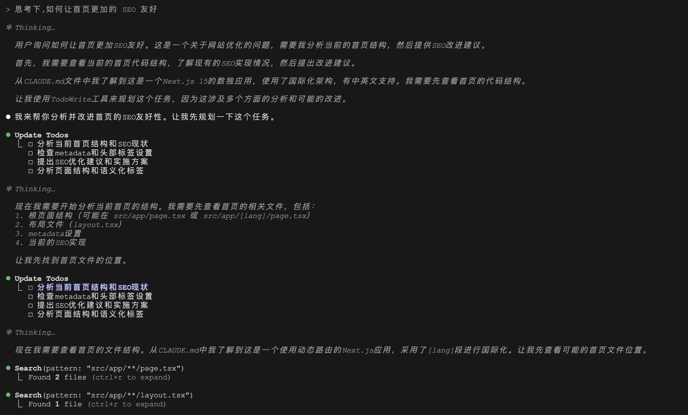
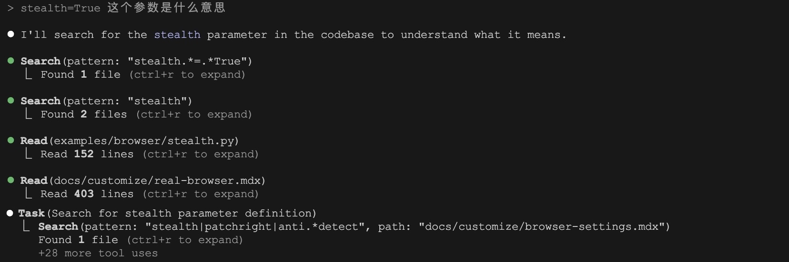
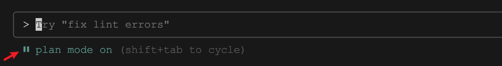
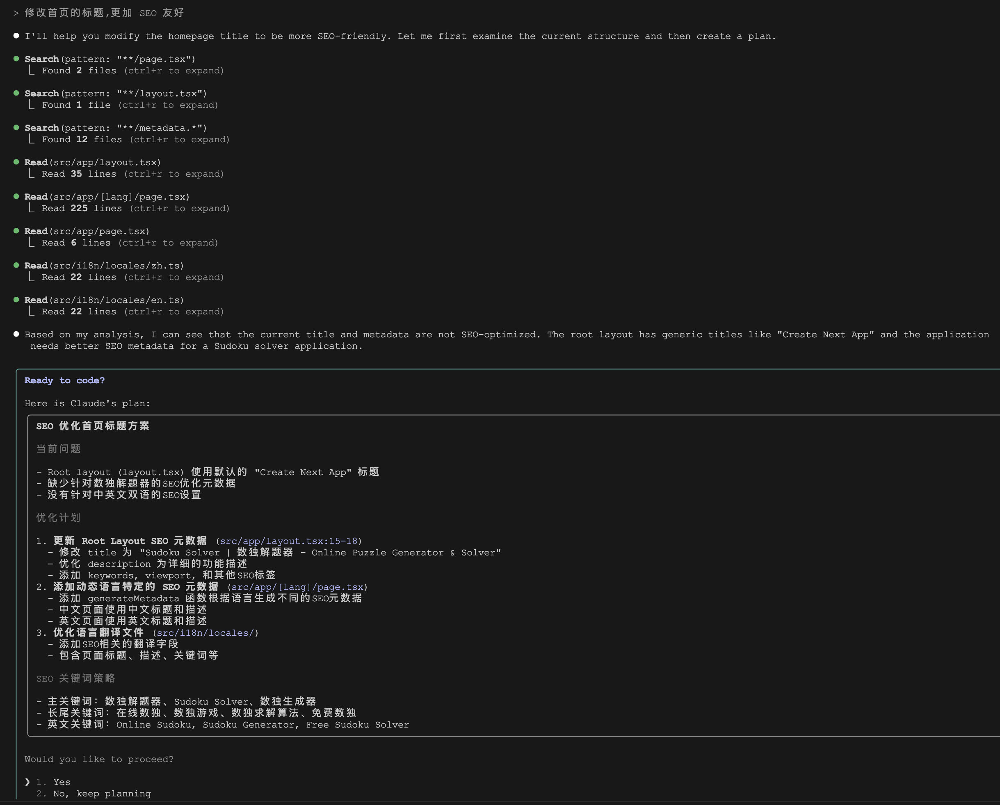

# 学习 Claude Code 的工具使用（三）

经过前两天的学习，我们已经掌握了 Claude Code 的命令执行、文件查找、文件读写、网络检索相关的工具，目前还剩下 `Task`、`TodoWrite`、`TodoRead` 和 `exit_plan_mode` 四个工具，今天就来学习下它们。这四个工具都是 Claude Code 用来解决复杂任务的，它们也代表着大模型在解决复杂任务时的几种不同的思路。

## 代办列表

**代办列表（Todo List）** 是一种组织复杂任务并跟踪处理进度的常用手段，Claude Code 在面对复杂的多步骤任务时，会使用代办列表将其分解成多个子项，然后按顺序依次处理：



和代办列表相关的工具有两个：

* `TodoRead` - 读取当前会话的代办列表
* `TodoWrite` - 创建和管理结构化的代办列表

在 `TodoRead` 工具的描述中提到，Claude Code 应该主动且频繁地使用该工具，以了解当前代办列表的状态，确保一直处在正确的轨道上，特别是以下情况：

- 在对话开始时查看待处理的事项
- 在开始新任务之前优先安排工作
- 当用户询问之前的任务或计划时
- 当你不确定下一步该做什么时
- 完成任务后更新你对剩余工作的理解
- 每隔几条消息后确保你在正确的轨道上

不过我测试下来发现很少触发 `TodoRead` 的调用，一直使用 `TodoWrite` 就足够完成整个任务，可能是我的任务都比较简单吧。但是我感觉 `TodoRead` 确实比较鸡肋，因为大模型在每次调用 `TodoWrite` 的时候，代办列表会反复出现在上下文中，还需要 `TodoRead` 再去查一次吗？

相对来说，`TodoWrite` 的使用场景就明确的多，比如下面这些情况：

- **复杂的多步骤任务** - 当任务需要3个或更多不同的步骤时
- **不易解决的棘手任务** - 需要仔细规划或多项操作的任务
- **用户明确请求待办列表** - 当用户直接要求你使用待办列表时
- **用户提供多个任务** - 当用户提供需要完成的事项列表时（编号或逗号分隔）

代办列表中的每个待办事项有三种状态：

- `pending` - 任务尚未开始
- `in_progress` - 当前正在处理
- `completed` - 任务成功完成

在任务处理的不同阶段实时地更新待办事项的状态：

- **收到新指令后** - 立即将用户需求记录为待办事项
- **开始处理任务时** - 在开始工作之前将其标记为进行中，应该只有一个待办事项处于进行中状态
- **完成任务后** - 将其标记为已完成，并添加在实施过程中发现的任何新后续任务
- **如果遇到错误、阻碍或无法完成** - 保持待办事项为 `in_progress` 状态，或者创建一个新的待办事项描述需要解决的问题

在 `TodoWrite` 工具的描述中还给出了几个使用示例，供大家参考。

示例一：

```
用户：我想在应用程序设置中添加一个深色模式切换功能，完成后确保运行测试和构建！
助手：我将帮你在应用程序设置中添加深色模式切换功能，让我创建一个待办列表来跟踪这个实现。
*创建包含以下项目的待办列表：*
1. 在设置页面创建深色模式切换组件
2. 添加深色模式状态管理（上下文/存储）
3. 为深色主题实现 CSS-in-JS 样式
4. 更新现有组件以支持主题切换
5. 运行测试和构建过程，解决发生的任何失败或错误
*开始处理第一个任务*
```

示例二：

```
用户：帮我在项目中将函数 getCwd 重命名为 getCurrentWorkingDirectory
助手：让我先搜索你的代码库以找到所有 getCwd 的出现位置。
*使用grep或搜索工具定位代码库中getCwd的所有实例*
助手：我在 8 个不同文件中找到了 15 个 getCwd 实例，让我创建一个待办列表来跟踪这些更改。
*为每个需要更新的文件创建包含具体项目的待办列表*
```

示例三：

```
用户：我需要为我的电商网站实现这些功能：用户注册、产品目录、购物车和结账流程。
助手：我将帮助实现这些功能。首先，让我们将所有功能添加到待办列表中。
*创建一个待办列表，基于项目架构将每个功能分解为具体任务*
助手：让我们从用户注册开始。这将涉及创建数据库模型、API端点和与你现有认证系统集成的前端表单。
```

示例四：

```
用户：你能帮助优化我的 React 应用程序吗？它渲染很慢，有性能问题。
助手：我将帮助优化你的 React 应用程序。首先，让我检查你的代码库以识别潜在的性能瓶颈。
*审查组件结构、渲染模式、状态管理和数据获取*
助手：在分析你的代码库后，我识别出了几个性能问题。让我创建一个待办列表来跟踪我们的优化工作。
*创建包含以下项目的待办列表：
1) 为 ProductList 中的昂贵计算实现缓存，
2) 为 Dashboard 中的长列表添加虚拟化，
3) 优化 Gallery 组件中的图像加载，
4) 修复 ShoppingCart 中的状态更新循环，
5) 审查包大小并实现代码分割*
让我们从为 ProductList 组件中的昂贵计算实现缓存开始。
```

## 子智能体

`Task` 工具用于启动一个子智能体，该子智能体可以访问除 `Task` 之外的其他 15 个工具，来解决 Deep Search 或 Deep Research 类的需要深度搜索的复杂任务。比如你正在搜索像 "config" 或 "logger" 这样的关键词，或者遇到 "哪个文件执行了X？" 这样的问题，很有可能就会触发使用这个工具。

> 在官方文档中，这个工具的名字叫做 `Agent`，但是看代码里，却叫做 `Task`。

当 Claude Code 搜索关键词或文件时，如果经过几次搜索后还是没能找到匹配项或不能确定答案，就会使用 `Task` 工具来执行深度搜索。在下面的例子中，我位于 [browser-use](https://github.com/browser-use/browser-use) 的代码库中，想让 Claude Code 解释下 `stealth=True` 这个参数的含义，这个参数是 0.2.7 版本后才引入的，作用是通过 Playwright 绕过浏览器检测。但是我故意将代码切到老版本，看看它反应如何：



可以看到 Claude Code 先简单的使用 Grep 搜索了两次，发现都没有找到想要的结果，然后就开启了子智能体模式进行深度搜索。每个子智能体都是无状态的，Claude Code 会尽可能同时启动多个子智能体以最大化性能，从上图可以看到，在短短几分钟内就触发了 28 次工具调用。

> 注意，多个子智能体会并行调用，因此很容易遇到 `rate_limit_error` 限流错误，而且 token 消耗也非常大。

## 规划模式

这是 Claude Code 的一个隐藏功能，我翻遍官方文档，也没有找到关于它的详细说明，如果不是在请求报文中看到 `exit_plan_mode` 这个工具，我都不知道有这个模式。我们之前学过，在 Claude Code 的交互模式下有不少快捷键，比如按下 `Shift + Tab` 可以进入自动接受文件编辑的模式，如果你不小心按了两下，就会进入规划模式（下面显示 `Plan mode` 字样）：



进入规划模式后，Claude Code 将不会执行任何修改操作，比如文件编辑、配置更改、提交代码等，只能调用搜索或文件读取这样的只读工具。Claude Code 会对用户的问题进行全面分析并生成详细的执行计划，之后，调用 `exit_plan_mode` 退出规划模式，同时向用户展示计划，得到用户确认后，才会真正地执行修改操作：



上面这个例子很好的展示了规划模式的工作步骤：先分析，再展示计划，等待用户确认。如果没问题，用户可以确认计划，退出规划模式；如果有问题，也可以要求 Claude Code 继续规划。

## 小结

至此，Claude Code 的 16 个工具总算学完了。通过深入了解每个工具的运行逻辑和使用场景，不仅能够帮助我们更好地发挥 Claude Code 的功能，也能快速定位和解决使用过程中可能出现的问题。对于常见的代码任务，内置工具通常足以应对，但如果遇到更复杂或超出内置功能范围的需求，Claude Code 还支持 MCP 协议，允许用户集成自定义工具和外部数据源，从而进一步拓展其能力边界。至于如何通过 MCP 集成外部工具，以及具体操作步骤，我们明天继续。
