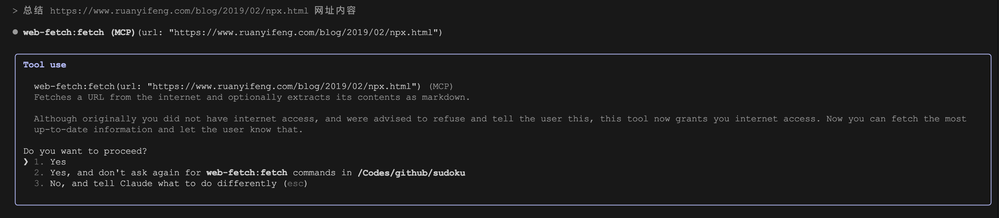

# 使用 MCP 让 Claude Code 集成外部工具

**[MCP（Model Context Protocol，模型上下文协议）]((https://modelcontextprotocol.io/introduction))** 是 Anthropic 于 [2024 年 11 月 25 日](https://www.anthropic.com/news/model-context-protocol) 推出的开放协议，用于标准化大模型与各类外部工具和数据源之间的交互。

Claude Code 作为自家的 AI 编程工具，自然也支持 MCP 协议。除了内置的 16 个工具，用户可以使用 MCP 无缝集成任意数量的自定义工具和外部数据源，从而进一步拓展 Claude Code 的能力边界。

## MCP 简介

下面这张图非常形象地展示了 MCP 的基本架构：


可以看到 MCP 采用了非常经典的 C/S 架构（客户端/服务器），主要包括三个部分：

* **主机（Host）**： 一般是基于大模型的 AI 应用，比如 Claude Desktop、ChatGPT Desktop、Cursor 等桌面应用，需要访问外部数据或工具；
* **客户端（Client）**：内置在应用中，与 MCP 服务器建立一对一的连接；
* **服务器（Server）**：连接本地数据源或远程服务，提供特定功能；
    * 本地数据源：文件或数据库；
    * 远程服务：外部 API 或互联网服务；

MCP 协议将所有的外部数据或工具以一种统一的方式接入 AI 应用，这就好比 USB-C 接口，将各种不同的电子设备统一成一种接口，从而让用户不再为准备各种各样不同的线缆插头而烦恼。简单说，MCP 就像一座桥梁，它本身不处理复杂逻辑，只负责协调 AI 应用与外部资源之间的信息流动。

在推出 MCP 之前，AI 应用如果要对接外部工具，通常需要单独整合多个不同的 API，每个 API 的接口可能都各不相同，认证方式和错误处理也可能不同，极大地增加了开发复杂度和维护成本。

所以说，传统 API 就像不同的门，每扇门都有一把不同的钥匙，而 MCP 像一把万能钥匙，AI 应用开发者只要集成了这个万能钥匙，就可以打开任意的门。下面是 MCP 和传统 API 的对比：


有关 MCP 的更多信息，请参阅 MCP 文档：

* https://modelcontextprotocol.io/introduction

## 添加 MCP 服务器

在之前的文章中我们曾遇到过 `WebFetch` 工具调用报错的问题，我们可以将其换成 [Fetch MCP Server](https://github.com/modelcontextprotocol/servers/tree/main/src/fetch)。通过 `claude mcp add` 命令添加 MCP 服务器：

```
$ claude mcp add web-fetch -- uvx mcp-server-fetch
```

上面的 `web-fetch` 是我们自定义的 MCP 工具名称，`--` 后面的内容是 MCP 服务器的启动命令。添加成功之后，进入 Claude Code 交互模式，输入 `/mcp` 可查看 MCP 服务器的状态：


如果状态显示 `connected`，则说明 MCP 服务器已就绪。可以按下 `Enter` 键查看 MCP 工具的详细信息：


此时就可以使用该工具了，比如对网页内容进行问答或总结：



默认情况下，所有的 MCP 工具都需要经过用户确认后才可以运行，同意运行后结果如下：


如果感兴趣的话，可以拿 Wireshark 对 Claude Code 进行抓包，可以发现请求的 `tools` 里多了一个工具 `mcp__web-fetch__fetch`，工具的名称、描述、参数和上面的工具详情是一样的：


## 添加 HTTP/SSE 模式的 MCP 服务器

上面的 Fetch MCP Server 是 STDIO 模式的 MCP 服务器，这也是最常见的 MCP 服务器连接方式。当运行 `claude mcp add` 命令时，默认就是 STDIO 模式，我们也可以通过 `--transport` 或 `-t` 参数添加 HTTP 或 SSE 模式的 MCP 服务器。

下面以 [高德地图](https://lbs.amap.com/api/mcp-server/summary) 为例，演示下如何在 Claude Code 中调用 HTTP 或 SSE 模式的 MCP 服务器。首先，我们需要注册并登录 [高德开放平台](https://lbs.amap.com/)，然后创建一个应用得到 Key，之后运行下面的命令添加 MCP 服务器：

```
$ claude mcp add --transport http amap "https://mcp.amap.com/mcp?key=<your-api-key>"
```

高德地址也支持 SSE 模式：

```
$ claude mcp add --transport sse amap "https://mcp.amap.com/sse?key=<your-api-key>"
```

高德地图的 MCP 服务器包含十几个工具，包括导航、定位、打车、路径规划、周边搜索、天气查询等，非常实用：


## 设置环境变量

有些 MCP 服务器依赖于额外的环境变量，比如设置 API 密钥，我们可以通过 `--env` 或 `-e` 参数来配置。

下面以 [Brave Search MCP Server](https://github.com/modelcontextprotocol/servers-archived/tree/main/src/brave-search) 为例，将内置的 `WebSearch` 工具替换成 Brave 搜索。首先注册并登录 [Brave](https://brave.com/search/api/)，订阅 Free 计划（需要提供信用卡信息），得到每月 2000 次免费额度：


然后生成 API Key，之后运行下面的命令添加 MCP 服务器：

```
$ claude mcp add brave-search \
    --env BRAVE_API_KEY=<your-api-key> \
    -- npx -y @modelcontextprotocol/server-brave-search
```

> 官方的 Brave Search MCP Server 使用 Node.js 的 fetch 方法来发请求，不支持 `HTTPS_PROXY` 代理配置，如果遇到网络问题，可以换成 [@kwp-lab/mcp-brave-search](https://github.com/kwp-lab/mcp-brave-search)。

接着就可以使用 Brave 进行搜索了，比如查询 Gemini CLI 的最新动态：


## 设置作用域

默认添加的 MCP 服务器仅在当前项目中可用，Claude Code 支持通过 `--scope` 或 `-s` 参数改变 MCP 服务器的作用域：

```
$ claude mcp add brave-search \
    --scope project \
    --env BRAVE_API_KEY=<your-api-key> \
    -- npx -y @modelcontextprotocol/server-brave-search
```

Claude Code 支持三种不同的作用域：

* **本地作用域（local）**：默认配置，用户私有，仅在当前项目中可用；
* **用户作用域（user）**：也是用户私有，但是跨所有项目可用；
* **项目作用域（project）**：通过将配置存储在项目根目录的 `.mcp.json` 文件中来实现团队协作；

不同作用域下，MCP 服务器的配置位置也不同。比如项目作用域是将配置保存到当前项目的 `.mcp.json` 文件中，可以提交到 Git 仓库，确保所有项目成员都能访问相同的 MCP 工具和服务。该文件遵循标准化格式（和 Claude Desktop 的配置格式一致），内容如下：

```json
{
  "mcpServers": {
    "brave-search": {
      "type": "stdio",
      "command": "npx",
      "args": [
        "-y",
        "@modelcontextprotocol/server-brave-search"
      ],
      "env": {
        "BRAVE_API_KEY": "<your-api-key>"
      }
    }
  }
}
```

而本地作用域和用户作用域则是将配置保存到用户的 Claude Code 配置文件 `~/.claude.json` 中，只能自己使用，注意它们在 JSON 中的位置：


当同名服务器存在于多个作用域时，系统通过优先考虑本地作用域服务器，然后是项目作用域服务器，最后是用户作用域服务器来解决冲突。

## 添加 MCP 服务器的其他方式

除了 `claude mcp add` 命令，Claude Code 还提供了另几种添加 MCP 服务器的方式。第一种是使用 JSON 配置添加：

```
$ claude mcp add-json brave-search -s project '{
    "type": "stdio",
    "command": "npx",
    "args": [
      "-y",
      "@modelcontextprotocol/server-brave-search"
    ],
    "env": {
      "BRAVE_API_KEY": "<your-api-key>"
    }
  }'
```

这种方式对于配置较复杂的 MCP 服务器来说很方便，因为这种 JSON 格式是 Claude 的标准，一般在 MCP 服务器的说明页面都有类似的配置示例。

第二种是从 Claude Desktop 导入配置，如果你本地安装了 Claude Desktop 且配置了 MCP 服务器，可以使用下面的命令一键导入：

```
$ claude mcp add-from-claude-desktop
```

运行后会显示交互式对话框，让你选择要导入的 MCP 服务器。

还有一种是启动 Claude Code 时，直接通过 `--mcp-config` 参数加载 MCP 服务器配置：

```
$ claude --mcp-config /path/to/mcp.json
```

## 管理 MCP 服务器

Claude Code 还提供了一些子命令对 MCP 服务器进行管理操作，比如列出所有的服务器：

```
$ claude mcp list
```

查看特定服务器详情：

```
$ claude mcp get brave-search
```

删除特定服务器：

```
$ claude mcp remove brave-search
```

检查 MCP 服务器状态：

```
> /mcp
```

另外，`/mcp` 命令还可以对 MCP 服务器进行 OAuth 2.0 身份认证，在需要认证的 MCP 服务器上按 Enter 后，会自动打开浏览器并跳到 OAuth 认证页面，用户在浏览器中完成身份验证后，Claude Code 接收并存储访问令牌，然后 MCP 服务器将变为 `connected` 状态。

## 使用 MCP 资源和提示词

MCP 服务器不仅可以暴露 [工具](https://modelcontextprotocol.io/docs/concepts/tools) 供其他 AI 程序使用，还支持暴露 [资源](https://modelcontextprotocol.io/docs/concepts/resources) 和 [提示词](https://modelcontextprotocol.io/docs/concepts/prompts)。

MCP 服务器暴露的资源可使用 `@` 引用，格式为 `server:protocol://resource/path`，比如：

```
> 分析 @github:issue://123 并提供修复建议
```

MCP 服务器暴露的提示词可作为斜杠命令使用，格式为 `/mcp__<server-name>__<prompt-name>`，比如：

```
> /mcp__github__list_prs
```

也可以带参数：

```
> /mcp__github__pr_review 456
```

无论是 MCP 资源还是提示词，都是从连接的 MCP 服务器中动态发现的，当键入 `@` 或 `/` 时，资源和提示词会自动显示在下拉菜单中。

## 将 Claude Code 作为 MCP 服务器

Claude Code 不仅可以作为客户端接入外部 MCP 服务器，也可以作为 MCP 服务器，为其他应用提供服务，比如将其加到 Claude Desktop 的配置文件中：

```json
{
  "mcpServers": {
    "claude-code": {
      "command": "claude",
      "args": ["mcp", "serve"],
      "env": {}
    }
  }
}
```

重启 Claude Desktop 后，可以看到加载的 16 个工具：


可以在 Claude Desktop 中，尝试要求 Claude 读取目录中的文件、进行编辑等。

## 小结

本文详细介绍了如何在 Claude Code 中配置和使用 MCP 服务器，通过统一的协议标准，我们可以轻松集成各类外部工具和数据源，将 Claude Code 从单纯的编程助手升级为功能强大的智能工作平台。

不过，在享受 MCP 带来便利的同时，安全性不容忽视，务必确保所使用的 MCP 服务器是可信的，特别是涉及网络交互的服务器，防范潜在的提示注入攻击和私有数据泄漏。
