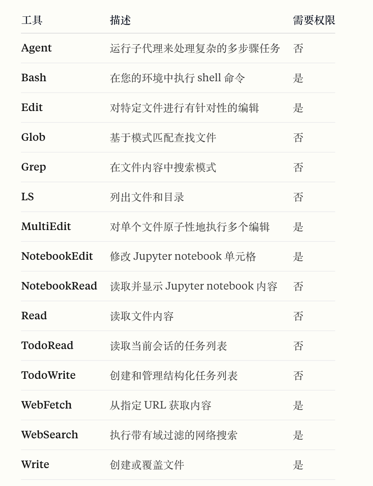
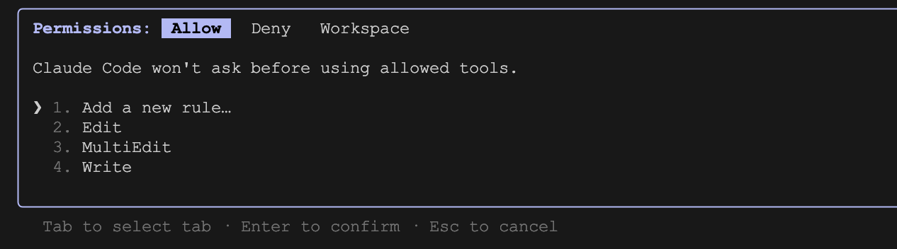
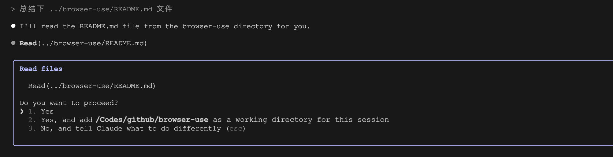
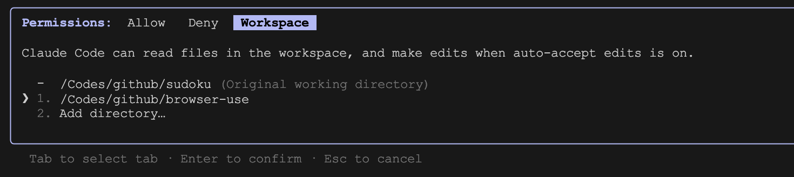
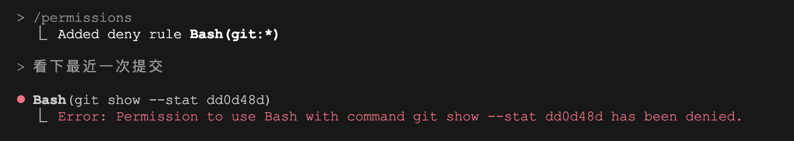
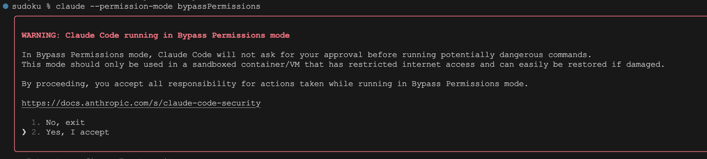

# 管理 Claude Code 的工具权限

我们知道，Claude Code 内置了 16 个强大的工具，加上我们昨天学习的 MCP 服务器，用户可以轻松集成更多的外部工具。通过合理调度这些工具，Claude Code 能够很好地对你的代码库进行理解和修改。但是这些工具中，不乏有一些是比较危险的，比如 `Bash` 可能执行任意的命令，`Edit` 可能篡改你的文件，外部工具可能存在安全风险，对此，Claude Code 提供了一套完善的权限控制机制。



上图列出了 Claude Code 内置工具的默认权限，对于 `Bash` 或 `Edit` 这种修改类的工具，必须等待用户确认后才开始执行。

## 修改工具的默认权限

当然，工具的权限并不是一成不变的，可以通过 `--allowedTools` 或 `--disallowedTools` 参数修改工具的默认权限：

```
$ claude --allowedTools "Edit,MultiEdit,Write"
```

通过上面的方式启动 Claude Code 后，在编辑或写入文件时，不再需要用户批准，将会直接执行。

```
$ claude --disallowedTools "WebSearch,WebFetch"
```

通过上面的方式启动 Claude Code 后，将会禁用联网搜索和网页抓取工具。

> 注意，`--allowedTools` 是将工具的权限从用户确认改成自动放行，而 `--disallowedTools` 是将工具直接从工具列表中移除。**貌似不能将工具的权限从自动放行改成用户确认。**

这两个参数都可以在会话过程中通过 `/permissions` 或 `/allowed-tools` 斜杠命令进行查看和修改：



允许和禁止的工具分别位于 `Allow` 和 `Deny` 页签下，如果某个工具既配了拒绝规则又配了允许规则，拒绝规则优先于允许规则。

## 额外的工作目录

默认情况下，Claude Code 只允许访问当前工作目录下的文件，在访问工作目录外的文件时，也会要求用户确认：



我们可以在启动时通过 `--add-dir` 参数添加额外的工作目录：

```
$ claude --add-dir ../browser-use
```

或者在会话中使用 `/add-dir` 斜杠命令：

```
> /add-dir ../browser-use
```

这个参数也可以在会话过程中通过 `/permissions` 或 `/allowed-tools` 斜杠命令进行查看和修改：



所有允许访问的目录均显示在 `Workspace` 页签下，额外的工作目录遵循和原始工作目录相同的权限规则：读取文件无需确认，编辑文件则根据当前的权限模式决定是否确认。

## 更细粒度的权限控制

在调用某些工具时，我们可能还需要有更细粒度的权限控制，比如可以允许 `Bash` 执行特定命令，拒绝 `Read` 读取某些文件，等等，Claude Code 支持在工具名后面加上特定的匹配规则，比如下面这个例子：

```
$ claude --allowedTools "Bash(npm run build)"
```

当使用 `Bash` 工具运行 `npm run build` 命令时，直接放行，无需用户确认。也可以在匹配规则中使用通配符：

```
$ claude --disallowedTools "Bash(git:*)"
```

当使用 `Bash` 工具运行以 `git` 开头的命令时，直接拒绝：



> Claude Code 能很好的处理 Shell 操作符（比如 `&&`），因此像 `Bash(safe-cmd:*)` 这样的前缀匹配规则不会给它运行命令 `safe-cmd && other-cmd` 的权限。

另外，`Read` 和 `Edit` 也有一套自己的匹配规则，比如：

```
$ claude --allowedTools "Edit(docs/**)"
```

上面的命令允许对项目 docs 目录中文件进行编辑，其中的 `docs/**` 规则 [遵循 gitignore 规范](https://git-scm.com/docs/gitignore)。还可以使用 `//` 引用绝对路径，或者 `~/` 引用用户目录的路径：

* `Edit(//tmp/scratch.txt)` 匹配对 `/tmp/scratch.txt` 的编辑
* `Read(~/.zshrc)` 匹配对用户的 `~/.zshrc` 文件的读取

值得注意的是，`Read` 的规则将应用于所有读取文件的内置工具，如 `Grep`、`Glob` 和 `LS`。

除了命令执行和文件操作，下面这些工具也支持细粒度控制：

* `WebFetch(domain:example.com)` 匹配对 `example.com` 的抓取请求
* `mcp__amap` 匹配由 MCP 服务器 `amap` 提供的任何工具
* `mcp__amap__weather` 匹配由 MCP 服务器 `amap` 提供的 `weather` 工具

## 权限模式

Claude Code 支持几种不同的权限模式：

* **默认模式（`default`）**：按照默认或用户配置的权限规则对工具进行验证
* **自动编辑模式（`acceptEdits`）**：自动接受对工作目录下的文件的编辑
* **规划模式（`plan`）**：只能读取文件进行分析，不允许编辑文件或执行命令
* **YOLO 模式（`bypassPermissions`）**：跳过所有权限验证，危险！

可以通过 `--permission-mode` 参数直接开启不同的权限模式：

```
$ claude --permission-mode <permission-mode>
```



也可以在会话中通过 `Shift + Tab` 切换，按一次进入自动编辑模式，按两次进入规划模式，再按一次回到默认模式。

YOLO 模式也可以通过 `--dangerously-skip-permissions` 参数开启：

```
$ claude --dangerously-skip-permissions
```

YOLO 模式可以绕过权限提示，实现无人值守操作，但是非常危险，使用时一定要小心。建议在容器环境下使用，通过容器的隔离和防火墙规则等安全措施，最大程度的防止系统遭受攻击。官方提供了一份 devcontainer 设置，可以和 VS Code 的 Remote - Containers 扩展搭配使用，感兴趣的朋友可以参考：

* https://docs.anthropic.com/zh-CN/docs/claude-code/devcontainer

## 配置文件

除了命令行参数和斜杠命令，Claude Code 还支持将工具的权限保存在配置文件中：

```json
{
  "permissions": {
    "deny": [
      "WebSearch",
      "WebFetch",
      "Bash(curl:*)"
    ],
    "allow": [
      "Bash(git:*)"
    ],
    "additionalDirectories": [
      "../browser-use"
    ]
  }
}
```

该配置文件可以放在下面这些位置：

* 用户设置（`~/.claude/settings.json`）：用户私有，适用于所有项目
* 共享项目设置（`.claude/settings.json`）：提交到 Git 仓库，团队成员共用
* 本地项目设置（`.claude/settings.local.json`）：不提交到 Git 仓库，用户私有，只适用于当前项目
* 企业管理策略（`/path/to/policies.json`）：在企业环境下，系统管理员可以强制执行用户无法覆盖的安全策略，优先级最高

对于企业管理策略，系统管理员通常将策略部署到：

* macOS: `/Library/Application Support/ClaudeCode/policies.json`
* Linux 和 WSL: `/etc/claude-code/policies.json`

当同一个工具的规则出现在多个位置时，优先级从高到低如下：**企业管理策略 > 命令行参数 > 本地项目设置 > 共享项目设置 > 用户设置**。这样的层次结构确保始终执行企业策略，同时在适当的情况下仍允许在项目和用户级别的灵活性。

## 小结

我们今天详细学习了 Claude Code 的权限控制机制，包括如何设置权限规则（允许规则、禁止规则、额外目录、细粒度规则），如何选择权限模式（默认、自动编辑、规划、YOLO）以及合理使用配置文件等。Claude Code 的权限控制机制为用户提供了从粗粒度到细粒度的全方位安全保障，通过灵活的权限配置，我们可以在保证开发效率的同时，最大程度地降低安全风险。
