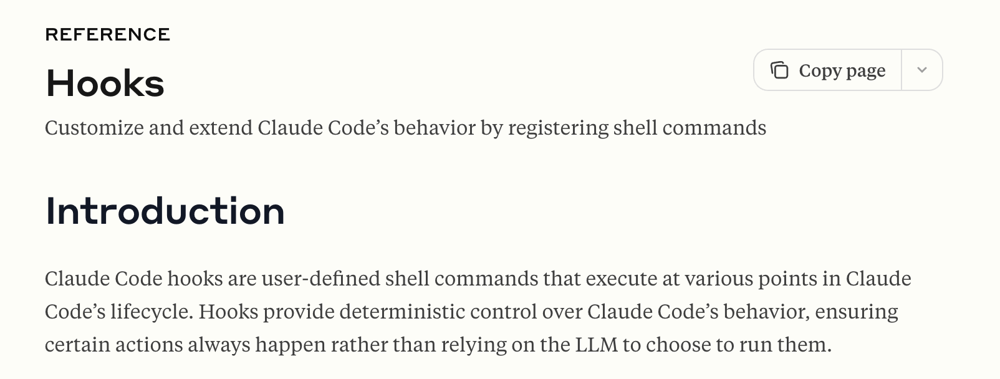
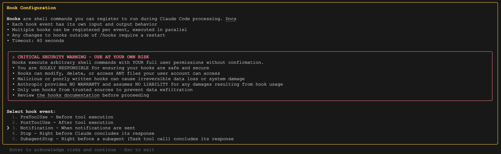
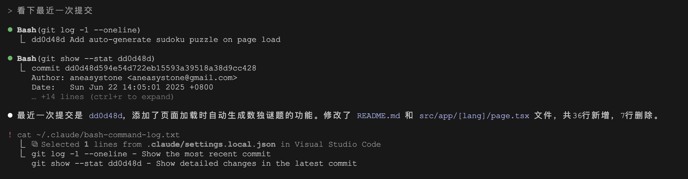

# 给 Claude Code 的工具加上钩子

就在前几天，Claude Code [发布了 v1.0.38 版本](https://github.com/anthropics/claude-code/blob/main/CHANGELOG.md)，推出了一项有趣的功能：**[钩子（Hooks）](https://docs.anthropic.com/en/docs/claude-code/hooks)**，它允许用户注册自己的 Shell 脚本，在 Claude Code 生命周期的各个阶段执行，以此来自定义和扩展 Claude Code 的行为。



我们上周刚学习了 Claude Code 的权限控制机制，它为工具的调用提供了全方位的安全保障，现在有了钩子机制，我们可以实现更加个性化的控制。当然，除了权限控制，钩子的想象空间还是很大的，以下是一些示例用例：

* **通知**：当 Claude Code 等待用户确认时，可以用钩子自定义通知用户的方式
* **自动格式化**：每次编辑文件后，对文件进行格式化，比如对 `.ts` 文件运行 `prettier`，对 `.go` 文件运行 `gofmt` 等
* **日志记录**：跟踪和统计所有执行的命令，以满足合规性或调试需求
* **反馈**：当 Claude Code 生成的代码不符合代码库规范时，提供自动反馈
* **自定义权限**：对工具调用实现更加个性化的权限控制，比如阻止对生产文件或敏感目录的修改

## 钩子配置

钩子配置和权限配置一样，保存在配置文件里，该配置文件可以放在下面这些位置：

* 用户设置（`~/.claude/settings.json`）：用户私有，适用于所有项目
* 共享项目设置（`.claude/settings.json`）：提交到 Git 仓库，团队成员共用
* 本地项目设置（`.claude/settings.local.json`）：不提交到 Git 仓库，用户私有，只适用于当前项目
* 企业管理策略（`/path/to/policies.json`）：在企业环境下，系统管理员可以强制执行用户无法覆盖的安全策略，优先级最高

钩子配置的结构如下：

```json
{
  "hooks": {
    "EventName": [
      {
        "matcher": "ToolPattern",
        "hooks": [
          {
            "type": "command",
            "command": "your-command-here"
          }
        ]
      }
    ]
  }
}
```

其中 `EventName` 表示事件名称，Claude Code 目前支持下面这些钩子事件：

* **PreToolUse** - 在 Claude Code 生成工具参数后、执行工具调用前运行
* **PostToolUse** - 在 Claude Code 执行工具调用成功结束后运行
* **Notification** - 在 Claude Code 发送通知时运行
* **Stop** - 在主 Claude Code 完成响应时运行
* **SubagentStop** - 在 Claude Code 子智能体完成响应时运行（也就是 `Task` 工具调用）

下面的 `matcher` 叫做匹配器，表示匹配工具名称的模式。它可以是简单的字符串完全匹配，比如 `Write` 仅匹配 Write 工具；也可以是正则表达式，比如 `Edit|Write` 或 `Notebook.*`；如果省略或为空字符串，钩子将匹配所有工具；注意这个参数仅适用于 `PreToolUse` 和 `PostToolUse` 事件。

匹配器也支持匹配 MCP 工具，MCP 工具名称遵循 `mcp__<server>__<tool>` 格式。匹配器可以完全匹配，如 `mcp__filesystem__read_file`；也可以正则匹配，如 `mcp__memory__.*` 或 `mcp__.*__write.*` 等。

每个匹配器可以配多个钩子，每个钩子支持三个配置参数：

- `type`：当前仅支持 `"command"` 类型
- `command`：要运行的 Bash 命令，运行环境为 Claude Code 所在目录，如果匹配多个钩子，所有钩子并行运行
- `timeout`：（可选）命令运行超时时间，以秒为单位，默认 60 秒；只要有一个命令运行超时，所有进行中的钩子都会被取消

## 你的第一个钩子

这是官方文档中展示的一个钩子示例：

```json
{
  "hooks": {
    "PreToolUse": [
      {
        "matcher": "Bash",
        "hooks": [
          {
            "type": "command",
            "command": "jq -r '\"\\(.tool_input.command) - \\(.tool_input.description // \"No description\")\"' >> ~/.claude/bash-command-log.txt"
          }
        ]
      }
    ]
  }
}
```

> 请提前安装用于 JSON 处理的 `jq` 命令。

这个示例用于记录 Claude Code 运行的 Shell 命令，它创建了一个监听 `PreToolUse` 事件的钩子，在调用 `Bash` 工具之前，先运行 `jq -r ...` 这串命令。这个 `jq -r ...` 命令从 STDIO 读取一个 JSON 数据，将 `Bash` 要执行的命令 `.tool_input.command` 和该命令的描述 `.tool_input.description` 写入 `~/.claude/bash-command-log.txt` 文件中。

> 其中 `//` 是 jq 内置的运算符，其功能是当字段为空时提供默认值，感兴趣的可以[查阅 jq 的官方手册](https://jqlang.org/manual/)。

将上面的钩子示例保存到你的配置文件 `~/.claude/settings.json` 中，这样可以对所有项目生效，启动 Claude Code 进入交互模式，输入 `/hooks` 斜杠命令：



在这里可以检查你的钩子是否生效。然后随便问一个需要调用 `Bash` 工具的问题，比如这里我们让 Claude Code 查看最近一次提交记录：



可以看到 Claude Code 运行了两次 `git` 命令，并将命令信息写到了 `~/.claude/bash-command-log.txt` 文件中。

## 钩子输入

在上面的钩子示例中，我们使用 `jq -r ...` 命令从 STDIO 读取一个 JSON 数据，这个 JSON 数据就是钩子的输入，它的格式如下，包含了会话信息和特定事件信息：

```typescript
{
  // 公共字段
  session_id: string       // 会话 ID
  transcript_path: string  // 对话 JSON 的路径

  // 特定事件字段
  ...
}
```

不同的钩子事件对应不同的 JSON 格式，比如 `PreToolUse` 输入：

```json
{
  "session_id": "abc123",
  "transcript_path": "~/.claude/projects/.../00893aaf-19fa-41d2-8238-13269b9b3ca0.jsonl",
  "tool_name": "Write",
  "tool_input": {
    "file_path": "/path/to/file.txt",
    "content": "file content"
  }
}
```

`PostToolUse` 输入：

```json
{
  "session_id": "abc123",
  "transcript_path": "~/.claude/projects/.../00893aaf-19fa-41d2-8238-13269b9b3ca0.jsonl",
  "tool_name": "Write",
  "tool_input": {
    "file_path": "/path/to/file.txt",
    "content": "file content"
  },
  "tool_response": {
    "filePath": "/path/to/file.txt",
    "success": true
  }
}
```

这里的 `tool_input` 和 `tool_response` 会根据工具的不同而不同。

`Notification` 输入：

```json
{
  "session_id": "abc123",
  "transcript_path": "~/.claude/projects/.../00893aaf-19fa-41d2-8238-13269b9b3ca0.jsonl",
  "message": "Task completed successfully",
  "title": "Claude Code"
}
```

`Stop` 和 `SubagentStop` 输入：

```json
{
  "session_id": "abc123",
  "transcript_path": "~/.claude/projects/.../00893aaf-19fa-41d2-8238-13269b9b3ca0.jsonl",
  "stop_hook_active": true
}
```

## 钩子输出

钩子有两种输出方式，Claude Code 根据钩子的输出决定是阻止还是继续运行，或将信息反馈给用户。

第一种是简单方式，钩子通过退出代码、标准输出 `stdout` 和标准错误 `stderr` 传达状态：

- **退出代码 0**：成功。在对话模式中向用户显示 `stdout`，注意该信息并不会反馈给 Claude Code
- **退出代码 2**：阻止错误。`stderr` 会自动反馈给 Claude Code 进行处理，注意不同的钩子事件对退出代码 2 的行为不一样，参见下面的表格
- **其他退出代码**：非阻止错误。向用户显示 `stderr`，并继续执行


不同的钩子事件对退出代码 2 的行为如下：

| 钩子事件 | 行为 |
| ---- | ---- |
| `PreToolUse` | 阻止工具调用，向 Claude Code 显示错误 |
| `PostToolUse` | 向 Claude Code 显示错误（工具已运行） |
| `Notification` | 不适用，仅向用户显示 `stderr` |
| `Stop` | 阻止停止，向 Claude Code 显示错误 |
| `SubagentStop` | 阻止停止，向 Claude Code 子代理显示错误 |

第二种是高级方式，钩子可以在 `stdout` 中返回结构化 JSON，以实现更复杂的控制：

```json
{
  "continue": true, // Claude 在钩子执行后是否应继续（默认：true）
  "stopReason": "string", // 当 continue 为 false 时显示的消息
  "suppressOutput": true, // 从对话模式隐藏 stdout（默认：false）
}
```

如果 `continue` 为 false，Claude 在钩子运行后会立即停止，并将停止原因 `stopReason` 显示给用户。

如果 `continue` 为 true，Claude 会继续根据不同的钩子事件来进一步控制，比如 `PreToolUse` 和 `PostToolUse` 钩子都可以控制是否继续工具调用，可以多返回两个字段：

```json
{
  "decision": "approve" | "block" | undefined,
  "reason": "决策解释"
}
```

Claude Code 根据返回的 `decision` 来决定下一步的动作：

* `approve` - 绕过权限系统，并将 `reason` 显示给用户，但不返回给 Claude。该值对 `PostToolUse` 不适用，因为工具已经调用过了
* `block` - 阻止调用当前工具，并将 `reason` 返回给 Claude，以便 Claude 选择切换其他工具
* `undefined` - 进入现有权限流程，忽略 `reason` 字段

`Stop` 和 `SubagentStop` 钩子可以控制 Claude 是否停止，返回的字段和上面一样：

```json
{
  "decision": "block" | undefined,
  "reason": "当阻止 Claude 停止时必须提供"
}
```

Claude Code 根据返回的 `decision` 来决定下一步的动作：

* `block` - 阻止 Claude 停止，必须返回 `reason` 字段，以便 Claude 知道如何继续
* `undefined` - 允许 Claude 停止，忽略 `reason` 字段

## 一个复杂点的例子

下面是一个稍微复杂点的例子，首先添加如下钩子配置：

```json
{
  "hooks": {
    "PreToolUse": [
      {
        "matcher": "Bash",
        "hooks": [
          {
            "type": "command",
            "command": "python3 ./validate_command.py"
          }
        ]
      }
    ]
  }
}
```

然后在当前目录下创建一个 `validate_command.py` 文件：

```python
#!/usr/bin/env python3
import json
import re
import sys

# 验证规则
VALIDATION_RULES = [
    (
        r"\bgrep\b(?!.*\|)",
        "使用 'rg'（ripgrep）代替 'grep' 以获得更好的性能和功能",
    ),
    (
        r"\bfind\s+\S+\s+-name\b",
        "使用 'rg --files | rg pattern' 或 'rg --files -g pattern' 代替 'find -name' 以获得更好的性能",
    ),
]

# 验证命令是否匹配规则
def validate_command(command: str) -> list[str]:
    issues = []
    for pattern, message in VALIDATION_RULES:
        if re.search(pattern, command):
            issues.append(message)
    return issues

# 从 stdin 读取 JSON 输入
try:
    input_data = json.load(sys.stdin)
except json.JSONDecodeError as e:
    print(f"错误：无效的 JSON 输入：{e}", file=sys.stderr)
    sys.exit(1)

tool_name = input_data.get("tool_name", "")
tool_input = input_data.get("tool_input", {})
command = tool_input.get("command", "")

# 只处理 Bash 工具
if tool_name != "Bash" or not command:
    sys.exit(1)

# 对命令进行核查
issues = validate_command(command)
if issues:
    for message in issues:
        print(f"• {message}", file=sys.stderr)
    # 退出代码 2 阻止工具调用并向 Claude 显示 stderr
    sys.exit(2)
```

这段 Python 脚本通过退出代码、标准输出和标准错误向 Claude Code 传达消息；它对 `Bash` 工具执行的命令进行核查，阻止 Claude Code 执行 `grep` 和 `find` 命令，而是替换成性能更高的 `rg` 命令。

## 小结

本文详细介绍了 Claude Code 新增的钩子（Hooks）功能，它为用户提供了一种强大的机制，通过在工具生命周期的关键节点执行自定义 Shell 脚本来扩展和定制 Claude Code 的行为。

我们学习了钩子的核心概念和功能，包括：

*   **钩子配置**：如何通过配置文件，在不同作用域（用户、项目、本地）下定义钩子。
*   **生命周期事件**：学习了 `PreToolUse`、`PostToolUse` 等多种事件类型，以及如何使用匹配器精确触发钩子。
*   **输入与输出**：了解了钩子如何通过标准输入（STDIN）接收 JSON 格式的上下文数据，并通过退出码和标准输出（STDOUT）与 Claude Code 交互，实现批准、阻止或提供反馈等高级控制。
*   **实际应用**：通过日志记录和命令验证等示例，展示了钩子的实际应用场景。

钩子功能在赋予我们高度灵活性的同时，也带来了重要的安全问题。钩子会在未经用户确认的情况下，以当前用户的完整权限执行 Shell 命令。因此，**确保钩子脚本的安全性和可靠性至关重要**。在部署任何钩子之前，请务必遵循安全最佳实践，如验证输入、使用绝对路径、避免处理敏感文件，并在受控环境中进行充分测试。

总而言之，钩子机制极大地增强了 Claude Code 的可扩展性，使其能够更好地融入现有的开发工作流和规范。善用钩子，我们能将 Claude Code 打造成更智能、更贴合团队需求的自动化编程伙伴。
