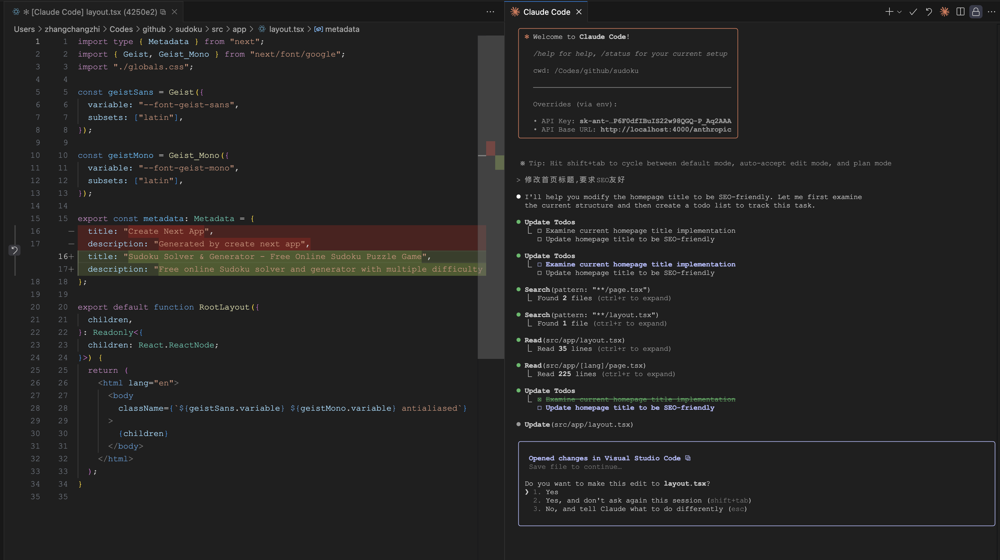

# 将 Claude Code 集成到更多地方

我们已经熟悉了在终端中与 Claude Code 进行会话，并了解了其强大的功能。为了进一步提升开发效率，本文将介绍如何将 Claude Code 无缝集成到我们日常使用的 IDE 和 GitHub 工作流中，使其成为开发过程中的得力助手。

## 将 Claude Code 添加到 IDE 中

Claude Code 可以无缝地集成到一些流行的 IDE 中，这样我们在使用 IDE 编码的同时也能享受 Claude Code 的功能。它目前支持两个主要的 IDE 系列：VS Code（包括 Cursor、Windsurf 等分支）和 JetBrains IDEs（包括 PyCharm、WebStorm、IntelliJ 和 GoLand）。

我们以 VS Code 为例，它的安装非常简单，直接在集成终端中运行 `claude` 命令，即可自动安装扩展。

> 注意 VS Code 版本必须是 1.98 以上。

如果没有自动安装，我们也可以手动在应用商店中找到 Claude Code 扩展，点击安装即可：


安装成功后，在 VS Code 右上角会显示一个 “Run Claude Code” 的按钮：


> 吐槽一句，必须得随便打开一个文件才能看到这个按钮。

点击这个按钮或使用 `Cmd + Esc` 快捷键，可以快速打开 Claude Code 交互界面；或者直接在集成终端中运行 `claude` 命令也可以自动连上 VS Code；甚至可以在任何外部终端中使用 `claude --ide` 和 `/ide` 命令也能连接到 VS Code。

连接到 IDE 之后，我们可以享受下面这些功能：

* **差异查看**：代码更改可以直接在 IDE 中显示，而不是在终端中，代码差异更加直观；
* **选择上下文**：你在 IDE 中选择的文本和打开的文件会自动填充到 Claude Code 上下文中；
* **文件引用快捷键**：使用 `Cmd + Option + K` 插入文件引用（比如 `@File#L1-99`）；
* **诊断共享**：在 IDE 中出现的诊断错误会自动与 Claude Code 共享；

在 IDE 中查看代码差异：



在 Claude Code 引用选择的文本：


## 让 Claude Code 操作 Github

之前在学习 `Bash` 工具时，我们曾介绍过 Claude Code 是如何操作 Git 的。其实，当时还有一部分内容没讲，除了 Git 操作，Claude Code 还可以处理许多 GitHub 操作，我们今天补下这部分内容。

开始之前，你需要提前安装 [Github CLI](https://docs.github.com/zh/github-cli/github-cli/about-github-cli) 命令行工具：

```
$ brew install gh
```

然后登录你的 Github 账号：


接下来就可以让 Claude Code 操作 Github 仓库了，比如：

* **创建拉取请求（Pull Request）**：自动查看你的更改和最近历史，生成符合上下文的提交消息，并使用 `gh pr create` 创建 PR；
* **代码审查（Code Review）**：对用户提交的 PR 进行审查，提出优化或修复建议；
* **处理代码审查（Code Review）评论**：根据 PR 上的评论来修复问题，并在完成后推送回 PR 分支；
* **修复构建失败或 linter 警告**：根据构建报错信息或 linter 警告来修复问题；
* **分类和筛选未解决的问题**：让 Claude 循环处理未解决的 GitHub Issues；

### 创建拉取请求（Pull Request）

和 Git 提交一样，Claude Code 会自动查看你的更改和最近历史，生成符合上下文的提交消息；Claude 理解 PR 简写，所以可以直接这样说：


在 `Bash` 的工具描述中，有一份创建 PR 的规范，可以对照着上面的截图，了解下 Claude Code 是如何创建 PR 的：

```
对于所有 GitHub 相关任务，包括处理 issues、拉取请求、检查和发布，请使用 Bash 工具通过 gh 命令。
如果给出了 GitHub URL，请使用 gh 命令获取所需信息。

重要提示：当用户要求您创建拉取请求时，请仔细遵循以下步骤：

1. 始终使用 Bash 工具并行运行以下 bash 命令，以了解分支自从与主分支分离以来的当前状态：
   - 运行 git status 查看所有未跟踪的文件
   - 运行 git diff 查看将要提交的已暂存和未暂存更改
   - 检查当前分支是否跟踪远程分支并与远程保持最新，这样你就知道是否需要推送到远程
   - 运行 git log 命令和 `git diff [base-branch]...HEAD` 来了解当前分支的完整提交历史（从它与基础分支分离的时间开始）

2. 分析将包含在拉取请求中的所有更改，确保查看所有相关提交（不仅仅是最新提交，而是将包含在拉取请求中的所有提交！！！），并起草拉取请求摘要

3. 始终并行运行以下命令：
   - 如果需要，创建新分支
   - 如果需要，使用 -u 标志推送到远程
   - 使用 gh pr create 创建 PR，格式如下，使用 HEREDOC 传递正文以确保正确格式化。

<example>
gh pr create --title "PR 标题" --body "$(cat <<'EOF'
## 摘要
<1-3 个要点>
## 测试计划
[测试拉取请求的待办事项清单...]
.... 由 [Claude Code](https://claude.ai/code) 生成
EOF
)"
</example>
```

创建 PR 成功后，可以在 Github 页面看到对应的信息：


### 代码审查（Code Review）

可以向 Claude Code 请求代码审查，它会对你提交的代码进行审查，提出优化或修复建议；Claude Code 甚至内置了一个斜杠命令来做这个：

```
> /review	
```

还可以让 Claude Code 根据 PR 上的评论来修复问题，并在完成后推送回 PR 分支；Claude Code 也内置了一个斜杠命令来做这个：

```
> /pr_comments
```

Claude Code 会调用 `gh api` 命令获取 PR 评论：

```
$ gh api repos/aneasystone/sudoku/pulls/1/comments
```

比如我对这个提交不满意，可以在这里加一些评论：


调用 `gh api` 命令的返回如下：


从命令的返回中 Claude Code 可以知道代码所在行以及评论内容，然后根据这些信息对代码进行完善。

## 将 Claude Code 集成到 Github Actions 中

Claude Code 还支持以 GitHub Actions 的方式集成到你的 Github 工作流中，然后你就可以在任何 PR 或 Issue 评论中 `@claude` 让 Claude Code 分析你的代码、创建拉取请求、实现功能和修复错误。

首先启动 Claude Code 进入交互模式，运行 `/install-github-app` 斜杠命令：


选择你的仓库后，会打开浏览器，跳到 Claude Github App 的安装页面：


点击安装按钮，可以选择为所有仓库安装还是为指定仓库安装，安装结束后返回交互模式确认，提示要安装下面两个工作流：


其中 **@Claude Code** 让我们可以在 PR 或 Issue 评论中 `@claude` 来帮我们做事，而 **Claude Code Review** 会自动对新 PR 进行代码审查。确认之后，还需要配置 Claude Code 的 API Key，再接着 Claude Code 就会自动完成后面的动作：


直到最后，它会打开一个创建新 PR 的页面，标题和内容都已经填好：


我们只需要点击创建按钮确认即可，再将该 PR 合并到你的项目中就大功告成了。

随便找一个 PR ，在评论中 `@claude` 试试：


可以去我的这个仓库 PR 看完整的运行结果：

* https://github.com/aneasystone/sudoku/pull/1

由于安装的工作流里有一个是自动对新 PR 进行代码审查的，所以其实刚刚 Claude Code 为我们创建 PR 的时候已经触发过一次了，感兴趣的可以看这个 PR 的运行结果：

* https://github.com/aneasystone/sudoku/pull/2

## 小结

今天，我们探索了如何将 Claude Code 从终端扩展到更广阔的开发场景中。通过将其无缝集成到 VS Code 等主流 IDE，我们能直接在编码环境中利用其智能，极大地提升了编码效率和体验。

更进一步，我们学习了如何授权 Claude Code 操作 GitHub，借助 `gh` 命令行工具，它能像一位经验丰富的同事一样，帮助我们处理创建 PR、审查代码、响应评论等日常任务。

最令人兴奋的是，通过集成 GitHub Actions，Claude Code 能够化身为代码仓库的智能守护者。它不仅可以在我们召唤时（`@claude`）及时出现，还能自动为新的 PR 提供代码审查，将 AI 的力量深度融入到团队协作和 CI/CD 流程中。

至此，我们已经将 Claude Code 集成到了开发的方方面面。如果这些还不能满足你的需求，Claude Code 甚至提供了 [SDK](https://docs.anthropic.com/zh-CN/docs/claude-code/sdk)，让你可以将其能力嵌入到任何自定义的工具或自动化流程中，开启无限可能。
