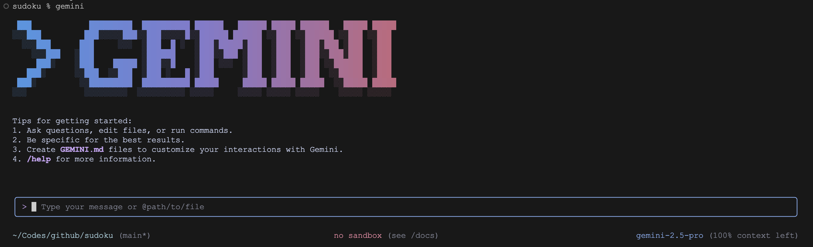
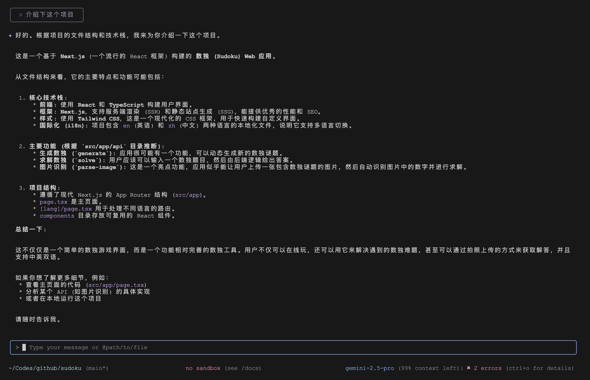
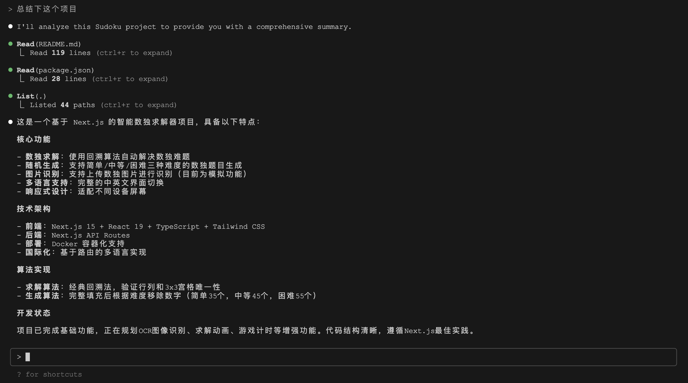
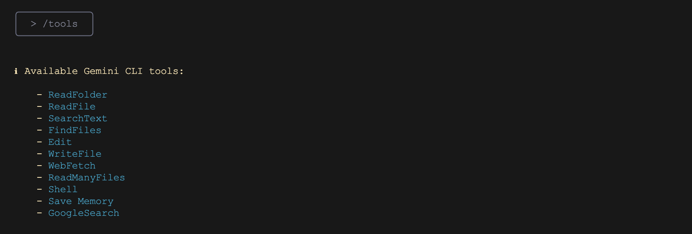
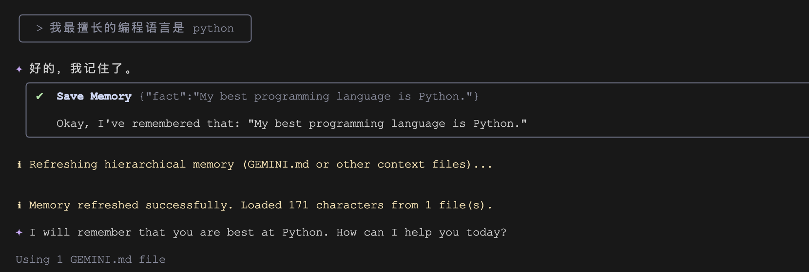
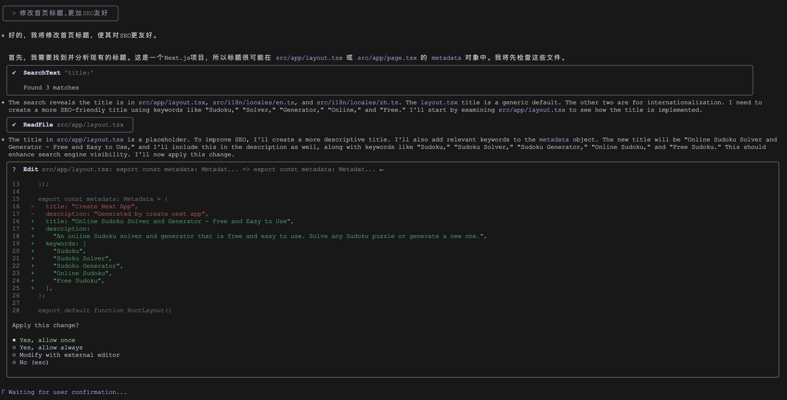
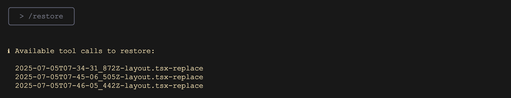
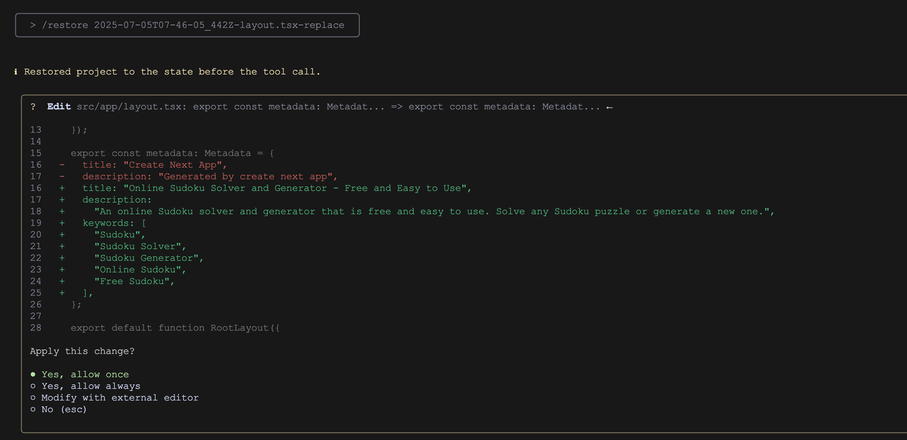
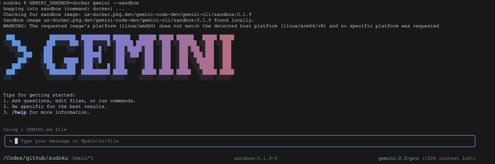

# Gemini CLI vs. Claude Code 功能对比

经过两周多的深度学习和体验，我们对 Claude Code 的基本功能和特性已经有了基本了解。而正在我们学习 Claude Code 的期间，Google 开源了另一款终端 AI 助手 ———— [Gemini CLI](https://github.com/google-gemini/gemini-cli)，作为 Claude Code 的开源平替，它接入了 Google 顶级的 Gemini 2.5 Pro 大模型，而且使用个人账号登录即可免费使用，支持每分钟最多 60 次、每日最多 1000 次请求，引起了业界的广泛关注，仅用几天时间就获得了 52k+ 的星标。

刚开始学习 Claude Code 的时候，我本来想着充 5 美刀体验体验，到后来又充了 10 美刀，直到最后，两周时间一共花了我 35 美刀，实在是贵的肉疼。相对来说，开源且免费的 Gemini CLI 用起来是真香，所以 Gemini CLI 发布后的第一时间，我也赶紧试用了一番，这篇文章就对两者的功能做一个全面的对比。

## 安装与上手

Gemini CLI 的安装和 Claude Code 一样便捷，都依赖于 `npm` 进行全局安装：

```
$ npm install -g @google/gemini-cli
```

安装后，只需在终端输入 `gemini`，首次运行会引导用户进行 Google 账户授权和主题选择，整个过程和 Claude Code 几乎没有区别，完成后进入交互模式：



下面将从几个重要的维度对 Gemini CLI 和 Claude Code 的功能进行对比。

## 代码理解与交互

Gemini CLI 和 Claude Code 这两款工具都具备强大的代码理解能力，支持超长的上下文窗口，能够轻松应对大型项目。它们都允许用户通过 `@` 符号引用文件和目录，并提供自动补全功能，使得与代码库的对话变得异常简单。

Gemini CLI 在与代码交互时，更侧重于直接的问答和指令执行；Claude Code 则更进一步，它通过与 IDE 的深度集成，能够获取更丰富的上下文信息，例如当前打开的文件、光标选中的代码、甚至是 IDE 的诊断信息。这使得 Claude Code 在进行代码修复或重构时，能够提供更精准、更贴合当前开发场景的建议。

上手第一个问题，必定是让它 “介绍下这个项目”：



可以看到 Gemini CLI 也能很好的完成这个工作，不过相对于 Claude Code 感觉还是差点意思，缺少了中间读取文件的过程：



## 内置工具与扩展性

Gemini CLI 内置了一系列实用的工具，涵盖了文件查找 (`FindFiles/ReadFolder`)、内容搜索 (`SearchText`)、文件读取（`ReadFile/ReadManyFiles`）、文件编辑 (`Edit`)、文件创建 (`WriteFile`)、Shell 命令执行 (`Shell`) 、网页抓取 (`WebFetch`) 、联网搜索（`GoogleSearch`）和保存记忆（`Save Memory`）等常用功能。

可以在交互模式下输入 `/tools` 斜杠命令查看：



而 Claude Code 的内置工具集更为丰富和专业，多达 16 个。除了 Gemini CLI 包含的基础功能外，它还提供了：

*   **更精细的文件操作**: `MultiEdit` 用于批量修改，`NotebookRead/Edit` 用于原生支持 Jupyter Notebook 操作；
*   **更高效的文件检索**：`Grep` 工具通过 `ripgrep` 替代 `grep` 在检索大型代码库时效率更高；
*   **任务管理与规划**: `TodoWrite/Read` 用于生成和跟踪任务列表，`Task` (子智能体) 用于执行深度搜索和研究，`exit_plan_mode` (规划模式) 用于在执行复杂任务前制定详细计划；
*   **Git/GitHub 集成**: 内置了对 `git` 和 `gh` (GitHub CLI) 的深度支持，能够理解 PR、审查代码、处理评论等；

关于 Claude Code 的这些功能，可以参考我之前的文章。尽管如此，Gemini CLI 提供的这些基础工具已经可以完成绝大多数工作了，其中，[保存记忆（`Save Memory`）](https://github.com/google-gemini/gemini-cli/blob/main/docs/tools/memory.md) 是 Gemini CLI 的一个比较有特色的工具，我们可以通过自然语言让 Gemini CLI 记住我们的个人偏好或项目设置等信息：



也可以通过斜杠命令 `/memory add` 手动添加：

```
> /memory add "your fact here"
```

添加的记忆内容将保存在用户目录下的 `~/.gemini/GEMINI.md` 文件中，查看该文件的内容如下：

```
$ cat ~/.gemini/GEMINI.md

## Gemini Added Memories
- My best programming language is Python.
```

后续对话时 Gemini CLI 会自动填充记忆内容。我们也可以在项目的根目录手动创建记忆文件，供整个项目团队共用。

很显然，这个功能和 Claude Code 的 `CLAUDE.md` 非常类似，只不过 Claude Code 并没有把它抽象成工具，而是通过 `/init` 命令初始化记忆以及 `#` 快捷键来手动添加记忆。

此外，在扩展性方面，Gemini CLI 也[支持 MCP 协议](https://github.com/google-gemini/gemini-cli/blob/main/docs/tools/mcp-server.md)，允许用户集成外部工具和服务，这和 Claude Code 基本上差不多。

## 与开发环境的集成

Claude Code 目前在外部集成方面功能强大，它可以与 IDE 无缝集成，能直接在 IDE 的差异视图中展示代码变更，自动将 IDE 的上下文共享给大模型，甚至可以通过快捷键在 IDE 和 CLI 之间切换。这种“沉浸式”的体验，使得 Claude Code 更像是一个嵌入在开发环境中的智能伙伴，而不是一个外部工具。

此外，Claude Code 还支持以 **GitHub Actions** 的方式集成到 CI/CD 流程中。你可以在 PR 或 Issue 的评论中 `@claude`，让它自动分析代码、创建 PR 或修复错误，将 AI 的能力贯穿于整个软件开发生命周期。

显然，Gemini CLI 在这方面要薄弱地多，它更多地被定位为一个独立的终端工具，虽然可以和 VS Code 中的 Gemini Code Assist 配合使用，但两者之间的联动相对松散。

## 权限控制与安全性

Claude Code 在权限控制和安全性方面考虑得非常周全，它提供了一套非常完善和精细的权限控制机制，用户可以通过配置文件或命令行参数，精确控制每个工具的权限，例如：

* 允许或禁止某个 `Bash` 命令 (`Bash(npm run build)`)
* 限制文件的读写范围 (`Edit(docs/**)`)
* 设置不同的权限模式（如 `plan` 模式只读不写，`yolo` 模式则跳过所有确认）
* 在企业环境下，系统管理员还可以强制执行用户无法覆盖的安全策略
* 最近还引入了 **钩子 (Hooks)** 功能，允许在工具执行前后运行自定义脚本，实现日志记录、代码格式化、自定义校验等高级功能

而 Gemini CLI 在这方面相对简单，主要依赖于执行前的用户确认。不过 Gemini CLI 有一个 [检查点（Checkpointing）](https://github.com/google-gemini/gemini-cli/blob/main/docs/checkpointing.md) 功能，比较有意思。如果开启了该功能，Gemini CLI 的工具对文件进行修改之前，会自动保存项目状态的快照，这样用户可以放心地尝试和应用代码，我们可以通过 `--checkpointing` 参数开启：

```
$ gemini --checkpointing
```

然后让 Gemini CLI 对代码稍作修改：



修改完成后输入 `/restore` 命令，可以查看生成的检查点：



输入 `/restore <checkpoint-file>` 可以将项目还原到特定的检查点：



运行该命令后，你的文件和对话将立即恢复到创建检查点时的状态，工具调用的提示也会重新出现。

此外，Gemini CLI 的 [沙盒模式](https://github.com/google-gemini/gemini-cli/blob/main/docs/sandbox.md) 也是其一大特色，它支持两种实现方式：

1. 基于 macOS 的 Seatbelt 功能实现轻量级沙盒，使用 `sandbox-exec` 命令，默认限制为禁止项目目录之外的写操作；也可以通过 `SEATBELT_PROFILE` 环境变量调整限制策略，比如严格限制、禁止联网等；
2. 基于 Docker 或 Podman 容器实现完全进程隔离的跨平台沙盒；

```
# 使用默认的沙盒机制
$ gemini --sandbox

# 通过环境变量指定沙盒机制
$ GEMINI_SANDBOX=docker gemini
```

下面是以 Docker 容器方式运行，会自动拉取沙箱镜像：



## 小结

经过一番研究和对比，我们对 Gemini CLI 也有了基本的认识，简单说，两款工具都很棒，但定位不同：

* Gemini CLI 开源、免费、够用，适合个人开发者或想省钱的用户；
* Claude Code 更加专业、功能更强、集成更好，适合追求极致效率的团队；

所以，想免费尝鲜，用 Gemini CLI；不差钱，追求专业高效，就选 Claude Code。同时，我们也要及时关注开源社区的动态，相信在社区的共同努力下，Gemini CLI 也会越来越好用，超越 Claude Code 也不无可能。
