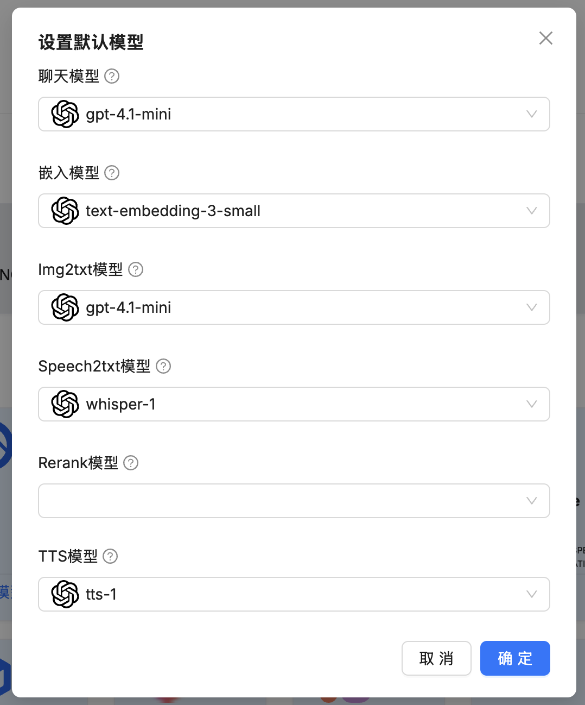

# RAGFlow 快速入门

在构建高级 AI 应用时，检索增强生成（RAG）已成为一项关键技术，它能让大语言模型（LLM）利用外部知识库，提供更准确、更具上下文的回答。然而，如何高效地处理和理解格式各异的复杂文档（如 PDF、Word、PPT 等），并从中提取高质量信息，一直是 RAG 应用落地的一大挑战。

今天，我们将介绍一款强大的开源 RAG 引擎 —— [RAGFlow](https://ragflow.io/)，它专为解决这一难题而生。RAGFlow 基于深度文档理解技术，能够为企业和个人提供一套精简、高效的 RAG 工作流程，让 AI 应用能够从海量复杂数据中高质量地提取信息，真正做到 **Quality in, quality out**。


RAGFlow 的核心特性如下：

* **深度文档理解**：不仅仅是提取文本，RAGFlow 能够深入理解各类复杂文档的布局和结构，确保从 PDF、Word、PPT 等文件中提取高质量、有价值的信息；
* **智能文本切片**：提供基于模板的文本切片方法，不仅智能，而且整个过程清晰可控，方便解释和调整；
* **有理有据的回答**：生成的回答都附带关键引用的快照，并支持追根溯源，最大限度地减少了 AI 幻觉；
* **广泛的异构数据支持**：兼容各类数据源，包括 Word 文档、PPT、Excel 表格、PDF、图片、网页，甚至是扫描件；
* **自动化的 RAG 工作流**：提供从数据处理、多路召回到融合重排序的全自动化 RAG 工作流，并支持灵活配置大语言模型和向量模型，提供易用的 API，方便与现有系统集成；

本文将带你快速入门 RAGFlow，学习如何安装、配置并使用它来构建你自己的 RAG 应用。

## 安装与上手

安装 RAGFlow 最简单的方法是使用 Docker 和 Docker Compose。首先检查我们的电脑上已经安装了它们：

```
$ docker --version
Docker version 24.0.2, build cb74dfc

$ docker compose version
Docker Compose version 2.38.1
```

确保 Docker 的版本在 24.0.0 以上，Docker Compose 的版本在 v2.26.1 以上。然后克隆 RAGFlow 仓库：

```
$ git clone https://github.com/infiniflow/ragflow.git
```

进入 `docker` 文件夹：

```
$ cd ragflow/docker
```

这个文件夹下有几个比较重要的文件：

* `docker-compose.yml` - 定义了 RAGFlow 的镜像和配置，这个文件通过 Docker Compose 的 `include` 语法引用了 `docker-compose-base.yml` 文件，因此启动时只需指定这个入口文件即可
* `docker-compose-base.yml` 定义了 RAGFlow 依赖的中间件的镜像和配置，包括 ES、MySQL、Redis 和 Minio 等
* `.env` - 通过环境变量修改启动配置，比如调整各组件的端口，用户名和密码，默认镜像等，在 macOS 电脑上可以将 `MACOS=1` 打开，如果访问不了 `huggingface.co` 可以开启 `HF_ENDPOINT=https://hf-mirror.com` 参数

配置确认无误后，使用 Docker Compose 一键启动：

```
$ docker compose -f docker-compose.yml up -d
```

启动时默认会拉取官方构建好的 `infiniflow/ragflow:v0.19.1-slim` 镜像，该镜像比较大，下载要花点时间。启动成功后如下：


## 构建 ARM64 镜像

目前官方提供的 Docker 镜像均基于 x86 架构构建，并不提供基于 ARM64 的 Docker 镜像，比如在我的 macOS 上启动后，容器的下面会显示一个 AMD64 的标签。如果你的 Docker 和我一样，开启了 QEMU 或 Apple 的 Virtualization Framework 虚拟化技术，在 ARM64 机器上也可以跑 x86 的镜像，就是速度有点慢。


当然你也可以自行构建 ARM64 架构的镜像，顺便也能看看镜像中隐藏的一些细节，参考这篇文档：

* https://ragflow.io/docs/dev/build_docker_image

首先，下载构建镜像所需的资源：

```
$ uv run download_deps.py
```

下载的资源包括：

* 几个库文件
    * libssl
    * tika-server-standard.jar
    * cl100k_base.tiktoken
    * chrome 和 chromedriver
* 几个 nltk_data 资源
    * `wordnet`
    * `punkt`,
    * `punkt_tab`
* 几个 huggingface 模型
    * `InfiniFlow/text_concat_xgb_v1.0`
    * `InfiniFlow/deepdoc`
    * `InfiniFlow/huqie`
    * `BAAI/bge-large-zh-v1.5`
    * `maidalun1020/bce-embedding-base_v1`

然后构建资源镜像（就是将刚刚下载的资源拷贝到基础镜像里）：

```
$ docker build -f Dockerfile.deps -t infiniflow/ragflow_deps .
```

然后基于资源镜像构建 RAGFlow 镜像：

```
$ docker build --build-arg LIGHTEN=1 -f Dockerfile -t infiniflow/ragflow:nightly-slim .
```

构建完成后，打开 `docker/.env` 文件，找到 `RAGFLOW_IMAGE` 配置，将其修改为 `infiniflow/ragflow:nightly-slim`。最后，使用 Docker Compose 一键启动：

```
$ cd docker
$ docker compose -f docker-compose-macos.yml up -d
```

## RAGFlow 登录

启动后，查看 RAGFlow 容器的日志，当显示如下的文字 LOGO 时，说明启动成功：


RAGFlow 默认监听本地 80 端口，直接用浏览器打开 `http://localhost` 即可，进入 RAGFlow 的登录页面：


> 吐槽下 RAGFlow 的登录页面，这背景图选的，文字都看不清。

第一次使用需要注册一个新账号，注册完成后使用新账号登录即可：


## RAGFlow 初体验

进入 RAGFlow 的第一件事是配置模型，点击右上角的头像，然后进入 “模型供应商” 页面：


从下面的列表中选择并添加自己的模型，根据不同的模型，需要配置 API Key 等不同的参数。然后设置默认模型：



RAGFlow [支持大量的模型供应商](https://ragflow.io/docs/dev/supported_models)，这些模型按功能被划分成几类：

* 聊天模型
* 嵌入模型
* Img2txt模型
* Speech2txt模型
* Rerank模型
* TTS模型

根据需要配置这些模型，一般来讲，除了聊天模型和嵌入模型是必填的，其他的可以不填；配置完默认模型后，就可以体验 RAGFlow 的功能了。进入 “知识库” 页面，创建一个新知识库：


然后点击 “新增文件” 按钮，从本地上传一个文件，上传后点击解析按钮，只有解析成功后的文件才可以对其问答，文件解析完成后如下所示：


我们再进入 “聊天” 页面，点击 “新建助理” 创建一个聊天助手：


下面的知识库选择我们刚刚创建的知识库，创建成功后，就可以和它进行对话了：


## 小结

在本文中，我们对 RAGFlow 进行了快速入门。我们学习了 RAGFlow 的核心特性，讲解了如何通过 Docker Compose 进行安装部署，并为 ARM64 用户提供了详细的镜像构建指南。在完成模型供应商的配置后，我们通过创建一个知识库并上传文档，完整地体验了 RAGFlow 从数据处理到智能问答的基本工作流程。

通过今天的学习，我们对 RAGFlow 已经有了初步的了解。在后续的文章中，我们将结合源码深入其核心，探索更多高级功能，例如深度文档理解、智能文本切片、自动化 RAG 工作流等。
