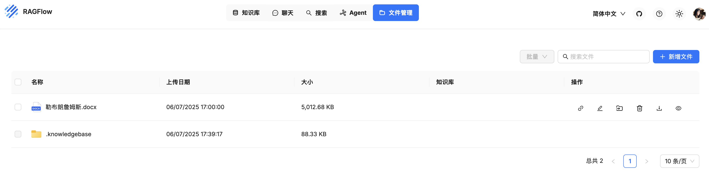
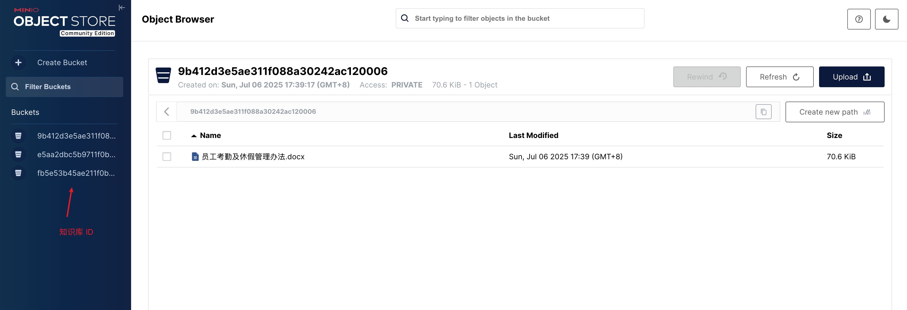

# 学习 RAGFlow 的文件上传逻辑

在上一篇中，我们学习了 RAGFlow 的系统架构和启动流程，了解了 RAGFlow 的 **API 服务器（API Server）** 和 **任务执行器（Task Executor）** 两大核心组件，一个负责提供外部接口和平台基本功能，另一个则负责文件的解析和切片处理。

从系统架构图中，我们可以看到 RAGFlow 的核心流程包括 **文件上传** -> **文件解析** -> **文件分块** -> **多路召回** -> **重排序** -> **大模型回答** 这些步骤，今天我们就从源码的角度，先来学习下文件上传的相关逻辑。

## 文件上传接口实现

文件上传接口为 `/v1/document/upload`，其实现逻辑位于 `api/apps/document_app.py` 文件：

```python
@manager.route("/upload", methods=["POST"])
@login_required
def upload():
  kb_id = request.form.get("kb_id")
  file_objs = request.files.getlist("file")
  
  # 根据 kb_id 查询知识库
  e, kb = KnowledgebaseService.get_by_id(kb_id)

  # 上传文件到指定知识库
  err, files = FileService.upload_document(kb, file_objs, current_user.id)

  return get_json_result(data=files)
```

其中 `FileService` 的 `upload_document` 实现如下：

```python
@classmethod
@DB.connection_context()
def upload_document(self, kb, file_objs, user_id):
  
  # 初始化知识库目录结构：/.knowledgebase/kb_name
  root_folder = self.get_root_folder(user_id)
  pf_id = root_folder["id"]
  self.init_knowledgebase_docs(pf_id, user_id)
  kb_root_folder = self.get_kb_folder(user_id)
  kb_folder = self.new_a_file_from_kb(kb.tenant_id, kb.name, kb_root_folder["id"])

  err, files = [], []
  for file in file_objs:
    # 文件重名处理，a.pdf -> a(1).pdf
    filename = duplicate_name(DocumentService.query, name=file.filename, kb_id=kb.id)

    # 读取文件内容，如果是 PDF 尝试对格式错误的文件进行修复
    blob = file.read()
    if filetype == FileType.PDF.value:
      blob = read_potential_broken_pdf(blob)
    
    # 上传文件到对象存储
    location = filename
    STORAGE_IMPL.put(kb.id, location, blob)

    # 生成文件缩略图
    doc_id = get_uuid()
    img = thumbnail_img(filename, blob)
    thumbnail_location = ""
    if img is not None:
      thumbnail_location = f"thumbnail_{doc_id}.png"
      STORAGE_IMPL.put(kb.id, thumbnail_location, img)

    # 保存到 document 表
    doc = {
      "id": doc_id,
      "kb_id": kb.id,
      "parser_id": self.get_parser(filetype, filename, kb.parser_id),
      "parser_config": kb.parser_config,
      "created_by": user_id,
      "type": filetype,
      "name": filename,
      "location": location,
      "size": len(blob),
      "thumbnail": thumbnail_location,
    }
    DocumentService.insert(doc)

    # 保存到 file 表
    FileService.add_file_from_kb(doc, kb_folder["id"], kb.tenant_id)
    files.append((doc, blob))

  return err, files
```

这里有几个值得注意的点，我们来逐一分析下。

## 知识库目录结构

RAGFlow 除了知识库管理之外，还有一个文件管理功能：



用户可以直接在这里创建目录和上传文件，然后点击右边的 “链接知识库” 将其挂到某个知识库下。和直接在知识库中上传文件相比，在这里管理文件的好处是，一份文件可有链接到多个知识库，且知识库删除时文件不会被删除。在知识库中上传的文件也会出现在文件管理里，每个知识库在 `/.knowledgebase` 目录下都有一个对应的文件夹，只不过该文件夹是只读的，不允许用户在其中创建子文件夹或对文件进行修改。

整个文件的目录结构如下所示：

```
/
├── Folder 1
│   ├── File 11
│   └── File 12
├── Folder 2
│   ├── File 21
│   └── File 22
└── .knowledgebase
    ├── kb1
    │   ├── File 11
    │   └── File 12
    └── kb2
        ├── File 21
        └── File 22
```

此外，从文件管理上传的文件会在 `file` 表中插入记录，而在知识库中上传的文件会同时在 `file` 和 `document` 表中插入记录，并通过 `file2document` 表维护两者之间的关系，这也是上面最后几句代码的作用。

## 修复 PDF 格式错误

PDF 文件的处理是一件非常棘手的问题，RAGFlow 在上传 PDF 文件的时候，会检查文件能否正常打开，如果有问题，则尝试用 Ghostscript 对其进行修复：

```python
def read_potential_broken_pdf(blob):
  def try_open(blob):
    try:
      with pdfplumber.open(BytesIO(blob)) as pdf:
        if pdf.pages:
          return True
    except Exception:
      return False
    return False

  if try_open(blob):
    return blob

  repaired = repair_pdf_with_ghostscript(blob)
  if try_open(repaired):
    return repaired

  return blob
```

修复的逻辑很简单，就是执行 Ghostscript 命令：

```
$ gs -o <outfile> -sDEVICE=pdfwrite -dPDFSETTINGS=/prepress <infile>
```

> 我们之前在学习 PDFMathTranslate 时，了解到它有一个兼容模式，通过 [pikepdf](https://github.com/pikepdf/pikepdf) 将 PDF 转换为 `PDF/A` 格式，可以提高 PDF 文件的兼容性。感觉这也算一种修复 PDF 文件的方式，只是不知道二者之间有何区别。

## 缩略图的生成

RAGFlow 支持为不同格式的文件生成缩略图，可以学习下它这里不同文件的实现。

比如使用 [pdfplumber](https://github.com/jsvine/pdfplumber) 的 `Page.to_image()` 生成 PDF 文件的缩略图：

```python
import pdfplumber
pdf = pdfplumber.open(BytesIO(blob))

buffered = BytesIO()
resolution = 32
pdf.pages[0].to_image(resolution=resolution).annotated.save(buffered, format="png")
img = buffered.getvalue()

pdf.close()
return img
```

使用 [PIL](https://pypi.org/project/pillow/) 的 `Image.thumbnail()` 生成图片的缩略图：

```python
from PIL import Image
image = Image.open(BytesIO(blob))

image.thumbnail((30, 30))
buffered = BytesIO()
image.save(buffered, format="png")

return buffered.getvalue()
```

使用 [aspose-slides](https://pypi.org/project/aspose-slides/) 的 `Slide.get_thumbnail()` 生成 PPT 文件的缩略图：

```python
import aspose.pydrawing as drawing
import aspose.slides as slides

with slides.Presentation(BytesIO(blob)) as presentation:
  buffered = BytesIO()
  scale = 0.03
  img = None
  presentation.slides[0].get_thumbnail(scale, scale).save(buffered, drawing.imaging.ImageFormat.png)
  img = buffered.getvalue()
  return img
```

## 文件存储的实现

从代码可以看到，这里通过 `STORAGE_IMPL.put(...)` 将文件上传到对象存储，RAGFlow 默认使用 Minio 存储，可以在浏览器里输入 `http://localhost:9001` 来访问它：


默认用户为 `rag_flow`，密码为 `infini_rag_flow`，登录进去后可以浏览 RAGFlow 的所有的文件：



其中桶名就是知识库的 ID，Key 就是文件的名称。

RAGFlow 支持多种不同的文件存储实现，除了 Minio 还支持下面这些：

* `AZURE_SPN` - 使用 Azure 的 [DataLake 服务](https://github.com/Azure/azure-sdk-for-python/tree/main/sdk/storage/azure-storage-file-datalake)
* `AZURE_SAS` - 使用 Azure 的 [Storage Blobs 服务](https://github.com/Azure/azure-sdk-for-python/tree/main/sdk/storage/azure-storage-blob)
* `AWS_S3` - 使用 AWS 的 [S3 服务](https://boto3.amazonaws.com/v1/documentation/api/latest/index.html)
* `OSS` - 使用阿里云的 [OSS 对象存储服务](https://help.aliyun.com/zh/oss/developer-reference/use-amazon-s3-sdks-to-access-oss)
* `OPENDAL` - 使用 Apache 的 [OpenDAL](https://github.com/apache/opendal) 连接不同的存储服务

可以在 `.env` 文件中通过 `STORAGE_IMPL` 变量来切换其他的存储实现。比如使用阿里云的 OSS 存储，需要在 `.env` 文件中添加下面的配置：

```
STORAGE_IMPL=OSS
```

同时修改 `service_conf.yaml.template` 中对应的 `oss` 配置：

```yaml
oss:
  access_key: 'access_key'
  secret_key: 'secret_key'
  endpoint_url: 'http://oss-cn-hangzhou.aliyuncs.com'
  region: 'cn-hangzhou'
  bucket: 'bucket_name'
```

## 小结

我们今天学习了 RAGFlow 的文件上传逻辑，了解了 RAGFlow 是如何组织知识库的目录结构、如何修复 PDF 格式错误、如何生成不同文件的缩略图、以及如何切换不同的文件存储等相关内容。文件上传之后，自然就要对其进行解析处理了，我们明天继续吧。
