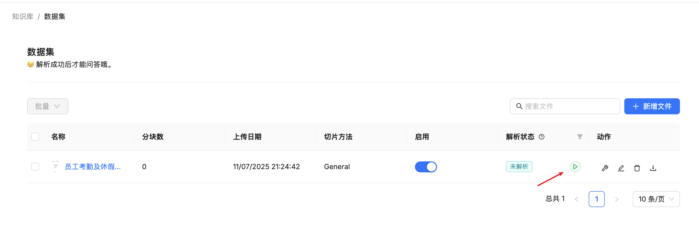
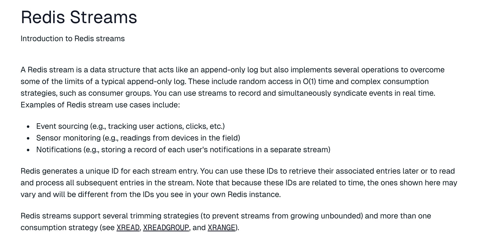
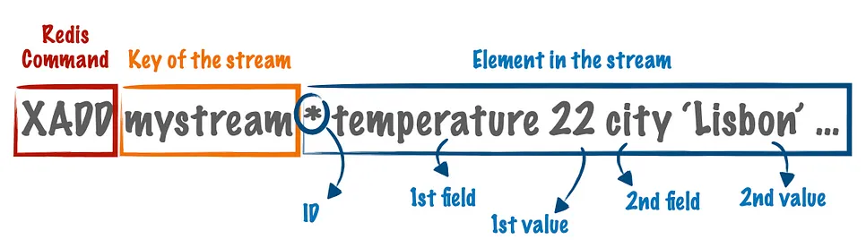
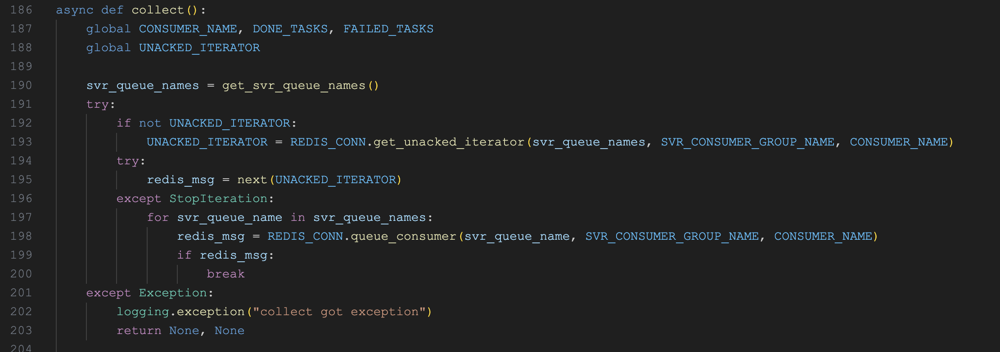

# 学习 RAGFlow 的文件解析逻辑

昨天我们已经学习了 RAGFlow 文件上传的相关逻辑，今天继续学习文件解析的逻辑。

## 触发文件解析

文件上传后，在文件列表中会有一个 “解析” 按钮，点击后会触发文件解析：



调用接口为 `/v1/document/run`，其实现逻辑位于 `api/apps/document_app.py` 文件：

```python
@manager.route("/run", methods=["POST"])
@login_required
def run():
  req = request.json
  for id in req["doc_ids"]:

    # 任务进度清零
    info = {"run": str(req["run"]), "progress": 0}
    DocumentService.update_by_id(id, info)

    if str(req["run"]) == TaskStatus.RUNNING.value:

      # 任务队列
      doc = DocumentService.get_by_id(id)
      bucket, name = File2DocumentService.get_storage_address(doc_id=doc["id"])
      queue_tasks(doc, bucket, name, 0)

  return get_json_result(data=True)
```

这里的代码做了简化，只保留了主要部分，其中 `req["run"]` 可能是 `RUNNING(1)` 或 `CANCEL(2)`，表示启动或取消任务。下面的 `queue_tasks` 函数是触发文件解析的入口，它的实现比较复杂，它根据不同的文件类型和配置，创建和排队文件处理任务，主要逻辑如下：

1. 如果文件类型为 PDF 文件，默认每 12 页创建一个任务，可以通过 `parser_config` 中的 `task_page_size` 来修改；如果 `paper_id` 是 `paper`，表示使用论文分块方法，则按每 22 页创建任务；如果 `paper_id` 是 `one` 或 `knowledge_graph`，表示不分块或提取知识图谱，则整个文件创建一个任务；
2. 如果 `paper_id` 是 `table`，表示文件类型为 Excel、CSV 等表格文件，则每 3000 行创建一个任务；
3. 对于其他类型，则整个文件创建一个任务；

此外，它会根据 `doc_id` 获取文档的分块配置，计算任务的摘要，并检查之前是否已经执行过一样的任务，如果有，则直接复用之前已经执行过的任务结果，提高处理效率。

最后将任务列表批量插入到数据库，并标记文档开始解析，然后从任务列表中筛选出未完成的任务，加入 Redis 队列：

```python
def queue_tasks(doc: dict, bucket: str, name: str, priority: int):

  # 根据不同的文件类型和配置，创建任务
  parse_task_array = []
  if doc["type"] == FileType.PDF.value:
    # ...
  elif doc["parser_id"] == "table":
    # ...
  else:
    # ...

  # 批量插入任务到数据库
  bulk_insert_into_db(Task, parse_task_array, True)

  # 标记文档开始解析
  DocumentService.begin2parse(doc["id"])

  # 将未完成的任务加入 Redis 队列
  unfinished_task_array = [task for task in parse_task_array if task["progress"] < 1.0]
  for unfinished_task in unfinished_task_array:
    assert REDIS_CONN.queue_product(
      get_svr_queue_name(priority), message=unfinished_task
    ), "Can't access Redis. Please check the Redis' status."
```

## 投递解析任务

上面通过 `REDIS_CONN.queue_product()` 将任务加入 Redis 队列，队列名为 `rag_flow_svr_queue` 或 `rag_flow_svr_queue_1`。RAGFlow 支持任务优先级，默认 `priority` 为 0，任务会被投递到 `rag_flow_svr_queue`，如果 `priority` 为 1，则会被投递到 `rag_flow_svr_queue_1`。

函数 `queue_product()` 的实现如下：

```python
def queue_product(self, queue, message) -> bool:
  for _ in range(3):
    try:
      payload = {"message": json.dumps(message)}
      self.REDIS.xadd(queue, payload)
      return True
    except Exception as e:
      logging.exception(
        "RedisDB.queue_product " + str(queue) + " got exception: " + str(e)
      )
  return False
```

它通过 Redis 的 `XADD` 命令将任务加入到队列中，重试 3 次。

## 学习 Redis 的 Stream 数据类型

Redis Stream 是 Redis 5.0 引入的一个强大的数据结构，专门用于处理流式数据和消息队列。它适用于下面这些场景：

* **实时数据处理**：适合处理传感器数据、日志流、用户行为事件等实时数据；
* **消息队列**：可替代传统的 List 作为消息队列，提供更强的功能和可靠性保证；
* **事件溯源**：支持回放历史消息，适合需要事件重放的业务场景；
* **微服务通信**：在微服务架构中作为轻量级的消息中间件使用；

Redis Stream 相比传统的 List 和 Pub/Sub，提供了更完善的消息处理机制，包括消息持久化、消费进度跟踪、消费者组协作等企业级特性：

* **持久化日志结构**：Stream 以只追加的方式存储数据，每条消息都有唯一的 ID 和时间戳，类似于 Apache Kafka 的日志结构；
* **消息格式**：每条消息由 ID 和 Value 组成，Value 是一个字典，包含多对键值对；
* **消费者组（Consumer Groups）**：支持多个消费者协作处理消息，提供负载均衡和故障转移能力，每个消费者组独立跟踪消费进度；



下面我们简单学习下 Redis Stream 的基本用法。

### 使用 `XADD` 生产消息

首先是通过 [`XADD` 命令](https://redis.io/docs/latest/commands/xadd/) 生产消息，该命令格式如下：



其中 `mystream` 是这个 Stream 的名称，`*` 表示自动生成 ID，后面的内容是 Stream 的值，由多个键值对组成。我们创建 Stream 并添加一些测试消息：

```
127.0.0.1:6379> XADD mystream * sensor_id temp_01 temperature 25.3
"1752285099426-0"
127.0.0.1:6379> XADD mystream * sensor_id temp_02 temperature 26.1
"1752285103416-0"
127.0.0.1:6379> XADD mystream * sensor_id temp_01 temperature 24.8
"1752285107329-0"
```

使用 [`XLEN` 命令](https://redis.io/docs/latest/commands/xlen/) 获取 Stream 长度：

```
127.0.0.1:6379> XLEN mystream
(integer) 3
```

### 使用 `XREAD` 消费消息

有多种消费 Redis Stream 的方法，最简单的是使用 [`XREAD` 命令](https://redis.io/docs/latest/commands/xread/)：

```
127.0.0.1:6379> XREAD COUNT 1 BLOCK 1000 STREAMS mystream 0
1) 1) "mystream"
   2) 1) 1) "1752285099426-0"
         2) 1) "sensor_id"
            2) "temp_01"
            3) "temperature"
            4) "25.3"
```

其中 `COUNT`  表示一次消费的数量，不指定则消费所有消息；`BLOCK` 表示阻塞等待时间（毫秒），置为 0 表示无限等待；`STREAMS` 后面跟要消费的 Stream 名称；最后的 `0` 表示从头开始消费。从输出结果可以看到，我们成功拿到了队列中的第一条消息，要获取后续消息，可以拿着这个 ID 继续消费：

```
127.0.0.1:6379> XREAD COUNT 1 BLOCK 1000 STREAMS mystream 1752285099426-0
1) 1) "mystream"
   2) 1) 1) "1752285103416-0"
         2) 1) "sensor_id"
            2) "temp_02"
            3) "temperature"
            4) "26.1"
```

### 使用消费者组消费消息

Redis Stream 的一大特色是支持消费者组，每个消费者组都有自己的消费进度，互不影响，同一个消费者组允许多个消费者协作处理消息。通过 [`XGROUP CREATE` 命令](https://redis.io/docs/latest/commands/xgroup-create/) 创建消费者组：

```
127.0.0.1:6379> XGROUP CREATE mystream mygroup 0
OK
```

其中 `mygroup` 是消费者组的名称，`0` 表示从头开始消费。然后我们就可以使用 [`XREADGROUP` 命令](https://redis.io/docs/latest/commands/xreadgroup/) 消费消息了：

```
127.0.0.1:6379> XREADGROUP GROUP mygroup consumer1 COUNT 1 STREAMS mystream >
1) 1) "mystream"
   2) 1) 1) "1752285099426-0"
         2) 1) "sensor_id"
            2) "temp_01"
            3) "temperature"
            4) "25.3"
```

其中 `consumer1` 是消费者名称，后面指定要读取的 Stream 和起始位置：

- `>` 表示读取新消息
- `0` 表示读取所有待确认消息
- 具体 ID 表示从该 ID 之后读取

比 `XREAD` 方便的是，我们可以一直使用 `>` 来读取新消息，而不需要关心上一次读取的 ID，Redis 会自动记录消费进度：

```
127.0.0.1:6379> XREADGROUP GROUP mygroup consumer1 COUNT 1 STREAMS mystream >
1) 1) "mystream"
   2) 1) 1) "1752285103416-0"
         2) 1) "sensor_id"
            2) "temp_02"
            3) "temperature"
            4) "26.1"
```

Redis Stream 支持多消费者协作，我们可以换一个消费者 `consumer2` 继续读取：

```
127.0.0.1:6379> XREADGROUP GROUP mygroup consumer2 COUNT 1 STREAMS mystream >
1) 1) "mystream"
   2) 1) 1) "1752285107329-0"
         2) 1) "sensor_id"
            2) "temp_01"
            3) "temperature"
            4) "24.8"
```

### 处理待确认消息

和传统的消息队列一样，消费 Redis Stream 之后需要确认消息已经处理完成，否则消息会一直是未确认状态，通过 [`XPENDING` 命令](https://redis.io/docs/latest/commands/xpending/) 查看待确认的消息：

```
127.0.0.1:6379> XPENDING mystream mygroup
1) (integer) 3
2) "1752285099426-0"
3) "1752285107329-0"
4) 1) 1) "consumer1"
      2) "2"
   2) 1) "consumer2"
      2) "1"
```

可以看到 `consumer1` 有 2 条未确认消息，`consumer2` 有 1 条未确认消息。使用 [`XACK` 命令](https://redis.io/docs/latest/commands/xack/) 确认消息：

```
127.0.0.1:6379> XACK mystream mygroup 1752285099426-0
(integer) 1
```

关于 Redis Stream 的更多内容，可以参考下面的官方文档：

* https://redis.io/docs/latest/develop/data-types/streams/

了解了 Redis Stream 的基本知识，可以帮助我们更好的理解 RAGFlow 任务执行器的实现原理。

## 任务执行器

我们之前提过，RAGFlow 由 **API 服务器（API Server）** 和 **任务执行器（Task Executor）** 两大核心组成，上面投递到 Redis 中的任务，就是由任务执行器来消费和处理的。任务执行器的入口位于 `rag/svr/task_executor.py` 文件，它是一个 [Trio](https://github.com/python-trio/trio) 异步程序：

```python
import trio

# 控制并发任务数
MAX_CONCURRENT_TASKS = int(os.environ.get('MAX_CONCURRENT_TASKS', "5"))
task_limiter = trio.Semaphore(MAX_CONCURRENT_TASKS)

async def main():
  async with trio.open_nursery() as nursery:
    
    # 定时汇报任务状态
    nursery.start_soon(report_status)
    
    # 启动任务管理器
    while not stop_event.is_set():
      await task_limiter.acquire()
      nursery.start_soon(task_manager)
  logging.error("BUG!!! You should not reach here!!!")
```

程序首先通过 `trio.open_nursery()` 创建了一个 nursery 对象（中文翻译 “托儿所”），用于管理异步任务。然后使用 `start_soon()` 启动一个定时任务，每隔一段时间汇报一次任务状态；最后使用 `start_soon()` 启动任务管理器，通过信号量控制并发任务数，默认为 5，可以通过环境变量 `MAX_CONCURRENT_TASKS` 修改。

> 启动任务执行器时有一个参数 `--workers=5` 表示启动 5 个 worker 进程，每个进程内部都是一个 Trio 程序，由上面的代码可知，每个进程内部又会启动 5 个并发的任务，所以实际上一共有 25 个处理线程。

任务管理器的核心逻辑位于 `handle_task()` 函数中：

```python
async def handle_task():

  # 从 Redis 中读取任务
  redis_msg, task = await collect()

  # 处理任务
  logging.info(f"handle_task begin for task {json.dumps(task)}")
  await do_handle_task(task)
  logging.info(f"handle_task done for task {json.dumps(task)}")

  # 确认任务完成
  redis_msg.ack()
```

这里的一系列操作就使用了上面我们学习的 Redis Stream 相关知识。它首先通过 `collect()` 函数从 Redis 中读取任务：



这里的消费者组名称为 `rag_flow_svr_task_broker`，消费者名称为 `"task_executor_" + CONSUMER_NO`，其中 `CONSUMER_NO` 就是启动任务执行器时传入的 `${host_id}_${consumer_id}` 参数，用于唯一标识每个消费者。

`collect()` 函数优先读取未确认的消息（调用 `XREADGROUP` 时 `ID` 传 0），当没有未确认消息时，再读取新消息（调用 `XREADGROUP` 时 `ID` 传 `>`），读取消息之后，调用 `do_handle_task()` 函数处理任务，最后通过 `redis_msg.ack()` 确认任务完成。

## 小结

本文深入探讨了 RAGFlow 的文件解析流程。我们首先学习了如何通过 API 触发解析任务，这些任务随后被智能地拆分并放入 Redis Stream 消息队列中。接着，我们详细了解了 Redis Stream 的工作原理，并分析了任务执行器如何利用 `trio` 异步框架和消费者组机制，高效、可靠地消费和处理这些任务。

在下一篇文章中，我们将继续研究 `do_handle_task()` 函数的实现，深入了解 RAGFlow 是如何具体执行每个解析任务的。
