# 学习 RAGFlow 的知识库配置

书接上回，昨天我们深入学习了如何触发解析任务，如何通过 Redis Stream 作为消息队列投递任务，以及任务执行器如何利用 `trio` 异步框架和消费者组机制，消费和处理这些任务。我们可以用 Redis 客户端连接到 Redis，看看 `rag_flow_svr_queue` 队列中的消息是什么样的：

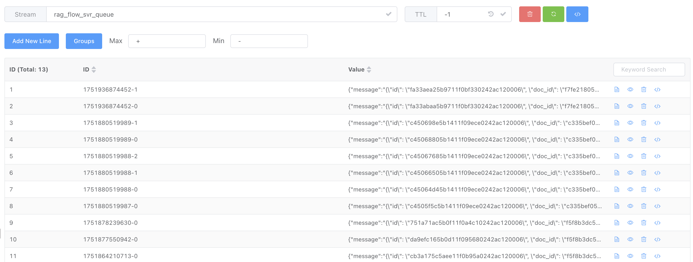

## 任务消息结构

我们知道，每条 Redis Stream 的消息由 ID 和 Value 组成，Value 是一个字典，包含多对键值对；这里的 Value 只有一对键值对，键为 `message`，值为一个 JSON 字符串，表示任务的详细信息：

```json
{
  "id": "58b8b5a65e5b11f0b6c20242ac120006",
  "doc_id": "677bfde25e5a11f09c890242ac120006",
  "progress": 0.0,
  "from_page": 0,
  "to_page": 100000000,
  "digest": "81e29dac5b568aca",
  "priority": 0,
  "create_time": 1752240687243,
  "create_date": "2025-07-11 21:31:27",
  "update_time": 1752240687243,
  "update_date": "2025-07-11 21:31:27"
}
```

很显然，这里的信息还不够完整，因此 `collect()` 继续通过任务 ID 查询数据库，获取了更详细的任务信息：

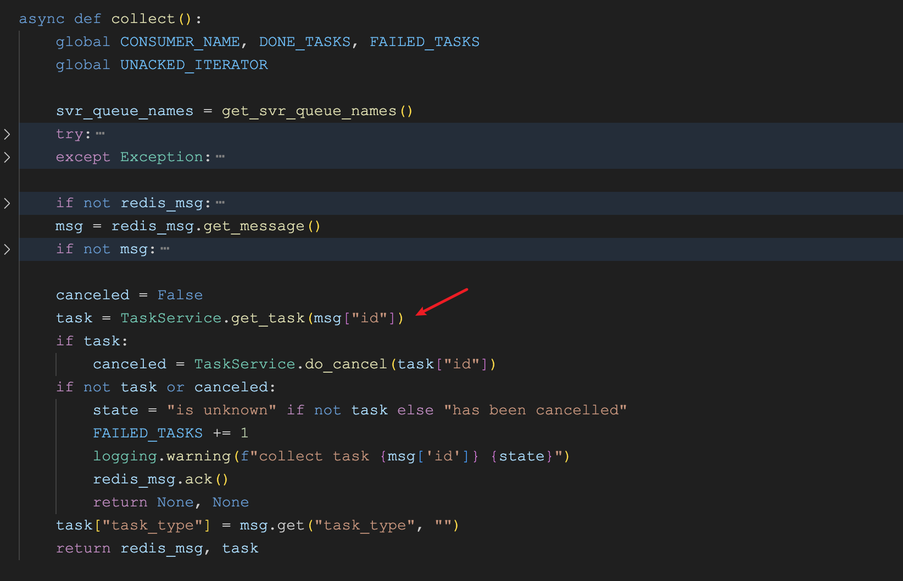

详细的任务信息如下：

```json
{
  "id": "58b8b5a65e5b11f0b6c20242ac120006",
  "doc_id": "677bfde25e5a11f09c890242ac120006",
  "from_page": 0,
  "to_page": 100000000,
  "retry_count": 0,
  "kb_id": "e5aa2dbc5b9711f0b0880242ac120006",
  "parser_id": "naive",
  "parser_config": {
    "layout_recognize": "DeepDOC",
    "chunk_token_num": 512,
    "delimiter": "\n",
    "auto_keywords": 0,
    "auto_questions": 0,
    "html4excel": false,
    "raptor": {
      "use_raptor": false
    },
    "graphrag": {
      "use_graphrag": false
    }
  },
  "name": "README.md",
  "type": "doc",
  "location": "README.md",
  "size": 9078,
  "tenant_id": "fb5e4b9e5ae211f0b4620242ac120006",
  "language": "English",
  "embd_id": "text-embedding-3-small@OpenAI",
  "pagerank": 0,
  "img2txt_id": "gpt-4.1-mini@OpenAI",
  "asr_id": "whisper-1@OpenAI",
  "llm_id": "gpt-4.1-mini@OpenAI",
  "update_time": 1752240687243,
  "task_type": ""
}
```

这里的 `parser_id` 和 `parser_config` 是文件解析时用到的最为重要的两个参数，`parser_id` 表示切片方法，而 `parser_config` 则表示文件解析时的配置，包括解析策略、分块大小、分隔符、是否自动提取关键字和问题等。

在继续研究 `do_handle_task()` 函数的解析逻辑之前，我们需要先了解下 RAGFlow 的知识库配置都有哪些。

## 切片方法

RAGFlow 提供了多种切片方法，以便对不同布局的文件进行分块，并确保语义完整性。我们可以在知识库配置页面中进行选择：

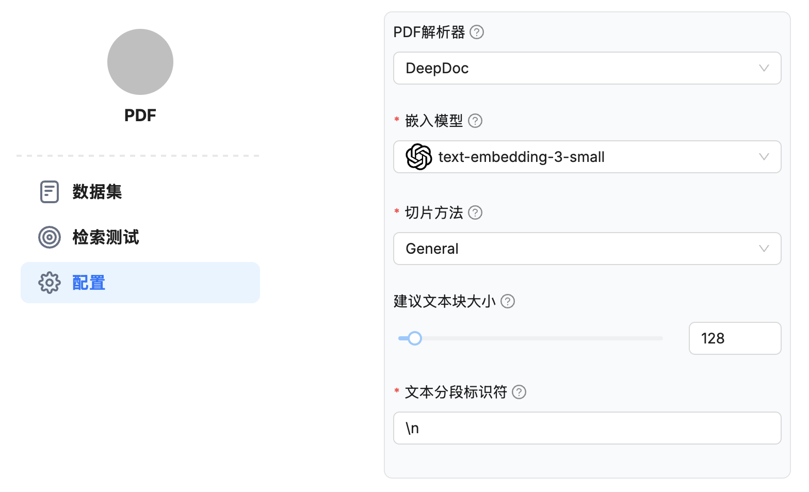

正确选择知识库配置对于未来的召回和问答效果至关重要。下面是官方对每种切片方法的说明：

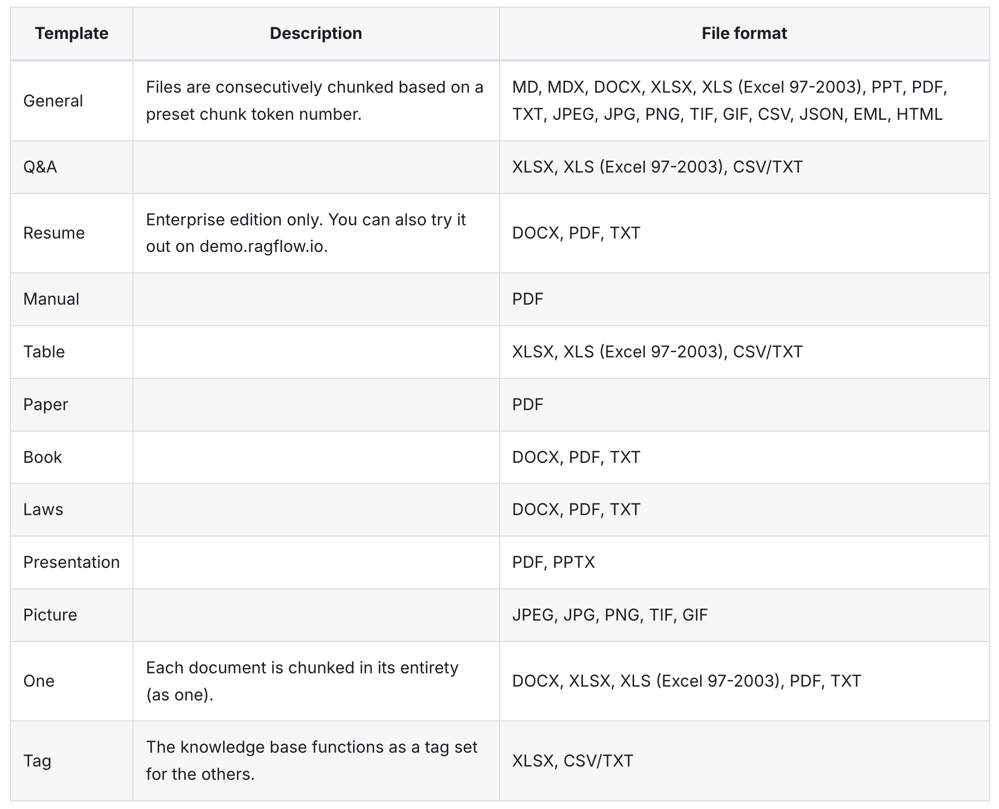

### `General` 分块方法

这是最简单的一种分块方法，也是最通用的一种，它支持众多的文件格式，包括 MD、MDX、DOCX、XLSX、XLS、PPT、PDF、TXT、JPEG、JPG、PNG、TIF、GIF、CSV、JSON、EML、HTML 等。它的处理逻辑如下：

* 它首先使用视觉检测模型将连续文本分割成多个片段；
* 接下来，这些连续的片段被合并成 Token 数不超过 `chunk_token_num` 的块。

下面是 `General` 分块方法的示例：

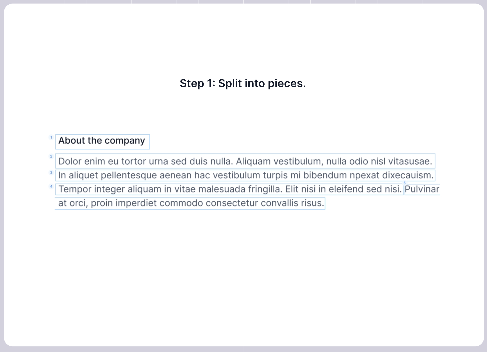

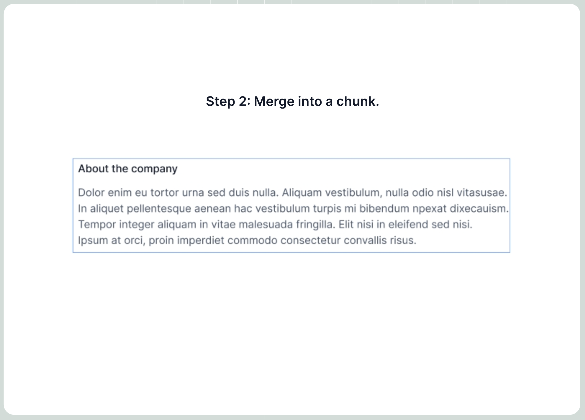

### `Q&A` 分块方法

此分块方法专门用于问答对的处理，支持 Excel、CSV 和 TXT 文件格式：

* 如果文件是 Excel 格式，则应由两列组成，第一列提出问题，第二列提供答案。文件不需要标题行，且支持多个工作表（Sheet）；
* 如果文件是 CSV 和 TXT 格式，必须是 UTF-8 编码且使用制表符（TAB）作为问题和答案的定界符；

> 注意，RAGFlow 在处理问答对文件时将自动忽略不满足上述规则的文本行。

下面是 `Q&A` 分块方法的示例：

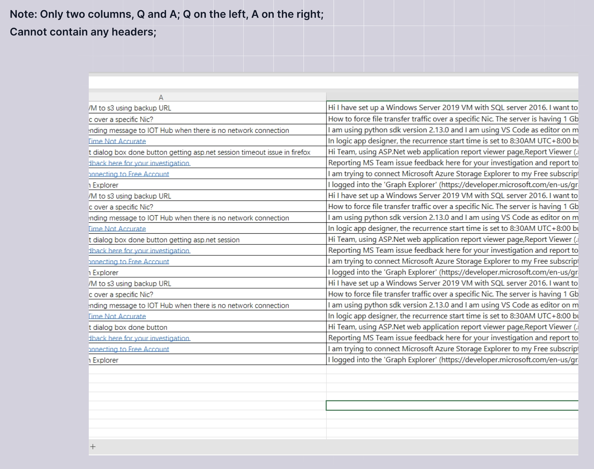

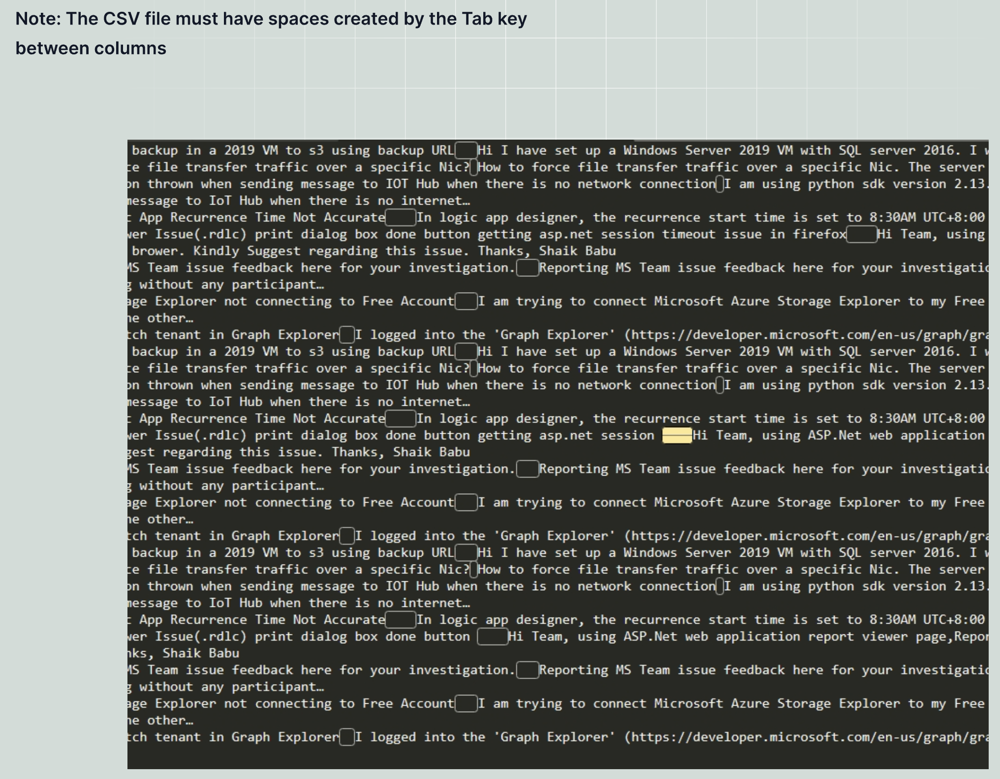

### `Resume` 分块方法

此分块方法专门用于处理简历文件，将各种形式的简历解析并整理成结构化数据，方便招聘人员搜索候选人。支持 DOCX、PDF 和 TXT 格式。


### `Manual` 分块方法

此分块方法专门用于处理手册文件，目前仅支持 PDF 格式。

RAGFlow 在处理手册文件时，假设手册具有分层的章节结构，将最低层级的章节标题作为文档分块的基本单位。因此，同一章节中的图表和表格不会被分开，这可能会导致分块的篇幅更大。

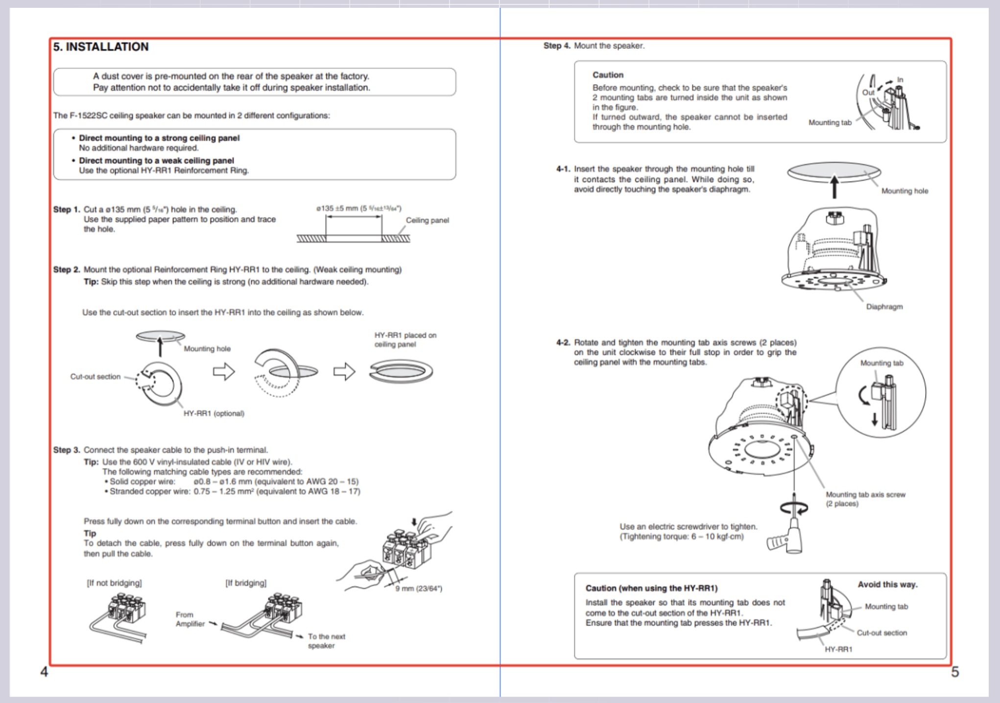

### `Table` 分块方法

此分块方法专门用于处理表格文件，支持 Excel、CSV 和 TXT 格式。

* 表格文件的第一行必须包含列标题；
* 列标题必须是有意义的术语，便于大模型理解；可以将同义词用斜线 `/` 隔开，比如 `分块方法/切片方法`；并使用括号列出所有的枚举值，例如：`性别（男，女）`、`颜色（黄，蓝，棕）`、`尺寸（M，L，XL，XXL）` 等；
* 如果是 CSV 或 TXT 格式，列与列之间的分隔符必须是制表符（TAB）；

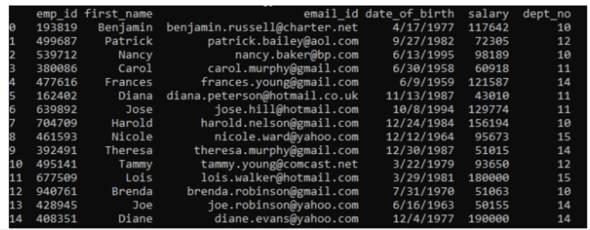

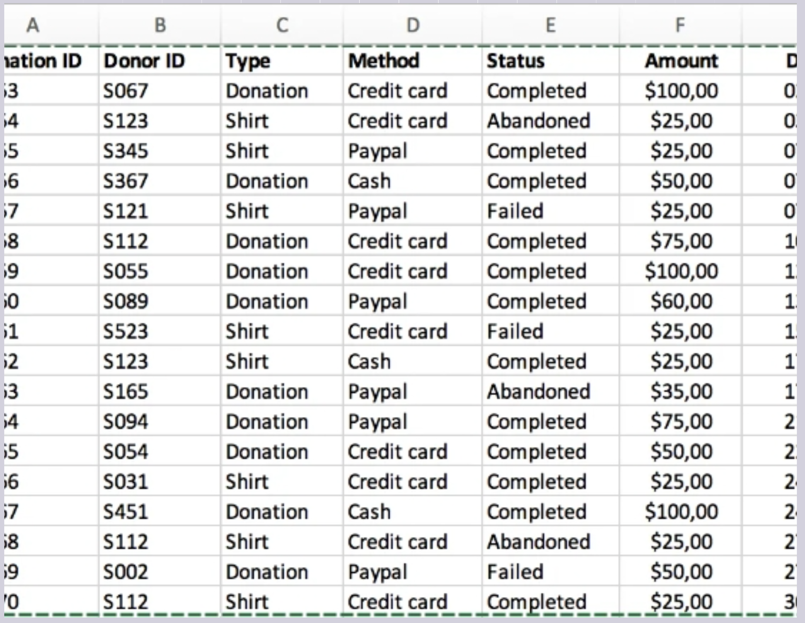

### `Paper` 分块方法

此分块方法专门用于处理论文文件，目前仅支持 PDF 格式。

论文将按章节进行分块，例如 `摘要`、`1.1 节`、`1.2 节` 等部分。这种方法使大模型能够更有效地总结论文，并提供更全面、易于理解的回答。然而，它也增加了对话的上下文，进而增加了大模型的计算成本。因此，在对话过程中，可考虑降低 `topN` 的值。

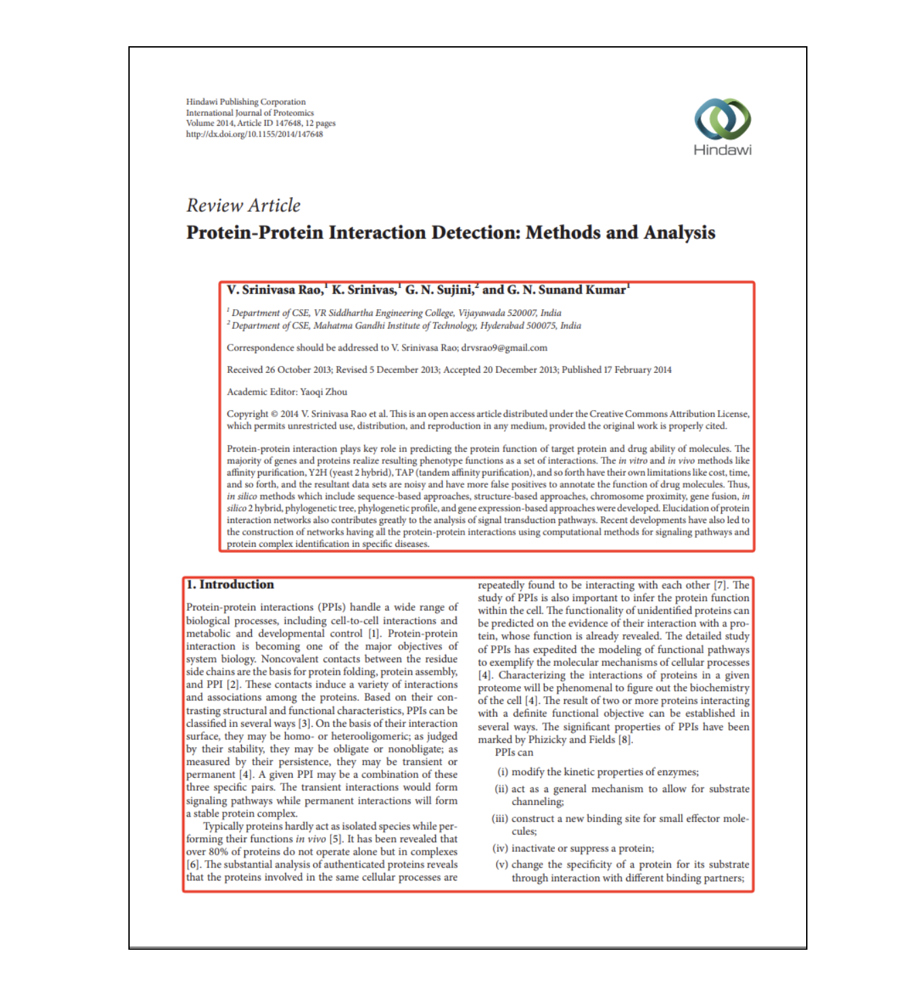

### `Book` 分块方法

此分块方法专门用于处理书籍文件，支持 DOCX、PDF 和 TXT 格式。对于 PDF 格式的书，请设置页面范围，以去除不必要的信息并缩短分析时间。

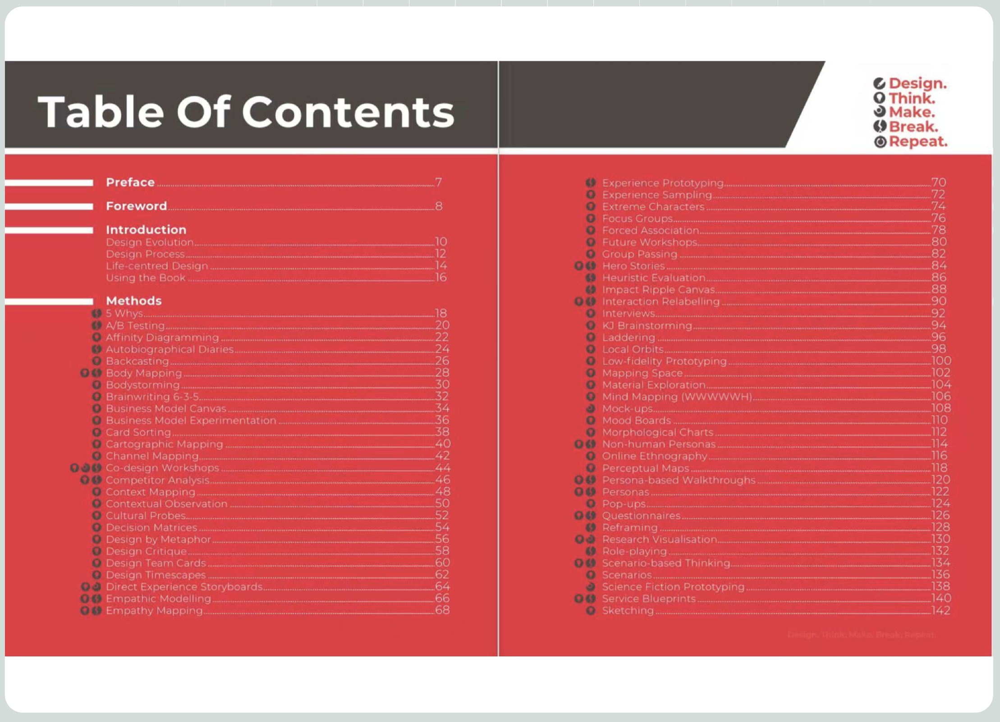

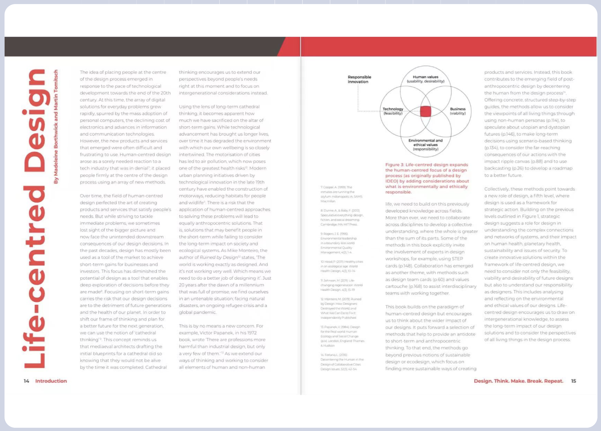

### `Laws` 分块方法

此分块方法专门用于处理法律文书，支持 DOCX、PDF 和 TXT 格式。

在法律文书（如合同、宪法、国际条约、公司章程等）中，常常按 `篇（Part）` - `章（Chapter）` - `节（Section）` - `条（Article）` - `款（Paragraph）` - `项（Subparagraph）` 这样的层级划分内容。其中 `条（Article）` 是构成法律文书的基本结构单元，它用于对特定主题或事项进行分点阐述，具有明确的逻辑层级和法律效力。例如《联合国宪章》中的 `“Article 51”（第五十一条）` 或者合同中的 `“Article 3: Payment Terms”（第三条：付款条款）`。

RAGFlow 在处理法律文书时，将 `条（Article）` 作为分块的基本单位，确保所有上层文本都包含在该块中。

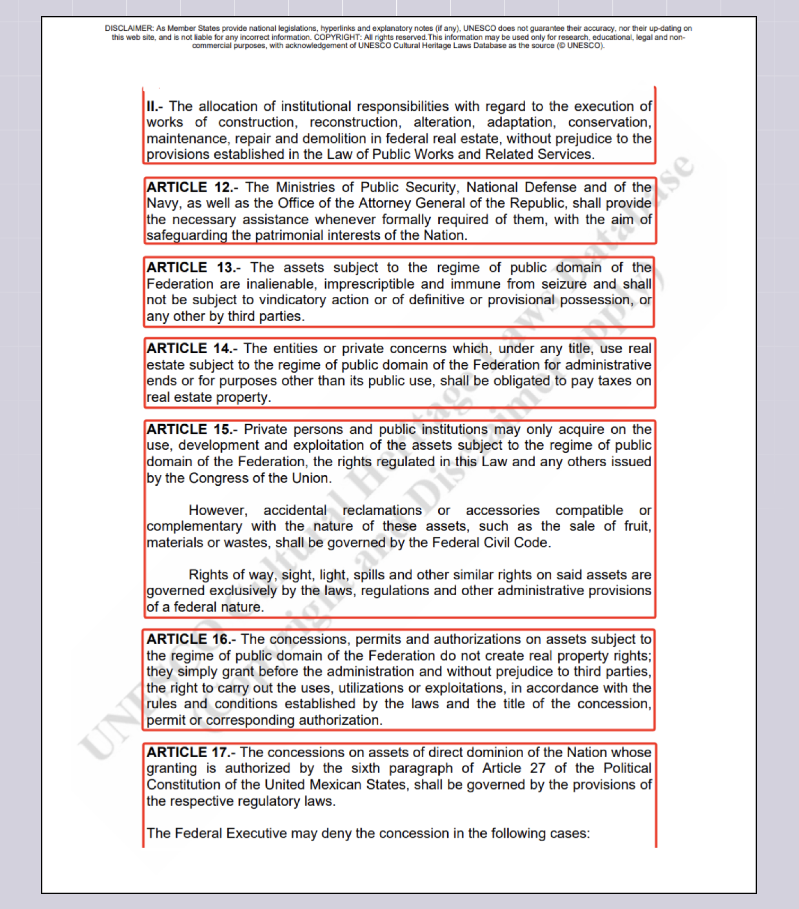

### `Presentation` 分块方法

此方法专门用于处理幻灯片文件，支持 PDF 和 PPTX 格式。

* 幻灯片的每一页都被视为一个分块，并存储其缩略图；
* 此分块方法会自动应用于所有上传的 PPT 文件，因此对于 PPT 文件来说无需手动指定；

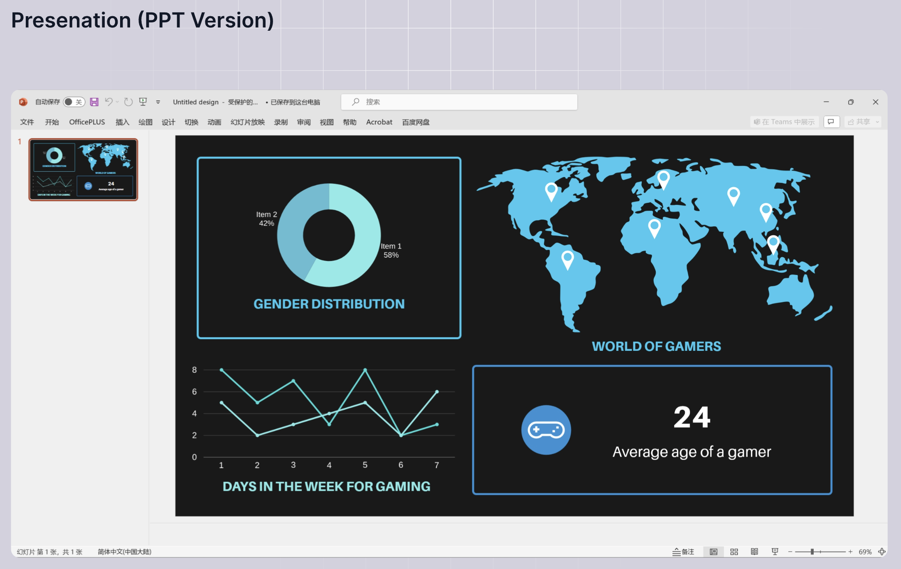

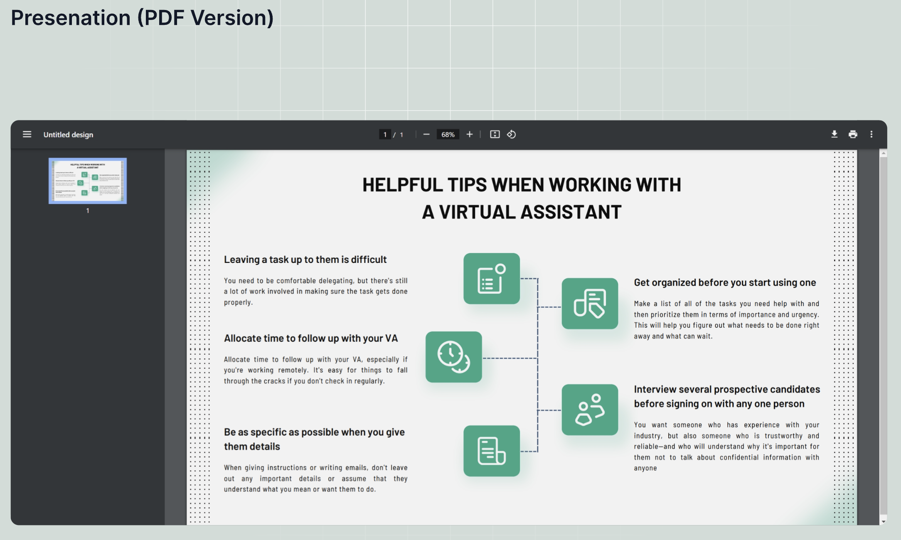

### `One` 分块方法

此分块方法将每个文档整体视为一个分块，当需要使用大模型对整个文档进行总结，且模型能够处理该上下文长度时适用。支持的文件格式包括 DOCX、XLSX、XLS、PDF、TXT 等。

### `Tag` 分块方法

这是一种特殊的知识库配置，使用 `Tag` 作为分块方法的知识库不会参与 RAG 流程，而是充当标签集的角色。其他知识库可以使用它来标记自己的分块，对这些知识库的查询也将使用此标签集进行标记。

此知识库中的每个分块都是一个独立的 `描述 - 标签` 对，支持 Excel、CSV 和 TXT 文件格式。

* 如果文件是 Excel 格式，它应包含两列：第一列用于标签描述，第二列用于标签名称；和 `Q&A` 分块方法一样，文件不需要标题行，且支持多个工作表（Sheet）；
* 如果文件是 CSV 和 TXT 格式，必须采用 UTF-8 编码，且使用制表符（TAB）作为分隔符来分隔描述和标签；
* 在标签列中可以包含多个标签，使用逗号分隔；

不符合上述规则的文本行将被忽略。

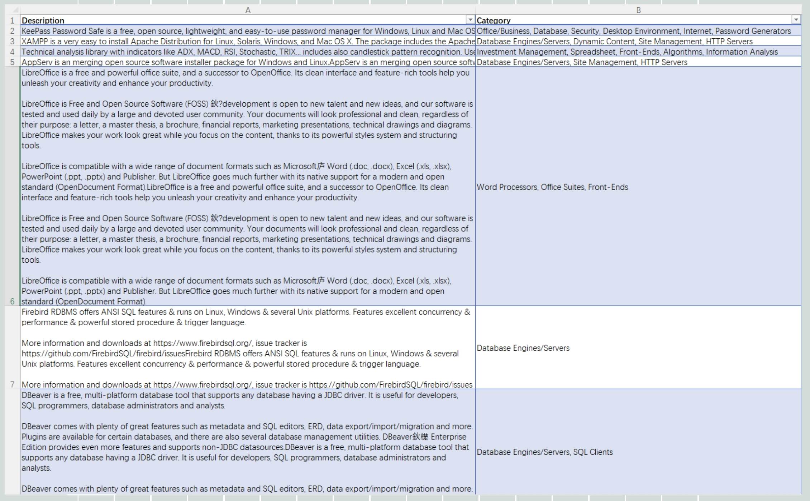

标签集构建完成后，可以在页面下方看到类似这样的标签云：

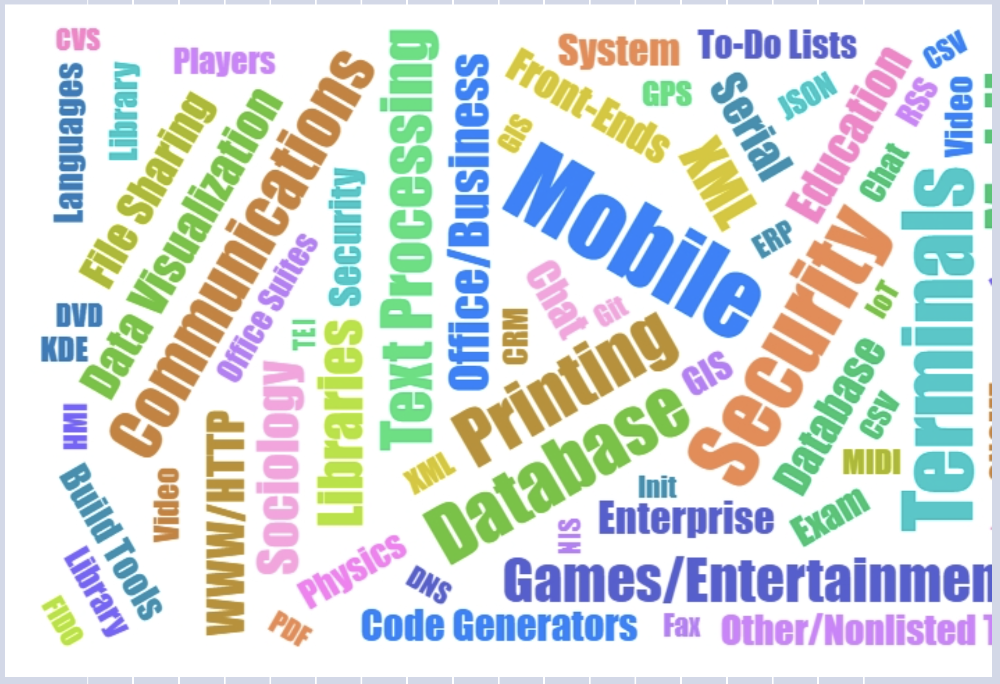

关于标签集的用法，我们会在后面专门的文章中进行介绍，可以把它视作一种检索优化的手段，而不是分块方法。

## 其他配置参数

除了分块方法，知识库配置页面还提供了一些其他参数，包括：

* `PDF 解析器（layout_recognize）` - 基于 PDF 布局分析的可视化模型，有效地定位文档标题、文本块、图像和表格；支持 `DeepDoc` 和 `Native` 两种方式；如果选择 `Native` 选项，将仅检索 PDF 中的纯文本；目前最新版本中还有个实验特性，使用大模型的多模态能力实现该功能；此选项仅适用于 PDF 文档；
* `建议文本块大小（chunk_token_num）` - 推荐的分块大小，如果一个片段的令牌数少于此阈值，它将与后续片段合并，直到令牌总数超过该阈值，此时才会创建一个分块。除非遇到分隔符，否则即使超过阈值也不会创建新的分块；
* `文本分段标识符（delimiter）` - 分隔符或分隔标识可以由一个或多个特殊字符组成。如果是多个字符，确保它们用反引号（\`\`）括起来。例如，如果你像这样配置分隔符：\`\n\`##\`;`，那么你的文本将在行尾、双井号（##）和分号处进行分隔；
* `嵌入模型（embd_id）` - 知识库的默认嵌入模型。一旦知识库有了分块，该选择就无法更改。要切换不同的嵌入模型，必须删除知识库中所有现有的分块；

除此之外，还有一些高级配置，比如：

* `页面排名（pagerank）` - 你可以为特定的知识库分配更高的 PageRank 分数，这个分数会加到从这些知识库检索到的文本块的混合相似度分数上，从而提高它们的排名；
* `自动关键词提取（auto_keywords）` - 自动为每个文本块提取 N 个关键词，以提高包含这些关键词的查询的排名，可以在文本块列表中查看或更新为某个文本块添加的关键词；
* `自动问题提取（auto_questions）` - 自动为每个文本块提取 N 个问题，以提高包含这些问题的查询的排名，可以在文本块列表中查看或更新为某个文本块添加的问题；
* `表格转 HTML（html4excel）` - 与 `General` 分块方法一起使用。禁用时，知识库中的电子表格将被解析为键值对；而启用时，它们将被解析为 HTML 表格，按照每 12 行进行拆分；
* `标签集` - 选择一个或多个标签知识库，以自动为你的知识库中的分块添加标签；用户查询也将自动添加标签；自动添加标签与自动提取关键词之间的区别：标签知识库是用户定义的封闭集合，而由大模型提取的关键词可被视为开放集合；在运行自动添加标签功能之前，你必须手动上传指定格式的标签集；而自动提取关键词功能依赖于大语言模型，并且会消耗大量的令牌； 

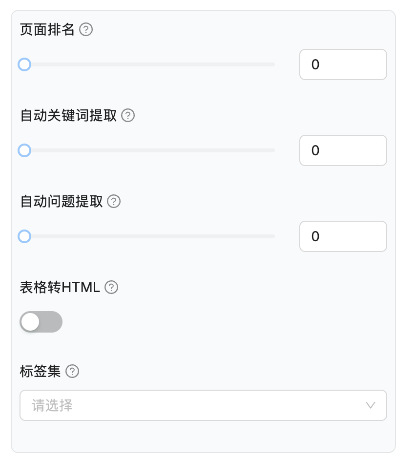

* `使用召回增强 RAPTOR 策略（use_raptor）` - 为多跳问答任务启用 RAPTOR 提高召回效果；

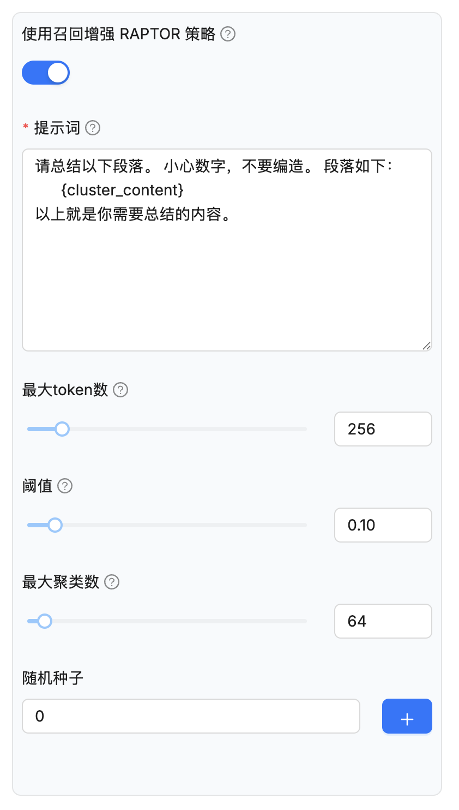

* `提取知识图谱（use_graphrag）` - 在当前知识库的文件块上构建知识图谱，以增强涉及嵌套逻辑的多跳问答；

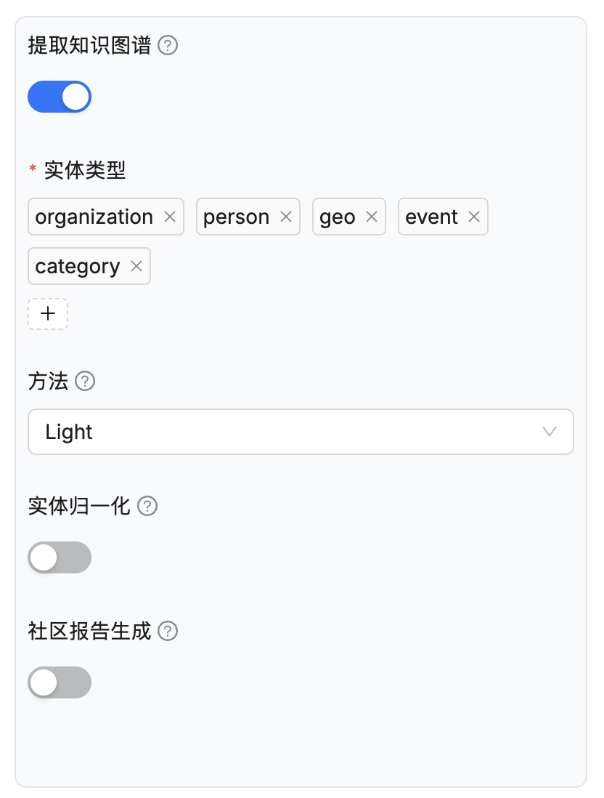

## 小结

今天我们详细学习了 RAGFlow 的知识库配置。我们首先分析了任务消息的结构，然后重点探讨了 RAGFlow 提供的多种切片方法，如 `General`、`Q&A`、`Table` 和 `Paper` 等，并了解了如何根据不同的文档类型选择最合适的配置。此外，我们还介绍了 PDF 解析器、分块大小、嵌入模型以及 PageRank、RAPTOR 等高级设置。

了解这些配置是掌握 RAGFlow 的关键一步。在下一篇文章中，我们将深入 `do_handle_task()` 函数的实现，揭示 RAGFlow 是如何根据这些配置来具体执行文件解析任务的。
