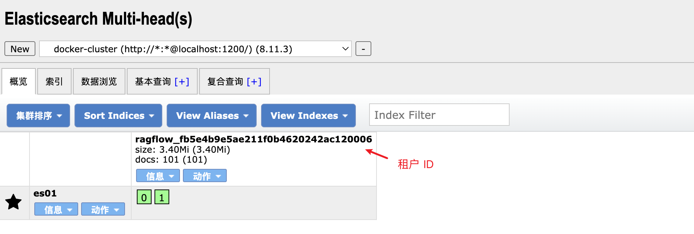
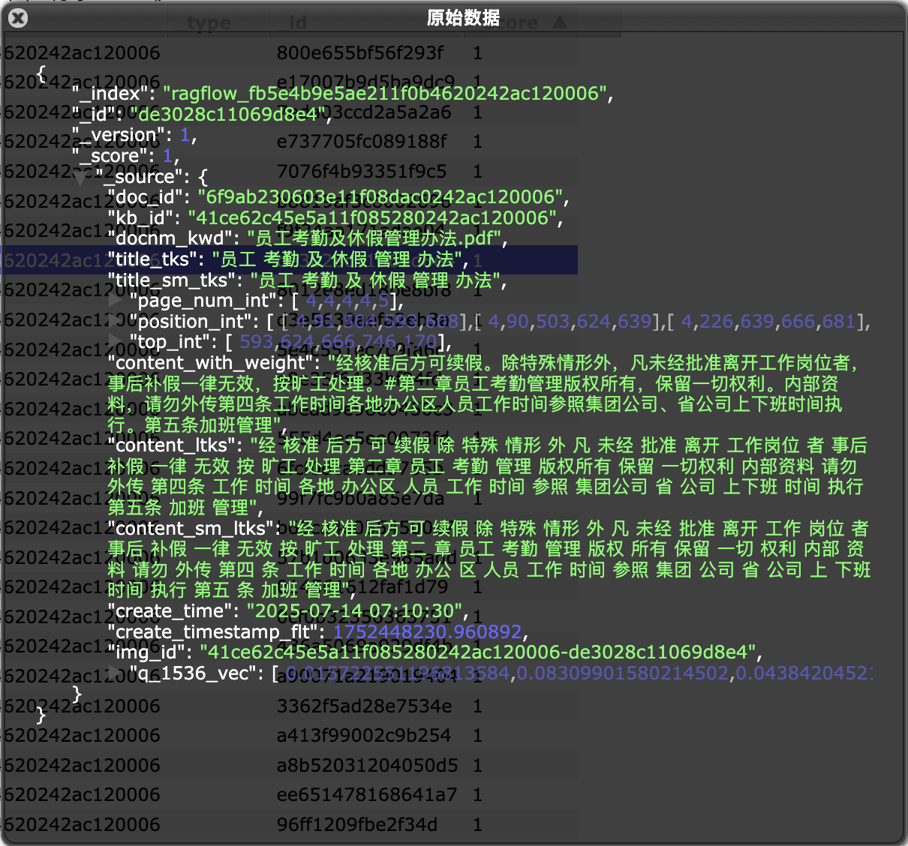
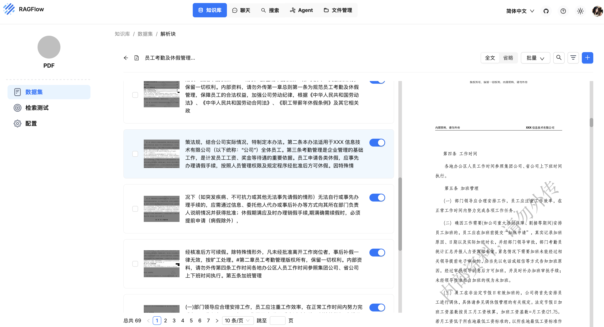

# 再学 RAGFlow 的文件解析逻辑

经过几天的学习，我们了解了 RAGFlow 的文件上传和解析流程，了解了解析任务是如何触发并放入 Redis Stream 消息队列中，等待任务执行器消费和处理的。今天我们将继续学习任务执行器中最重要的函数 `do_handle_task()` 的实现，看看 RAGFlow 是如何具体执行每个解析任务的。

## `do_handle_task` 函数实现

`do_handle_task` 是 RAGFlow 系统中的任务处理函数，负责处理文档解析、分块、向量化和索引的完整流程。它的主要逻辑如下：

1. 判断任务是否被取消，如果是，则直接返回；
2. 根据任务配置绑定对应的嵌入模型，用于后续的向量化处理；
3. 根据嵌入模型的向量维度，初始化知识库索引结构；
4. 根据任务类型执行不同的处理流程：
   - 如果是 RAPTOR 类型的任务，则执行递归抽象处理；
   - 如果是 GraphRAG 类型的任务，则执行知识图谱构建；
   - 如果是标准分块类型的任务，则执行普通分块处理；
5. 批量插入分块数据到知识库索引中；
6. 更新文档统计信息，包括分块数量、token 数量等；

下面是 `do_handle_task` 函数的核心实现：

```python
async def do_handle_task(task):

  # 过程回调，用于报告进度
  progress_callback = partial(set_progress, task_id, task_from_page, task_to_page)

  # 判断任务是否已取消
  task_canceled = TaskService.do_cancel(task_id)
  if task_canceled:
    progress_callback(-1, msg="Task has been canceled.")
    return

  # 绑定嵌入模型
  embedding_model = LLMBundle(task_tenant_id, LLMType.EMBEDDING, llm_name=task_embedding_id, lang=task_language)
  vts, _ = embedding_model.encode(["ok"])
  vector_size = len(vts[0])

  # 初始化知识库
  init_kb(task, vector_size)

  if task.get("task_type", "") == "raptor":
    # 使用 RAPTOR 分块策略
  elif task.get("task_type", "") == "graphrag":
    # 使用 GraphRAG 分块策略
  else:
    # 使用标准分块策略
    chunks = await build_chunks(task, progress_callback)
    # 计算每个分块的向量
    token_count, vector_size = await embedding(chunks, embedding_model, task_parser_config, progress_callback)

  # 批量插入分块数据
  for b in range(0, len(chunks), DOC_BULK_SIZE):
    doc_store_result = await trio.to_thread.run_sync(
      lambda: settings.docStoreConn.insert(
        chunks[b:b + DOC_BULK_SIZE], search.index_name(task_tenant_id), task_dataset_id))

  # 更新文档统计信息
  DocumentService.increment_chunk_num(task_doc_id, task_dataset_id, token_count, chunk_count, 0)
```

上面的代码中有几个需要注意的点，值得展开来学习下。

## 了解偏函数

```python
progress_callback = partial(set_progress, task_id, task_from_page, task_to_page)
```

这段代码使用了 Python 中的 **偏函数（Partial Function）**，一个比较冷门但有点意思的功能。偏函数是一种特殊的函数，它通过固定原函数的某些参数，从而创建出一个新的函数。偏函数的创建主要通过 `functools.partial` 实现，下面是一个简单的示例，固定加法函数的一个参数：

```python
from functools import partial

# 定义一个加法函数
def add(a, b):
    return a + b

# 创建一个偏函数，固定 a=10
add_ten = partial(add, 10)

# 调用偏函数
print(add_ten(5))  # 输出 15 (相当于 10 + 5)
print(add_ten(10)) # 输出 20 (相当于 10 + 10)
```

回到前面的代码片段，我们使用偏函数创建了一个新的回调函数 `progress_callback`，它固定了 `set_progress` 函数的前三个参数：`task_id`、`task_from_page` 和 `task_to_page`。当后续调用 `progress_callback` 时，只需提供剩余的参数（如进度值和错误消息）即可：

```python
progress_callback(50, msg="Processing...")

progress_callback(-1, msg="Error occurred")
```

这种方式的好处是，在多次调用 `progress_callback` 时，不需要重复传递某些固定参数，减少函数调用时需要提供的参数数量。在 `do_handle_task()` 函数的实现中，会大量的调用 `progress_callback` 汇报任务进度，通过偏函数，可以让代码更加简洁和灵活，提高了代码的可读性和可维护性。

## 绑定嵌入模型

```python
embedding_model = LLMBundle(task_tenant_id, LLMType.EMBEDDING, llm_name=task_embedding_id, lang=task_language)
vts, _ = embedding_model.encode(["ok"])
vector_size = len(vts[0])
```

RAGFlow 通过 `LLMBundle` 将所有大模型的操作统一封装在一个类里，方便使用。比如通过 `LLMBundle.encode()` 方法调用嵌入模型，`LLMBundle.chat()` 方法调用聊天模型，等等。

`LLMType` 枚举了所有支持的模型类型（这也就是我们之前在 “模型供应商” 页面配置的模型类型）：

```python
class LLMType(StrEnum):
  CHAT = 'chat'                # 聊天模型
  EMBEDDING = 'embedding'      # 嵌入模型
  SPEECH2TEXT = 'speech2text'  # 语音转文字
  IMAGE2TEXT = 'image2text'    # 图片转文字
  RERANK = 'rerank'            # 排序模型
  TTS    = 'tts'               # 文字转语音
```

这里创建的 `embedding_model` 是一个嵌入模型，它的具体实现位于 `rag/llm/embedding_model.py` 文件，该文件定义了大量的嵌入模型实现，包括：

* OpenAI 系列
  - OpenAI - text-embedding-ada-002 / text-embedding-3-large (OpenAIEmbed)
  - Azure OpenAI (AzureEmbed)
* 中国厂商
  - 阿里通义千问 - text_embedding_v2 (QWenEmbed)
  - 智谱 AI - embedding-2 / embedding-3 (ZhipuEmbed)
  - 百川智能 - Baichuan-Text-Embedding (BaiChuanEmbed)
  - 百度千帆 (BaiduYiyanEmbed)
* 国外厂商
  - Cohere - embed-multilingual-v3.0 (CoHereEmbed)
  - Mistral - mistral-embed (MistralEmbed)
  - Jina - jina-embeddings-v3 (JinaEmbed)
  - Voyage AI - voyage-large-2 (VoyageEmbed)
  - Gemini - text-embedding-004 (GeminiEmbed)
  - Bedrock - amazon.titan-embed-text-v2:0 / cohere.embed-multilingual-v3 (BedrockEmbed)
* 聚合平台
  - [TogetherAI](https://www.together.ai/) - togethercomputer/m2-bert-80M-8k-retrieval (TogetherAIEmbed)
  - [SiliconFlow](https://siliconflow.cn/) - 硅基流动 (SILICONFLOWEmbed)
  - [VolcEngine](https://www.volcengine.com/) - 火山引擎方舟平台 (VolcEngineEmbed)
  - [PerfXCloud](https://perfxlab.cn/) - 澎峰科技 (PerfXCloudEmbed)
  - [Upstage](https://www.upstage.ai/) - solar-embedding-1-large (UpstageEmbed)
  - [NovitaAI](https://novita.ai/) - 兼容接口 (NovitaEmbed)
  - [GiteeAI](https://ai.gitee.com/) - 码云AI平台 (GiteeEmbed)
  - [Replicate](https://replicate.com/) - 云端推理平台 (ReplicateEmbed)
* 本地部署模型
  - BAAI/bge-large-zh-v1.5 (DefaultEmbedding)
  - BAAI/bge-small-en-v1.5 (FastEmbed)
  - maidalun1020/bce-embedding-base_v1 (YoudaoEmbed)
* 本地部署框架
  - [Ollama](https://ollama.com/) (OllamaEmbed)
  - [LocalAI](https://github.com/mudler/LocalAI) (LocalAIEmbed)
  - [LM-Studio](https://lmstudio.ai/) (LmStudioEmbed)
  - [XInference](https://github.com/xorbitsai/inference) (XinferenceEmbed)
  - [HuggingFace TEI](https://github.com/huggingface/text-embeddings-inference) (HuggingFaceEmbed)
  - [GPUStack](https://github.com/gpustack/gpustack) (GPUStackEmbed)

## 初始化知识库索引

创建嵌入模型实例之后，RAGFlow 通过 `embedding_model.encode(["ok"])` 来验证模型的可用性，同时还能获取到嵌入模型的向量维度信息。接着，它会根据向量维度创建相应的索引库：

```python
init_kb(task, vector_size)
```

`init_kb()` 函数的实现如下：

```python
def init_kb(row, vector_size: int):
  idxnm = search.index_name(row["tenant_id"])
  return settings.docStoreConn.createIdx(idxnm, row.get("kb_id", ""), vector_size)
```

可以看到 RAGFlow 通过 `docStoreConn` 的 `createIdx(tenant_id, kb_id, vector_size)` 创建索引库，其中 `docStoreConn` 表示文档存储引擎，可以通过环境变量 `DOC_ENGINE` 进行切换，目前支持三种：

* [Elasticsearch](https://www.elastic.co/elasticsearch)
* [Infinity](https://infiniflow.org/)
* [OpenSearch](https://opensearch.org/)

RAGFlow 默认使用 Elasticsearch 作为文档存储引擎。另外从 `createIdx` 的三个参数可以看出，RAGFlow 是支持多租户的，不同租户的索引库之间是隔离的。其实，只有 `Infinity` 是根据传入的三个参数创建索引库的，Elasticsearch 和 OpenSearch 则是根据 `tenant_id` 创建索引库的，`kb_id` 和 `vector_size` 对它们来说没有用。



之所以 Elasticsearch 和 OpenSearch 创建索引时不用指定向量维度，是因为 RAGFlow 使用了一种比较讨巧的方法，它将常见的向量维度提前预定义在 Mapping 里了（参考 `conf/mapping.json` 和 `conf/os_mapping.json` 文件）：

```json
{
  "dynamic_templates": [
    {
      "dense_vector": {
        "match": "*_512_vec",
        "mapping": {
          "type": "dense_vector",
          "index": true,
          "similarity": "cosine",
          "dims": 512
        }
      }
    },
    {
      "dense_vector": {
        "match": "*_768_vec",
        "mapping": {
          "type": "dense_vector",
          "index": true,
          "similarity": "cosine",
          "dims": 768
        }
      }
    },
    {
      "dense_vector": {
        "match": "*_1024_vec",
        "mapping": {
          "type": "dense_vector",
          "index": true,
          "similarity": "cosine",
          "dims": 1024
        }
      }
    },
    {
      "dense_vector": {
        "match": "*_1536_vec",
        "mapping": {
          "type": "dense_vector",
          "index": true,
          "similarity": "cosine",
          "dims": 1536
        }
      }
    }
  ]
}
```

如果你的嵌入模型不是 512、768、1024 或 1536 维的，那么在创建索引时可能会报错，需要修改 Mapping 文件来支持新的向量维度。

## 文档分块策略

昨天在学习知识库配置时，我们提到了两个高级配置：

* `使用召回增强 RAPTOR 策略（use_raptor）` - 为多跳问答任务启用 RAPTOR 提高召回效果；
* `提取知识图谱（use_graphrag）` - 在当前知识库的文件块上构建知识图谱，以增强涉及嵌套逻辑的多跳问答；

这两个配置其实对应着 RAGFlow 不同的文档分块策略：

```python
if task.get("task_type", "") == "raptor":
  # 使用 RAPTOR 分块策略
elif task.get("task_type", "") == "graphrag":
  # 使用 GraphRAG 分块策略
else:
  # 使用标准分块策略
  chunks = await build_chunks(task, progress_callback)
  # 计算每个分块的向量
  token_count, vector_size = await embedding(chunks, embedding_model, task_parser_config, progress_callback)
```

关于 RAPTOR 和 GraphRAG 的实现，我们后面再详细学习，今天我们先来学习下标准分块策略的实现。它的核心流程分两步：

* `build_chunks()` - 执行标准文档分块流程
* `embedding()` - 对分块进行向量化处理

其中，`build_chunks()` 函数的实现大致如下：

```python
async def build_chunks(task, progress_callback):

    # 从对象存储中读取文件
    bucket, name = File2DocumentService.get_storage_address(doc_id=task["doc_id"])
    binary = await get_storage_binary(bucket, name)

    # 调用分块器进行分块，通过 chunk_limiter 限制并发路数
    chunker = FACTORY[task["parser_id"].lower()]
    async with chunk_limiter:
        cks = await trio.to_thread.run_sync(lambda: chunker.chunk(...))

    # 将分块结果上传到对象存储
    async with trio.open_nursery() as nursery:
        for ck in cks:
            nursery.start_soon(upload_to_minio, doc, ck)

    return docs
```

它首先根据 `doc_id` 从数据库中查询出桶名和文件名，从对象存储中读取出文件内容；接着使用 `parser_id` 创建对应的分块器，然后调用它的 `chunk()` 方法对文件进行分块；最后将分块结果上传到对象存储。这里的 `parser_id` 我们昨天已经学习过了，它表示切片方法，有 `General`, `Q&A`, `Resume`, `Manual`, `Table`, `Paper`, `Book`, `Laws`, `Presentation`, `One`, `Tag` 共 11 种，对应的分块器实现定义在 `FACTORY` 工厂中：

```python
FACTORY = {
  "general": naive,
  ParserType.NAIVE.value: naive,
  ParserType.PAPER.value: paper,
  ParserType.BOOK.value: book,
  ParserType.PRESENTATION.value: presentation,
  ParserType.MANUAL.value: manual,
  ParserType.LAWS.value: laws,
  ParserType.QA.value: qa,
  ParserType.TABLE.value: table,
  ParserType.RESUME.value: resume,
  ParserType.PICTURE.value: picture,
  ParserType.ONE.value: one,
  ParserType.AUDIO.value: audio,
  ParserType.EMAIL.value: email,
  ParserType.KG.value: naive,
  ParserType.TAG.value: tag
}
```

可以看到 `FACTORY` 工厂中除了上面的 11 种切片方法之外，还多出了 `PICTURE`, `AUDIO` 和 `EMAIL` 三种切片方法，暂时没看到使用，估计 RAGFlow 后面会支持对图片、音频和邮件的处理吧。

不同类型的文件使用不同的切片方法，这是 RAGFlow 的核心优势之一，官方将这种特性称为 **基于模板的文本切片方法（`Template-based chunking`）**；实际上，在实施切片之前，我们还需要将各类文档转换为文本格式，这是基于 RAGFlow 的 [深度文档理解（`DeepDoc`）](https://github.com/infiniflow/ragflow/blob/main/deepdoc/README.md) 技术实现的；`DeepDoc` 支持广泛的文件格式，能够处理各类复杂文档的布局和结构，确保从 PDF、Word、PPT 等文件中提取高质量、有价值的信息。

## 对分块进行向量化处理

通过调用 `build_chunks()` 方法，我们根据知识库配置，将文档切分成了一个个的分块数据，接着调用 `embedding()` 对分块进行向量化处理：

```python
async def embedding(docs, mdl, parser_config=None, callback=None):

    # 准备标题和内容数据
    tts, cnts = [], []
    for d in docs:
        tts.append(d.get("docnm_kwd", "Title"))
        cnts.append(d["content_with_weight"])

    # 计算标题的向量（只计算第一个标题，然后复制到所有文档，这里的 docs 属于同一个文档，因此文件名是一样的）
    tk_count = 0
    if len(tts) == len(cnts):
        vts, c = await trio.to_thread.run_sync(
            lambda: mdl.encode(tts[0: 1]))
        tts = np.concatenate([vts for _ in range(len(tts))], axis=0)
        tk_count += c

    # 计算内容的向量（按批生成）
    cnts_ = np.array([])
    for i in range(0, len(cnts), EMBEDDING_BATCH_SIZE):
        vts, c = await trio.to_thread.run_sync(
            lambda: mdl.encode([truncate(c, mdl.max_length-10) for c in cnts[i: i + EMBEDDING_BATCH_SIZE]]))
        if len(cnts_) == 0:
            cnts_ = vts
        else:
            cnts_ = np.concatenate((cnts_, vts), axis=0)
        tk_count += c

    # 加权融合标题和内容向量
    cnts = cnts_
    filename_embd_weight = parser_config.get("filename_embd_weight", 0.1)
    title_w = float(filename_embd_weight)
    vects = (title_w * tts + (1 - title_w) * cnts) if len(tts) == len(cnts) else cnts

    # 将向量添加到每个文档中
    vector_size = 0
    for i, d in enumerate(docs):
        v = vects[i].tolist()
        vector_size = len(v)
        d["q_%d_vec" % len(v)] = v
    return tk_count, vector_size
```

这里有一个点值得注意，RAGFlow 在计算分块向量时综合考虑了标题（也就是文件名）和内容的，通过加权将标题和内容的向量进行融合，标题的权重默认为 0.1，内容的权重为 0.9，可以通过 `filename_embd_weight` 参数进行调整。最后计算出的向量会添加到每个文档的 `q_N_vec` 字段中，其中 `N` 表示向量的维度。

至此，我们就得到了文档的分块以及每个分块的向量，在 `do_handle_task` 函数的最后，通过批量插入将分块数据写入到知识库索引中。下面是写入到 ES 索引库中的一个分块示例：



也可以点击知识库中的文件名称，对文件的分块数据进行浏览和编辑：



## 小结

今天我们详细学习了 RAGFlow 的文件解析逻辑，将任务执行器中的 `do_handle_task()` 函数从头到尾梳理了一遍，从任务进度的汇报，嵌入模型的选择，索引库的构建，到根据文档类型选择合适的文档分块策略，再到对分块后的内容进行向量化处理，到最后的批量写入。相信通过整个过程的学习，你对 RAGFlow 的文件解析逻辑已经有了更深入的了解，并对 RAGFlow 的工作原理有了更直观的感受。

不过，这里还有很多技术细节没有展开，比如 RAGFlow 是如何使用 `DeepDoc` 技术深度理解和解析文档的，它使用的 `RAPTOR` 分块策略是什么，它又是如何使用 `GraphRAG` 构建知识图谱的。还有昨天学习的一些高级配置参数也值得进一步研究，比如自动提取关键字，自动生成问题，标签集的构建和使用，等等。我们明天继续学习。
