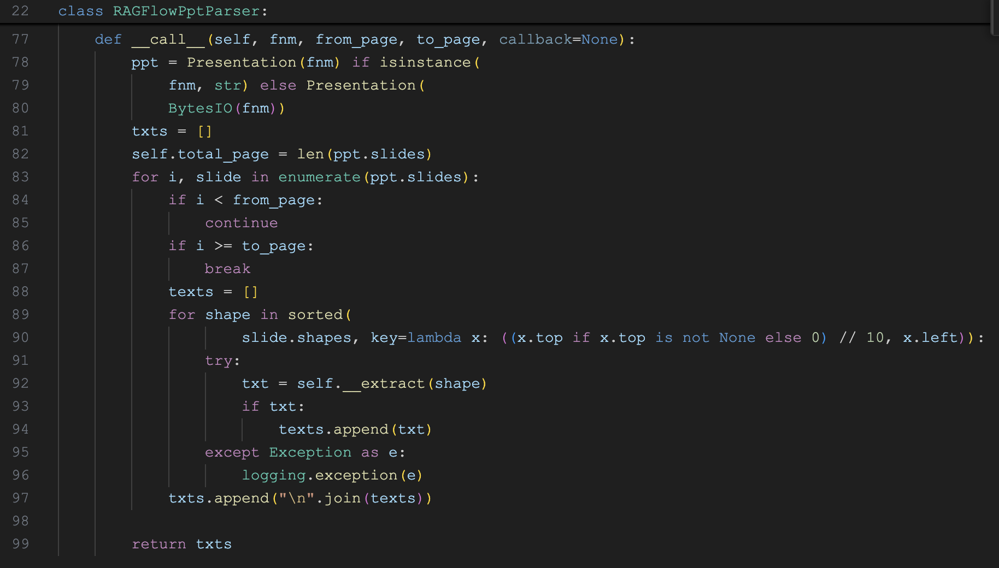

# 学习 RAGFlow 的 DeepDoc 技术之解析器

我们昨天将任务执行器中的 `do_handle_task()` 函数从头到尾梳理了一遍，详细学习了 RAGFlow 的文件解析和分块逻辑。其中还遗漏了一些关键技术点，包括 `DeepDoc` 深度解析文档、`RAPTOR` 分块策略、`GraphRAG` 构建知识图谱，以及自动提取关键字、自动生成问题、标签集的构建和使用等高级配置。让我们一样一样来，先从 `DeepDoc` 技术学起。

在知识库的配置页面，当我们选择与 PDF 兼容的切片方法时，比如 `General`、`Manual`、`Paper`、`Book`、`Laws`、`Presentation` 和 `One` 这几个，会出现 PDF 解析器下拉菜单：


默认支持 `DeepDoc` 和 `Native` 两种方式：

* `DeepDoc` - 基于 OCR、表格识别、布局分析等视觉模型，深度分析 PDF 文档，有效地提取文档标题、文本块、图像和表格等内容；
* `Native` - 仅提取 PDF 中的纯文本内容；当用户的 PDF 仅包含纯文本时，可以选择该选项，从而减少整体解析时间；

目前最新版本中还有个实验特性，如果用户配置了第三方视觉模型（也就是之前配置的 Img2txt 模型），也可以使用这些视觉模型来做 PDF 解析。


我们重点关注 `DeepDoc` 方式，因为这是 RAGFlow 的默认方式，也是最强大的方式。

> 注意 `DeepDoc` 选项暂时不适用于 Word 文档，若要使用该功能，可以将 Word 文档转换为 PDF 格式。

## `DeepDoc` 简介

`DeepDoc` 是 RAGFlow 的核心特性之一，可以对来自不同领域、具有不同格式和不同检索要求的文档进行深度分析，它负责将各类复杂文档转换为结构化的文本格式，为后续的分块和向量化处理打下基础。从 v0.17.0 版本开始，RAGFlow 将数据提取任务与分块方法解耦，成为两个独立的模块。这种解耦的设计具有更高的灵活性，支持更深层次的定制，以适应更复杂的用例。用户能够自主选择适合的视觉模型，在速度和性能之间取得平衡，以满足具体的用例需求。

分块的逻辑位于 `rag/app` 目录：

```
$ tree rag/app
rag/app
├── __init__.py
├── audio.py
├── book.py
├── email.py
├── laws.py
├── manual.py
├── naive.py
├── one.py
├── paper.py
├── picture.py
├── presentation.py
├── qa.py
├── resume.py
├── table.py
└── tag.py
```

这些文件就对应我们之前学习过的十四种不同的 **分块器（Chunker）**，RAGFlow 会根据不同的文档类型使用不同的分块器，对分块逻辑感兴趣的朋友可以研究下这里的代码。有很多分块器依赖于 `DeepDoc` 来解析文档，`DeepDoc` 的逻辑位于 `deepdoc` 目录：

```
$ tree deepdoc
deepdoc
├── __init__.py
├── parser
│   └── ...
└── vision
    ├── layout_recognizer.py
    ├── ocr.py
    └── table_structure_recognizer.py
```

从目录结构可以看出，`DeepDoc` 由两个部分组成：**解析器（parser）** 和 **视觉处理（vision）**，解析器提供了不同格式文档的通用解析方法，供分块器使用；而视觉处理部分则提供了 OCR、表格识别、布局分析等高级特性，可以对 PDF 和 图片等文件实现更好的识别效果。分块器、解析器和视觉处理这三者之间的关系如下：


## 解析器概览

今天我们主要关注 `DeepDoc` 的解析器部分，视觉处理部分我们放到下一篇文章中学习。

```
$ tree deepdoc/parser
deepdoc/parser
├── __init__.py
├── docx_parser.py
├── excel_parser.py
├── figure_parser.py
├── html_parser.py
├── json_parser.py
├── markdown_parser.py
├── pdf_parser.py
├── ppt_parser.py
├── resume
│   ├── step_one.py
│   └── step_two.py
├── txt_parser.py
└── utils.py
```

从 `deepdoc/parser` 目录下的文件可以看到，`DeepDoc` 内置了 10 种不同的解析器，支持 Word、Excel、PPT、PDF、HTML、Markdown、JSON、图片等文件的处理和解析；此外，由于简历是一种非常复杂的文档，包含各种格式的非结构化文本，可以被解析为包含近百个字段的结构化数据，RAGFlow 还内置了一个专门的简历解析器。

### DOCX 解析器

DOCX 解析器的实现类为 `RAGFlowDocxParser`，代码如下：


它使用 [python-docx](https://github.com/python-openxml/python-docx) 读取 `docx` 文件，将其解析为结构化的文本和表格数据，主要包括两个部分：

* 段落解析：遍历每个 `paragraph` 和 `run`（在 `python-docx` 中，`paragraph` 表示段落，`run` 表示具有相同样式的一段连续文本，它是段落的更细分单位）；提取出文本和样式信息，格式为 `(text, style_name)`；
* 表格解析：遍历每个 `table` 的 `rows` 和 `cells`，然后将表格转换为 pandas 的 `DataFrame` 对象；使用了一些规则来识别表头和数据类型，然后按"表头: 内容"的格式返回组织好的表格数据，比如 `表头1:内容;表头2:内容;...`；

> 注意它只对 `docx` 文件生效，对于 `doc` 文件，在分块器代码里可以看到使用 [tika](https://github.com/chrismattmann/tika-python) 来读取，目前这个并没有放到解析器里。

假设 `docx` 文件中含有如下段落内容：


解析后的 `secs` 如下：

```
[
  ('标题一', 'Heading 1'), 
  ('这里是第一段正文。', 'Normal'), 
  ('标题二', 'Heading 1'), 
  ('这里是第二段正文。', 'Normal')
]
```

假设 `docx` 文件中含有如下表格内容：


解析后的 `tbls` 如下：

```
[
  [
    '姓名: 张三;学号: 001;年龄: 18;性别: 男;成绩: 100',
    '姓名: 李四;学号: 002;年龄: 19;性别: 女;成绩: 99',
    '姓名: 王五;学号: 003;年龄: 20;性别: 男;成绩: 98'
  ]
]
```

### Excel 解析器

Excel 解析器的实现类为 `RAGFlowExcelParser`，代码如下：


它的实现比较简单，首先通过 `_load_excel_to_workbook()` 方法将 Excel 文件加载为 `Workbook` 对象，然后遍历每个 `Worksheet` 的表格数据，将其转换为类似上面 Word 表格解析后的格式，方便后续文本向量化处理。

解析器支持自动识别 Excel 或 CSV 格式：

```python
if not (file_head.startswith(b'PK\x03\x04') or file_head.startswith(b'\xD0\xCF\x11\xE0')):
  
  # 不是 Excel 文件
  df = pd.read_csv(file_like_object)
  return RAGFlowExcelParser._dataframe_to_workbook(df)

return load_workbook(file_like_object,data_only= True)
```

它通过文件头检测技术判断文件是否为 Excel 文件，如果前 4 字节是 `PK\x03\x04` 表示是 XLSX 文件，如果是 `\xD0\xCF\x11\xE0` 表示是旧版 XLS 文件；对于 Excel 文件，程序使用 [openpyxl](https://openpyxl.readthedocs.io/) 的 `load_workbook` 来读取；对于 CSV 文件，则使用 pandas 的 `read_csv` 来读取，然后调用 `_dataframe_to_workbook()` 方法将其转换为 `Workbook` 对象，便于后续的统一处理。

### PPT 解析器

PPT 解析器的实现类为 `RAGFlowPptParser`，代码如下：



它使用 [python-pptx](https://python-pptx.readthedocs.io/) 来读取 PPT 文件，通过遍历幻灯片中的所有形状，提取出所有的纯文本数据。**形状（Shape）** 是 PPT 文件中的一个重要概念，包含各种类型的元素：文本框、图片、表格、图表、图形、组合形状等。函数 `__extract(shape)` 从形状中提取内容，核心逻辑如下：

- 文本框：提取段落文本，保留项目符号和缩进结构
- 表格：转换为键值对格式（第一行作为表头）
- 组合形状：按位置顺序递归处理内部的所有形状
- 其他：返回空字符串

这里有一个细节，程序在遍历形状时，会按垂直位置和水平位置排序，确保文本顺序符合视觉阅读顺序。

## 未完待续

今天我们学习了 RAGFlow 的 `DeepDoc` 技术，它由解析器和视觉处理两部分组成，将各类复杂文档转换为结构化的文本数据，为分块和向量化打下基础。我们详细学习了其中的 3 种解析器，包括：DOCX 解析器、Excel 解析器 和 PPT 解析器。

今天的内容就这么多，我们将在下一篇继续学习剩下的解析器。
