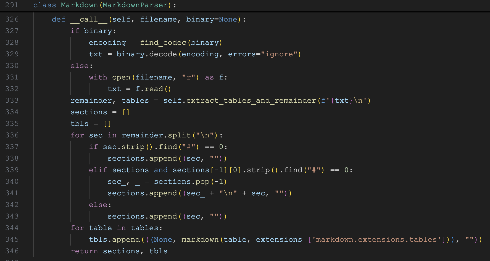

# 学习 RAGFlow 的 DeepDoc 技术之解析器（二）

在上一篇文章中，我们学习了 RAGFlow 的 `DeepDoc` 技术，并对 `DeepDoc` 的 10 大解析器做了个概览，目前我们已经学习了其中的 3 种解析器，包括：DOCX 解析器、Excel 解析器 和 PPT 解析器。今天我们继续学习剩下的解析器。

## TXT 解析器

TXT 解析器的实现类为 `RAGFlowTxtParser`，代码如下：


它通过 `get_text()` 直接读取文本，并使用 `parser_txt()` 对文本进行分块处理，默认分块大小为 128，分隔符为 `"\n!?;。；！？"`。具体的分块逻辑如下：

* 从 `delimiter` 中提取出所有的分割符；支持多字符分隔符，确保用反引号（\`\`）把它们括起来；比如 \`\n\`##\`;`，表示在行尾、双井号（##）和分号处进行分隔；
* 使用 `|` 将所有的分割符拼接（这是一个合法的正则表达式），并使用 `re.split()` 对原文本进行分割得到 `secs` 数组；
* 遍历 `secs` 数组，如果数据和分隔符一样，忽略之，否则加入分块；这一点感觉有点粗暴，比如 `hello!world!` 分块后的结果为 `helloworld`，分割符号会丢掉；
* 使用 [tiktoken](https://github.com/openai/tiktoken) 的 `cl100k_base` 编码器计算分块的 token 数量，如果没有超过 `chunk_token_num`，则进行合并，最终得到 `cks` 数组；

注意解析器最后返回的 `[[c, ""] for c in cks]` 格式，这个 `[c, ""]` 是为了统一不同解析器的返回，第一个元素表示文本内容，第二个元素表示位置信息或其他元数据。可以在 `native` 分块器代码里看到其他的解析器的处理：


> 吐槽一句，RAGFlow 中解析器返回的格式有点乱，有的是在解析器里返回这个格式，有的是在分块器中拼这个格式。

## HTML 解析器

HTML 解析器的实现类为 `RAGFlowHtmlParser`，代码如下：


这个解析器的实现比较简单，直接使用 [readability-lxml](https://pypi.org/project/readability-lxml/) 和 [html-text](https://pypi.org/project/html-text/) 两个库来读取 HTML 标题和内容，最后返回使用换行符分割后的数组。

> 可以看到，这个返回格式和 TXT 解析器就不一样，因此要在分块器中进行适配。

这里比较有意思的是它对 HTML 文件编码的处理，我们可以参考下，使用 `chardet` 来检测文件编码：

```python
import chardet

all_codecs = [
  'utf-8', 'gb2312', 'gbk', 'utf_16', 'ascii', 'big5', 'big5hkscs',
  # 这里省略一堆编码 ...
]

def find_codec(blob):
  detected = chardet.detect(blob[:1024])
  if detected['confidence'] > 0.5:
    if detected['encoding'] == "ascii":
      return "utf-8"

  for c in all_codecs:
    try:
      blob[:1024].decode(c)
      return c
    except Exception:
      pass
    try:
      blob.decode(c)
      return c
    except Exception:
      pass

  return "utf-8"
```

## Markdown 解析器

Markdown 解析器的实现类为 `RAGFlowMarkdownParser`，代码如下：


和之间的解析器不一样的是，这里只有一个 `extract_tables_and_remainder()` 函数，用于从 Markdown 文本中提出表格数据和剩余的文本内容。从代码中可以看到它支持三种不同的表格形式：

- 标准 Markdown 表格
- 无边框表格
- HTML 表格

下面是三种表格的示例：

```
# 标准 Markdown 表格

| 姓名 | 年龄 |
| ---- | ---- |
| 张三 | 18   |
| 李四 | 19   |

# 无边框表格

姓名 | 年龄 
---- | ---- 
张三 | 18   
李四 | 19   

# HTML 表格

<table>
  <tr>
    <th>姓名</th>
    <th>年龄</th>
  </tr>
  <tr>
    <td>张三</td>
    <td>18</td>
  </tr>
  <tr>
    <td>李四</td>
    <td>19</td>
  </tr>
</table>
```

光看这里的代码可能有点蒙，这个解析器咋就一个函数，入口都没有。很显然，这又是 RAGFlow 解析器不规范的一个例子。实际上，在 `native` 分块器里可以看到 Markdown 解析器的完整实现：



从 Markdown 提取出表格内容和剩余文本后，文本段落按标题进行分块，表格部分使用 [markdown](https://github.com/Python-Markdown/markdown) 库将表格转换为 HTML 格式；最后返回两部分：文本段落（sections） 和 表格（tbls），用于后续的 RAG 处理。

> 看来，解析器和分块器的代码耦合还是很多啊！

## JSON 解析器

JSON 解析器的实现类为 `RAGFlowJsonParser`，代码如下：


这是一个挺有意思的解析器，实现了 JSON 的分块算法，它通过递归的方式将 JSON 对象切分成多个小块，确保每个小块的大小不超过 `max_chunk_size` 限制，并且在切分过程中保持 JSON 的层次结构，确保每个小块都是有效的 JSON 对象。

分块算法的核心逻辑如下：

* 首先，使用 `json.loads` 将 JSON 解析为 Python 对象；
* 接着，将对象中的所有数组转换为字典格式，比如 `["a", "b", "c"]` 转换为 `{"0": "a", "1": "b", "2": "c"}`；
* 然后遍历对象中的每个键值对，根据键值对的类型进行不同的处理：
  * 如果值不是字典（字符串、数字等），直接添加到当前分块；
  * 如果值是字典，则遍历字典中的每个键值对；判断当前键值对的大小是否超过限制，没有的话，将键值对加到当前分块；如果超出限制，则创建新分块，递归处理；
* 最后返回分块数组，数组里的每一项转化为 JSON 字符串；

下面是一个简单的 JSON 示例：

```json
{
  "user": {"name": "Alice", "age": 30},
  "tags": ["python", "json"]
}
```

首先将数组转换为字典格式：

```json
{
  "user": {"name": "Alice", "age": 30},
  "tags": {"0": "python", "1": "json"}
}
```

假设分块大小限制为 30，那么分块后，变成两个 JSON 字符串，如下：

```json
[
  "{'user': {'name': 'Alice', 'age': 30}}",
  "{'tags': {'0': 'python', '1': 'json'}}"
]
```

## 图片解析器

图片解析器的实现类为 `VisionFigureParser`，代码如下：


这个解析器的实现很简单，直接使用视觉大模型对图片进行描述，Prompt 如下：

```
## 角色
你是一位专业的视觉数据分析师。

## 目标
分析图像并对其内容进行全面描述，重点在于识别视觉数据呈现的类型（例如柱状图、饼图、折线图、表格、流程图）、其结构以及图像中包含的任何文字说明或标签。

## 任务
1. 描述视觉呈现的整体结构，明确它是图表、图形、表格还是示意图。
2. 识别并提取图像中存在的任何轴、图例、标题或标签。在可获得的情况下提供确切文本。
3. 从视觉元素中提取数据点（例如柱高、折线图坐标、饼图扇区、表格行和列）。
4. 分析并解释数据中显示的任何趋势、对比或模式。
5. 捕捉任何注释、说明或脚注，并解释它们与图像的相关性。
6. 只包含图像中明确存在的细节。如果某个元素（例如轴、图例或说明）不存在或不可见，请勿提及。

## 输出格式（只包含与图像内容相关的部分）
- 视觉类型：[类型]
- 标题：[标题文本，如有]
- 轴/图例/标签：[细节，如有]
- 数据点：[提取的数据]
- 趋势/见解：[分析和解读]
- 说明/注释：[文本及相关性，如有]

> 确保分析的准确性、清晰度和完整性，只包含图像中存在的信息。避免对缺失元素做出不必要的陈述。
```

## 简历解析器

简历解析器是 RAGFlow 中的一类特殊解析器，它专门针对简历文件而打造，为 HR 和招聘场景提供了强大的简历处理能力，将非结构化的简历文档转换为可搜索、可分析的结构化数据。

> 个人感觉将简历处理逻辑放在分块器模块不是更合适么？解析器里都是一些通用的文档处理逻辑。

这个解析器的实现位于 `deepdoc/parser/resume`，目录结构如下：

```
tree deepdoc/parser/resume 
deepdoc/parser/resume
├── __init__.py
├── entities
│   ├── __init__.py
│   ├── corporations.py         - 公司处理
│   ├── degrees.py              - 学历处理
│   ├── industries.py           - 行业处理
│   ├── regions.py              - 地区处理
│   ├── res                     - 一些资源数据
│   │   ├── corp.tks.freq.json
│   │   ├── corp_baike_len.csv
│   │   ├── corp_tag.json
│   │   ├── good_corp.json
│   │   ├── good_sch.json
│   │   ├── school.rank.csv
│   │   └── schools.csv
│   └── schools.py             学校处理
├── step_one.py                - 第一步，数据处理和基础字段提取
└── step_two.py                - 第二步，深度解析和特征提取
```

整个简历的处理分为两步：

- `step_one.py` - 第一步，数据处理和基础字段提取，包括姓名、性别、出生日期、联系方式、公司、教育背景、工作经历等基础信息；
- `step_two.py` - 第二步，深度解析和特征提取，对基础信息进行补充，这一部分的处理非常细致，很有参考价值。比如对学校的处理：识别985/211/双一流等标签，获取学校的排名信息，海外知名学校识别等等；比如对公司的处理：公司名称标准化，好公司识别和标签生成，公司规模和行业分类等；

简历解析器整体结构比较散乱，代码写的也是一言难尽，整个模块没有明确的调用入口。不过，我们可以在简历分块器的代码（`rag/app/resume.py`）中找到它的调用逻辑：


可以看到，这里调用了一个 `http://127.0.0.1:61670/tog` 接口，简历解析器处理的是这个接口返回的 JSON 数据。不过，我在源码里搜了一圈，都没找到 61670 这个服务的相关说明，后来在官方的 [Issues](https://github.com/infiniflow/ragflow/issues/6738) 中看到也有人提过这个疑问，官方答复是暂不计划开源 o(╥﹏╥)o

## PDF 解析器

PDF 解析器作为压轴出场的最后一个解析器，也是最重要、最复杂的一个，包括 `RAGFlowPdfParser`、`PlainParser` 和 `VisionParser` 三种不同实现；其中 `RAGFlowPdfParser` 是默认实现，依赖 `DeepDoc` 的视觉处理部分，使用 OCR、表格识别、布局分析等视觉模型，深度分析 PDF 文档，有效地提取文档标题、文本块、图像和表格等内容；`PlainParser` 则是直接使用 [pypdf](https://github.com/py-pdf/pypdf) 提取 PDF 文本，不进行任何布局分析；`VisionParser` 则是将页面转成图片，然后使用视觉大模型提取文档内容。

`VisionParser` 的实现如下：


它首先通过 `__images__` 方法将 PDF 中的每一页转换成图片（通过 [pdfplumber](https://github.com/jsvine/pdfplumber) 的 `Page.to_image()` 生成），然后遍历每一页的图片，调用视觉模型对图片进行描述，提取出图片中的文字内容。使用的 Prompt 如下：

```
## 说明
将提供的PDF页面图像中的内容转录为清晰的Markdown格式。

- 仅输出从图像中转录的内容。
- 不要输出本说明或任何其他解释。

## 规则
1. 不要生成示例、演示或模板。
2. 不要输出任何额外文本，如“示例”、“示例输出”等类似内容。
3. 不要生成任何表格、标题或图像中未明确呈现的内容。
4. 逐字转录内容。不要修改、翻译或遗漏任何内容。
5. 不要解释Markdown或提及你正在使用Markdown。
6. 不要将输出包裹在```markdown或```块中。
7. 仅根据图像的布局，对标题、段落、列表和表格应用Markdown结构。除非图像中确实存在表格，否则不要创建表格。
8. 严格按照图像所示，保留原始语言、信息和顺序。


在转录的末尾，添加页面分隔符：`--- Page {{ page }} ---`。


> 如果你在图像中未检测到有效内容，请返回空字符串。
```

`PlainParser` 的实现如下：


它使用 [pypdf](https://github.com/py-pdf/pypdf) 库的 `PdfReader` 读取 PDF 文件，通过 `page.extract_text()` 提取页面上的文本内容，通过 `pdf.outline` 递归解析 PDF 的书签或大纲结构。

`RAGFlowPdfParser` 的实现如下：


别看这里只有短短 8 行代码，但是它是整个 PDF 解析的核心，它通过 OCR、布局分析、表格识别等多个模型协同工作，高质量地提取 PDF 文档中的各种内容。整个 PDF 解析的流程如下：

1. `__images__(fnm, zoomin)` - 这是解析流程的第一步和核心基础，负责将 PDF 页面转换为图像并执行 OCR 识别，为后续的所有处理步骤提供基础数据。它首先使用 pdfplumber 将 PDF 页面转换为图像；然后异步并发调用 `self.__ocr()` 对每个页面进行 OCR 处理；处理流程包括三步：
    * 文本检测：调用 `self.ocr.detect()` 函数使用深度学习模型检测图像中的文本区域；
    * 字符合并：找到与 PDF 原生字符重叠的 OCR 文本框，检查字符高度与文本框高度的匹配度（阈值70%），将匹配的字符分配到对应的文本框中；接着对文本框中的字符垂直排序，并将字符按顺序拼接成完整文本；
    * 文本识别：使用 `get_rotate_crop_image()` 从原图中裁剪出文本区域，然后使用 `self.ocr.recognize_batch()` 对所有裁剪图像进行文本识别，将识别结果赋值给对应的文本框；
2. `_layouts_rec(zoomin)` - 使用 `LayoutRecognizer` 对页面进行文档布局分析，识别和标注不同类型的文档元素（如标题、正文、表格、图片等）；
3. `_table_transformer_job(zoomin)` - 这一步对已识别的表格区域进行更进一步的结构分析，识别表格的行、列、表头、合并单元格等细粒度结构信息；它首先从上一步的结果中筛选出所有表格区域，然后根据区域裁剪出表格图像，再调用 `TableStructureRecognizer` 对所有表格图像进行批量结构识别；
4. `_text_merge()` - 合并水平方向上相邻的文本框。通过 `self._y_dis()` 方法计算两个文本框中心点的垂直距离，如果距离小于平均行高的 1/3，则认为它们是在同一行；
5. `_concat_downward()` - 对文档中的文本框进行排序。首先按照 `top` 坐标从上到下排序，当两个文本框的垂直位置差距小于阈值 `threshold` 时，按照 `x0` 坐标从左到右排序，模拟人类的阅读顺序；
6. `_filter_forpages()` - 去除对内容理解没有帮助的目录和前言页面，让最终提取的文本更加干净和有用。首先检测包含目录标题的文本框（如 "contents"、"目录" 等），删除该标题以及后续相关的目录条目；如果没有找到明确的目录标题，函数会检测包含大量省略号的页面，这些通常是目录页面的特征（章节标题和页码之间用省略号连接）；
7. `_extract_table_figure()` - 提取和处理文档中的表格和图片。首先遍历所有文本框，根据 `layout_type` 识别表格和图片区域，然后找到距离表格或图片最近的标题与之关联；另外还支持将跨页的表格合并为完整的表格，调用 `self.tbl_det.construct_table()` 进行表格结构识别，以 HTML 格式返回表格内容；
8. `__filterout_scraps()` - 这是解析流程的最后一步，负责过滤掉无用的文本碎片并生成最终的文本输出。它根据文本块是否包含项目符号或标题，且有足够的高度和宽度来决定是否保留；最后通过 `_line_tag()` 方法为每行文本添加位置标签，用于后续的位置追踪和引用。

> 整个解析的逻辑是非常复杂的，而且 RAGFlow 的代码写得相当晦涩难懂，几乎没有注释，强烈建议大家结合大模型来阅读。

## 小结

本文深入学习了 RAGFlow 的 `DeepDoc` 技术中剩余的 7 种解析器，包括 TXT、HTML、Markdown、JSON、图片、简历和 PDF 解析器。其中 PDF 解析器最为复杂，包含三种不同实现方式，`RAGFlowPdfParser` 是默认实现，依赖视觉模型实现高质量的 PDF 解析。它在处理过程中使用了下面这些 [InfiniFlow/deepdoc](https://huggingface.co/InfiniFlow/deepdoc) 模型：

* 文本检测模型 (det.onnx)
* 文本识别模型 (rec.onnx)  
* 布局分析模型 (layout.onnx)
* 表格结构识别模型 (tsr.onnx)

下篇文章我们将学习 `DeepDoc` 技术中的视觉处理部分，瞅瞅这些模型的具体实现和工作原理。
