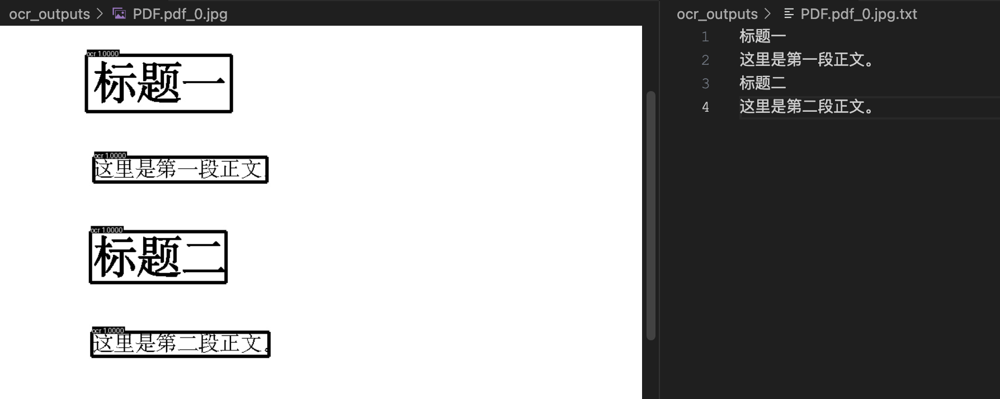
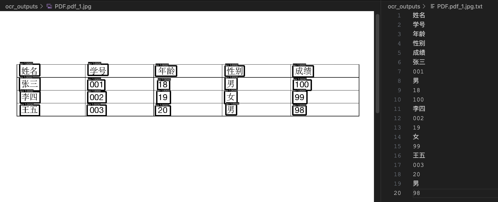
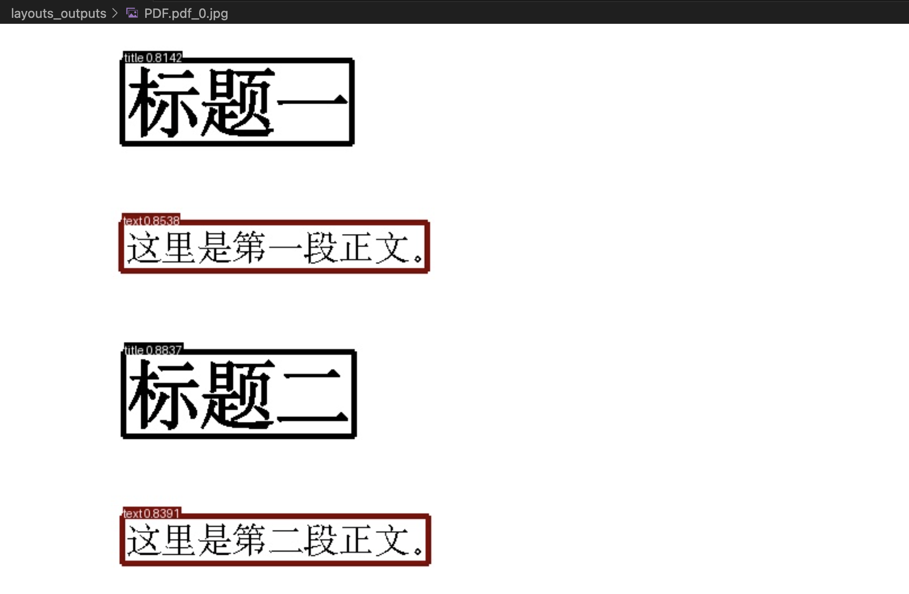
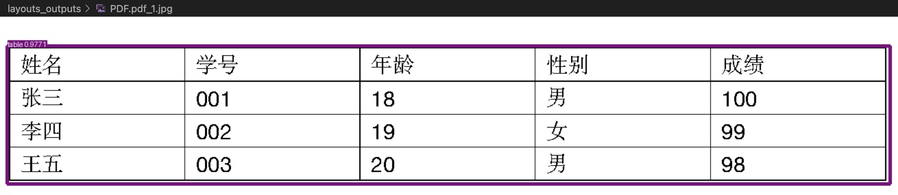
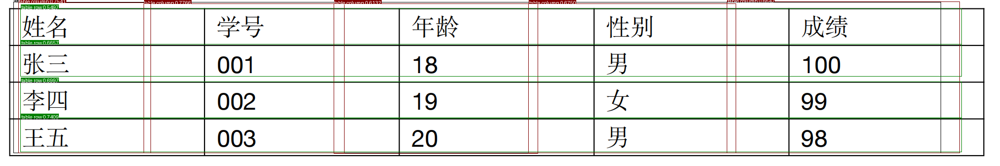
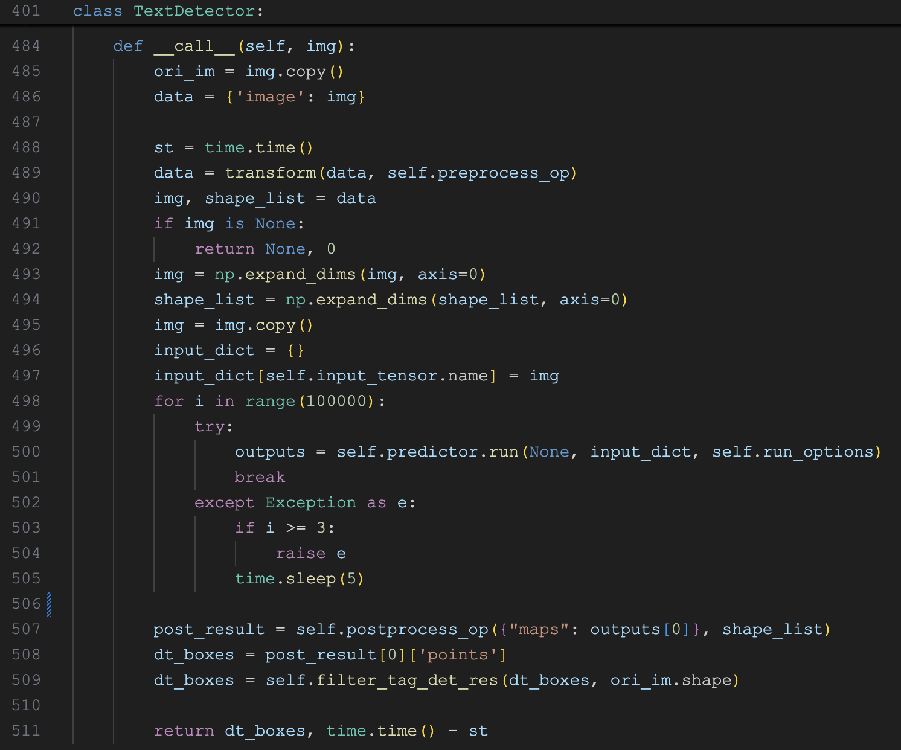
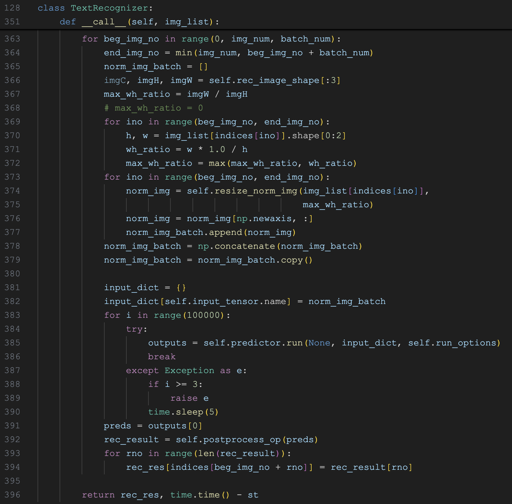
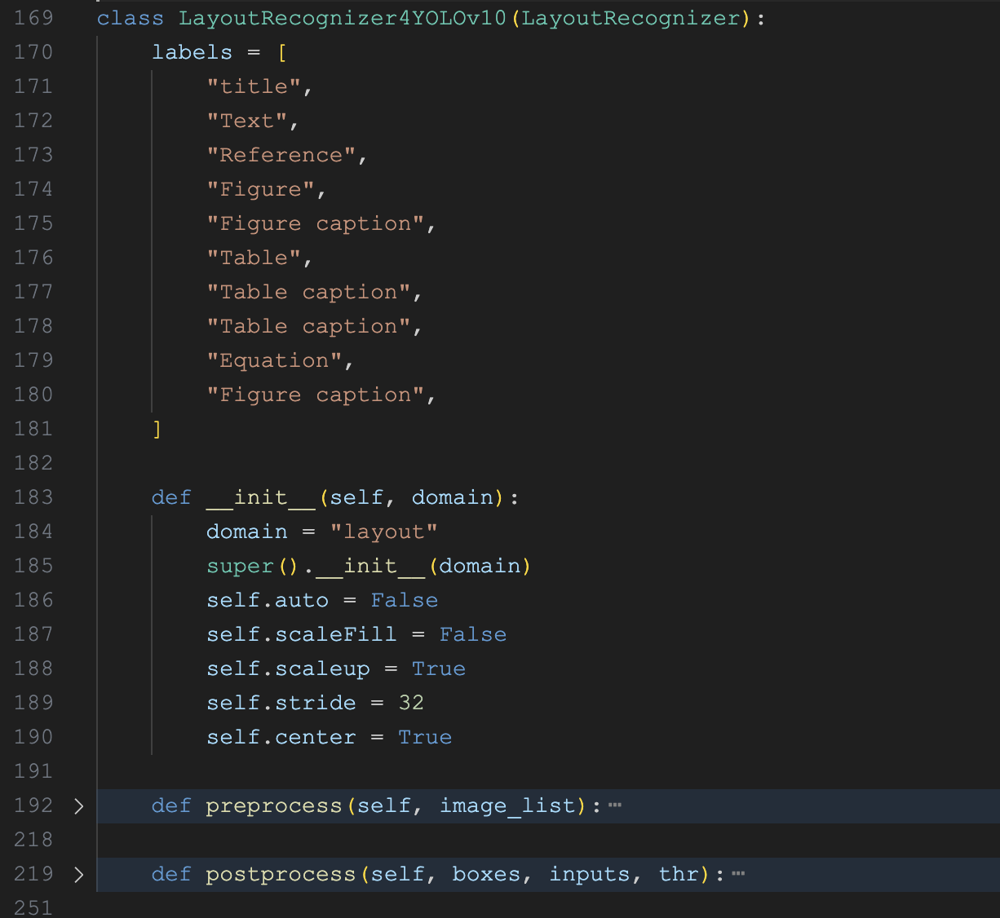
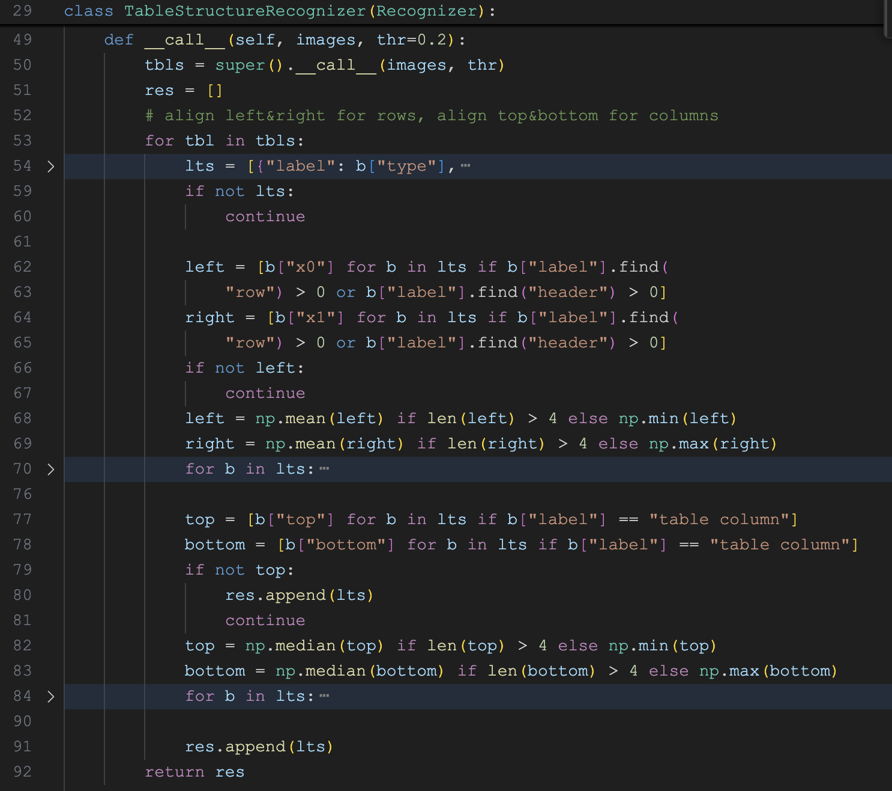
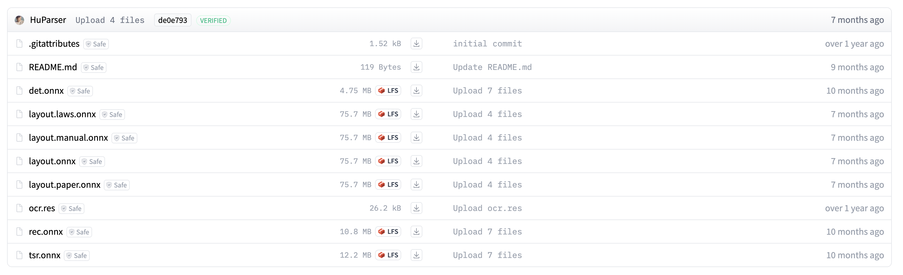

# 学习 RAGFlow 的 DeepDoc 技术之视觉处理

我们之前已经学过，`DeepDoc` 由 **解析器（parser）** 和 **视觉处理（vision）** 两个部分组成。解析器提供了不同格式文档的通用解析方法，我们花了两天时间，对这 10 个解析器的源码做了深入分析；今天我们将学习 `DeepDoc` 的视觉处理部分，包括 **光学字符识别（OCR，Optical Character Recognition）** 、 **文档布局识别（DLR，Document Layout Recognition）** 和 **表格结构识别（TSR，Table Structure Recognition）** 等高级特性，可以对 PDF 文件实现更好的识别效果。

## 测试脚本

为了更直观的体验 OCR、DLR 和 TSR 的效果，`DeepDoc` 提供了两个测试脚本，位于 `deepdoc/vision` 目录下：

* `t_ocr.py` - 调用 **文本检测模型 (det.onnx)** 和 **文本识别模型 (rec.onnx)** 测试 OCR 功能；
* `t_recognizer.py` - 调用 **布局分析模型 (layout.onnx)** 和 **表格结构识别模型 (tsr.onnx)** 测试 DLR 和 TSR 功能；

拿一个简单的 PDF 文档测试一下 OCR 功能：

```
$ python deepdoc/vision/t_ocr.py --inputs /path/to/demo.pdf
```

运行之后会在当前目录下生成一个 `./ocr_outputs` 目录，里面包含了 OCR 的结果。每个页面生成两个文件：一个是 jpg 图片，对应文本检测结果，使用黑框将检测到的文本区域框了起来；另一个是 txt 文本，包含文本识别的结果：



表格页面的识别结果：



继续使用下面的命令测试一下 DLR 功能（注意后面的 ``--mode layout` 参数，表示布局分析模式）：

```
$ python deepdoc/vision/t_recognizer.py --inputs /path/to/demo.pdf --mode layout
```

> `--inputs` 输入可以是 PDF 文件，也可以是图片文件，还可以是包含 PDF 或图片的目录。另外，它还有一个 `--output_dir OUTPUT_DIR` 参数，可以指定输出位置。

运行之后会在当前目录下生成一个 `./layout_outputs` 目录，里面包含了 DLR 的结果。每个页面生成一个 jpg 图片，识别到区域使用不同颜色的框框了出来：



可以注意到框的左上角还打上了标签，比如 `title` 标题，`text` 正文。下面是表格页面的识别结果：



左上角的标签为 `table` 表格，表示模型成功识别出了表格区域。

最后将上面的表格区域抠出来，另存成一个张独立的图片，测试一下 TSR 功能（注意后面的 ``--mode tsr` 参数，表示表格结构识别模式）：

```
$ python deepdoc/vision/t_recognizer.py --inputs /path/to/table.png --mode tsr
```

运行之后的结果同样保存在 `./layout_outputs` 目录，里面有一个 jpg 图片，标识出了更加详细的表格区域：



上面绿色的框左上角标签为 `table row` 表示行，红色的框左上角标签为 `table column` 表示列。另外，该目录下还生成了一个 html 文件，以 HTML 形式展示了表格的结构：

```html
<html>
<head>
<style>
  ...
</style>
</head>
<body>
<table>
<tr><th  >姓名</th><th  >学号</th><th  >年龄</th><th  >性别</th><th  >成绩</th></tr>
<tr><td  >张三</td><td  >001</td><td  >18</td><td  >男</td><td  >100</td></tr>
<tr><td  >李四</td><td  >002</td><td  >19</td><td  >女</td><td  >99</td></tr>
<tr><td  >王五</td><td  >003</td><td  >20</td><td  >男</td><td  >98</td></tr>
</table>
</body>
</html>
```

## 文本检测

文本检测是 OCR 流水线的第一步，为后续的文本识别提供准确的文本区域定位。它的代码逻辑位于 `deepdoc/vision/ocr.py` 文件中，实现类 `TextDetector` 如下：



它的核心流程分为三个部分：预处理阶段，模型推理阶段，后处理阶段。

### 预处理阶段

```python
data = transform(data, self.preprocess_op)
```

这里的 `self.preprocess_op` 有点意思，它是通过下面这个 `create_operators()` 函数创建：

```python
def create_operators(op_param_list, global_config=None):
  ops = []
  for operator in op_param_list:
    op_name = list(operator)[0]
    param = {} if operator[op_name] is None else operator[op_name]
    if global_config is not None:
      param.update(global_config)
    op = getattr(operators, op_name)(**param)
    ops.append(op)
  return ops
```

这个函数接受一个 JSON 数组，数组中的每个元素表示一个操作（这些操作定义在 `deepdoc/vision/operators.py` 文件中），操作的名称为 JSON 对象的键，操作的参数为 JSON 对象的值。比如下面这个 JSON 数组，表示了四个预处理操作：

```python
pre_process_list = [{
    # 第一步：图像缩放
    # 将图像最大边长限制为 960 像素，确保输入尺寸适合模型处理
    'DetResizeForTest': {
        'limit_side_len': 960,
        'limit_type': "max",
    }
}, {
    # 第二步：图像归一化
    # 将像素值缩放到 [0,1] 范围（也就是 'scale': '1./255.'）
    # 使用 ImageNet 预训练参数进行标准化（这里的 std 和 mean 这组参数并非随机设定，而是在 ImageNet 数据集上统计得到的）
    'NormalizeImage': {
        'std': [0.229, 0.224, 0.225],
        'mean': [0.485, 0.456, 0.406],
        'scale': '1./255.',
        'order': 'hwc'
    }
}, {
    # 第三步：通道转换
    # 将图像的通道顺序从 HWC（高、宽、通道）转换为 CHW（通道、高、宽），符合模型的输入要求
    'ToCHWImage': None
}, {
    # 第四步：数据筛选
    # 只保留 'image' 和 'shape' 两个关键字段
    'KeepKeys': {
        'keep_keys': ['image', 'shape']
    }
}]
```

### 模型推理阶段

```python
for i in range(100000):
  try:
    outputs = self.predictor.run(None, input_dict, self.run_options)
    break
  except Exception as e:
    if i >= 3:
      raise e
    time.sleep(5)
```

调用 `self.predictor.run()` 进行推理，包含重试机制，最多重试 3 次。这里的 `self.predictor` 是通过 `load_model()` 函数加载的 `det.onnx` 文本检测模型：

```python
self.predictor, self.run_options = load_model(model_dir, 'det', device_id)
```

它会根据机器上是否安装 CUDA 库来选择使用 GPU 还是 CPU 进行推理：

```python
import onnxruntime as ort

def load_model(model_dir, nm, device_id: int | None = None):
  # ...
  run_options = ort.RunOptions()
  if cuda_is_available():
    cuda_provider_options = {
      "device_id": device_id, # Use specific GPU
      "gpu_mem_limit": 512 * 1024 * 1024, # Limit gpu memory
      "arena_extend_strategy": "kNextPowerOfTwo",  # gpu memory allocation strategy
    }
    sess = ort.InferenceSession(
      model_file_path,
      options=options,
      providers=['CUDAExecutionProvider'],
      provider_options=[cuda_provider_options]
      )
    run_options.add_run_config_entry("memory.enable_memory_arena_shrinkage", "gpu:" + str(device_id))
    logging.info(f"load_model {model_file_path} uses GPU")
  else:
    sess = ort.InferenceSession(
      model_file_path,
      options=options,
      providers=['CPUExecutionProvider'])
    run_options.add_run_config_entry("memory.enable_memory_arena_shrinkage", "cpu")
    logging.info(f"load_model {model_file_path} uses CPU")
  loaded_model = (sess, run_options)
  return loaded_model
```

可以看出，模型推理使用的是 [ONNX Runtime](https://github.com/microsoft/onnxruntime) 库。

### 后处理阶段

```python
post_result = self.postprocess_op({"maps": outputs[0]}, shape_list)
dt_boxes = post_result[0]['points']
dt_boxes = self.filter_tag_det_res(dt_boxes, ori_im.shape)
```

这里的 `self.postprocess_op` 和上面的预处理操作类似，也是通过一个 JSON 配置创建的：

```python
postprocess_params = {
  "name": "DBPostProcess",
  # 二值化阈值，用于将概率图转换为二值图
  "thresh": 0.3,
  # 文本框置信度阈值，过滤低质量检测框
  "box_thresh": 0.5,
  # 最大候选框数量
  "max_candidates": 1000,
  # 文本框扩展比例，防止文本被裁切
  "unclip_ratio": 1.5,
  "use_dilation": False,
  # 评分模式选择，支持 fast 和 slow 两种
  "score_mode": "fast",
  "box_type": "quad"
}
```

这个后处理操作 `DBPostProcess` 定义在 `deepdoc/vision/postprocess.py` 文件中。`DeepDoc` 的文本检测模型使用了 **DB（Differentiable Binarization）算法**，最终输出文本区域的 **概率图 (Probability Map)**，表示每个像素是文本的概率。因此后处理阶段的任务就是从概率图中提取出文本区域的坐标框。

### DB（Differentiable Binarization）算法介绍

DB（Differentiable Binarization）算法即可微分二值化算法，由百度的 PaddleOCR 团队提出，主要用于场景文本检测领域。以下是具体介绍：

- **算法背景**：基于分割的场景文本检测需将分割产生的概率图转化为边界框和文字区域，二值化是其中关键的后处理过程。常规二值化通过设定固定阈值，难以适应复杂多变的检测场景，且因不可微分无法在训练阶段随分割网络优化，DB 算法则旨在解决这些问题。
- **核心原理**：DB 算法将传统图像分割流程中的二值化操作引入到网络中，并使之可微分。它利用一个可微分的近似替代，这种处理方式既在前向推理时近似于二值化，又允许梯度传递，从而能在训练过程中优化网络参数，实现端到端的训练。
- **网络结构**：整体采用 **全卷积网络（FCN）** 架构，由 Backbone、FPN 和 DB Head 组成。首先通过 Backbone（如 MobileNetV3 或 ResNet50）提取图像特征，再利用 FPN 模块融合多尺度特征，最后由 DB Head 同时输出文本区域概率图和阈值图，用于后续的可微分二值化处理。
- **算法优势**：一是结构简单，基于 FCN 框架，易于实现和优化；二是高效推理，轻量级结构适合移动端及实时应用；三是检测效果好，能够自适应学习最佳阈值，将文字区域与背景更好地区分开，还能把相近的实例分离开来，提升文本检测的准确性。
- **应用场景**：适用于对实时性有较高要求且背景复杂的任务，如自然场景文本检测、移动端 OCR 应用等，许多手机 OCR 应用采用 DB 算法实现低延迟的实时文字检测。

## 文本识别

文本检测之后，我们得到了图片中各个文本区域的坐标框，然后我们可以根据这些坐标，将文本区域从原图中裁剪出来，这些裁剪出来的子图，就可以丢给文本识别模型进行识别了。

文本识别的代码逻辑同样位于 `deepdoc/vision/ocr.py` 文件中，实现类 `TextRecognizer` 如下：



它接受的参数是子图列表，根据 `batch_num` 按批次进行识别，默认 16 张图一个批次。针对每个批次，它的核心流程也可以分为三个部分：

* 预处理阶段：通过 `resize_norm_img()` 对批次中的每张图片进行预处理，主要包括尺寸调整、数据类型转换、通道调整、归一化等步骤，然后将预处理后的图片拼接成一个大图，作为模型的输入；
* 模型推理阶段：和文本检测一样，使用 ONNX Runtime 执行推理，加载的模型为 `rec.onnx` 文本识别模型，该模型基于 **CTC（Connectionist Temporal Classification）算法** 实现；
* 后处理阶段：从 ocr.res 文件加载字符映射表，通过 CTC 解码得到文本和置信度，并基于置信度阈值过滤低质量结果。

### CTC（Connectionist Temporal Classification）算法介绍

CTC（Connectionist Temporal Classification）算法即联结主义时序分类算法，是一种常用于语音识别、文本识别等领域的算法，主要用于解决输入和输出序列长度不一、无法对齐的问题。以下是其详细介绍：

- **算法背景**：在语音识别、文本识别等序列标注任务中，输入序列（如语音信号帧序列、文本图像特征序列）和输出序列（如文字序列）长度往往是可变的，且它们之间难以找到严格的对齐关系。传统的序列标注算法需要每一时刻输入与输出符号完全对齐，这就导致在处理此类问题时面临巨大挑战，标注成本极高且难度大。CTC 算法由 DeepMind 研究员 Alex Graves 等人在 ICML 2006 上提出，旨在解决这些问题，实现端到端的序列学习。
- **核心原理**：CTC 引入了一个特殊的空白字符 “blank”，输出序列中的每个元素可以是正常字符或空白字符。对于给定的输入序列，模型输出一系列概率分布，每个时间步的输出表示该时刻出现不同字符（包括空白字符）的概率。通过合并相邻重复字符并删除空白字符，将包含空白字符的输出序列映射到最终的目标标签序列。CTC 的目标是最大化给定输入序列下，正确目标标签序列的概率，通常通过计算负对数似然损失函数来进行模型训练，利用动态规划的前向后向算法高效计算损失函数及其导数，从而更新模型参数。
- **应用场景**：
  - **语音识别**：可将连续的语音信号映射到文字序列，实现自动语音转写，无需对语音信号进行复杂的帧级对齐标注，广泛应用于语音助手、语音转文字软件等。
  - **文本识别**：常用于光学字符识别（OCR），将图像中的文字映射到文字序列，能处理不同长度的文字图像，提高识别效率和准确性。
  - **其他序列标注任务**：还可应用于动态手势识别、声音事件检测、动作标注、唇读等领域，只要是涉及序列输入输出且存在对齐困难的任务，都可以考虑使用 CTC 算法。

## 文档布局分析

来自不同领域的文档可能有不同的布局，如报纸、杂志、书籍和简历在布局方面往往是不同的。只有当机器有准确的布局分析时，它才能决定这些文本部分是连续的还是不连续的，或者这个部分需要使用表结构识别来处理，或者这个部分是一个配图并用这个标题来描述。`DeepDoc` 支持 10 个基本布局组件，涵盖了大多数情况：

- 文本（Text）
- 标题（Title）
- 配图（Figure）
- 配图标题（Figure caption）
- 表格（Table）
- 表格标题（Table caption）
- 页头（Header）
- 页尾（Footer）
- 参考引用（Reference）
- 公式（Equation）

布局分析的代码逻辑位于 `deepdoc/vision/layout_recognizer.py` 文件中，实现类 `LayoutRecognizer4YOLOv10` 如下：



从类名可以看出，它是一个基于 [YOLOv10](https://github.com/THU-MIG/yolov10) 模型的文档布局识别器，通过加载 `layout.onnx` 模型文件，对输入图片进行推理，得到检测到的布局区域坐标和类型。

## 表结构识别

表格是一种常用的结构，经常出现在各类文档中，它的结构可能非常复杂，比如层次结构标题、跨单元格和投影行标题等。在 RAG 领域，对表格的处理和理解，直接影响着对表格内数据的问答效果。我们一般先通过布局分析，定位到文档中的表格区域，然后将其裁剪出来，使用专门的表结构识别模型进行识别。`DeepDoc` 支持 5 中不同的表结构：

- 列（table column）
- 行（table row）
- 列标题（table column header）
- 行标题（table projected row header）
- 合并单元格（table spanning cell）

表结构识别的代码逻辑位于 `deepdoc/vision/table_structure_recognizer.py` 文件中，实现类 `TableStructureRecognizer` 如下：



它的调用流程和之前的模型基本一致，前处理，模型推理，后处理，这里使用的是 `tsr.onnx` 这个表结构识别模型，最后返回的是表格区域的坐标和类型。

## 小结

本文深入探讨了 `DeepDoc` 中的视觉处理部分，包括光学字符识别（OCR）、文档布局识别（DLR）和表格结构识别（TSR）的实现原理及技术细节。这几个类的实现都比较复杂，特别是调用每个模型的前处理和后处理部分，非常烧脑，有不少逻辑我也没看懂，但是这并不妨碍我们了解 RAGFlow 解析 PDF 文件的大致思路，权当是扩展下课外知识吧。

本文介绍的四个视觉模型都可以从 [HuggingFace 下载](https://huggingface.co/InfiniFlow/deepdoc)：



而且可以看到，这几个模型都很轻量级，最大的布局检测模型也就只有 75MB 而已。另外，官方还提供了几个领域定制的布局识别模型，比如 `layout.laws.onnx` 用于法律文书，`layout.manual.onnx` 用于手册，`layout.paper.onnx` 用于论文，感兴趣的朋友可以自己尝试下。
