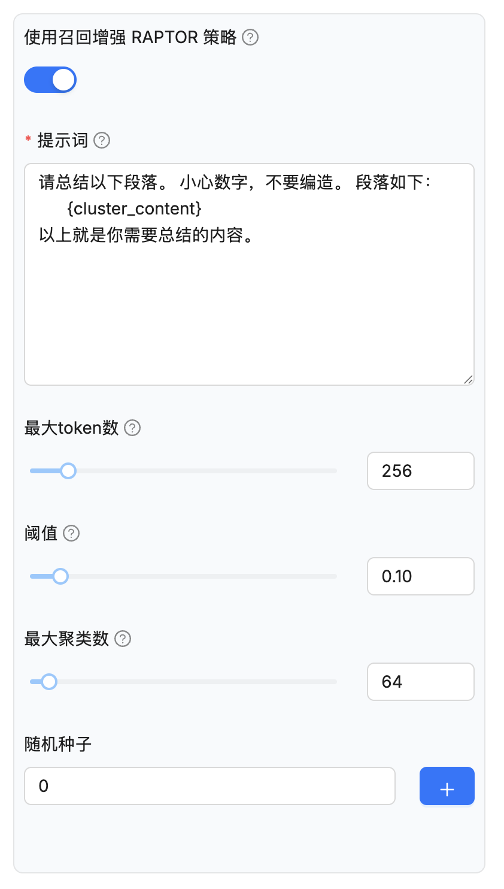
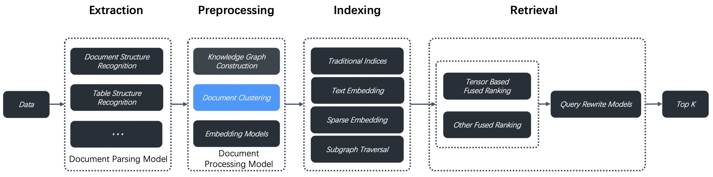
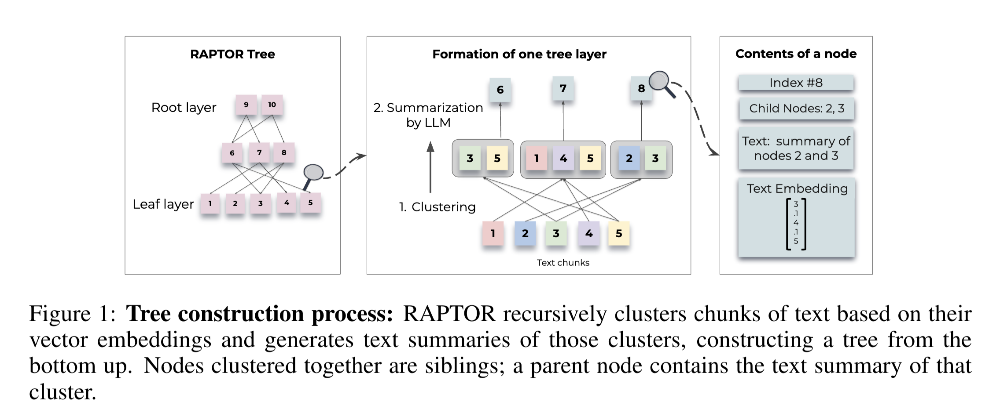
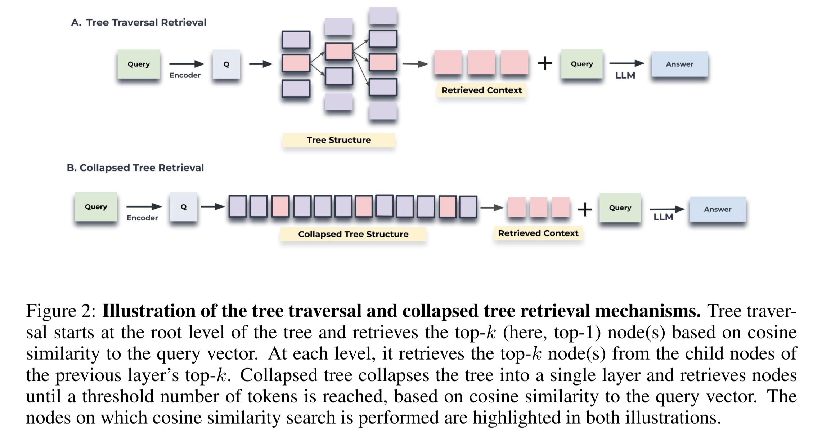
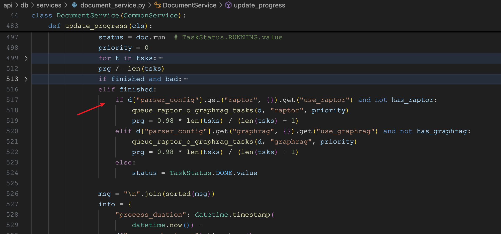
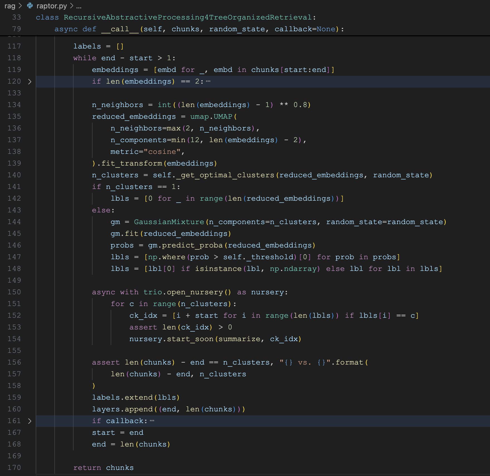
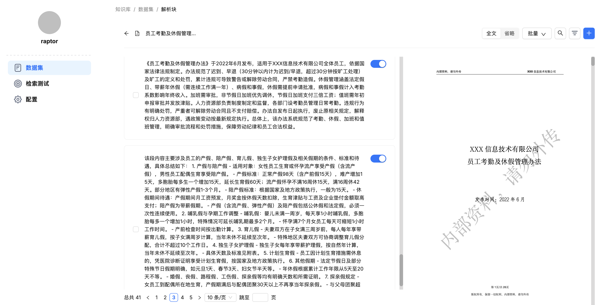

# 学习 RAGFlow 的 RAPTOR 分块策略

在学习知识库配置时，我们提到了一个高级配置 —— **使用召回增强 RAPTOR 策略（use_raptor）**：



开启该配置后，RAGFlow 会使用 RAPTOR 分块策略，这是去年提出的一种增强型文档预处理技术，旨在解决多跳问答问题，通过对文档片段进行递归聚类和摘要，构建分层树状结构，使得在长文档中实现更具上下文感知的检索。RAGFlow 从 v0.6.0 版本开始集成 RAPTOR 策略，用于文档聚类，作为其数据预处理流程中数据提取与索引之间的一部分，如下所示：



使用这种新方法，RAGFlow 在复杂多步推理的问答任务上展示了 SOTA 结果，通过将 RAPTOR 与其他内置的分块或检索方法结合使用，可以进一步提升问答的准确性。

## RAPTOR 简介

RAPTOR 是一种新型的信息检索方法，全称为 **用于树形组织检索的递归抽象处理**，由 Parth Sarthi 等人于 2024 年发表的论文 *《RAPTOR: Recursive Abstractive Processing for Tree-Organized Retrieval》* 中提出：

* https://arxiv.org/abs/2401.18059

传统的 RAG 方法仅从检索语料库中检索短的连续片段，这限制了大模型对整体文档上下文的全面理解，导致其在总结型、整合型的问题上表现堪忧；而 RAPTOR 则通过递归地对文本片段进行嵌入、聚类和摘要，从下到上构建具有不同摘要层级的树结构，从而提高检索的效率和问答的效果。

RAPTOR 的本质是树的构建和检索。树的构建流程如下图所示：



1. 首先，将原始文本切分成块（chunks），然后计算每个分块的向量，这一步和传统 RAG 没有区别，这些分块构成树的叶节点层（Leaf layer）；
2. 接着，对分块进行聚类，将相似的分块归为一类，使用语言模型对每一类分块进行摘要，生成新的分块，这些分块构成树的中间层；
3. 重复执行上述步骤，直到分块不可再分为止，即树的根节点层（Root layer）；

对于每个非叶子节点，都存储着自己的索引、子节点、总结后的文本以及对应的向量。

构建好树形结构之后，就是对树的检索。RAPTOR 提供了两种检索树的方法，**树遍历（Tree Traversal Retrieval）** 和 **压缩树（Collapsed Tree Retrieval）**：



树遍历的流程如下：

1. 从根节点层出发，选取跟问题最相似的 topK 个节点，记为 S1；
2. 再在 S1 的子节点中选取跟问题最相似的 topK 个节点，记为 S2；
3. 重复这个过程，一直执行到叶节点层为止，构成 S1、S2、S3... 等；
4. 将 S1、S2、S3... 合并，组装为上下文用于大模型回答；

而压缩树就要简单的多了，它直接将整个树的所有节点（包括根节点和叶子节点）都放在一个集合里，然后走传统 RAG 一样的检索方法，选出 topK 个相似节点作为上下文。

RAPTOR 的实现在 Github 上开源了，可以参考其官方仓库：

* https://github.com/parthsarthi03/raptor

## 开启 RAPTOR 任务

RAPTOR 的逻辑位于任务执行器的 `do_handle_task()` 函数中：

```python
async def do_handle_task(task):

  # ...
  if task.get("task_type", "") == "raptor":

    # 绑定聊天模型
    chat_model = LLMBundle(task_tenant_id, LLMType.CHAT, llm_name=task_llm_id, lang=task_language)

    # 运行 RAPTOR 逻辑
    async with kg_limiter:
      chunks, token_count = await run_raptor(task, chat_model, embedding_model, vector_size, progress_callback)
```

这个函数我们之前已经详细学习过，但是跳过了 RAPTOR 相关的逻辑，今天我们就继续来看下这个 `run_raptor()` 的实现细节：

```python
async def run_raptor(row, chat_mdl, embd_mdl, vector_size, callback=None):
    
  # 检索原始分块列表
  chunks = []
  vctr_nm = "q_%d_vec"%vector_size
  for d in settings.retrievaler.chunk_list(row["doc_id"], ...):
    chunks.append((d["content_with_weight"], np.array(d[vctr_nm])))

  # 初始化 RAPTOR 实例
  raptor = Raptor(
    row["parser_config"]["raptor"].get("max_cluster", 64),
    chat_mdl,
    embd_mdl,
    row["parser_config"]["raptor"]["prompt"],
    row["parser_config"]["raptor"]["max_token"],
    row["parser_config"]["raptor"]["threshold"]
  )

  # 执行 RAPTOR 分块
  chunks = await raptor(chunks, ...)
  # ...
```

首先通过 `retrievaler.chunk_list()` 检索出该文档原始的分块列表，然后使用配置参数初始化 RAPTOR 实例，并执行 RAPTOR 分块，最后返回新的分块列表。这里的几个初始化参数可以在上面的知识库配置里进行修改，解释如下：

* 最大聚类数（`max_cluster`） - 要创建的最大聚类数，默认为 64，最大限制为 1024；
* 提示词（`prompt`） - 使用该 Prompt 对聚类内容生成摘要，其中 `{cluster_content}` 作为内部参数，表示聚类的内容；
* 最大 token 数（`max_token`） - 每个生成摘要的最大 token 数，默认为 256，最大限制为 2048；
* 阈值（`threshold`） - 在 RAPTOR 中，分块根据其语义相似度进行聚类，该参数设置了分块被归为一组所需的最小相似度。默认值为 0.1，最大限制为 1。阈值越高，每个聚类中的分块就越少，阈值越低，则分块越多；

看到这里，细心的同学可能会有个疑问，第一次执行到这里时，还没有原始的分块列表，怎么对其进行 RAPTOR 聚类呢？

其实，对于开启了 RAPTOR 的知识库，RAGFlow 会生成两个任务。第一个任务会先执行一次标准的分块策略，生成原始的分块列表，在完成第一个任务后，会再生成一个 RAPTOR 类型的任务，执行上面的代码逻辑。我们可以在 `DocumentService` 的 `update_progress()` 更新任务进度这里看到：



## RAPTOR 的实现

RAPTOR 的实现位于 `rag/raptor.py` 文件中，其核心代码如下：



通过一个 `while` 循环不断迭代，其中 `chunks[start:end]` 表示当前层需要处理的分块范围，当 `end - start > 1` 时，表示当前层的分块数量大于 1，需要继续进行聚类和摘要，从而生成上一层的分块；当 `end - start <= 1` 时，表示当前层的分块数量小于等于 1，不需要继续进行聚类和摘要，此时 `while` 循环结束，表示树的构建完成。

在迭代的过程中，有几个地方值得重点关注。第一个地方是对 Embedding 向量进行 UMAP 降维：

```python
n_neighbors = int((len(embeddings) - 1) ** 0.8)
reduced_embeddings = umap.UMAP(
  n_neighbors=max(2, n_neighbors),
  n_components=min(12, len(embeddings) - 2),
  metric="cosine",
).fit_transform(embeddings)
```

现代嵌入模型（如 OpenAI、BGE 等）通常生成高维向量，高维向量虽然在表征文本语义方面表现出色，但也存在一些问题：

* **距离失效**：在高维空间中，所有点之间的距离趋于相等；
* **聚类困难**：高斯混合模型在高维空间中表现不佳；
* **计算复杂度**：高维数据的协方差矩阵计算成本极高；
* **稀疏性**：高维空间中数据点变得稀疏，难以找到有意义的聚类；

简单说就是高维向量不适合聚类，因此需要进行降维处理，将高维向量映射到低维空间中，这样可以提高聚类效果。RAPTOR 使用 UMAP 算法进行降维处理，UMAP 是一种非线性降维算法，可以较好地保留数据的局部结构和全局结构，适用于嵌入向量的降维处理。

第二个地方是 `_get_optimal_clusters(...)` 函数，它的核心作用是自动确定最优的聚类数量：

```python

def _get_optimal_clusters(self, embeddings: np.ndarray, random_state: int):
  max_clusters = min(self._max_cluster, len(embeddings))
  n_clusters = np.arange(1, max_clusters)
  bics = []
  for n in n_clusters:
    gm = GaussianMixture(n_components=n, random_state=random_state)
    gm.fit(embeddings)
    bics.append(gm.bic(embeddings))
  optimal_clusters = n_clusters[np.argmin(bics)]
  return optimal_clusters

n_clusters = self._get_optimal_clusters(reduced_embeddings, random_state)
```

这是 RAPTOR 算法中的关键步骤，它解决了聚类分析中的一个经典问题：**如何确定数据应该被分成多少个聚类？**

该函数通过穷举搜索，从 1 个聚类到最大聚类数逐一尝试，使用 **BIC（Bayesian Information Criterion，贝叶斯信息准则）** 来选择最优的聚类数量。BIC 是一种用于模型选择的统计方法，它考虑了模型的复杂度和拟合数据的程度，倾向于选择在解释力和复杂度之间取得平衡的模型。

第三个地方是使用上面确定的聚类数量，使用 **高斯混合模型（Gaussian Mixture Models，GMM）** 进行聚类：

```python
from sklearn.mixture import GaussianMixture

# 创建 GMM 模型
gm = GaussianMixture(n_components=n_clusters, random_state=random_state)

# 学习每个聚类的高斯分布参数（均值、协方差、权重）
gm.fit(reduced_embeddings)

# 返回概率矩阵
probs = gm.predict_proba(reduced_embeddings)

# 找出所有概率超过阈值的聚类索引
lbls = [np.where(prob > self._threshold)[0] for prob in probs]
lbls = [lbl[0] if isinstance(lbl, np.ndarray) else lbl for lbl in lbls]
```

这里直接使用 scikit-learn 内置的 `GaussianMixture` 创建 GMM 模型，对此感兴趣的同学可以参考下官方文档：

* https://scikit-learn.org/stable/auto_examples/mixture/index.html

> 注意，这里的 lbl 只取了第一个，也就是一个分块只放到一个聚类里，而 RAPTOR 论文指出，一个分块是可以隶属于多个聚类的，因此 RAGFlow 这里算是 RAPTOR 的一种简化版实现。

最后，针对同一个聚类中的分块，使用语言模型进行摘要，生成新的分块：

```python
async with trio.open_nursery() as nursery:
  for c in range(n_clusters):
    ck_idx = [i + start for i in range(len(lbls)) if lbls[i] == c]
    nursery.start_soon(summarize, ck_idx)
```

深入分析上面的实现代码可以发现，整个实现过程中并没有看到构建树形结构，这是因为 RAGFlow 只实现了 RAPTOR 中的 **压缩树** 方式，所有的分块是扁平的，这种方式实现起来简单，存储和检索都方便，相比于 **树遍历** 方式，性价比更高。

我们可以在完成 RAPTOR 任务之后，点击文件名称，进入分块列表：



可以看到，RAPTOR 分块的结果和普通分块的结果没有任何区别，都是混在一起的。

## 小结

今天我们深入学习了 **RAPTOR** 的实现，它为解决多跳问答任务提供了一个非常有趣的方法。通过递归性地聚类和摘要文档片段，创造树状的检索结构，RAPTOR 让复杂语境的检索更具效率。

RAGFlow 采用了 RAPTOR 的简化版实现，并且选择了更轻巧的压缩树方法。这种选择在性能和效果间找到了一种平衡：它既保持了检索的简单性，又充分发挥了多层次语境理解的优势。RAPTOR 一般用在长文档上，短文档就没必要用了，启用 RAPTOR 需要大量的内存、计算资源和令牌，在使用时需要权衡利弊。

另外，知识图谱也可用于多跳问答任务，这也是知识库配置中的一个高级选项，我们明天就来看看它。
