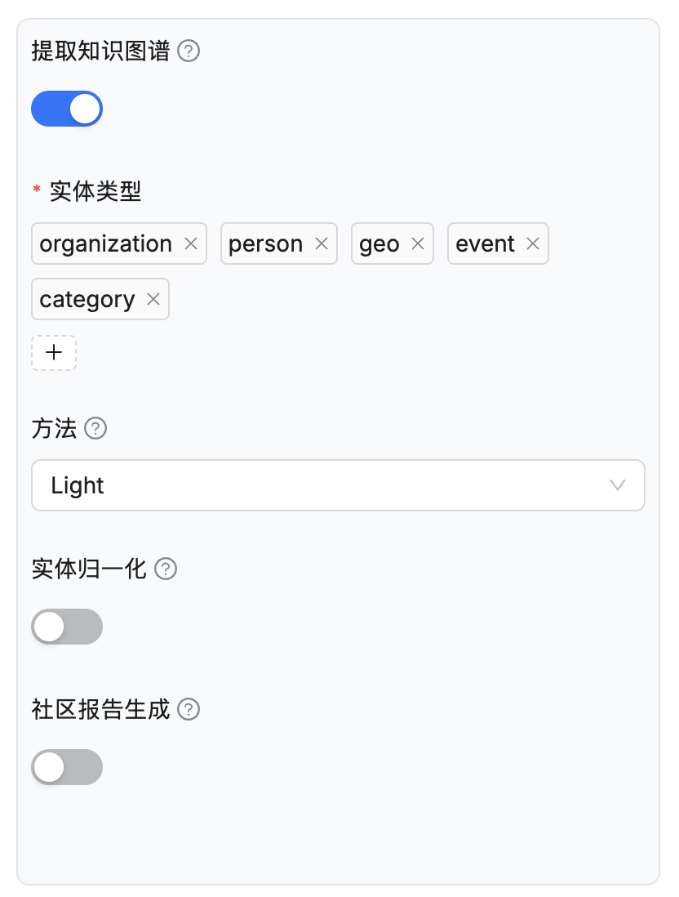
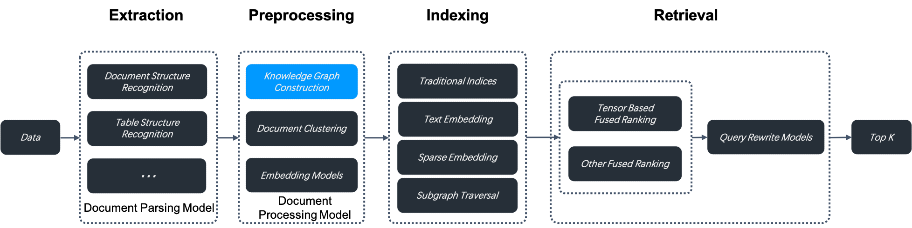
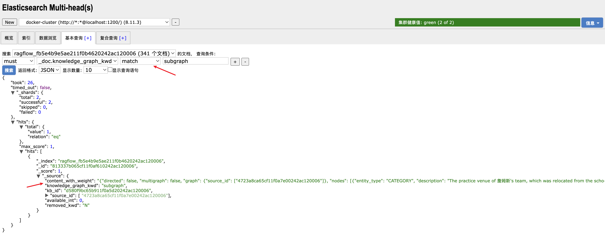
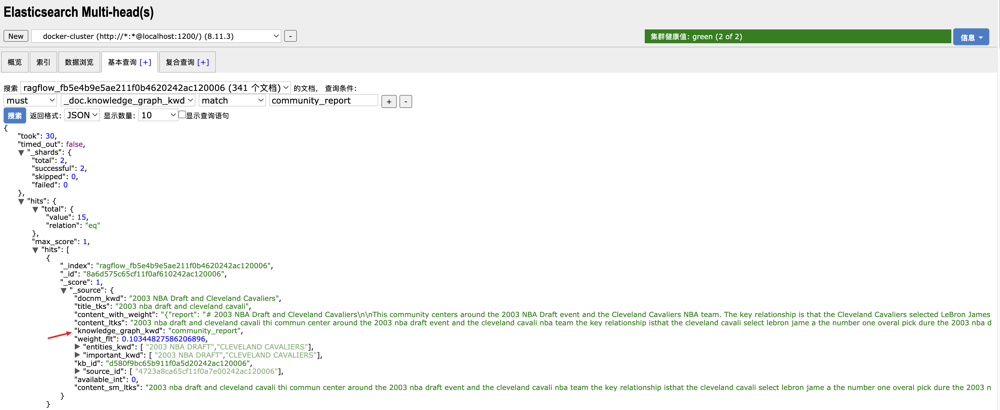
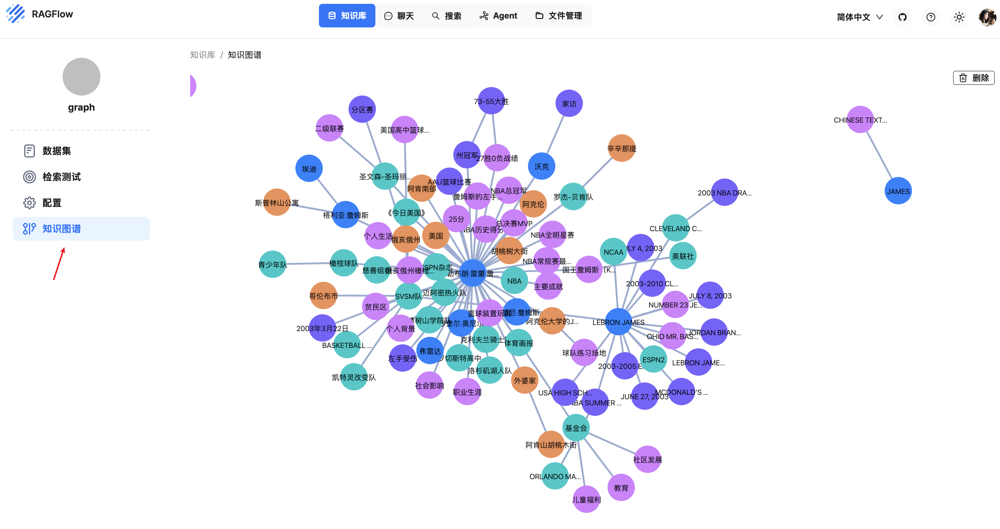

# 学习 RAGFlow 的知识图谱功能

昨天我们学习了 RAGFlow 的 RAPTOR 分块策略，今天我们将继续学习另一种高级配置 —— **提取知识图谱（use_graphrag）**：



该特性自 v0.16.0 起引入，开启该配置后，RAGFlow 会在当前知识库的分块上构建知识图谱，构建步骤位于数据抽取和索引之间，如下所示：



知识图谱在涉及嵌套逻辑的多跳问答中尤其有用，当你在对书籍或具有复杂实体和关系的作品进行问答时，知识图谱的表现优于传统的抽取方法。

> 请注意，构建知识图谱将消耗大量 token 和时间。

## 开启 GraphRAG 任务

GraphRAG 的逻辑位于任务执行器的 `do_handle_task()` 函数中：

```python
async def do_handle_task(task):
    
  # ...
  elif task.get("task_type", "") == "graphrag":
    
    # 绑定聊天模型
    chat_model = LLMBundle(task_tenant_id, LLMType.CHAT, llm_name=task_llm_id, lang=task_language)

    # 运行 GraphRAG 逻辑
    graphrag_conf = task["kb_parser_config"].get("graphrag", {})
    with_resolution = graphrag_conf.get("resolution", False)
    with_community = graphrag_conf.get("community", False)
    async with kg_limiter:
      await run_graphrag(task, task_language, with_resolution, with_community, chat_model, embedding_model, progress_callback)
    return
```

这个函数我们之前已经详细学习过，但是跳过了 GraphRAG 相关的逻辑，今天我们就继续来看下这个 `run_graphrag()` 的实现细节：

```python
async def run_graphrag(row: dict, language, with_resolution: bool, with_community: bool, chat_model, embedding_model, callback):
    
  # 检索原始分块列表
  chunks = []
  for d in settings.retrievaler.chunk_list(...):
    chunks.append(d["content_with_weight"])

  # 使用 LightKGExt 或 GeneralKGExt 生成子图
  subgraph = await generate_subgraph(
    LightKGExt if row["kb_parser_config"]["graphrag"]["method"] != "general" else GeneralKGExt,
    ...
    row["kb_parser_config"]["graphrag"]["entity_types"],
    ...
  )

  # 将子图合并到知识图谱中
  subgraph_nodes = set(subgraph.nodes())
  new_graph = await merge_subgraph(...)

  # 实体消歧
  if with_resolution:
    await resolve_entities(new_graph, subgraph_nodes, ...)

  # 社区报告
  if with_community:
    await extract_community(new_graph, ...)
```

整体的逻辑还是比较清晰的，首先通过 `retrievaler.chunk_list()` 检索出该文档原始的分块列表，然后基于配置的实体类型生成子图，然后将子图合并到知识图谱中，最后进行实体消歧和社区报告的生成。

> 和 RAPTOR 任务一样，开启知识图谱也需要先执行一次标准的分块策略，生成原始的分块列表，在完成第一个任务后，会再生成一个知识图谱类型的任务，执行上面的代码逻辑。

提取知识图谱涉及的配置参数如下：

* 实体类型（`entity_types`） - 指定要提取的实体类型，默认类型包括：组织（organization）、人物（person）、事件（event）和类别（category），可根据具体的知识库内容添加或删除类型；
* 方法（`method`） - 用于构建知识图谱的方法，RAGFlow 支持两种方法：
    * 通用（`general`）：使用 [GraphRAG](https://github.com/microsoft/graphrag) 提供的提示词提取实体和关系。
    * 轻量（`light`）：使用 [LightRAG](https://github.com/HKUDS/LightRAG) 提供的提示词来提取实体和关系。此选项消耗更少的 tokens、更少的内存和更少的计算资源。
* 实体消歧（`resolution`） - 是否启用实体消歧。启用后，解析过程会将具有相同含义的实体合并在一起，从而使知识图谱更简洁、更准确。例如 “2025” 和 “2025 年” 或 “IT” 和 “信息技术”，“特朗普总统” 和 “唐纳德·特朗普” 等。
* 社区报告生成（`community`） - 是否生成社区报告。在知识图谱中，社区是由关系连接的实体簇，可以让大模型为每个社区生成摘要，这被称为 **[社区报告](https://www.microsoft.com/en-us/research/blog/graphrag-improving-global-search-via-dynamic-community-selection/)**。

## 构建子图

构建子图的逻辑位于 `generate_subgraph()` 函数：

```python
async def generate_subgraph(...):

  # 检查 doc_id 是否已经构建过子图
  contains = await does_graph_contains(tenant_id, kb_id, doc_id)
  if contains:
    return None

  # 创建提取器实例，提取实体和关系
  ext = extractor(llm_bdl, language=language, entity_types=entity_types)
  ents, rels = await ext(doc_id, chunks, callback)

  # 将实体和关系构建成 NetworkX 子图
  subgraph = nx.Graph()
  for ent in ents:
    ent["source_id"] = [doc_id]
    subgraph.add_node(ent["entity_name"], **ent)
  for rel in rels:
    rel["source_id"] = [doc_id]
    subgraph.add_edge(
      rel["src_id"],
      rel["tgt_id"],
      **rel,
    )

  # 将子图序列化为 JSON 字符串，作为分块存到文档库中
  subgraph.graph["source_id"] = [doc_id]
  chunk = {
    "content_with_weight": json.dumps(
      nx.node_link_data(subgraph, edges="edges"), ensure_ascii=False
    ),
    "knowledge_graph_kwd": "subgraph",
    "kb_id": kb_id,
    "source_id": [doc_id],
    "available_int": 0,
    "removed_kwd": "N",
  }
  cid = chunk_id(chunk)

  # 首先根据 doc_id 删除旧的子图
  await trio.to_thread.run_sync(
    lambda: settings.docStoreConn.delete(
      {"knowledge_graph_kwd": "subgraph", "source_id": doc_id}, search.index_name(tenant_id), kb_id
    )
  )

  # 然后插入新的子图
  await trio.to_thread.run_sync(
    lambda: settings.docStoreConn.insert(
      [{"id": cid, **chunk}], search.index_name(tenant_id), kb_id
    )
  )

  return subgraph
```

关键步骤已经由注释标出，这里不再赘述。主要关注三点：

1. 支持两种提取器，`GeneralKGExt` 和 `LightKGExt`，提取的步骤差不多（都是经过三步：首次抽取 -> 二次抽取 -> 判断是否抽取完毕），只是使用的提示词不一样而已；
2. 子图是通过 [NetworkX](https://github.com/networkx/networkx) 库构建的，这是一种 Python 中常用的图论库，可以方便地创建、操作和分析图结构；
3. 子图会序列化为 JSON 字符串，作为分块存到文档库中，可以在 ES 中通过 `"knowledge_graph_kwd": "subgraph"` 条件检索出来：



感兴趣的可以看下这个 `content_with_weight` 字段，里面包含从文档中抽取出来的完整子图。

## 合并子图

上面一步生成的是文档级别的子图，接下来，将该子图合并到全局知识图谱中：

```python
async def merge_subgraph(tenant_id: str, kb_id: str, subgraph: nx.Graph, ...):

  # 检索旧的全局知识图谱
  change = GraphChange()
  old_graph = await get_graph(tenant_id, kb_id, subgraph.graph["source_id"])
  if old_graph is not None:
    # 如果旧图谱存在，则将文档子图合并到全局图谱中
    new_graph = graph_merge(old_graph, subgraph, change)
  else:
    # 如果旧图谱不存在，则直接使用文档子图作为新的全局图谱
    new_graph = subgraph
    change.added_updated_nodes = set(new_graph.nodes())
    change.added_updated_edges = set(new_graph.edges())

  # 计算 PageRank
  pr = nx.pagerank(new_graph)
  for node_name, pagerank in pr.items():
    new_graph.nodes[node_name]["pagerank"] = pagerank

  # 保存新的全局图谱
  await set_graph(tenant_id, kb_id, embedding_model, new_graph, change, callback)
  
  return new_graph
```

合并的逻辑比较简单，就是遍历文档子图中的所有节点和边，判断是否已经存在于全局图谱中，如果存在，就将 `description`、`keywords`、`source_id` 等属性拼接到全局图谱中。此外，还会使用 NetworkX 的 [pagerank() 方法](https://networkx.org/documentation/stable/reference/algorithms/generated/networkx.algorithms.link_analysis.pagerank_alg.pagerank.html) 对合并后的图谱计算 PageRank 值，为每个节点添加 `pagerank` 属性，用于衡量节点的重要性。

> PageRank 最初被设计为一种对网页进行排名的算法，在 NetworkX 中，是根据指向该节点的边的个数来计算节点的排名，表示该实体在知识图谱中的重要性。

## 开启实体消歧

实体消歧的逻辑位于 `graphrag/entity_resolution.py` 文件：

```python
class EntityResolution(Extractor):

  async def __call__(self, graph: nx.Graph, subgraph_nodes: set[str], ...) -> EntityResolutionResult:
    
    # 将节点按照实体类型分组
    nodes = sorted(graph.nodes())
    entity_types = sorted(set(graph.nodes[node].get('entity_type', '-') for node in nodes))
    node_clusters = {entity_type: [] for entity_type in entity_types}
    for node in nodes:
      node_clusters[graph.nodes[node].get('entity_type', '-')].append(node)

    # 在同类型实体中生成所有可能的配对组合
    candidate_resolution = {entity_type: [] for entity_type in entity_types}
    for k, v in node_clusters.items():
      candidate_resolution[k] = [
        (a, b) for a, b in itertools.combinations(v, 2) 
        if (a in subgraph_nodes or b in subgraph_nodes) and self.is_similarity(a, b)
      ]
    
    # 并发调用大模型进行批量消歧，大模型针对每一对实体输出明确的 Yes/No 判断
    # 默认一批 100 对实体，最多并发 5 个任务
    resolution_result = set()
    async with trio.open_nursery() as nursery:
      for candidate_resolution_i in candidate_resolution.items():
        for i in range(0, len(candidate_resolution_i[1]), resolution_batch_size):
          candidate_batch = candidate_resolution_i[0], candidate_resolution_i[1][i:i + resolution_batch_size]
          nursery.start_soon(limited_resolve_candidate, candidate_batch, resolution_result, resolution_result_lock)

    # 将消歧结果构建成新的图谱
    change = GraphChange()
    connect_graph = nx.Graph()
    connect_graph.add_edges_from(resolution_result)
    async with trio.open_nursery() as nursery:
      for sub_connect_graph in nx.connected_components(connect_graph):
        merging_nodes = list(sub_connect_graph)
        nursery.start_soon(limited_merge_nodes, graph, merging_nodes, change)

    return EntityResolutionResult(
      graph=graph,
      change=change,
    )
```

实体消歧所使用的提示词核心部分如下，主要是输出部分使用的一些特殊符号，方便程序解析结果：

```
问题:
在判断两个产品是否相同时，你应该只关注关键属性，忽略噪声因素。

演示 1: 产品A的名称是："电脑"，产品B的名称是："手机" 不，产品A和产品B是不同的产品。
问题 1: 产品A的名称是："电视机"，产品B的名称是："电视"
问题 2: 产品A的名称是："杯子"，产品B的名称是："马克杯"
问题 3: 产品A的名称是："足球"，产品B的名称是："橄榄球"
问题 4: 产品A的名称是："钢笔"，产品B的名称是："橡皮擦"

使用产品的领域知识来帮助理解文本，并按以下格式回答上述4个问题：对于问题i，是的，产品A和产品B是同一个产品。或者 不，产品A和产品B是不同的产品。对于问题i+1，（重复上述程序）
################
输出:
(对于问题 <|>1<|>，&&是&&，产品A和产品B是同一个产品。)##
(对于问题 <|>2<|>，&&是&&，产品A和产品B是同一个产品。)##
(对于问题 <|>3<|>，&&不&&，产品A和产品B是不同的产品。)##
(对于问题 <|>4<|>，&&不&&，产品A和产品B是不同的产品。)##
```

## 生成社区报告

生成社区报告的逻辑位于 `graphrag/general/community_reports_extractor.py` 文件：

```python
class CommunityReportsExtractor(Extractor):

  async def __call__(self, graph: nx.Graph, callback: Callable | None = None):

    # 使用 Leiden 算法来发现图中的社区结构
    # 将社区组织成一个多层级的树形结构，每个层级包含多个社区
    communities: dict[str, dict[str, list]] = leiden.run(graph, {})

    # 遍历每一个社区，从图中提取当前社区中的所有实体和关系的描述，调用大模型生成社区报告
    async with trio.open_nursery() as nursery:
      for level, comm in communities.items():
        logging.info(f"Level {level}: Community: {len(comm.keys())}")
        for community in comm.items():
          nursery.start_soon(extract_community_report, community)

    return CommunityReportsResult(
      structured_output=res_dict,
      output=res_str,
    )
```

整个流程比较简单，分为两步。第一步，使用 [Leiden 算法](https://en.wikipedia.org/wiki/Leiden_algorithm) 发现图中的社区结构。

在网络科学或图论中，**社区（Community）** 是指网络中的一组节点，其核心特征是：**社区内部的节点之间连接紧密，而与社区外部节点的连接相对稀疏**，这种 “内密外疏” 的结构是社区的核心标志，反映了网络中节点的聚类性和关联性。Leiden 算法是一种在图数据中识别社区结构的高效算法，由 Traag 等人在莱顿大学于 2018 年提出。它在经典的 [Louvain 算法](https://en.wikipedia.org/wiki/Louvain_method) 基础上进行了改进，解决了 Louvain 算法中可能出现的 “分辨率限制” 和社区划分不精确的问题，因此在复杂网络分析中被广泛应用。

> 这里，RAGFlow 使用的是 [graspologic](https://graspologic-org.github.io/graspologic/) 库的 `hierarchical_leiden()` 方法。

第二步，调用大模型为每个社区生成摘要，这被称为 **社区报告（Community Report）**，报告以 JSON 格式输出：

```
{
  "title": <报告标题>,
  "summary": <执行摘要>,
  "rating": <影响严重性评级>,
  "rating_explanation": <评级说明>,
  "findings": [
    {
      "summary":<洞察1摘要>,
      "explanation": <洞察1解释>
    },
    {
      "summary":<洞察2摘要>,
      "explanation": <洞察2解释>
    }
  ]
}
```

包括以下几个部分：

- 标题：代表其关键实体的社区名称，标题应简短但具体，如果可能，在标题中包含代表性的命名实体；
- 摘要：社区整体结构的执行摘要，其实体如何相互关联，以及与其实体相关的重要信息；
- 影响严重性评级：0-10 之间的浮点分数，表示社区内实体造成的影响严重程度；
- 评级说明：对影响严重性评级给出一句话解释；
- 详细发现：关于社区的 5-10 个关键洞察列表，每个洞察应有一个简短摘要，然后是根据下面的基础规则进行的多段解释性文本，要全面；

生成的社区报告可以在 ES 中通过 `"knowledge_graph_kwd": "community_report"` 条件检索出来：



## 小结

在今天的学习中，我们深入探讨了 RAGFlow 中的知识图谱功能，我们详细了解了提取知识图谱的流程，包括：实体和关系的提取，子图的构建和合并，实体消歧和社区报告生成等。图谱生成成功后，知识库的配置页面会多出一个 “知识图谱” 的菜单项：



通过引入知识图谱，RAGFlow 能在复杂多跳问答场景中表现得更加出色，特别是在分析具有复杂关系和实体的文档时。和昨天学习的 RAPTOR 一样，启用知识图谱功能需要大量的内存、计算资源和令牌，在使用时需要权衡利弊，建议提前在少量测试集上进行验证，只有当效果提升明显，才具有足够的性价比，才建议开启该功能。
