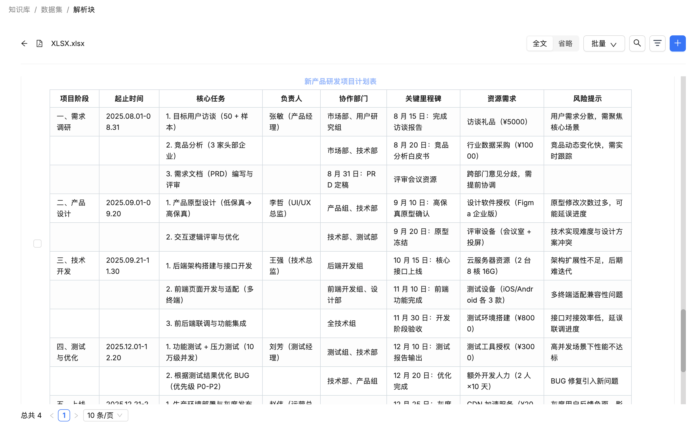

# 学习 RAGFlow 知识库高级配置

目前为止，我们已经学习了很多关于 RAGFlow 的知识库配置，包括分块方法，PDF 解析器，嵌入模型，RAPTOR 策略，提取知识图谱等，除此之外，还剩下一些高级配置，我们今天一起来看下：


## 页面排名（pagerank）

当我们从多个指定的知识库中检索知识时，可能希望某些知识库的知识优先被检索到。比如我们有两个知识库：知识库 A 用于 2024 年新闻，知识库 B 用于 2025 年新闻，但希望优先显示 2025 年的新闻，那么提高知识库 B 的页面排名将非常有用。

PageRank 最初被设计为一种对网页进行排名的算法，RAGFlow 中的这个参数用于为特定的知识库分配更高的 PageRank 分数，这个分数会在文档分块和解析时加到每个文本块上，处理逻辑位于任务执行器的 `build_chunks()` 方法中：

```python
async def build_chunks(task, progress_callback):

  # ...
  if task["pagerank"]:
    doc[PAGERANK_FLD] = int(task["pagerank"])
```

需要注意的是，这个参数是针对整个知识库的，而不是针对单个文档。当我们修改知识库的 `pagerank` 值时，整个知识库的文本块都会同步更新：

```python
@manager.route('/update', methods=['post'])
def update():

  # 当 pagerank 参数有变动时
  if kb.pagerank != req.get("pagerank", 0):

    # 该参数只支持 ES 文档引擎
    if os.environ.get("DOC_ENGINE", "elasticsearch") != "elasticsearch":
      return get_data_error_result(message="'pagerank' can only be set when doc_engine is elasticsearch")
    
    if req.get("pagerank", 0) > 0:
      # 更新知识库中的所有文本块的 PAGERANK_FLD
      settings.docStoreConn.update({"kb_id": kb.id}, {PAGERANK_FLD: req["pagerank"]}, search.index_name(kb.tenant_id), kb.id)
    else:
      # 由于 ES 中的 PAGERANK_FLD 不能为 0，因此删除该字段
      settings.docStoreConn.update({"exists": PAGERANK_FLD}, {"remove": PAGERANK_FLD}, search.index_name(kb.tenant_id), kb.id)
```

可以在 ES 中查看文本块详情，会多一个 `pagerank_fea` 字段：


## 自动关键词提取（auto_keywords）

这个参数的作用是自动为每个文本块提取 N 个关键词，当用户问题包含这些关键词时，可以提高文本块的排名。一般情况下，如果分块大小在 1000 字符左右，那么推荐提取 3-5 个关键词即可；如果你的分块较大，可以适当提高这个值，但是请注意，随着数值的增加，边际收益会递减，最多是 30 个。

提取关键词的逻辑同样位于任务执行器的 `build_chunks()` 方法中：

```python
async def build_chunks(task, progress_callback):

  # ...
  if task["parser_config"].get("auto_keywords", 0):
    
    # 绑定大模型
    chat_mdl = LLMBundle(task["tenant_id"], LLMType.CHAT, llm_name=task["llm_id"], lang=task["language"])

    # 调用大模型，为指定文本块生成 N 个关键词
    async def doc_keyword_extraction(chat_mdl, d, topn):
      
      # 缓存机制
      cached = get_llm_cache(chat_mdl.llm_name, d["content_with_weight"], "keywords", {"topn": topn})
      if not cached:
        # 限制大模型并发路数，默认 10 路
        async with chat_limiter:
          cached = await trio.to_thread.run_sync(lambda: keyword_extraction(chat_mdl, d["content_with_weight"], topn))
        set_llm_cache(chat_mdl.llm_name, d["content_with_weight"], cached, "keywords", {"topn": topn})
      if cached:
        d["important_kwd"] = cached.split(",")
        d["important_tks"] = rag_tokenizer.tokenize(" ".join(d["important_kwd"]))
      return

    # 启动并发任务，为每个文本块生成关键词
    async with trio.open_nursery() as nursery:
      for d in docs:
        nursery.start_soon(doc_keyword_extraction, chat_mdl, d, task["parser_config"]["auto_keywords"])
```

关键词提取的提示词比较简单，如下：

```
### 角色
你是一名文本分析员。

### 任务
提取给定文本内容中最重要的关键词/短语。

### 要求
- 总结文本内容，并给出排名前 {{ topn }} 的重要关键词/短语。
- 关键词必须与给定文本内容的语言一致。
- 关键词之间用英文逗号分隔。
- 仅输出关键词。

---

## 文本内容
{{ content }}
```

生成的关键词可以在文本块列表中查看或更新（双击文本块）：


## 自动问题提取（auto_questions）

这个参数的作用是自动为每个文本块提取 N 个问题，当用户问题和这些问题比较类似时，可以提高文本块的排名。一般情况下，如果分块大小在 1000 字符左右，那么推荐提取 1-2 个问题即可；如果你的分块较大，可以适当提高这个值，最多 10 个。

问题提取逻辑和关键词提取几乎一模一样，同样位于任务执行器的 `build_chunks()` 方法中：

```python
async def build_chunks(task, progress_callback):

  # ...
  if task["parser_config"].get("auto_questions", 0):
    
    # 绑定大模型
    chat_mdl = LLMBundle(task["tenant_id"], LLMType.CHAT, llm_name=task["llm_id"], lang=task["language"])

    # 调用大模型，为指定文本块生成 N 个问题
    async def doc_question_proposal(chat_mdl, d, topn):

      # 缓存机制
      cached = get_llm_cache(chat_mdl.llm_name, d["content_with_weight"], "question", {"topn": topn})
      if not cached:
        # 限制大模型并发路数，默认 10 路
        async with chat_limiter:
          cached = await trio.to_thread.run_sync(lambda: question_proposal(chat_mdl, d["content_with_weight"], topn))
        set_llm_cache(chat_mdl.llm_name, d["content_with_weight"], cached, "question", {"topn": topn})
      if cached:
        d["question_kwd"] = cached.split("\n")
        d["question_tks"] = rag_tokenizer.tokenize("\n".join(d["question_kwd"]))

    # 启动并发任务，为每个文本块生成问题
    async with trio.open_nursery() as nursery:
      for d in docs:
        nursery.start_soon(doc_question_proposal, chat_mdl, d, task["parser_config"]["auto_questions"])
```

问题提取的提示词如下：

```
角色
你是一名文本分析员。

任务
就给定的一段文本内容提出{{ topn }}个问题。

要求
- 理解并总结文本内容，提出最重要的{{ topn }}个问题。
- 问题之间不应有含义重叠。
- 问题应尽可能涵盖文本的主要内容。
- 问题必须与给定文本内容的语言一致。
- 每行一个问题。
- 仅输出问题。

---

文本内容
{{ content }}
```

生成的问题可以在文本块列表中查看或更新（双击文本块）：


自动关键词提取和自动问题提取的数值和知识库分块大小密切相关，如果你是第一次使用此功能且不确定从哪个数值开始，可以参考下面这份从社区收集的推荐值：


## 表格转 HTML（html4excel）

该参数只对 Excel 或 CSV 表格文件生效，并与 `General` 分块方法一起使用。当禁用时，文件将被解析为键值对；当启用时，文件将被解析为 HTML 表格，按照每 12 行进行拆分；实现代码位于 `rag/app/naive.py` 文件中：

```python
def chunk(filename, binary=None, from_page=0, to_page=100000, ...):
    
  # ...
  elif re.search(r"\.(csv|xlsx?)$", filename, re.IGNORECASE):
    excel_parser = ExcelParser()
    if parser_config.get("html4excel"):
      sections = [(_, "") for _ in excel_parser.html(binary, 12) if _]
    else:
      sections = [(_, "") for _ in excel_parser(binary) if _]
```

该参数默认禁用，表格内容被解析成 “表头1: 内容1；表头2：内容2；” 的键值对格式，如下所示：


这种格式适用于一些比较简单的表格，当表格比较复杂时，比如层次结构标题、合并单元格和投影行标题等，建议解析成 HTML 格式。比如下面这样的表格：


开启表格转 HTML 之后，解析结果如下所示：



页面上显示的是渲染后的结果，实际上存储的是 HTML 代码。

> 可以看到，HTML 代码还不是那么完美，并没有完全保留原表格的样式，比如这里无法体现出合并单元格。另外，值得注意的是，RAGFlow 在处理 DOCX 和 PDF 文件中的表格时，并没有按这个参数来，而是各自处理的，默认都是解析成 HTML 格式，我觉得这块的逻辑可以统一。

## 小结

今天我们学习了 RAGFlow 知识库的几个高级配置选项，这些功能可以帮助我们进一步优化 RAG 应用的检索效果和处理能力。主要包括：

- **页面排名**：通过为知识库设置不同的权重，实现对检索结果的优先级排序。
- **自动关键词提取**：利用大模型为每个文本块自动提取核心关键词，提升相关查询的召回率。
- **自动问题提取**：同样利用大模型，为文本块生成可能的问题，增强对问答式查询的理解和匹配。
- **表格转 HTML**：为 Excel 和 CSV 文件提供两种不同的解析方式，通过转换为 HTML 格式更好地处理复杂表格。

至此，我们已经系统地学习了 RAGFlow 知识库的大部分配置。掌握这些配置，可以让我们根据不同的业务场景和文档类型，灵活地构建出高质量的 RAG 应用。在知识库的高级配置中，还剩下一个标签集的功能，我们明天再来学习它。