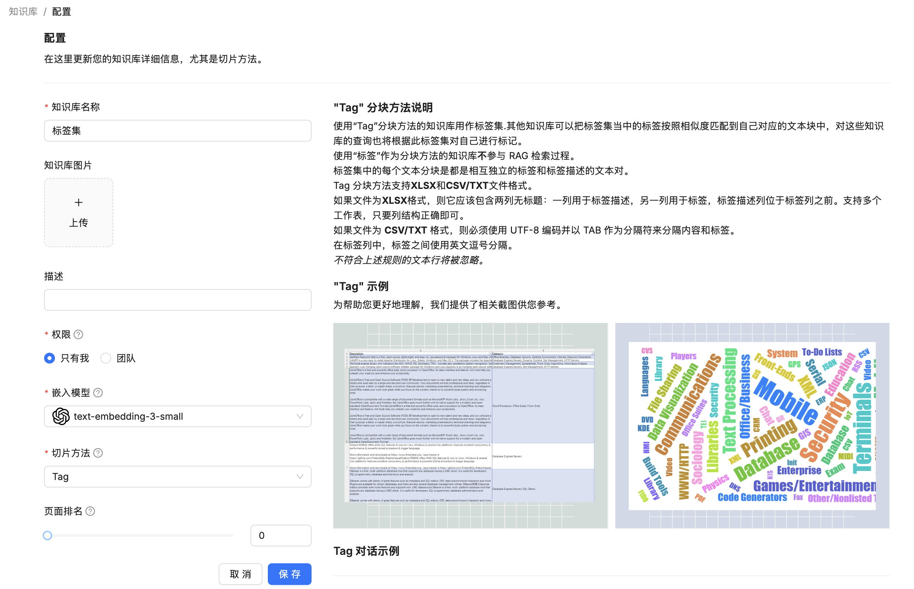
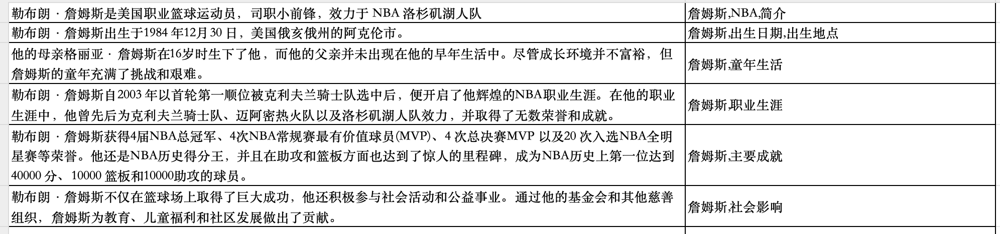
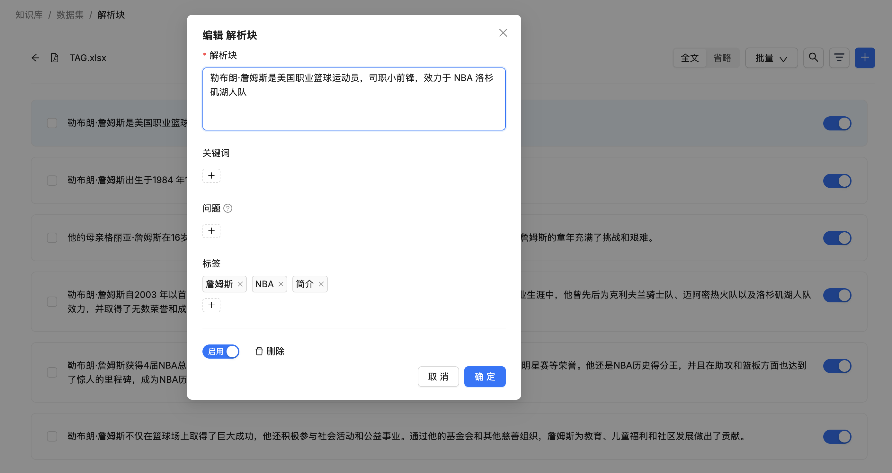
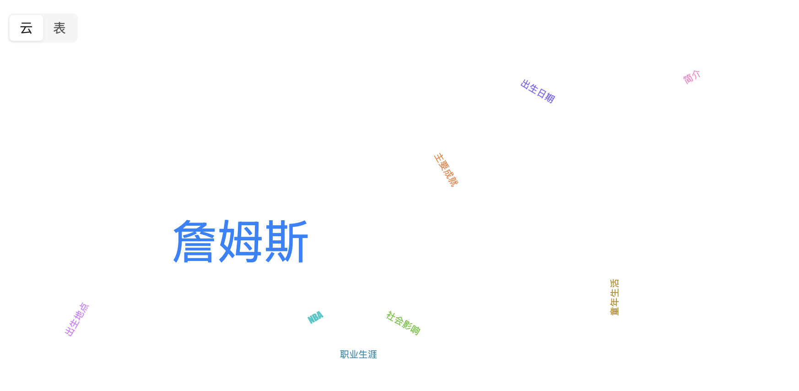
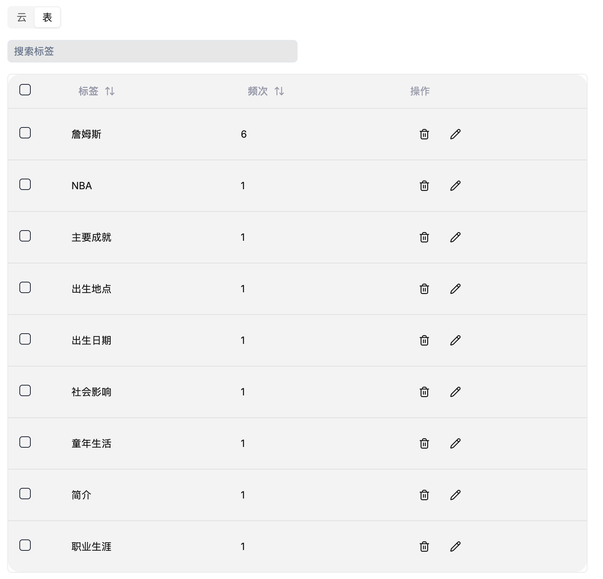
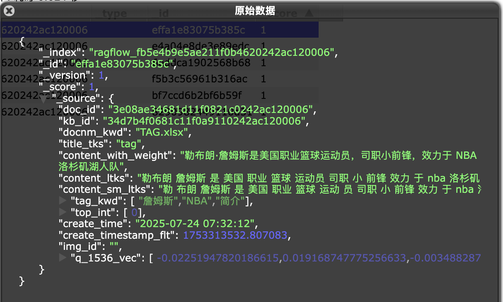
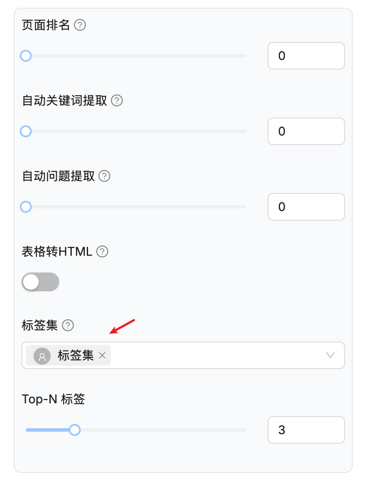
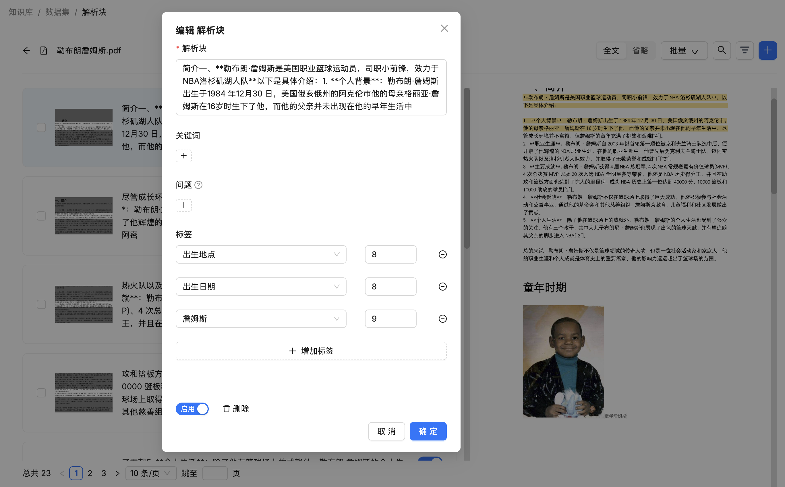

# 构建和使用 RAGFlow 的标签集

检索准确性是衡量生产级 RAG 框架的试金石。除了自动关键词提取、自动问题提取、知识图谱等提升检索效果的方法外，RAGFlow 还引入了自动提取标签的功能，它会根据每个知识块的相似性，自动将用户自定义标签集中的标签映射到知识库中的相关块。这些标签为现有的数据集增加了额外的层级领域知识，特别适用于各个片段彼此非常相似，以至于无法将目标片段与其他片段区分开的情况。例如，当你有少量关于 iPhone 的片段，而大多数是关于 iPhone 手机壳或配件时，如果没有额外信息，就很难检索到那些关于 iPhone 的片段。

要使用此功能，你必须先创建一个标签集，然后在知识库的配置页面中指定该标签集。我们今天就来学习如何构建和使用 **标签集（Tag Set）**。

## 构建标签集

在前面学习的 11 种切片方法中有一种叫 `Tag` 分块，这是一种特殊的知识库配置，使用 `Tag` 作为切片方法的知识库不会参与 RAG 的检索和问答流程，而是充当标签集的角色。其他知识库可以使用它来标记自己的分块，对这些知识库的查询也将使用此标签集进行标记。

首先我们创建一个知识库，选择 `Tag` 作为切片方法：



然后上传提前准备好的 Excel 标签文件，文件内容如下：



标签文件可以是 Excel、CSV 或 TXT 格式，文件内容需满足下面的格式要求：

* 如果文件是 Excel 格式，它应包含两列：第一列用于标签描述，第二列用于标签名称；不需要标题行，且支持多个工作表（Sheet）；
* 标签描述可以是示例分块或示例查询；
* 如果文件是 CSV 和 TXT 格式，必须采用 UTF-8 编码，且使用制表符（TAB）作为分隔符来分隔描述和标签；
* 在标签列中可以包含多个标签，使用逗号分隔；

然后点击 “解析” 按钮，解析完成后查看分块列表：



可以看到，标签集的第一列，也就是描述部分变成了知识库的分块，而第二列变成了该分块对应的标签列表。

在知识库的配置页面底部，我们可以以标签云的形式查看整个标签集：



标签越大代表出现的频次越高，或者以表格形式查看：



## 构建标签集的实现

构建标签集的逻辑主要位于 `Tag` 分块器，也就是 `rag/app/tag.py` 文件：

```python
def chunk(filename, binary=None, lang="Chinese", callback=None, **kwargs):
    
  # 分块基础信息
  res = []
  doc = {
    # 文件名
    "docnm_kwd": filename,
    # 对文件名进行分词
    "title_tks": rag_tokenizer.tokenize(re.sub(r"\.[a-zA-Z]+$", "", filename))
  }

  # 处理 Excel 文件
  if re.search(r"\.xlsx?$", filename, re.IGNORECASE):
    excel_parser = Excel()
    for ii, (q, a) in enumerate(excel_parser(filename, binary, callback)):
      res.append(beAdoc(deepcopy(doc), q, a, eng, ii))
    return res

  # 处理 TXT 文件
  elif re.search(r"\.(txt)$", filename, re.IGNORECASE):
    # ...

  # 处理 CSV 文件
  elif re.search(r"\.(csv)$", filename, re.IGNORECASE):
    # ...
```

其中比较关键的部分是 `beAdoc()` 函数，对每个标签描述和标签统一进行处理，组装文本块信息：

```python
def beAdoc(d, q, a, eng, row_num=-1):
  # 标签描述的原始内容
  d["content_with_weight"] = q
  # 对标签描述进行分词
  d["content_ltks"] = rag_tokenizer.tokenize(q)
  # 对标签描述再进行细粒度分词
  d["content_sm_ltks"] = rag_tokenizer.fine_grained_tokenize(d["content_ltks"])
  # 标签处理
  d["tag_kwd"] = [t.strip().replace(".", "_") for t in a.split(",") if t.strip()]
  # 行号记录
  if row_num >= 0:
    d["top_int"] = [row_num]
  return d
```

其中 `tokenize()` 对原始文本进行首次分词，感兴趣的可以看看里面的实现，包含完整的文本预处理，比如全角转半角、繁体转简体、去除非词字符、大小写转换等，然后使用 **正向/反向最大匹配算法** 进行中文分词，对有歧义的部分使用 DFS 进一步处理；`fine_grained_tokenize()` 对已分词的结果进行二次细分，它只处理 3-10 字符长度且中文词汇占比超过 20% 的文本，输出更细粒度的分词结果。

可以在 ES 中看到完整的文本块信息：



## 使用标签集

构建好标签集之后，我们就可以在其他知识库中使用它。接下来，我们创建一个新知识库，选择刚刚创建的标签集以及 Top-N 标签数量：



> 注意这里可以选择多个标签集。通常来讲一个标签集就足够了，当使用多个标签集时，确保它们彼此独立，否则，建议合并你的标签集。

然后在新知识库上传文件，等待解析完成后，查看分块详情，每个分块上都打上了用户自定义的标签：



在解析过程中，知识库中的每个分块都会与标签集中的每个条目进行比较，并根据相似度自动应用标签。可以看到，自动添加标签和昨天我们学习的自动提取关键词很像，这两个功能都增强了 RAGFlow 中的检索能力，它们之间的区别是：标签集是用户定义的封闭集合，而提取关键词则是开放集合。在使用自动添加标签功能之前，你必须手动构建好指定格式的标签集；自动提取关键依赖于大语言模型，并且会消耗大量的令牌。

## 自动提取标签的实现

当启用标签集功能时，文档分块之后会增加一些后处理逻辑，如下：

```python
async def build_chunks(task, progress_callback):

  # ...
  if task["kb_parser_config"].get("tag_kb_ids", []):
    
    # 从指定知识库中检索所有的标签，返回每个标签出现的频率
    kb_ids = task["kb_parser_config"]["tag_kb_ids"]
    all_tags = settings.retrievaler.all_tags_in_portion(tenant_id, kb_ids, S)

    # 基于统计的打标
    for d in docs:
      # 遍历所有的文本块，先用统计方法快速生成标签(基于相似文档的标签)
      if settings.retrievaler.tag_content(tenant_id, kb_ids, d, all_tags, topn_tags=topn_tags, S=S) and len(d[TAG_FLD]) > 0:
        # 成功生成标签的文档作为示例样本
        examples.append({"content": d["content_with_weight"], TAG_FLD: d[TAG_FLD]})
      else:
        # 统计方法失败的文档加入待处理列表
        docs_to_tag.append(d)

    # 绑定大模型
    chat_mdl = LLMBundle(task["tenant_id"], LLMType.CHAT, llm_name=task["llm_id"], lang=task["language"])

    # 基于大模型的智能打标
    async def doc_content_tagging(chat_mdl, d, topn_tags):

      # 缓存机制
      cached = get_llm_cache(chat_mdl.llm_name, d["content_with_weight"], all_tags, {"topn": topn_tags})
      if not cached:

        # 为每个文档准备 2 个随机示例
        picked_examples = random.choices(examples, k=2) if len(examples)>2 else examples
        if not picked_examples:
          picked_examples.append({"content": "This is an example", TAG_FLD: {'example': 1}})

        # 限制大模型并发路数，默认 10 路
        async with chat_limiter:
          cached = await trio.to_thread.run_sync(
            lambda: content_tagging(chat_mdl, d["content_with_weight"], all_tags, picked_examples, topn=topn_tags))
        if cached:
          cached = json.dumps(cached)
      if cached:
        set_llm_cache(chat_mdl.llm_name, d["content_with_weight"], cached, all_tags, {"topn": topn_tags})
        d[TAG_FLD] = json.loads(cached)

    # 启动并发任务，为每个文本块打标
    async with trio.open_nursery() as nursery:
      for d in docs_to_tag:
        nursery.start_soon(doc_content_tagging, chat_mdl, d, topn_tags)
```

核心代码我都加了注释，主要逻辑可以分为两部分：

1. 基于统计方法的快速打标：首先通过 `all_tags_in_portion()` 函数，从标签集中检索所有的标签，返回每个标签出现的频率；然后遍历所有的文本块，调用 `tag_content()` 函数检索相似分块，根据统计算法快速生成标签；
2. 基于大模型的智能打标：从统计打标成功的分块中随机抽两条作为示例样本，让大模型对统计打标失败的分块进行处理；

通过这种先用统计方法快速匹配、失败后再调用大模型的两阶段策略，RAGFlow 实现了高效的自动提取标签流程。

其中，在统计方法快速打标的实现中，有两个函数比较有意思，可以深入看一下：

```python
def all_tags_in_portion(self, tenant_id: str, kb_ids: list[str], S=1000):
  # 在指定知识库中搜索所有文档的 tag_kwd 字段
  res = self.dataStore.search([], [], {}, [], OrderByExpr(), 0, 0, index_name(tenant_id), kb_ids, ["tag_kwd"])
  # 统计每个标签的出现次数
  res = self.dataStore.getAggregation(res, "tag_kwd")
  # 计算所有标签的总出现次数
  total = np.sum([c for _, c in res])
  # 返回每个标签的出现频率
  return {t: (c + 1) / (total + S) for t, c in res}
```

这个函数从标签集中检索所有的标签，并返回每个标签出现的频率，在计算每个标签出现的频率时使用了 **拉普拉斯平滑（Laplace Smoothing）** 公式：


拉普拉斯平滑也称为 **加一平滑（Add-One Smoothing）**，是一种在概率估计中用于解决 “零概率问题” 的技术，广泛应用于自然语言处理和机器学习等领域。这里通过拉普拉斯平滑将每个标签出现的频率归一化，为后续的相似度计算提供权重，用于标签相关性评分。

```python
def tag_content(self, tenant_id: str, kb_ids: list[str], doc, all_tags, topn_tags=3, keywords_topn=30, S=1000):
  # 合并文档标题和内容的分词结果，提取关键词，构造查询条件 MatchTextExpr
  match_txt = self.qryr.paragraph(doc["title_tks"] + " " + doc["content_ltks"], doc.get("important_kwd", []), keywords_topn)
  # 用构造的查询条件搜索相似文档，只返回 tag_kwd 字段
  res = self.dataStore.search([], [], {}, [match_txt], OrderByExpr(), 0, 0, idx_nm, kb_ids, ["tag_kwd"])
  # 获取搜索结果中标签的出现频次
  aggs = self.dataStore.getAggregation(res, "tag_kwd")
  # 如果没有找到相关标签则返回 False
  if not aggs:
    return False
  # 总标签数
  cnt = np.sum([c for _, c in aggs])
  # 计算相关性得分，按得分降序排序，取前 3 个
  tag_fea = sorted([(a, round(0.1*(c + 1) / (cnt + S) / max(1e-6, all_tags.get(a, 0.0001)))) for a, c in aggs], key=lambda x: x[1] * -1)[:topn_tags]
  # 将计算出的标签得分保存到文档的 TAG_FLD 字段
  doc[TAG_FLD] = {a.replace(".", "_"): c for a, c in tag_fea if c > 0}
  return True
```

这个函数针对当前分块，从标签库中检索出相似分块，根据标签的相关性得分为分块生成标签。这里最复杂的是计算相关性得分这一步，不过将公式展开可以发现它其实就是 TF-IDF 公式：


**TF-IDF（Term Frequency-Inverse Document Frequency）** 是一种常用于信息检索和文本挖掘的统计方法，用于评估一个词在文档集合中的重要程度。它通过计算词的 **词频（TF）** 和 **逆文档频率（IDF）** 的乘积，突出对特定文档有区分性的词，抑制常见词的影响：

- **词频（TF）**：一个词在文档中出现的频率越高，通常越重要；上面的 `(c + 1) / (cnt + S)` 就是在计算词频（某个标签出现的频率）；
- **逆文档频率（IDF）**：一个词在整个文档集合中出现的文档数越少，越稀有，其携带的信息量越大，权重越高；上面的 `1 / max(1e-6, all_tags.get(a, 0.0001))` 就是逆文档频率，`max(1e-6, ...)` 防止除零错误；值得注意的是，在经典的 TF-IDF 公式里，`IDF = log(总文档数 / 包含该词的文档数)`，这里采用倒数算是一种变体吧，好处是简单高效，易于实现和计算。

通过计算 TF-IDF 相关性得分，为输入文档自动标注最相关的 3 个标签，这就是基于统计的打标原理。而基于大模型的智能打标就比较简单了，使用的提示词如下：

```
## 角色
你是一名文本分析员。

## 任务
根据示例和完整的标签集，为给定的一段文本内容添加标签（标记）。

## 步骤
- 查看标签集。
- 查看示例，所有示例均包含文本内容和带有相关度评分的已分配标签（JSON格式）。
- 总结文本内容，并从标签集中选取与文本最相关的前{{ topn }}个标签及其相应的相关度评分进行标记。

## 要求
- 标签必须来自标签集。
- 输出必须仅为JSON格式，键为标签，值为其相关度评分。
- 相关度评分必须在1到10之间。
- 仅输出关键词。

# 标签集
{{ all_tags | join(', ') }}



# 示例 {{ loop.index0 }}
### 文本内容
{{ ex.content }}

输出：
{{ ex.tags_json }}



# 真实数据
### 文本内容
{{ content }}
```

## 小结

今天我们详细学习了 RAGFlow 中标签集的构建和使用方法。通过创建一个专门的 `Tag` 类型知识库，我们可以为 RAG 系统引入一套自定义的、封闭的领域知识标签，从而显著提升检索的精准度。

我们探讨了以下核心内容：

- **构建标签集**：如何创建 `Tag` 类型的知识库，并上传符合格式要求的标签描述文件。
- **使用标签集**：如何在其他知识库中启用标签集，实现对文本块的自动标注。
- **两阶段打标策略**：深入分析了 RAGFlow 如何结合高效的统计方法和精准的大模型方法为文本块自动分配最相似的标签。

通过合理利用标签集，我们可以为知识库增加更丰富的语义层次，尤其是在处理内容相似度高、难以区分的文档时，标签能够提供关键的区分信息，是优化 RAG 检索效果的重要手段。

至此，我们已经全面学习了 RAGFlow 知识库的所有配置选项。从基础的分块方法到高级的 RAPTOR、知识图谱和标签集，掌握这些配置将使我们能够根据不同场景，构建出更加强大和智能的 RAG 应用。接下来，我们将开始探索 RAGFlow 的另一核心部分：检索与问答。
