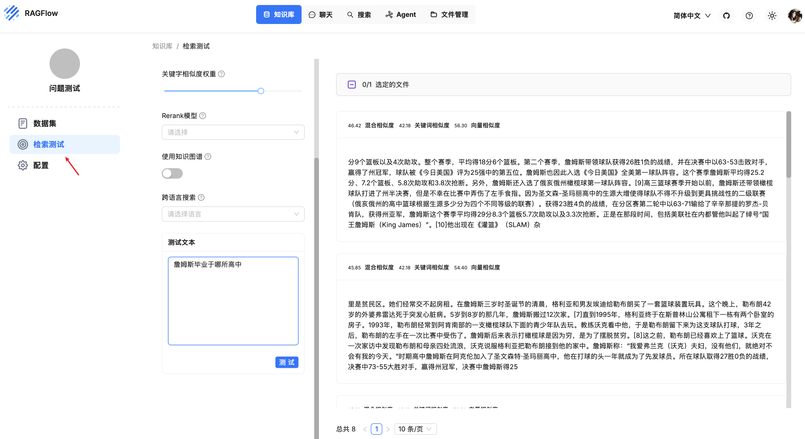
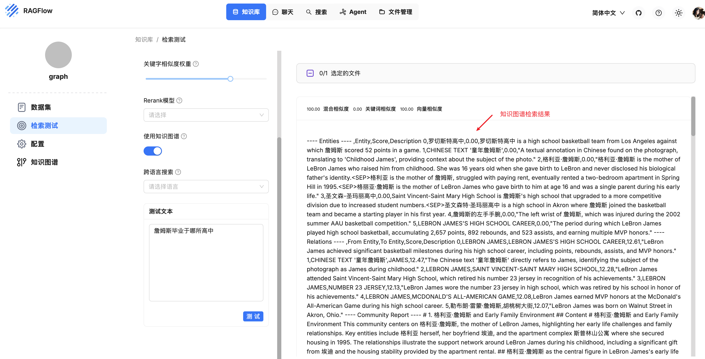

# 学习 RAGFlow 的检索流程

经过一段时间的学习，我们已经深入了解了 RAGFlow 从文件上传、解析、分块到知识库构建的全过程，并探索了 RAPTOR、知识图谱、标签集等高级功能。至此，知识库的构建阶段已经完成，接下来我们将进入 RAG 应用的核心环节：**检索与问答**。

我们今天先学习 RAGFlow 的检索测试功能。

## 运行检索测试

当知识库构建完毕，我们需要验证下知识库的配置是否有效。RAGFlow 在知识库页面提供了一个 “检索测试” 的功能，我们可以在这里快速提问，检查是否能够检索到预期的文档块：



> 注：在运行检索测试之前，确保你的文件已上传并成功解析。

就像微调精密仪器一样，RAGFlow 需要仔细调试才能实现最佳问答性能，你的知识库设置、聊天助手配置以及所指定的模型配置都可能对最终结果产生重大影响。因此在继续配置聊天助手之前建议先运行一次检索测试，验证目标片段是否能够被检索出来，从而帮助你快速发现需要改进的地方或定位需要解决的问题。例如，在调试问答系统时，如果知道可以检索到正确的片段，就可以将精力集中在其他方面。

你可以通过调整下面这些参数来运行检索测试：

* **相似度阈值（Similarity threshold）**：如果查询语句和分块之间的相似度小于此阈值，则该分块将被过滤掉，默认设置为 0.2，也就是说文本块的相似度得分至少 20 才会被召回；
* **关键字相似度权重（Keyword similarity weight）**：RAGFlow 使用混合相似度得分来评估两行文本之间的距离，它结合了关键词相似度和向量相似度，这个参数用于设置关键词相似度在混合相似度得分中的权重，默认情况下，该值为 0.7，使得另一个组成部分的权重为 0.3，两个权重之和为 1.0；
* **重排序模型（Rerank model）**：上面提到混合相似度得分结合了关键词相似度和向量相似度，这其实是没有配置重排序模型时的算法，当配置了重排序模型，那么混合相似度得分中的向量相似度将由重排序分数替代，混合相似度得分将结合关键词相似度和重排序分数；
* **使用知识图谱（Use knowledge graph）**：启用该配置前，确保知识图谱已成功构建，它会检索知识图谱相关文本块，以处理复杂的多跳问题。在知识图谱中，实体描述、关系描述或社区报告各自作为独立的片段存在，因此启用该配置将涉及对实体、关系和社区报告文本块的多次检索，会显著延长检索时间；
* **跨语言搜索（Cross-language search）**：选择一种或多种语言进行跨语言搜索，如果未选择任何语言，系统将使用原始查询进行搜索。

## 检索测试源码解读

检索测试调用的接口为 `/v1/chunk/retrieval_test`，入口代码位于 `api/apps/chunk_app.py` 文件：

```python
@manager.route('/retrieval_test', methods=['POST'])
def retrieval_test():

  # 查看知识库详情
  kb = KnowledgebaseService.get_by_id(kb_ids[0])

  # 开启跨语言搜索，将用户问题翻译成其他语言
  if langs:
    question = cross_languages(kb.tenant_id, None, question, langs)

  # 从用户问题中提取关键词，拼接到用户问题上
  if req.get("keyword", False):
    chat_mdl = LLMBundle(kb.tenant_id, LLMType.CHAT)
    question += keyword_extraction(chat_mdl, question)

  # 如果知识库配置了标签集，给用户问题打上标签
  labels = label_question(question, [kb])

  # 检索的核心逻辑
  ranks = settings.retrievaler.retrieval(question, ..., rank_feature=labels)

  # 检索知识图谱，结果插到第一条
  if use_kg:
    ck = settings.kg_retrievaler.retrieval(question, ...)
    if ck["content_with_weight"]:
      ranks["chunks"].insert(0, ck)

  return get_json_result(data=ranks)
```

> 这里的 `req.get("keyword")` 这个参数比较奇怪，看起来应该是 “是否启用关键词” 之类的开关，但是我在页面上并没有找到对应的配置。

核心逻辑已有注释标出，下面对这里的几个关键函数分节讨论。

## 跨语言搜索

默认情况下，未选择目标语言，系统只会使用原始查询进行搜索，当知识库包含多种语言文档时，或者存在某些专业术语在不同语言中的表达差异时，单语言查询可能导致遗漏其他语言的相关信息。开启跨语言搜索后，RAGFlow 会将用户的单语言查询扩展为多语言版本，以提高跨语言文档检索的准确性。

跨语言搜索的第一步是将用户的问题翻译成目标语言，使用大模型完成，逻辑比较简单：

```python
def cross_languages(tenant_id, llm_id, query, languages=[]):

  # 绑定大模型
  chat_mdl = LLMBundle(tenant_id, LLMType.CHAT, llm_id)

  # 组装提示词
  rendered_sys_prompt = PROMPT_JINJA_ENV.from_string(CROSS_LANGUAGES_SYS_PROMPT_TEMPLATE).render()
  rendered_user_prompt = PROMPT_JINJA_ENV.from_string(CROSS_LANGUAGES_USER_PROMPT_TEMPLATE).render(query=query, languages=languages)

  # 调用大模型，过滤 <think> 标签中思考的内容
  # 采用 temperature=0.2 低温度采样，确保翻译的一致性和准确性
  ans = chat_mdl.chat(rendered_sys_prompt, [{"role": "user", "content": rendered_user_prompt}], {"temperature": 0.2})
  ans = re.sub(r"^.*</think>", "", ans, flags=re.DOTALL)

  # 出错时返回原始查询
  if ans.find("**ERROR**") >= 0:
    return query

  # 返回多语言查询
  return "\n".join([a for a in re.sub(r"(^Output:|\n+)", "", ans, flags=re.DOTALL).split("===") if a.strip()])
```

> 这里感觉有个 BUG，看下面的提示词，RAGFlow 使用 ### 分隔不同语言版本，但是这里却使用 === 分隔。

使用提示词如下：

```
## 角色
一个高效的多语言翻译器。

## 行为规则
1. 接收以下格式的批量翻译请求：
   **输入：** `[文本]`
   **目标语言：** 逗号分隔的列表

2. 保持：
   - 原始格式（表格、列表、间距）
   - 专业术语的准确性
   - 文化背景的适宜性

3. 以下列格式输出翻译：

[语言1的翻译]
###
[语言2的翻译]
```

下面是一个输入和输出的示例：

```
**输入：**
Hello World! Let's discuss AI safety.
===
Chinese, French, Japanese

**输出：**
你好世界！让我们讨论人工智能安全问题。
###
Bonjour le monde ! Parlons de la sécurité de l'IA.
###
こんにちは世界！AIの安全性について話し合いましょう。
```

## 检索的核心逻辑

检索的核心逻辑位于 `rag/nlp/search.py` 中的 `retrieval()` 方法，它通过结合向量相似度和全文检索执行混合语义搜索，同时提供重排序和分页功能，返回相关文档片段及相似度评分：

```python
def retrieval(self, question, ...):
    
  # 通过 “关键词加权 + 语义向量匹配” 双重方式进行 ES 检索
  sres = self.search(req, [index_name(tid) for tid in tenant_ids], kb_ids, embd_mdl, highlight, rank_feature=rank_feature)

  if rerank_mdl and sres.total > 0:
    # 使用外部模型重排序
    sim, tsim, vsim = self.rerank_by_model(rerank_mdl, sres, question, 1 - vector_similarity_weight, vector_similarity_weight, rank_feature=rank_feature)
  else:
    # 使用内置重排序算法
    sim, tsim, vsim = self.rerank(sres, question, 1 - vector_similarity_weight, vector_similarity_weight, rank_feature=rank_feature)

  # 组装返回结果
  idx = np.argsort(sim * -1)[(page - 1) * page_size:page * page_size]
  for i in idx:
    d = {
      "chunk_id": id,
      "content_ltks": chunk["content_ltks"],
      ...
    }
    ranks["chunks"].append(d)
  return ranks
```

整体逻辑比较清晰，首先通过 ES 的关键词和向量检索，然后对检索结果进行重排序。第一步其实就是调用 ES 的查询接口，感兴趣的可以将 ES 查询语句打印出来看看，类似于下面这样：

```json
{
  "query": {
    "bool": {
      "must": [
        {
          "query_string": {
            "fields": [
              "title_tks^10",
              "title_sm_tks^5",
              "important_kwd^30",
              "important_tks^20",
              "question_tks^20",
              "content_ltks^2",
              "content_sm_ltks"
            ],
            "type": "best_fields",
            "query": "((毕业)^0.3859298493710235 (\"哪 所\")^0.22073633367349388 (詹姆斯 OR \"詹姆斯\" OR (\"詹姆斯\"~2)^0.5)^0.2003688922699708 (高中)^0.19296492468551174 (\"詹姆斯 毕业 于 哪 所 高中\"~2)^1.5)",
            "minimum_should_match": "30%",
            "boost": 1
          }
        }
      ],
      "filter": [
        {
          "terms": {
            "kb_id": [
              "d580f9bc65b911f0a5d20242ac120006"
            ]
          }
        },
        {
          "bool": {
            "must_not": [
              {
                "range": {
                  "available_int": {
                    "lt": 1
                  }
                }
              }
            ]
          }
        }
      ],
      "boost": 0.050000000000000044
    }
  },
  "knn": {
    "field": "q_1536_vec",
    "k": 1024,
    "num_candidates": 2048,
    "query_vector": [
      -0.018787164241075516,
      -0.016176467761397362,
      0.0048667327500879765,
      0.007344431709498167,
      ...
    ],
    "filter": {
      // 和上面的 `query` 部分一致
    },
    "similarity": 0.2
  },
  "from": 0,
  "size": 60
}
```

整个查询分为 `query` 核心查询部分和 `knn` 向量检索部分。其中 `query` 部分比较有意思，通过 `query_string` 实现多字段加权检索，具体规则如下：

- 检索字段及权重：对多个字段设置不同权重，优先匹配重要性高的字段，例如：重要关键词权重最高（`important_kwd^30`，`important_tks^20`），问题和标题字段次之（`question_tks^20`，title_tks^10），内容相关字段权重较低（`content_ltks^2`）等；
- 检索关键词及权重：
  - 核心词：`毕业`（权重0.386）、`哪所`（0.221）、`詹姆斯`（0.200）、`高中`（0.193）
  - 短语匹配：`“詹姆斯 毕业 于 哪 所 高中”~2`（允许短语中词语间隔不超过2个词，权重1.5，优先匹配连贯短语）
- 匹配阈值：`minimum_should_match: "30%"`，确保至少匹配 30% 的关键词，避免结果过于宽泛。

这里多字段加权检索是通过 `FulltextQueryer` 中的 `question()` 生成的，感兴趣的可以深入看下这个函数的逻辑。另外，对查询语法感兴趣的同学也可以参考 ES 的 Query DSL 文档：

* https://www.elastic.co/docs/explore-analyze/query-filter/languages/querydsl

返回检索结果后，RAGFlow 接着会计算每条结果的综合得分，对其进行重排序。如果没有配置重排序模型，综合得分由关键词相似度和向量相似度加权计算，如果配置了重排序模型，则使用关键词相似度和重排序得分加权计算。此外，还需要综合考虑标签的特征相似度和 PageRank 分数等。

> 使用重排序模型会显著增加检索耗时，建议使用 SaaS 服务，譬如 [Cohere](https://cohere.com/)、[Jina](https://jina.ai/) 等，如果你倾向于使用本地部署，请务必使用 GPU 推理。

## 检索知识图谱

如果开启了知识图谱，在检索的最后阶段，还会检索知识图谱相关文本块，这块的逻辑比较复杂，其核心代码如下：

```python
def retrieval(self, question: str, ...):
    
  # 使用大模型分析用户问题，从用户问题中提取实体类型（ty_kwds）以及实体（ents）
  # 提示词参考 [MiniRAG](https://github.com/HKUDS/MiniRAG)
  ty_kwds, ents = self.query_rewrite(llm, qst, [index_name(tid) for tid in tenant_ids], kb_ids)

  # 根据提取实体的向量，从图中查找相似的实体
  ents_from_query = self.get_relevant_ents_by_keywords(ents, filters, idxnms, kb_ids, emb_mdl, ent_sim_threshold)

  # 根据提取的实体类型，从图中查询实体
  ents_from_types = self.get_relevant_ents_by_types(ty_kwds, filters, idxnms, kb_ids, 10000)

  # 根据用户问题的向量，从图中查询相似的关系
  rels_from_txt = self.get_relevant_relations_by_txt(qst, filters, idxnms, kb_ids, emb_mdl, rel_sim_threshold)

  # 这里还有很多细碎的计算得分的逻辑，包括：
  # 1. N 跳路径分析，遍历每个实体的多跳邻居路径，相似度按 1/(2+跳数) 衰减，多条路径的相似度累加；
  # 2. 相似度增强策略，包括实体增强和关系增强，比如同时出现在类型检索和关键词检索中的实体，相似度翻倍，等等；

  # 将这些检索到的实体和关系的 PageRank 值与其对查询的相似度分数相乘进行排序，返回 topN 默认前 6 个
  ents_from_query = sorted(ents_from_query.items(), key=lambda x: x[1]["sim"] * x[1]["pagerank"], reverse=True)[:ent_topn]
  rels_from_txt = sorted(rels_from_txt.items(), key=lambda x: x[1]["sim"] * x[1]["pagerank"], reverse=True)[:rel_topn]

  # 返回最终结果，检索涉及最终检索中实体最多的社区的报告
  return {
      "chunk_id": get_uuid(),
      "content_with_weight": ents + relas + self._community_retrival_(...),
    }
```

检索知识图谱的过程涉及对实体、关系和社区报告文本块的多次检索，大体流程包括下面几个步骤：

1. 使用大模型从用户的查询中提取实体及实体类型；
2. 根据提取的实体，计算它们的嵌入向量，从图中查找相似实体及其 N 跳关系；
3. 根据提取的实体类型，基于它们的 PageRank 值从图中检索排名前 N 的实体；
4. 计算用户的查询嵌入，从图中检索相似的关系；
5. 将这些检索到的实体和关系的 PageRank 值与其对查询的相似度分数相乘进行排序，返回前 N 个作为最终检索结果；
6. 检索涉及最终结果中实体最多的社区的报告；

知识图谱的检索结果最终全部拼接在一起，插入到返回结果的第一条，如下所示：



## 小结

今天我们详细学习了 RAGFlow 的检索测试功能，这是验证和调试知识库配置的关键步骤。我们深入探讨了其背后的核心检索逻辑和多种高级功能，主要包括：

- **跨语言搜索**: 将用户的单语言查询扩展为多语言版本，以提高跨语言文档检索的准确性；
- **混合检索策略**：结合关键词全文检索（`query_string`）和向量相似度（`knn`）在 Elasticsearch 中实现混合搜索；
- **多字段加权**：通过为不同字段（如标题、关键词、内容）设置不同权重来优化检索；
- **重排序**：使用内置算法和外部重排序模型对检索结果进行排序；
- **知识图谱检索**：检索知识图谱中和用户问题相关的实体、关系和社区报告等；

通过今天的学习，我们对 RAGFlow 的检索机制有了全面的了解。接下来，我们将把目光投向最终的问答环节，看看 RAGFlow 是如何利用这些检索到的信息，结合大语言模型生成精准回答的。
