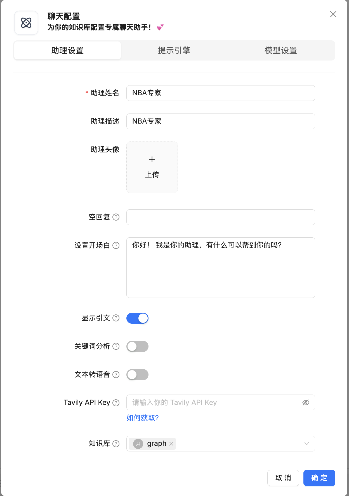

# 学习 RAGFlow 的问答流程

昨天，我们详细学习了 RAGFlow 的检索测试功能，深入了解了其如何通过混合检索、重排序、知识图谱等多种策略从知识库中高效地召回相关信息。然而，检索只是整个 RAG 流程的第一步，召回的文本块并不能直接作为最终答案呈现给用户。为了生成连贯、精准的回答，RAGFlow 还需要将这些检索到的信息与用户的问题一起，通过精心设计的提示词提交给大语言模型进行综合处理。

今天，我们将深入探讨 RAGFlow 的问答流程，学习如何创建一个聊天助手，了解其背后的配置参数，并分析从接收用户问题、执行检索、组装上下文到最终生成回答的完整源码实现。此外，我们还会研究 RAGFlow 提供的独立 AI 搜索功能，看看它与检索测试或问答流程有何不同。

## 创建聊天助手

一旦你创建了知识库、完成了文件解析并进行了检索测试，就可以开始 AI 对话了。点击页面顶部中间的 “聊天” 标签，然后点击 “新建助理” 按钮，打开聊天配置对话框：



创建聊天助手时，我们需要配置一系列参数，这些参数共同决定了问答的效果，这些配置分为三大块：助理设置、提示引擎、模型设置。助理设置参数如下：

* **助理姓名**：为聊天助手取个合适的名称。
* **助理描述**：简单描述聊天助手的使用场景。
* **助理头像**：为聊天助手配个好看的头像。
* **空回复**：如果在知识库中没有检索到用户的问题，将统一使用它作为兜底回复；如果希望让大模型来回答，请将此留空。
* **设置开场白**：用户打开对话窗口时，系统自动发送的第一条消息。
* **显示引文**：默认启用，展示回答所依据的信息来源。
* **关键词分析**：使用大模型分析用户的问题，提取在相关性计算中要强调的关键词。我们昨天在学习检索测试时遇到了一个没用的参数 `req.get("keyword")`，看来就是这个功能了。
* **文本转语音**：将回答内容转换为语音，请先在设置里面选择 TTS 模型。
* **Tavily API Key**：如果配置有效，将使用 Tavily 进行网络搜索作为知识库的补充。这个参数放在这感觉有点格格不入，改成 “开启联网搜索” 是不是更好点？
* **知识库**：将聊天助手与一个或多个知识库进行绑定。注意，如果这里选择多个知识库，请确保它们使用相同的嵌入模型，否则会发生错误。

切换到提示引擎配置页面：


这个页面的配置参数如下：

* **系统提示词**：大模型回答问题需要遵循的说明，比如角色设计、回复长度、回复语言等。如果模型原生支持在问答中推理，可以通过 `//no_thinking` 关闭自动推理。
* **相似度阈值**：如果查询和分块之间的相似度小于此阈值，则该分块将被过滤掉。默认设置为 0.2，也就是说文本块的混合相似度得分至少 20 才会被召回。
* **关键字相似度权重**：RAGFlow 使用混合相似度得分来评估两行文本之间的距离，它是加权关键词相似度和向量余弦相似度。两个权重的总和为 1.0。
* **Top N**：该参数决定最终输入大模型的有多少分块。也就是说，并非所有相似度得分高于相似度阈值的分块都会被提供给大语言模型，大模型只能看到这些 Top N 分块。
* **多轮对话优化**：在多轮对话的中，对知识库查询的问题进行优化。会调用大模型额外消耗令牌。
* **使用知识图谱**：是否检索与所选知识库对应的知识图谱相关文本块，以处理复杂的多跳问题？这一过程将涉及对实体、关系和社区报告文本块的多次检索，会显著延长检索时间。
* **推理**：在回复时使用类似 Deepseek-R1 或 OpenAI o1 等模型的推理过程，启用后，该功能允许模型访问外部知识，并借助思维链推理等技术逐步解决复杂问题。通过将问题分解为可处理的步骤，这种方法增强了模型提供准确回答的能力，从而在需要逻辑推理和多步思考的任务上表现更优。
* **重排序模型**：非必选项，若不选择，系统将默认采用关键词相似度与向量余弦相似度相结合的混合查询方式；如果设置了重排序模型，则混合查询中的向量相似度部分将被重排序打分替代。
* **跨语言搜索**：选择一种或多种语言进行跨语言搜索。如果未选择任何语言，系统将使用原始查询进行搜索。
* **变量**：通过变量动态调整大模型的系统提示词，`{knowledge}` 为系统预留变量，代表从指定知识库召回的文本块，所有变量都必须用大括号 `{}` 括起来。如果你在这里自定义了其他变量，唯一可以传递其值的方法是调用助手的对话 API，比如 [SDK](https://ragflow.io/docs/dev/python_api_reference#converse-with-chat-assistant) 或 [HTTP](https://ragflow.io/docs/dev/http_api_reference#converse-with-chat-assistant) 方式。

可以看到这里的大多数配置参数昨天在学习 “检索测试” 时都已经见过，今天重点学习那些新的参数，比如多轮对话优化、推理、变量等。

再切换到模型设置页面：


这里主要是大模型相关的参数：

* **模型**：选择用于生成最终答案的大语言模型。
* **温度**：控制生成文本的随机性，值越高，答案越具创造性；值越低，答案越确定。
* **Top P**：一种采样策略，与温度类似，用于控制生成文本的多样性。
* **存在处罚**：这会通过惩罚对话中已经出现的单词来阻止模型重复相同的信息，更高的存在惩罚值意味着鼓励模型在回复中包含更多样化的标记。
* **频率惩罚**：与存在惩罚类似，这减少了模型频繁重复相同单词的倾向。
* **最大令牌数**：限制生成答案的长度。

下面这些参数不懂也没关系，可以通过 “自由度” 来统一调整，RAGFlow 内置了三种自由度：

* **即兴发挥**：温度值较高（0.8），意味着生成更有创意的回复。
* **精确**：温度值较低（0.2），意味着生成更为保守的回复。
* **平衡**：温度值居中（0.5），是谨慎与自由之间的平衡。

完成这些配置后，一个功能完备的聊天助手就创建好了，我们可以开始进行问答交互：


注意每次回复的上方有一个小灯泡，点击它可以看到送给大模型的完整提示词，以及各个步骤消耗的时间和令牌：


## 标准问答流程解析

当用户在聊天窗口输入问题并点击发送时，前端会调用 `/v1/conversation/completion` 接口，从而触发整个后端的问答逻辑。这个接口的入口位于 `api/apps/conversation_app.py` 文件：

```python
@manager.route("/completion", methods=["POST"])
def completion():

    # 查询会话
    conv = ConversationService.get_by_id(req["conversation_id"])

    # 流式回复
    def stream():
        # 调用核心 chat 方法
        for ans in chat(dia, msg, True, **req):
            ans = structure_answer(conv, ans, message_id, conv.id)
            yield "data:" + json.dumps({"code": 0, "message": "", "data": ans}, ensure_ascii=False) + "\n\n"
        # 更新会话
        ConversationService.update_by_id(conv.id, conv.to_dict())
        
        yield "data:" + json.dumps({"code": 0, "message": "", "data": True}, ensure_ascii=False) + "\n\n"

    # 流式接口，使用 SSE 回复
    resp = Response(stream(), mimetype="text/event-stream")
    resp.headers.add_header("Cache-control", "no-cache")
    resp.headers.add_header("Connection", "keep-alive")
    resp.headers.add_header("X-Accel-Buffering", "no")
    resp.headers.add_header("Content-Type", "text/event-stream; charset=utf-8")
    return resp
```

可以看到，接口本身主要负责处理流式响应，真正的核心逻辑被封装在了 `chat()` 方法中。这个方法位于 `api/db/services/dialog_service.py`，是整个问答流程的中枢：

```python
def chat(dialog, messages, stream=True, **kwargs):
    
  # 如果助手没有关联知识库且没有配置 Tavily API，则调用 chat_solo 进行纯大模型对话
  if not dialog.kb_ids and not dialog.prompt_config.get("tavily_api_key"):
    for ans in chat_solo(dialog, messages, stream):
      yield ans
    return

  # 绑定嵌入、重排序、聊天、TTS 等模型
  kbs, embd_mdl, rerank_mdl, chat_mdl, tts_mdl = get_models(dialog)

  # SQL 检索优化
  # 这里比较有意思，当 `field_map` 不为空时，直接使用 SQL 而非向量检索，优化检索性能
  field_map = KnowledgebaseService.get_field_map(dialog.kb_ids)
  if field_map:
    ans = use_sql(questions[-1], field_map, dialog.tenant_id, chat_mdl, prompt_config.get("quote", True))
    if ans:
      yield ans
      return

  # 多轮对话优化，对历史对话进行重写，生成便于检索的完整问题
  if len(questions) > 1 and prompt_config.get("refine_multiturn"):
    questions = [full_question(dialog.tenant_id, dialog.llm_id, messages)]
  else:
    questions = questions[-1:]

  # 跨语言处理，支持多语言查询转换
  if prompt_config.get("cross_languages"):
    questions = [cross_languages(dialog.tenant_id, dialog.llm_id, questions[0], prompt_config["cross_languages"])]

  # 关键词增强，提取关键词增强检索效果
  if prompt_config.get("keyword", False):
    questions[-1] += keyword_extraction(chat_mdl, questions[-1])

  
  kbinfos = {"total": 0, "chunks": [], "doc_aggs": []}
  if prompt_config.get("reasoning", False):
    # 深度推理模式
    reasoner = DeepResearcher(chat_mdl, prompt_config, ...)
    for think in reasoner.thinking(kbinfos, " ".join(questions)):
      # ...
  else:
    # 标准检索模式
    kbinfos = retriever.retrieval(" ".join(questions), embd_mdl, ...)
    if prompt_config.get("tavily_api_key"):
      # 集成 Tavily 网络搜索
      tav = Tavily(prompt_config["tavily_api_key"])
      tav_res = tav.retrieve_chunks(" ".join(questions))
      kbinfos["chunks"].extend(tav_res["chunks"])
      kbinfos["doc_aggs"].extend(tav_res["doc_aggs"])
    if prompt_config.get("use_kg"):
      # 知识图谱检索
      ck = settings.kg_retrievaler.retrieval(" ".join(questions), ...)
      if ck["content_with_weight"]:
        kbinfos["chunks"].insert(0, ck)

  # 如果检索结果为空，兜底回复
  if not knowledges and prompt_config.get("empty_response"):
    empty_res = prompt_config["empty_response"]
    yield {"answer": empty_res, "reference": kbinfos, "prompt": "\n\n### Query:\n%s" % " ".join(questions), "audio_binary": tts(tts_mdl, empty_res)}
    return {"answer": prompt_config["empty_response"], "reference": kbinfos}

  # 组装提示词，替换系统提示词中的变量，开启引用的提示词
  msg = [{"role": "system", "content": prompt_config["system"].format(**kwargs)}]
  prompt4citation = ""
  if knowledges and (prompt_config.get("quote", True) and kwargs.get("quote", True)):
    prompt4citation = citation_prompt()
  msg.extend([{"role": m["role"], "content": re.sub(r"##\d+\$\$", "", m["content"])} for m in messages if m["role"] != "system"])
  # 确保对话消息不超过模型的 token 限制
  used_token_count, msg = message_fit_in(msg, int(max_tokens * 0.95))
  prompt = msg[0]["content"]

  # 格式化返回结果
  def decorate_answer(answer):
    # 引用处理
    if knowledges and (prompt_config.get("quote", True) and kwargs.get("quote", True)):
      idx = set([])
      if embd_mdl and not re.search(r"\[ID:([0-9]+)\]", answer):
        answer, idx = retriever.insert_citations(answer, ...)
      else:
        for match in re.finditer(r"\[ID:([0-9]+)\]", answer):
          i = int(match.group(1))
          if i < len(kbinfos["chunks"]):
            idx.add(i)

      # 修复错误引用格式
      answer, idx = repair_bad_citation_formats(answer, kbinfos, idx)

    # 返回完整结果，包括引用，提示词，详细时间统计等
    return {"answer": think + answer, "reference": refs, "prompt": re.sub(r"\n", "  \n", prompt), "created_at": time.time()}

  # 调用大模型流式输出
  for ans in chat_mdl.chat_streamly(prompt + prompt4citation, msg[1:], gen_conf):
    # 流式输出，支持 TTS 文本转语音
    yield {"answer": thought + answer, "reference": {}, "audio_binary": tts(tts_mdl, delta_ans)}
  # 最终完整答案
  yield decorate_answer(thought + answer)
```

整个问答的逻辑有点复杂，但是主要脉络还是比较清晰的，主要分为四步：**问题处理** -> **检索** -> **提示词组装** -> **答案生成**，在上面的代码中基本上已经加了注释，感兴趣的同学可以结合源码进行研究。其中有一些检索相关的内容，我们昨天已经介绍过，可以结合上一篇的内容一起学习。

## AI 搜索

除了在聊天助手中进行问答，RAGFlow 还在知识库页面提供了一个独立的 “AI 搜索” 功能：


AI 搜索和聊天助手的区别在于：聊天助手是一个多轮的 AI 对话，我们可以自定义检索策略，自定义聊天模型；而 AI 搜索使用预定义的检索策略（要么是加权关键词和向量的混合检索，要么是基于图谱的检索，根据知识库的配置决定）以及系统默认的聊天模型进行单轮 AI 对话，它不涉及关键词提取或问题提取等高级 RAG 策略。相关片段会按照相似度得分从高到低排列，显示在聊天模型回复的下方。

> 可以看出，它和 “检索测试” 很像，在调试聊天助手时，我们也可以使用 AI 搜索作为参考，以验证模型设置和检索策略是否生效。

AI 搜索旨在提供一种更接近于现代搜索引擎的体验：用户输入查询，系统不仅返回相关文档列表，还会基于这些文档生成一个精炼的摘要式答案。此外，它还提供了一个思维导图的功能，点击搜索结果右边的回形针按钮即可生成：


AI 搜索的接口为 `/v1/conversation/ask`，其后端实现位于 `api/apps/conversation_app.py` 文件中：

```python
@manager.route("/ask", methods=["POST"])
def ask_about():

  # 流式输出
  def stream():
    for ans in ask(req["question"], req["kb_ids"], uid):
      yield "data:" + json.dumps({"code": 0, "message": "", "data": ans}, ensure_ascii=False) + "\n\n"   
    yield "data:" + json.dumps({"code": 0, "message": "", "data": True}, ensure_ascii=False) + "\n\n"

  # 使用 SSE 流式输出
  resp = Response(stream(), mimetype="text/event-stream")
  resp.headers.add_header("Cache-control", "no-cache")
  resp.headers.add_header("Connection", "keep-alive")
  resp.headers.add_header("X-Accel-Buffering", "no")
  resp.headers.add_header("Content-Type", "text/event-stream; charset=utf-8")
  return resp
```

相比于 `chat()` 方法，这里的 `ask()` 方法要简单的多：

```python
def ask(question, kb_ids, tenant_id, chat_llm_name=None):
    
    # 使用普通检索 or 图谱检索
    retriever = settings.retrievaler if not is_knowledge_graph else settings.kg_retrievaler
    kbinfos = retriever.retrieval(question, ...)

    # 将检索结果拼接到内置提示词中
    knowledges = kb_prompt(kbinfos, max_tokens)
    prompt = DEFAULT_PROMPT % "\n".join(knowledges)
    msg = [{"role": "user", "content": question}]

    # 调用大模型流式回复
    answer = ""
    for ans in chat_mdl.chat_streamly(prompt, msg, {"temperature": 0.1}):
        answer = ans
        yield {"answer": answer, "reference": {}}

    # 返回最终的格式化回复
    yield decorate_answer(answer)
```

对比标准问答流程，AI 搜索的核心区别在于：

- **无对话历史**：它是一次性的请求，不考虑任何对话上下文。
- **固定提示词**：它使用一个内置的、专门为生成搜索摘要而优化的提示词，而不是聊天助手中可配置的提示词模板。
- **目标是摘要**：它的最终目的是生成一个简洁的摘要，而不是进行多轮的、交互式的对话。

总的来说，AI 搜索是一个轻量级的、以信息获取为目的的工具，而聊天助手则是一个功能更强大、以交互式问答为核心的应用。

## 小结

今天，我们对 RAGFlow 的问答与搜索流程进行了全面的学习，主要介绍了聊天助手的核心配置，并从源码的角度研究了从用户发起查询开始，到后端系统如何一步步处理并最终生成答案的过程。不过，问答过程中还有不少有趣的点可以展开学习：

* **SQL 检索优化**：知识库 `field_map` 字段是什么意思？为什么要用 SQL 而非向量检索？
* **多轮对话优化**：如何对历史对话进行重写生成便于检索的完整问题？
* **变量的使用**：如何在系统提示词中使用变量，带有自定义变量的助手又该如何传值和调用？
* **提示词的组装**：使用什么样的策略确保对话消息不超过模型的 token 限制？
* **引用处理**：开启引用后的提示词有何变化，输出的引用如何处理？
* **深度推理模式**：什么是深度推理模式？如何借助思维链推理等技术解决复杂问题？

我们明天继续。
