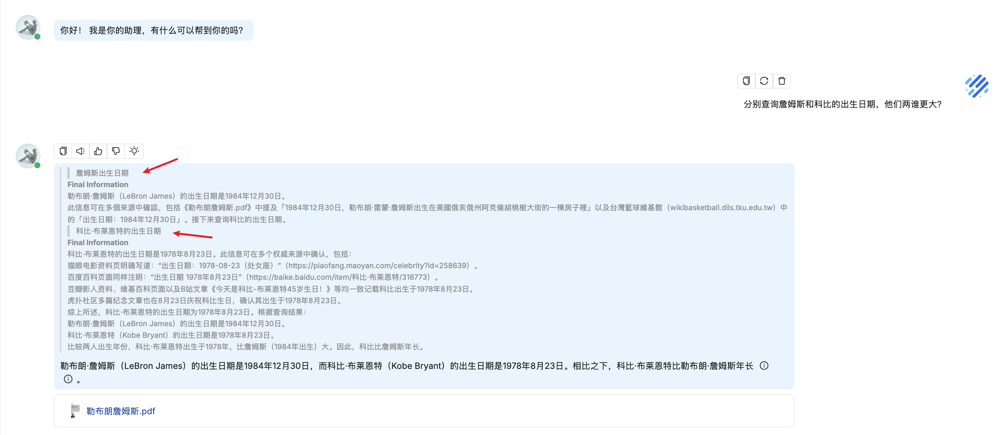

# 再学 RAGFlow 的问答流程（二）

废话不多说，我们今天继续学习昨天遗留的几个问答过程中的细节问题。

## 上下文管理

RAGFlow 检索完知识库后，需要将检索结果和系统提示词拼接丢给大模型回答问题，此时我们面临一个问题，检索的内容可能很长，超出大模型的最大 token 数，导致调用报错。RAGFlow 使用 `message_fit_in()` 函数对上下文的 token 进行管理，确保会话消息不超过模型限制的 95%：

```python
def chat(dialog, messages, stream=True, **kwargs):
  # ...
  max_tokens = llm_model_config.get("max_tokens", 8192)
  used_token_count, msg = message_fit_in(msg, int(max_tokens * 0.95))
```

这里的 `max_tokens` 表示大模型的最大 token 数，我们之前在 “模型提供商” 页面添加模型时，可能已经注意到了：


对于一些常见的模型，我们可以不用填写，RAGFlow 内置了这个值，可以参考 `conf/llm_factories.json` 文件：

```json
{
  "factory_llm_infos": [
    {
      "name": "OpenAI",
      "logo": "",
      "tags": "LLM,TEXT EMBEDDING,TTS,TEXT RE-RANK,SPEECH2TEXT,MODERATION",
      "status": "1",
      "llm": [
        {
          "llm_name": "gpt-4.1",
          "tags": "LLM,CHAT,1M,IMAGE2TEXT",
          "max_tokens": 1047576,
          "model_type": "chat",
          "is_tools": true
        },
        {
          "llm_name": "gpt-4.1-mini",
          "tags": "LLM,CHAT,1M,IMAGE2TEXT",
          "max_tokens": 1047576,
          "model_type": "chat",
          "is_tools": true
        },
        // ...
      ]
    },
    // ...
  ]
}
```

下面我们来看下 `message_fit_in()` 函数的逻辑：

```python
def message_fit_in(msg, max_length=4000):

  # 计算当前 msg 中所有文本的 token 数量
  def count():
    nonlocal msg
    tks_cnts = []
    for m in msg:
      tks_cnts.append({"role": m["role"], "count": num_tokens_from_string(m["content"])})
    total = 0
    for m in tks_cnts:
      total += m["count"]
    return total

  # 如果总 token 数未超限，直接返回原始消息
  c = count()
  if c < max_length:
    return c, msg

  # 保留所有 system 角色消息（也就是系统提示词）
  msg_ = [m for m in msg if m["role"] == "system"]
  if len(msg) > 1:
    # 保留最后一条消息（通常是用户的最新问题），丢弃中间的会话历史
    msg_.append(msg[-1])
  msg = msg_
  c = count()
  if c < max_length:
    return c, msg

  # 系统消息 token 数
  ll = num_tokens_from_string(msg_[0]["content"])
  # 最后消息 token 数
  ll2 = num_tokens_from_string(msg_[-1]["content"])
  # 如果系统消息占比超过 80%
  if ll / (ll + ll2) > 0.8:
    # 截断系统消息
    m = msg_[0]["content"]
    m = encoder.decode(encoder.encode(m)[: max_length - ll2])
    msg[0]["content"] = m
    return max_length, msg
  # 否则截断最后一条消息
  # 这里貌似有个 BUG，应该是 `max_length - ll`
  m = msg_[-1]["content"]
  m = encoder.decode(encoder.encode(m)[: max_length - ll2])
  msg[-1]["content"] = m
  return max_length, msg
```

其中 `count()` 用于计算当前 msg 中所有文本的 token 数量，它使用 `num_tokens_from_string()` 函数计算每条消息的 token 数，它是基于 [tiktoken](https://github.com/openai/tiktoken) 的 `cl100k_base` 编码器实现的（GPT-3.5/GPT-4标准）：

```python
import tiktoken

def num_tokens_from_string(string: str) -> int:
  encoder = tiktoken.get_encoding("cl100k_base")
  return len(encoder.encode(string))
```

`message_fit_in()` 函数通过三级截断策略，确保当前 msg 不超出模型的最大 token 数：

* 第一级，无需处理：如果总 token 数未超限，直接返回原始消息；
* 第二级，保留系统消息+最后一条消息：保留所有 system 角色消息（也就是系统提示词），保留最后一条消息（通常是用户的最新问题），丢弃中间的会话历史；
* 第三级：智能内容截断：如果系统消息占比超过 80% 则截断系统消息，否则截断最后一条消息；
  
可以看到，RAGFlow 的截断策略是 system 消息优先级最高，因为这里包含重要的系统提示和知识，历史会话可以牺牲，只保留用户最新消息；不过这里还可以再细化一点，比如保留最近几轮会话，而不是直接丢弃所有历史会话，只要不超出总数都可以。

## 引用处理

生成有理有据的回答是 RAGFlow 的核心特性之一，它支持在生成的回答中附带关键引用的快照，并支持追根溯源，最大限度地减少了 AI 幻觉。RAGFlow 在处理引用时别出心裁，综合使用 **大模型** 和 **文本块语义匹配** 两种手段在生成的回答中插入引用。首先看下大模型的使用：

```python
def chat(dialog, messages, stream=True, **kwargs):
  # ...
  # 开启引用的提示词
  if knowledges and (prompt_config.get("quote", True) and kwargs.get("quote", True)):
    prompt4citation = citation_prompt()

  # 调用大模型流式输出
  for ans in chat_mdl.chat_streamly(prompt + prompt4citation, msg[1:], gen_conf):
    yield {"answer": thought + answer, "reference": {}, "audio_binary": tts(tts_mdl, delta_ans)}
  yield decorate_answer(thought + answer)
```

主要是在系统提示词后面追加一段对引用的要求：

```
## 引用要求

- 采用统一的引用格式，例如[ID:i] [ID:j]，其中“i”和“j”为置于方括号中的文档ID。多个ID之间用空格分隔（例如，[ID:0] [ID:1]）。
- 引用标记必须放在句尾，与最后的标点符号（如句号、问号）之间用空格隔开。
- 每个句子最多允许使用4个引用。
- 如果内容并非来自检索到的片段，请勿插入引用。
- 请勿使用独立的文档ID（例如，#ID#）。
- 引用必须始终遵循[ID:i]格式。
- 严禁使用删除线符号（例如，~~）或任何其他非标准格式语法。
- 任何违反上述规则的行为——包括格式错误、使用禁止的样式或不支持的引用方式——都将导致该句子不添加任何引用。
```

RAGFlow 将知识库检索片段添加到系统提示词时，会为每一段分配一个 ID 序号：


如果大模型能准确理解引用要求，就会在对应的句子后面加上引用标记，RAGFlow 在大模型输出结束后，会调用 `decorate_answer()` 函数对引用标记进行提取和解析，然后追加一帧完整的结果，包括引用的文档信息、使用的提示词、详细的时间统计等：

```python
def decorate_answer(answer):
  # ...
  if knowledges and (prompt_config.get("quote", True) and kwargs.get("quote", True)):
    idx = set([])
    if embd_mdl and not re.search(r"\[ID:([0-9]+)\]", answer):
      # 大模型返回的答案中没有引用，使用语义匹配的方式生成引用
      answer, idx = retriever.insert_citations(answer, ...)
    else:
      # 大模型返回的答案中有引用，提取出所有的引用序号
      for match in re.finditer(r"\[ID:([0-9]+)\]", answer):
        i = int(match.group(1))
        if i < len(kbinfos["chunks"]):
          idx.add(i)
    # 修复错误引用格式
    answer, idx = repair_bad_citation_formats(answer, kbinfos, idx)
  # 返回完整结果，包括引用，提示词，详细时间统计等
  return {"answer": think + answer, "reference": refs, "prompt": re.sub(r"\n", "  \n", prompt), "created_at": time.time()}
```

这里比较有意思的是 RAGFlow 对大模型返回的答案中没有引用的情况的处理，它会调用 `insert_citations()` 函数使用语义匹配的方式生成引用，具体的处理流程大致如下：

1. **答案分段**：将答案按句号、问号、感叹号等标点符号分割成片段；
2. **向量编码**：使用嵌入模型对答案片段进行编码，确保答案向量和文档块向量维度一致；
3. **相似度计算**：对每个答案片段，计算与所有文档块的混合相似度（加权向量相似度和关键词相似度）。这里的处理也挺有意思的，采用了动态阈值来筛选，初始阈值为 0.63，使用该阈值筛选高相似度的匹配，如果没有匹配，逐步降低阈值重试（每次乘以 0.8），阈值最低不低于 0.3；
4. **引用插入**：在相似度超过阈值的答案片段后插入引用标记。

最后再通过 `repair_bad_citation_formats()` 函数修复答案中不规范的引用格式，将各种错误的引用格式统一转换为标准的 `[ID:数字]` 格式。函数通过 `BAD_CITATION_PATTERNS` 定义的正则表达式模式来识别错误格式：

```python
BAD_CITATION_PATTERNS = [
  re.compile(r"\(\s*ID\s*[: ]*\s*(\d+)\s*\)"),  # (ID: 12) - 圆括号格式
  re.compile(r"\[\s*ID\s*[: ]*\s*(\d+)\s*\]"),  # [ID: 12] - 方括号但带空格的格式
  re.compile(r"【\s*ID\s*[: ]*\s*(\d+)\s*】"),  # 【ID: 12】 - 中文方括号格式
  re.compile(r"ref\s*(\d+)", flags=re.IGNORECASE),  # ref12、REF 12 - ref 引用格式（不区分大小写）
]
```

## 深度推理模式

从 v0.17.0 起，RAGFlow 支持在 AI 聊天中集成深度推理模式（`Agentic RAG`），该模式模仿了人类研究员的工作方式：将一个大问题分解为多个子问题，分别对每个子问题进行深入研究（检索），然后将所有研究结果汇总，最终形成一个全面而有深度的答案：


深度推理的核心逻辑位于 `agentic_reasoning/deep_research.py` 文件中：

```python
class DeepResearcher:
  # ...
  def thinking(self, chunk_info: dict, question: str):
    
    think = "<think>"
    for step_index in range(MAX_SEARCH_LIMIT + 1):

      # 大模型推理，判断是否需要进一步搜索
      query_think = ""
      for ans in self._generate_reasoning(msg_history):
        query_think = ans
        yield {"answer": think + self._remove_query_tags(query_think) + "</think>", "reference": {}, "audio_binary": None}
      think += self._remove_query_tags(query_think)
      
      # 提取搜索问题
      queries = self._extract_search_queries(query_think, question, step_index)
      if not queries and step_index > 0:
        # 不需要继续搜索，退出循环
        break

      # 每个问题单独处理
      for search_query in queries:

        # 开始处理 ...
        think += f"\n\n> {step_index + 1}. {search_query}\n\n"
        yield {"answer": think + "</think>", "reference": {}, "audio_binary": None}
        
        # 检索：知识库、搜索引擎、知识图谱
        kbinfos = self._retrieve_information(search_query)
        
        # 从检索结果中提取关于该问题的关键信息
        think += "\n\n"
        summary_think = ""
        for ans in self._extract_relevant_info(truncated_prev_reasoning, search_query, kbinfos):
          summary_think = ans
          yield {"answer": think + self._remove_result_tags(summary_think) + "</think>", "reference": {}, "audio_binary": None}
        think += self._remove_result_tags(summary_think)

    # 返回所有的 think 步骤
    yield think + "</think>"
```

可以看出深度推理的本质就是一个 `for` 循环，通过不断的调用大模型，判断当前还缺失哪些信息，从而生成需要进一步搜索的问题，然后通过检索知识库、搜索引擎或知识图谱等补充对应的信息，直到大模型认为所有信息都已经完整为止。整个流程可以分为三个步骤：

* **生成推理**: 调用 `_generate_reasoning` 生成推理步骤，让大模型判断是否需要搜索，如果需要，则按特定格式输出要搜索的问题；
* **提取问题**：调用 `_extract_search_queries` 从大模型输出中提取搜索问题，如果为空，说明不需要继续搜索，则退出循环；
* **检索问题**：针对每个问题分别调用 `_retrieve_information` 进行检索，支持知识库、搜索引擎（需要配置 Tavily API KEY）、知识图谱（需要开启知识图谱功能）三种检索方式；
* **信息提取**：为防止多轮检索结果过多对上下文造成干扰，每次检索后，通过调用 `_extract_relevant_info` 从检索结果中提取关于当前问题的关键信息；

> 生成推理和信息提取基于大模型实现，提示词都比较简单，可参考源码。

每一轮提取的关键信息都会拼接到 `think` 字段中，最后返回完整的思考过程，这个内容将作为知识库喂给大模型，以便它基于该内容回答用户问题：

```python
def chat(dialog, messages, stream=True, **kwargs):
  # ...
  if prompt_config.get("reasoning", False):
    reasoner = DeepResearcher(chat_mdl, prompt_config, ...)
    for think in reasoner.thinking(kbinfos, " ".join(questions)):
      # 返回的是字符串，表示完整的 think 过程
      if isinstance(think, str):
        thought = think
        # 将其按换行分割作为知识库内容，大模型基于该内容回答用户问题
        knowledges = [t for t in think.split("\n") if t]
      # 返回的不是字符串，直接流式输出
      elif stream:
        yield think
```

下面是深度推理的一个示例，可以看到复杂问题被拆成了两步检索：



通过这种分而治之再综合归纳的策略，深度推理模式能够处理普通 RAG 难以应对的复杂查询，提供更高质量、更有深度的答案。

## 小结

今天我们继续深入探讨了 RAGFlow 问答流程中的几个核心技术细节：

* **上下文管理**：学习了 RAGFlow 如何通过智能的三级截断策略来管理上下文长度，确保即使在复杂的对话中也不会超出模型的 Token 限制；
* **引用处理**：分析了其独特的引用处理机制，它结合大模型和语义匹配，不仅能生成带引用的回答，还能自动修复格式错误，保证了答案的可追溯性；
* **深度推理模式**：揭示了深度推理模式的奥秘，了解了 RAGFlow 如何模仿人类研究员，通过多轮检索和归纳，解决复杂的多跳问题；

至此，我们已经贯穿了 RAGFlow 从知识库构建到最终问答的完整生命周期。通过这一系列的学习，我们不仅掌握了 RAGFlow 的使用方法，更深入理解了其背后的设计哲学和技术实现。希望这些内容能帮助你更好地利用 RAGFlow 构建出强大、智能的 RAG 应用。
