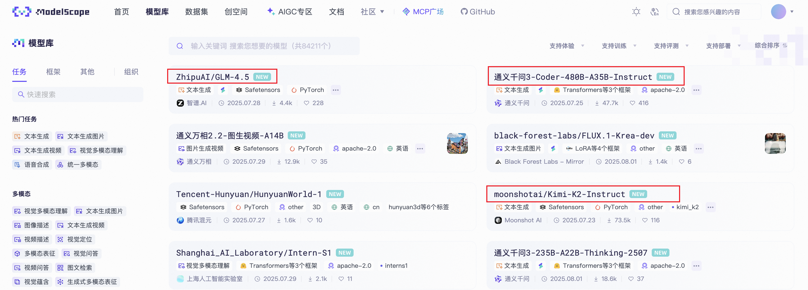

# Coze Studio 快速上手指南

相信大家最近都被 Coze 开源的新闻刷屏了吧，作为国内智能体平台的扛把子，字节的这一波操作确实让人猝不及防。Coze 是国内最早一批做智能体平台的，它的很多功能做得确实很不错，用户体验也很赞；但是，随着今年深度搜索和深度研究等概念的兴起，智能体平台的定位有点尴尬，字节本身也把精力投到 [扣子空间](https://space.coze.cn/) 这个产品上了，这估计也是字节选择开源 Coze 的一个原因吧。

本次开源包括 **Coze Studio（扣子开发平台）** 和 **Coze Loop（扣子罗盘）** 两个核心项目，并采用了 Apache 2.0 许可协议，这意味着开发者可以自由修改甚至闭源商用，这让那些其他的智能体开发平台，比如 Dify，瞬间就不香了。

我也算是 Coze 的老用户了，一直关注着它的最新动态，只要一有新功能推出，我总是第一时间去体验，然后和小伙伴们讨论，猜猜它后端可能是怎么实现的。现在开源了，这不得好好研究下它的代码嘛。

## Coze Studio 介绍

根据官网的介绍，Coze Studio 源自 [扣子开发平台](https://www.coze.cn/home)，是一个一站式 AI 智能体开发平台，通过 Coze Studio 提供的可视化设计与编排工具，开发者可以通过零代码或低代码的方式，快速打造和调试智能体、应用和工作流，实现强大的 AI 应用开发和更多定制化业务逻辑。


它的核心功能包括：

* **模型服务**：管理模型列表，可接入 OpenAI、火山方舟等在线或离线模型服务；
* **搭建智能体**：编排、发布、管理智能体，支持配置工作流、知识库等资源；
* **搭建应用**：创建、发布应用，通过工作流搭建业务逻辑；
* **搭建工作流**：创建、修改、发布、删除工作流；
* **开发资源**：支持创建并管理以下资源：插件、知识库、数据库、提示词；
* **API 与 SDK**：创建会话、发起对话等 OpenAPI，通过 Chat SDK 将智能体或应用集成到自己的应用；

## 本地部署

Coze 提供了项目所需的所有镜像，使用 Docker Compose 可以快速进行部署。我们首先克隆源码：

```
$ git clone https://github.com/coze-dev/coze-studio.git
```

进入 docker 目录：

```
$ cd coze-studio/docker
```

这个目录下的 `docker-compose.yml` 文件定义了部署 Coze 包含的各个组件，包括：

* `coze-mysql` - MySQL 结构化数据存储
* `coze-redis` - Redis 缓存
* `coze-elasticsearch` - Elasticsearch 存储
* `coze-minio` - Minio 对象存储
* `coze-milvus` - Milvus 向量数据库
* `coze-etcd` - Milvus 依赖 etcd 管理元数据
* `coze-server` - Coze 后端服务

Coze 默认使用 [NSQ](https://github.com/nsqio/nsq) 作为消息中间件服务，这是一个基于 Go 语言编写的内存分布式消息中间件，包括下面三个组件：

* `coze-nsqd` - 负责接收、排队和向客户端投递消息，处理消息收发和队列维护的组件
* `coze-nsqlookupd` - 管理拓扑信息的守护进程，相当于中心管理服务和服务发现组件
* `coze-nsqadmin` - 一个 Web UI，用于实时查看聚合的集群统计信息，并执行各种管理任务

此外，有些组件在部署时需要初始化一些数据，Coze 通过下面这三个组件来初始化：

* `coze-minio-setup` - 导入图标类的资源文件
* `coze-mysql-setup-schema` - 初始化 MySQL 表结构，使用 Atlas 工具根据 HCL 文件创建数据库表结构
* `coze-mysql-setup-init-sql` - 初始化 MySQL 表结构，导入初始化数据，和 `coze-mysql-setup-schema` 的区别是，这个服务使用 MySQL 原生客户端执行 SQL 脚本文件

> 为什么有两个初始化 MySQL 的服务？可能是为了兼容不同的部署方式，或者是逐步从传统 SQL 到 Atlas 迁移升级。

这个目录下还有一个 `.env.example` 文件，里面包含大量的项目配置，我们需要将其复制一份出来，另存为 `.env` 文件：

```
$ cp .env.example .env
```

如果你希望修改数据库用户名或密码之类的，可以编辑这个文件，默认情况下不用动。直接 `docker compose` 启动即可：

```
$ docker compose --profile "*" up -d
```

等待所有容器启动完毕：


> 其中 `coze-minio-setup`、`coze-mysql-setup-schema`、`coze-mysql-setup-init-sql` 这几个容器完成初始化任务后就退出了，因此处于 Exited 状态，是正常现象。

如果一切顺利，通过浏览器访问 `http://localhost:8888/` 即可进入 Coze Studio 页面：


输入邮箱和密码，点击注册，进入工作空间：


## 模型配置

不过这个时候我们还无法使用平台功能，比如创建智能体，会报如下错误：


Coze Studio 是一款基于大模型的 AI 应用开发平台，因此我们还必须配置模型服务。模型配置为 YAML 文件，统一放在 `backend/conf/model` 目录中，可以存在多个，每个文件对应一个可访问的模型。Coze Studio 支持常见的模型服务，如 OpenAI、DeepSeek、豆包等，为方便开发者快速配置，Coze Studio 在 `backend/conf/model/template` 目录下提供了常见模型的模板文件：

```
$ tree backend/conf/model/template 
backend/conf/model/template
├── model_template_ark.yaml
├── model_template_ark_doubao-1.5-lite.yaml
├── model_template_ark_doubao-1.5-pro-256k.yaml
├── model_template_ark_doubao-1.5-pro-32k.yaml
├── model_template_ark_doubao-1.5-thinking-pro.yaml
├── model_template_ark_doubao-1.5-thinking-vision-pro.yaml
├── model_template_ark_doubao-1.5-vision-lite.yaml
├── model_template_ark_doubao-1.5-vision-pro.yaml
├── model_template_ark_doubao-seed-1.6-flash.yaml
├── model_template_ark_doubao-seed-1.6-thinking.yaml
├── model_template_ark_doubao-seed-1.6.yaml
├── model_template_ark_volc_deepseek-r1.yaml
├── model_template_ark_volc_deepseek-v3.yaml
├── model_template_basic.yaml
├── model_template_claude.yaml
├── model_template_deepseek.yaml
├── model_template_gemini.yaml
├── model_template_ollama.yaml
├── model_template_openai.yaml
└── model_template_qwen.yaml
```

可以看到，除了字节自家的豆包（ARK 表示 [火山方舟](https://www.volcengine.com/)，豆包系列的大模型都支持），Coze Studio 也内置了 OpenAI、DeepSeek、Claude、Ollama、Qwen、Gemini 等模型的支持。

最近，国产开源模型大爆发，从月之暗面的 [Kimi K2](https://www.kimi.com/)、阿里的 [Qwen3](https://chat.qwen.ai/) 到智谱的 [GLM 4.5](https://chat.z.ai/)，模型效果一个比一个好。这些模型在[魔搭](https://modelscope.cn/models)也都上线了：



其中，Qwen3 和 GLM 4.5 都提供了推理 API 可以免费调用，每天 2000 次额度，我们不妨用 Qwen3 来测试一下。魔搭的推理 API 兼容 OpenAI 接口协议，因此我们这里使用 OpenAI 模版，将其复制到 `backend/conf/model` 目录：

```
$ cp backend/conf/model/template/model_template_openai.yaml backend/conf/model/model_modelscope_qwen3_coder.yaml
```

模版文件对各个参数已经有了比较详细的解释，一般来说，大多数参数都不用动，只需要关注其中几个重要参数即可：

* `id` - 模型 ID，由开发者自行定义，必须是非 0 的整数，且全局唯一，模型 ID 定下来之后最好就不要改了；
* `name` - 模型在平台上展示的名称；
* `description` - 模型在平台上展示的简介，分中英文；
* `default_parameters` - 模型默认参数，包括 `temperature`、`max_tokens`、`top_p`、`frequency_penalty`、`presence_penalty`、`response_format` 等，基本上不用动；
* `meta.capability` - 模型具备的能力，根据实际情况配置，比如是否支持 function call，是否支持 json mode，是否支持 reasoning，是否支持多模态，等；
* `meta.conn_config.base_url` - 模型服务的接口地址，如果使用的不是 OpenAI 官方接口，可以在这里配置；比如这里我使用魔搭的推理 API 接口；
* `meta.conn_config.api_key` - 模型服务的 API Key；注册魔搭平台后，在 “账号设置” - “访问令牌” 页面创建；
* `meta.conn_config.model` - 模型名，不同厂商的命名规则可能不一样；比如这里我使用 Qwen3-Coder 来测试，在魔搭上的模型名为 `Qwen/Qwen3-Coder-480B-A35B-Instruct`；
* `meta.conn_config.openai` - OpenAI 专属配置，这里将 `by_azure` 设置为 `false`；

> 更多参数介绍，请参考官方的 [模型配置文档](https://github.com/coze-dev/coze-studio/wiki/3.-%E6%A8%A1%E5%9E%8B%E9%85%8D%E7%BD%AE)。

修改后的配置文件内容如下：


然后执行以下命令重启 Coze 服务，使配置生效：

```
$ docker compose --profile "*" restart coze-server
```

再次点击创建智能体，此时就可以成功创建了，模型下拉列表可以看到我们配置的模型服务：


在右边的 “预览与调试” 对话框聊上两句，测试下模型服务是否正常：


## 小结

本文作为 Coze Studio 的快速上手指南，我们首先介绍了 Coze 开源的背景及其核心功能，然后详细讲解了如何使用 Docker Compose 在本地环境中完成部署，并以 OpenAI 兼容模型为例，演示了如何配置和验证模型服务。通过这些步骤，我们成功搭建了一个可用的 Coze Studio 本地开发环境。

至此，一切准备就绪，让我们一起开始 Coze 智能体的探索之旅吧！
