# 实战 Coze Studio 智能体开发

昨天，我们成功在本地部署了 Coze Studio，并配置好了大模型。今天，我们将正式开始 Coze 智能体的探索之旅，学习如何利用其强大的可视化编排能力，创建并发布我们自己的 AI 智能体。

## 创建智能体

首先进入 “项目开发” 页面，点击 “创建” 按钮，Coze 支持创建两种不同的项目：

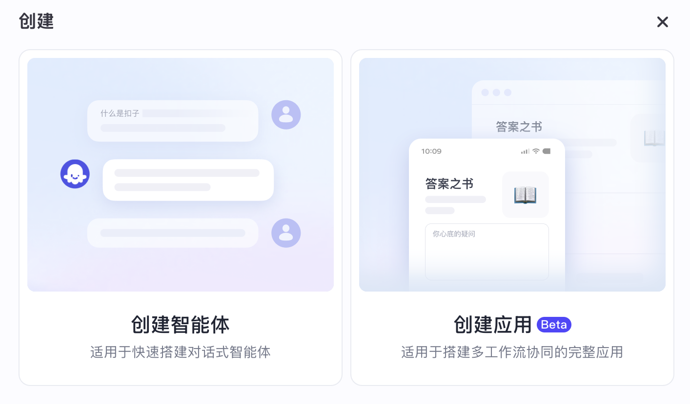

我们选择 “创建智能体”，然后为智能体取一个好听的名字，比如 “翻译小能手”：

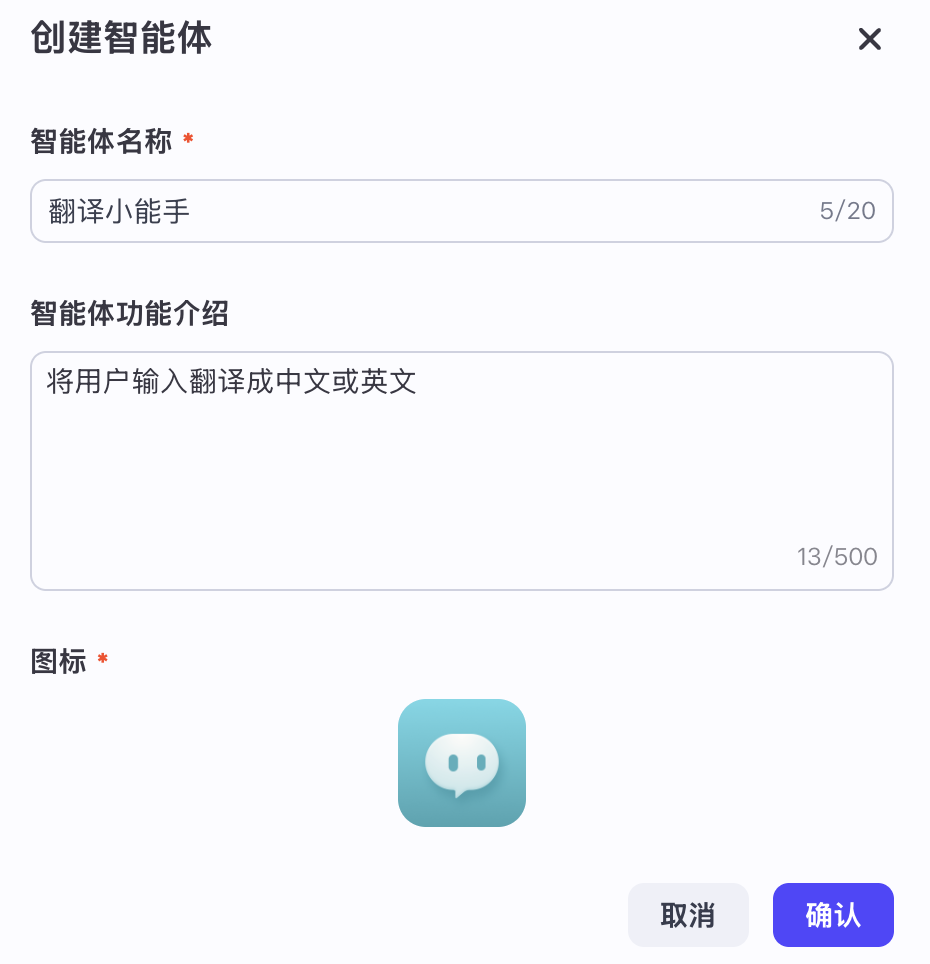

接着，进入智能体的配置页面：

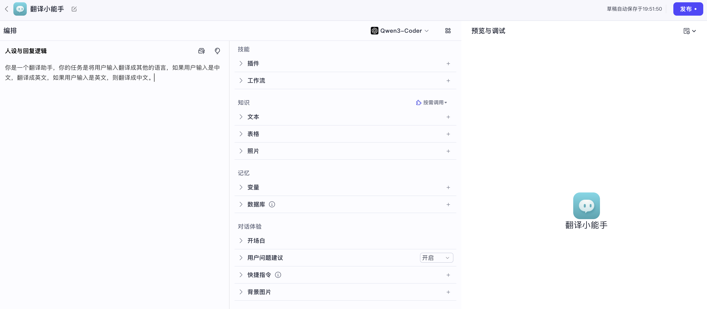

整个配置页面可分为两大块：左侧为 **编排** 区域，右侧为 **预览与调试** 区域。在编排区域里，可以对智能体进行以下配置：

* **人设与回复逻辑**：指定模型的角色、设计回复的语言风格、限制模型的回答范围，让对话更符合用户预期；
* **技能**：为智能体配置各种扩展能力，让其可以调用外部插件或用户自定义工作流；
* **知识**：为智能体提供特定领域的知识背景，包括文本、表格和图片，让其可以回答领域内的问题；
* **记忆**：变量用来存储动态变化的信息，数据库用来管理和处理结构化数据，这两种方式都为智能体提供了一定的记忆能力；
* **对话体验**：开场白是用户进入智能体后自动展示的引导信息；用户问题建议用于在智能体回复后，根据对话内容推荐 3 条相关问题；快捷指令是对话输入框上方的按钮，方便用户快速发起预设对话；背景图片为智能体的对话窗口增加背景，增加对话沉浸感。

这些高级配置项我们暂时不管，对于 “翻译小能手”，我们只需要配置其人设与回复逻辑即可：

```
你是一个翻译助手，你的任务是将用户输入翻译成其他的语言，
如果用户输入是中文，翻译成英文，如果用户输入是英文，则翻译成中文。
```

一个简单的翻译智能体就制作完成了：


另外，我们也可以打开 “探索” - “模版” 页面，Coze Studio 内置了两个智能体模版：英语聊天和导购陪练，都是纯提示词实现的，感兴趣的可以复制到工作空间看看：


## 自定义插件

单纯靠提示词实现的智能体能力非常有限，它无法连接和访问外部工具，我们可以为智能体添加一些技能，比如联网搜索、科学计算或绘制图片，扩展智能体的能力。上一节提到，在 Coze Studio 中，技能分为插件和工作流两种，下面我们先来学习下如何配置和使用插件。

这一节，我们将创建一个带技能的智能体，比如调用 “天气查询” 接口回答用户关于天气的问题。首先进入 “资源库” 页面，点击 “+ 资源” 按钮：

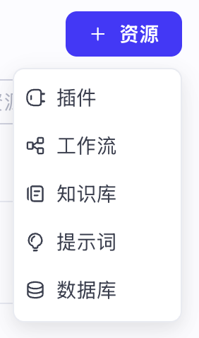

Coze 这里提供了五种不同类型的资源：

* **插件**：插件是一个工具集，一个插件内可以包含一个或多个工具，即 API 接口；
* **工作流**：通过在可视化画布上拖拽节点迅速搭建工作流，实现特定的业务逻辑；
* **知识库**：用户在这里上传外部知识内容，包括文本、表格和图片，解决大模型幻觉、专业领域知识不足的问题；
* **提示词**：可以将常用的提示词放在这里统一管理，在创建智能体或配置工作流中的大模型节点时可快速引用；
* **数据库**：管理和处理结构化数据，用户可通过自然语言插入、查询、修改或删除数据库中的数据；

我们这里选择创建插件：

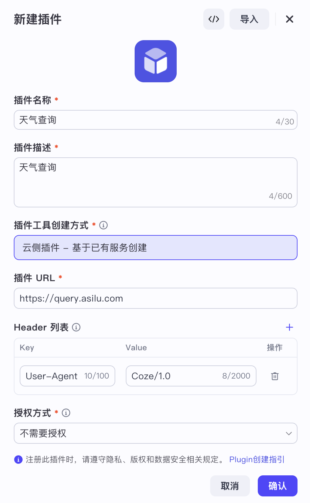

填写插件名称和描述，创建方式选 “云侧插件 - 基于已有服务创建”，插件 URL 填 `https://query.asilu.com`，该站点提供了不少免费而简单的 API 接口，用来测试智能体再合适不过。

> 注意插件的 URL 是根路径，插件下的所有工具都在这个 URL 之下。

Header 列表不用动，如果你的接口需要一些特别的请求头，可以在这里设置；授权方式选 “不需要授权”，除此之外，Coze Studio 还支持另两种授权方式：

* **Service 认证**：通常是指一种简化的认证方式，其中 API 调用需要某种秘钥或令牌来验证其合法性，这种秘钥可能会通过查询参数或请求头传递；
* **OAuth 认证**：这是一个开放标准，允许第三方应用在不共享用户密码的情况下访问用户账户的特定资源；

点击确定后进入插件页面，然后创建一个 `get_weather` 工具：

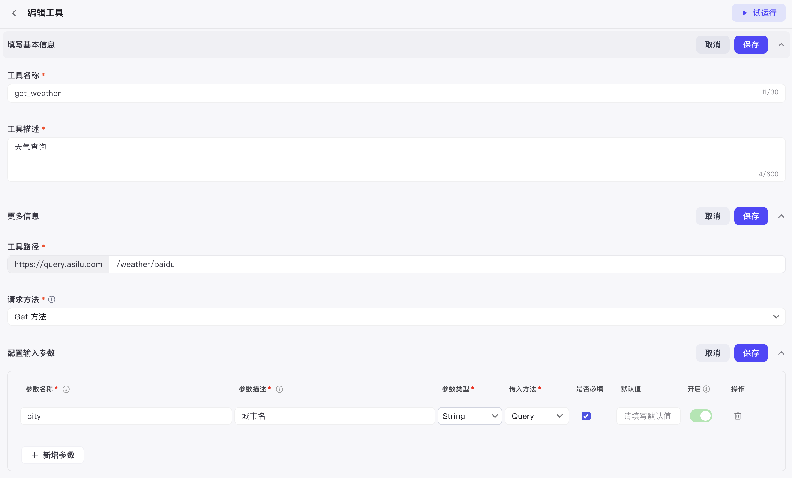

这个天气查询接口非常简单，只有一个 `city` 参数，如下：

* https://query.asilu.com/weather/baidu?city=城市名

因此我们需要配置三个地方：

* 工具路径：`/weather/baidu`
* 请求方法：`Get 方法`
* 输入参数：只有一个 “city”，参数描述 “城市名”，参数类型 “String”，传入方法 “Query”

输出参数可以不用手工配，点击 “自动解析” 弹出一个调试页面，输入参数后只要接口能正常访问，Coze 会自动根据接口的返回值将输出参数配置好：

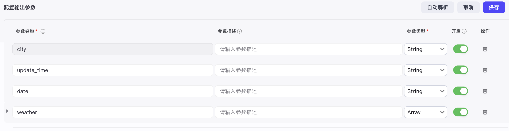

配置结束后，点击右上角的 “试运行” 对接口进行测试，测试完成后，这个插件就可以发布了。

然后，我们再创建一个 “天气助手” 智能体，将 `get_weather` 工具添加到它的技能里，这个智能体就可以为我们查询天气了：

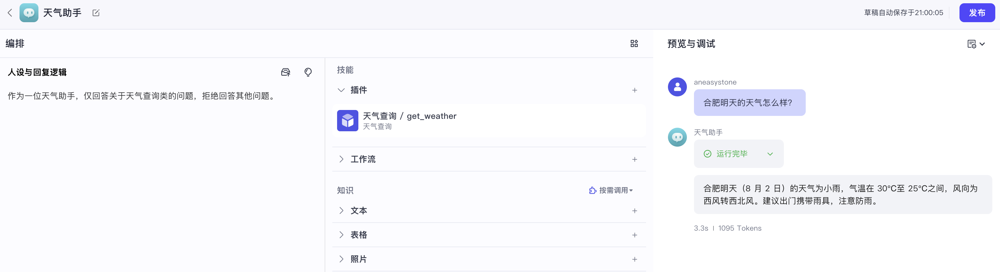

## 配置内置插件

其实，Coze Studio 提供了两种插件类型，即自定义插件和官方内置插件。官方内置插件由后台统一配置，支持所有用户使用；而自定义插件的使用范围为当前工作空间。可以打开 “探索” - “插件” 页面，查看所有官方内置插件：

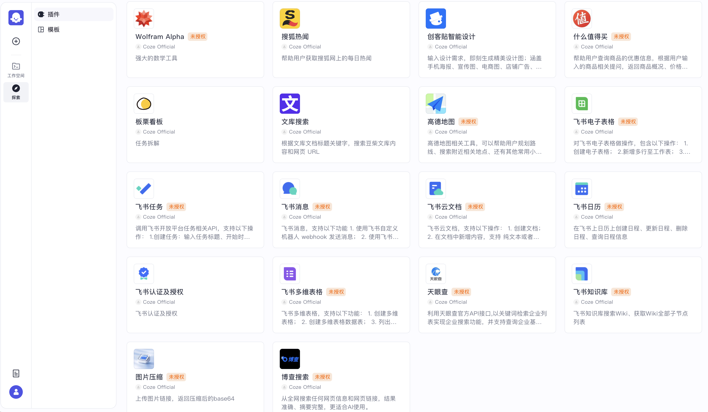

可以看到内置的插件还是蛮丰富的，一共 18 个，但是要注意的是，有些插件上带有 “未授权” 的标签，这表示此插件需要授权，这些插件我们还不能使用，需要配置授权信息。

所有内置的插件位于 `backend/conf/plugin/pluginproduct` 目录：

```
$ tree backend/conf/plugin/pluginproduct
backend/conf/plugin/pluginproduct
├── bocha_search.yaml # 博查搜索
├── chestnut_sign.yaml # 板栗看板
├── gaode_map.yaml # 高德地图
├── image_compression.yaml # 图片压缩
├── lark_authentication_authorization.yaml # 飞书认证及授权
├── lark_base.yaml # 飞书多维表格
├── lark_calendar.yaml # 飞书日历
├── lark_docx.yaml # 飞书云文档
├── lark_message.yaml # 飞书消息
├── lark_sheet.yaml # 飞书电子表格
├── lark_task.yaml # 飞书任务
├── lark_wiki.yaml # 飞书知识库
├── library_search.yaml # 文库搜索
├── maker_smart_design.yaml # 创客贴智能设计
├── plugin_meta.yaml # 所有插件的元配置，包括授权信息
├── sky_eye_check.yaml # 天眼查
├── sohu_hot_news.yaml # 搜狐热闻
├── wolfram_alpha.yaml # Wolfram Alpha
└── worth_buying.yaml # 什么值得买
```

其中 `plugin_meta.yaml` 为所有插件的元配置，授权信息就是配在这个文件中。我们以 “博查搜索” 为例，在该文件中找到对应的配置块：

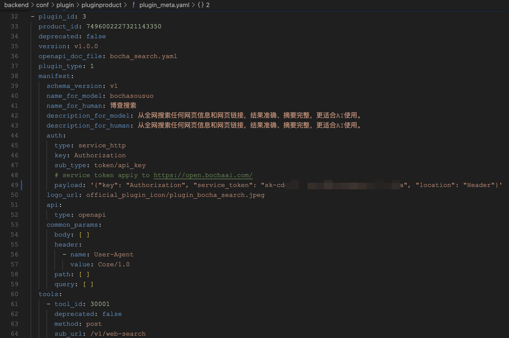

根据提示，访问 [博查 AI 开放平台](https://open.bochaai.com/)：

 

博查搜索是国内为数不多的一家搜索服务提供商，虽然不是免费，但价格确实很便宜，一次调用仅 3 分钱，为国外同类产品的 1/3。点击 “控制台” 注册、充值、并创建 API KEY，将其配置在 `payload` 中的 `service_token` 字段：

```
  auth:
    type: service_http
    key: Authorization
    sub_type: token/api_key
    # service token apply to https://open.bochaai.com/
    payload: '{"key": "Authorization", "service_token": "sk-xxx", "location": "Header"}'
```

这里的 `auth.type` 就对应上一节我们创建插件时选择的 “授权方式”，支持 `service_http` 和 `oauth` 两种，具体的授权信息位于 `payload` 里。关于插件配置和授权配置的详细解释，可以参考官方文档：

* https://github.com/coze-dev/coze-studio/wiki/4.-%E6%8F%92%E4%BB%B6%E9%85%8D%E7%BD%AE

配置好插件授权后，重启 Coze 服务：

```
$ docker compose --profile "*" restart coze-server
```

此时 “博查搜索” 插件就可以正常使用了。我们可以创建一个 “搜索专家” 智能体，让它调用搜索引擎来回答用户的问题：

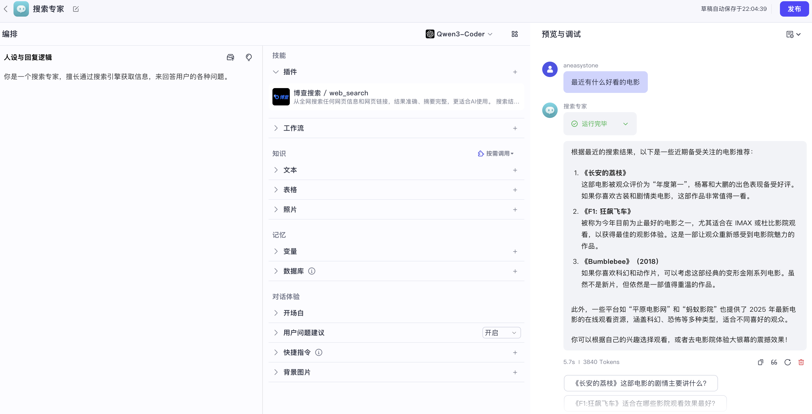

## 小结

今天，我们正式开启了 Coze Studio 的智能体开发之旅。我们从最基础的提示词工程开始，创建了一个简单的 “翻译小能手” 智能体，体验了仅通过人设与回复逻辑就能快速构建应用的过程。

接着，我们深入学习了如何通过插件扩展智能体的能力。我们一步步创建自定义的 “天气查询” 插件，并通过它实现了 “天气助手” 智能体；另外，还学习了如何配置和使用 Coze Studio 内置的插件，然后使用 “博查搜索” 插件，让智能体能够连接互联网获取实时信息。

通过今天的实战，我们掌握了 Coze Studio 中智能体和插件的基本用法，在后面的学习中，我们将继续探索工作流、知识库等更高级的功能，敬请期待。
