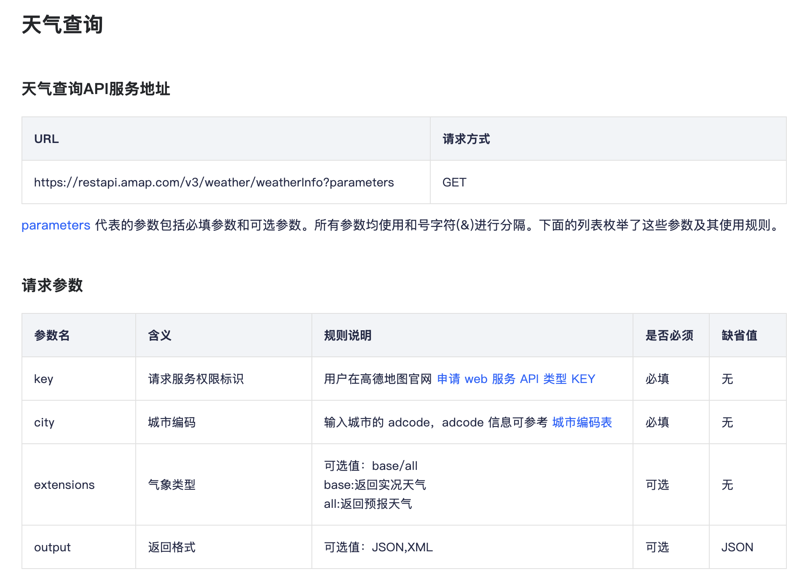
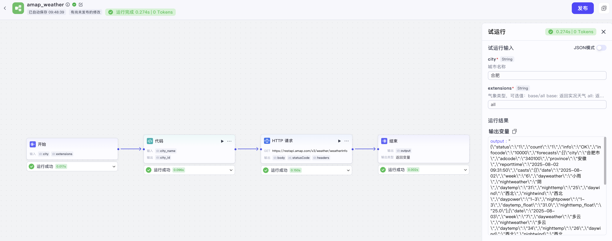
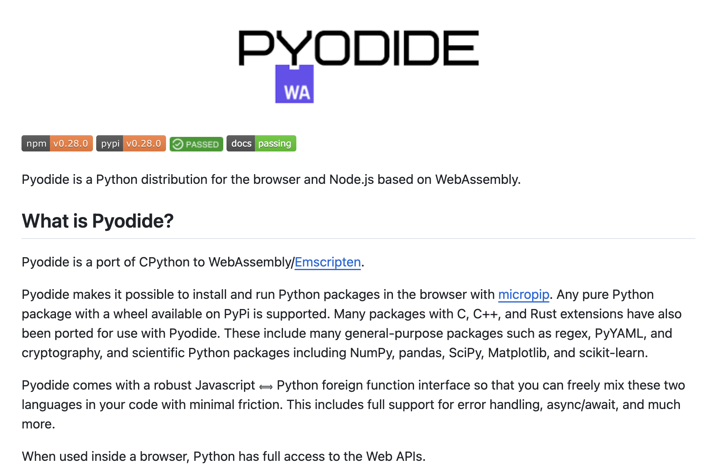

# 实战 Coze Studio 工作流搭建

昨天我们初步探索了 Coze Studio 的智能体和插件功能，体验了如何快速构建并扩展 AI 应用。今天，我们将更进一步，深入学习 Coze Studio 的核心功能之一 —— **工作流（Workflow）**，它是构建复杂、强大、专业的智能体的关键。

## 工作流介绍

如果说插件是智能体的 “单兵武器”，那么工作流就是将这些武器组合起来的 “战术编排”。工作流允许我们通过可视化的方式，将大模型、插件、代码、逻辑判断等节点串联起来，形成一个自动化的任务处理流程。Coze Studio 内置了很多处理节点可供选用：


这些组件大致可分为 6 大类，每个组件的功能汇总如下：

* **基础节点**
    * **大模型**：调用大语言模型，使用变量和提示词生成回复；
    * **插件**：调用插件运行指定工具；
    * **工作流**：调用其他已发布的工作流，实现工作流嵌套工作流的效果；
* **业务逻辑**
    * **代码**：支持通过编写代码，处理输入变量来生成返回值；
    * **选择器**：连接多个下游分支，若设定的条件成立则仅运行对应的分支，若均不成立则只运行 “否则” 分支；
    * **循环**：通过设定循环次数和逻辑，重复执行一系列任务；
    * **意图识别**：通过大模型来识别用户输入的意图，实现类似选择器的效果；
    * **批处理**：通过设定批量运行次数和逻辑，运行批处理体内的任务，和循环节点的区别在于，循环是按顺序逐个处理，批处理则是按批并行处理，运行效率更高；
    * **变量聚合**：对多个分支的输出进行聚合处理；
* **输入&输出**
    * **输入**：类似于开始节点，支持中间过程的信息输入；
    * **输出**：类似于结束节点，支持中间过程的消息输出，支持流式和非流式两种方式；
* **数据库**
    * **SQL 自定义**：基于用户自定义的 SQL 完成对数据库的增删改查操作；
    * **更新数据**：修改表中已存在的数据记录，用户指定更新条件和内容来更新数据；
    * **查询数据**：从表获取数据，用户可定义查询条件、选择列等，输出符合条件的数据；
    * **删除数据**：从表中删除数据记录，用户指定删除条件来删除符合条件的记录；
    * **新增数据**：向表添加新数据记录，用户输入数据内容后插入数据库；
* **知识库&数据**
    * **知识库检索**：在选定的知识中，根据输入变量召回最匹配的信息，并以列表形式返回；
    * **知识库写入**：可以向文档类型的知识库写入知识片段，仅可以添加一个知识库；
    * **变量赋值**：用于应用变量或用户变量的赋值；
* **组件**
    * **文本处理**：用于处理多个字符串类型变量的格式，包括字符串拼接和字符串分割；
    * **问答**：支持中间向用户提问问题，支持预置选项提问和开放式问题提问两种方式；
    * **HTTP 请求**：用于发送 API 请求，从接口返回数据；

## 创建工作流

下面我们来创建一个简单的工作流，假设我们现在要对接 [高德的天气查询接口](https://lbs.amap.com/api/webservice/guide/api-advanced/weatherinfo)：



这个接口就没有昨天那么直接了，该接口的 `city` 参数是城市编码，并不是城市名称，然而大模型是不知道每个城市的具体编码的，如果直接将该接口配置在插件里，调用必然会失败。这个时候我们就可以创建一个工作流，先将用户输入的城市名自动转换为城市编码，然后再调用高德的天气查询接口。

首先进入 “资源库” 页面，点击 “+ 资源” 并选择 “工作流”；然后为工作流命名，例如 “amap_weather”，工作流名称只能是英文；接着进入可视化编排画布：


所有工作流都由一个开始节点和一个结束节点构成，我们先从开始节点配起，开始节点用于定义工作流的输入，这里我们添加 `city` 和 `extensions` 两个字符串类型的参数，用于接收用户想要查询的城市名称和气象类型；


接着在开始节点后面加一个代码节点，为其定义输入参数 `city_name` 和输出参数 `city_id`，注意 `city_name` 参数设置成引用开始节点的 `city` 参数，然后编写一段 Python 代码将城市名称转成城市编码：


代码内容如下：

```python
city_list = [
  "北京市,110000",
  "天津市,120000",
  "石家庄市,130100",
  # ...
]
async def main(args: Args) -> Output:
  city_name = args.params['city_name']
  city_id = '110000'
  for city_info in city_list:
    city_info = city_info.split(',')
    if city_name in city_info[0]:
      city_id = city_info[1]
      break
  ret: Output = {
    'city_id': city_id
  }
  return ret
```

这里的 `city_list` 为城市编码表，可以从高德官网下载。然后点击上面的小三角测试该节点：


验证没问题后，接着再在代码节点后面加一个 HTTP 请求节点，配置如下参数：

* 接口方式 - `GET`
* API 地址 - `https://restapi.amap.com/v3/weather/weatherInfo`
* 请求参数
    * `key` - 填写高德 API KEY，可以从高德开放平台免费申请
    * `city` - 引用自代码节点的 `city_id` 参数
    * `extensions` - 引用自开始节点的 `extensions` 参数
    * `output` - 填写 `json` 表示希望接口返回 JSON 格式

配置好的 HTTP 请求节点如下：


仍然还是点击小三角测试：


测试通过后，将 HTTP 请求节点和结束节点连接起来，并在结束节点上添加 `output` 参数，引用 HTTP 请求节点的出参：


结束节点有两种返回方式：

* **返回变量**：工作流运行结束后会以 JSON 格式输出所有返回参数，智能体在对话中触发工作流后，会自动总结 JSON 格式的内容，并以自然语言回复用户；
* **返回文本**：工作流运行结束后，智能体将直接使用指定的内容回复对话；

这里选择 “返回变量” 方式，至此，整个工作流搭建完成，可以点击下方的 “试运行” 按钮，对整个工作流进行测试：



## 使用工作流

这样一个简单的工作流就创建好了，发布之后，我们就可以在创建智能体时，像添加插件一样，将这个工作流添加到智能体的技能中。当用户提问时，如果命中了这个工作流的意图，智能体就会自动执行整个流程：


> 注意，结束节点不要选 “返回文本”，可能导致工作流正常调用，但智能体却显示 “运行中止” 这样的情况。

## 代码沙箱配置

在上面的工作流示例中，代码节点默认会在服务所处的 Python 虚拟环境中直接运行，进入 Coze 容器，可以看到默认的 Python 版本和已安装的依赖：


如果你有隔离需求，可以开启沙箱功能，沙箱为我们提供了一个安全隔离的代码执行环境。沙箱配置位于 `docker/.env` 文件：

```sh
# 支持 `local` 和 `sandbox` 两种类型，默认 `local`
export CODE_RUNNER_TYPE="sandbox"
```

Coze Studio 的沙箱功能通过 Deno + [Pyodide](https://github.com/pyodide/pyodide) 实现的。Pyodide 是一个将 Python 运行时编译为 WebAssembly 的项目，使 Python 能够直接在 JavaScript 环境中运行，比如浏览器，无需后端服务器支持。它由 Mozilla 开发并维护，旨在将 Python 的科学计算生态系统带到 Web 平台。



Pyodide 非常适合作为代码沙箱环境，因为它在设计上就具备良好的安全性，可以有效限制代码的执行范围和权限，我们可以通过下面这些环境来限制它：

```sh
# 允许访问的环境变量，使用逗号分割，比如 `PATH,USERNAME`
export CODE_RUNNER_ALLOW_ENV=""
# 允许读取的路径，使用逗号分割，比如 `/tmp,./data`
export CODE_RUNNER_ALLOW_READ=""
# 允许写入的路径，使用逗号分割，比如 `/tmp,./data`
export CODE_RUNNER_ALLOW_WRITE=""
# 允许执行的子进程，比如 `python,git`
export CODE_RUNNER_ALLOW_RUN=""
# 允许访问的网络地址，域名或 IP
# pyodide 通过下面的 CDN 地址下载必须的依赖包，用于运行 Python 代码，最好不要删
export CODE_RUNNER_ALLOW_NET="cdn.jsdelivr.net"
# 允许访问的外部函数接口（Foreign Function Interface），例如 `/usr/lib/libm.so`
export CODE_RUNNER_ALLOW_FFI=""
# node_modules 目录位置，默认当前目录
export CODE_RUNNER_NODE_MODULES_DIR=""
# 超时时间，默认 60 秒
export CODE_RUNNER_TIMEOUT_SECONDS=""
# 内存限制，默认 100M
export CODE_RUNNER_MEMORY_LIMIT_MB=""
```

修改环境变量配置之后，通过下面的命令重启 Coze 服务生效：

```
$ docker compose --profile '*' up -d --force-recreate --no-deps coze-server
```

> 注意，由于修改了环境变量，这里用的 `--force-recreate` 参数强制容器重新创建，而不是重启。

## 小结

今天，我们深入学习了 Coze Studio 的工作流功能，我们不仅了解了工作流的基本概念和其丰富的节点类型，还通过一个实际的天气查询案例，动手创建了一个包含代码和 HTTP 请求的完整工作流。此外，我们还探讨了如何将工作流集成到智能体中，以及如何配置代码沙箱以确保执行安全。

接下来，我们将继续探索 Coze Studio 的另一个强大功能 —— 知识库，学习如何为我们的智能体注入专属知识，让它变得更加专业和智能。
