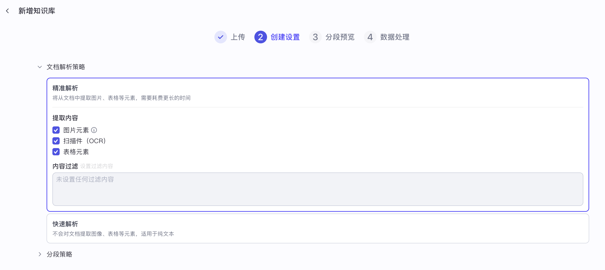

# 实战 Coze Studio 知识库使用

昨天我们学习了 Coze Studio 的工作流功能，通过在可视化画布上拖拽节点，迅速编排和搭建复杂的工作流。今天，我们将继续探索 Coze 的另一个核心功能 —— 知识库，学习如何为智能体注入私有或专业领域的知识，解决大模型幻觉和专业领域知识不足的问题。

## 创建知识库

大模型虽然知识渊博，但其知识截止于训练日期，并且对于私有或专业领域的知识一无所知。知识库功能正是为了解决这个问题而生的，它通过 RAG 技术，让智能体能够基于我们提供的专属资料库来回答问题。

我们首先进入 “资源库” 页面，点击 “+ 资源” 并选择 “知识库”，创建知识库：


Coze Studio 提供了三种不同类型的知识库：

* **文本格式**：文本知识库支持用户上传 PDF、TXT、DOC、DOCX、MD 等格式的文件，解析和分片后存储于向量数据库；它基于内容片段进行检索和召回，大模型结合召回的内容生成最终内容回复，适用于知识问答等场景；
* **表格格式**：表格知识库支持用户上传 CSV 和 XLSX 文件，导入表格数据，按行进行划分；它基于索引列的匹配进行检索，同时也支持基于 NL2SQL 的查询和计算；
* **照片类型**：照片知识库支持用户上传 JPG、JPEG 和 PNG 图片，通过大模型对图片进行标注；它基于标注信息的相似度匹配，找到与用户问题最相关的图片，给大模型用于内容生成；

Coze Studio 的知识库功能依赖于 Embedding 服务和向量化存储组件。

其中 Embedding 服务支持三种接入方式：

* **OpenAI** - 兼容 OpenAI 协议的 Embedding 接口
* **ARK** - 火山引擎提供的 Embedding 服务
* **HTTP** - 调用本地部署的模型服务，需要满足 Coze 自己的一套 [接口协议](https://github.com/coze-dev/coze-studio/blob/main/backend/infra/impl/embedding/http/http.go)，暂不支持 Ollama 或 Xinference 协议

这里我使用的是 OpenAI 的 `text-embedding-3-small` 模型，下面是 `.env` 配置示例，注意它的向量维度为 1536：

```sh
export EMBEDDING_TYPE="openai"
export OPENAI_EMBEDDING_BASE_URL=""
export OPENAI_EMBEDDING_MODEL="text-embedding-3-small"
export OPENAI_EMBEDDING_API_KEY="sk-xxx"
export OPENAI_EMBEDDING_BY_AZURE=false
export OPENAI_EMBEDDING_API_VERSION=""
export OPENAI_EMBEDDING_DIMS=1536
export OPENAI_EMBEDDING_REQUEST_DIMS=1536
```

另外，向量化存储组件支持开源向量数据库 [Milvus](https://milvus.io/) 和火山向量数据库 [VikingDB](https://www.volcengine.com/product/VikingDB)，默认使用 Milvus，一般不修改：

```sh
export VECTOR_STORE_TYPE="milvus"
export MILVUS_ADDR="localhost:19530"
```

如果你想切换成 VikingDB，可以使用下面的配置：

```sh
export VECTOR_STORE_TYPE="vikingdb"
export VIKING_DB_HOST=""
export VIKING_DB_REGION=""
export VIKING_DB_AK=""
export VIKING_DB_SK=""
export VIKING_DB_SCHEME=""
export VIKING_DB_MODEL_NAME=""
```

由于修改的是环境变量，通过 `--force-recreate` 重启服务：

```
$ docker compose --profile '*' up -d --force-recreate --no-deps coze-server
```

## 文本知识库

创建知识库时选择 “文本格式”，并填写知识库名称和描述，导入类型选 “本地文档”，然后点击 “创建并导入” 按钮，进入 “新增知识库” 的 “上传” 页面：


> 如果导入类型选 “自定义”，则进入 “新增知识库” 的 “文本填写” 页面，支持用户手动录入文档名称和文档内容。

我们上传一个简单的 PDF 文件（可以包含文本、表格、图片等元素），进入 “创建设置” 页面：



和其他的 RAG 系统类似，我们需要为知识库配置 **文档解析策略** 和 **分段策略**。Coze Studio 支持两种文档解析策略：

* **精准解析**：支持从文档中提取图片、表格等元素，需要耗费更长的时间；支持设置过滤内容，可以将一些特定的页面排除掉；
* **快速解析**：不会对文档提取图像、表格等元素，适用于纯文本；

如果上传的文件是扫描件，往往需要开启 OCR 功能，Coze Studio 目前只支持火山引擎的 [通用 OCR 服务](https://www.volcengine.com/product/OCR)，可以免费开通试用：


开通后创建密钥，获取 AK 和 SK，然后将其填到 `.env` 配置文件中：

```sh
export OCR_TYPE="ve"
export VE_OCR_AK="AK..."
export VE_OCR_SK="SK..."
```

同样的，由于修改的是环境变量，通过 `--force-recreate` 重启服务：

```
$ docker compose --profile '*' up -d --force-recreate --no-deps coze-server
```

如果上传的文件是纯文本，选择快速解析即可。

Coze Studio 也支持两种分段策略：

* **自动分段与清洗**：使用内置的分段与预处理规则；
* **自定义**：使用用户自定义的分段规则、分段长度与预处理规则；


配置好文档解析策略和分段策略后，点击 “下一步”，进入分段预览页面：


如果预览没问题的话，再次点击 “下一步”，系统开始对文件进行处理，等处理结束后，我们的文本知识库就构建完成了：


## 表格知识库

创建知识库时选择 “表格格式”，并填写知识库名称和描述，导入类型选 “本地文档”，然后点击 “创建并导入” 按钮，进入 “新增知识库” 的 “上传” 页面：


我们上传一个简单的 Excel 文件（必须有明确的表头行和数据行），进入 “表结构配置” 页面：


在这里可以切换数据表，一个表格数据库只能对应一个数据表；然后选择表头所在行以及数据起始行，再为表格的每一列添加描述和数据类型；并选择一个或多个列作为索引，用于和用户的问题进行相似度匹配；然后继续 “下一步”，进入预览页面：


预览没问题的话，再次点击 “下一步”，系统开始对表格进行处理，等处理结束后，我们的表格知识库就构建完成了。

## 照片知识库

创建知识库时选择 “照片类型”，并填写知识库名称和描述，导入类型选 “本地文档”，然后点击 “创建并导入” 按钮，进入 “新增知识库” 的 “上传” 页面：


我们上传几张图片，进入 “标注设置” 页面：


Coze Studio 支持两种标注图片的方式：

* **智能标注**：通过大模型深度理解图片，自动提供全面详细的内容描述信息；
* **人工标注**：不执行处理，在图片导入完成后，手动添加图片描述；

为了使用智能标注功能，我们还需要配置 AI 生成模型，可以通过下面的参数配置：

```sh
export BUILTIN_CM_TYPE="openai"
```

支持 OpenAI、ARK、DeepSeek、Ollama、Qwen、Gemini 等模型，不同模型的配置有所区别，对于 OpenAI 配置如下：

```sh
export BUILTIN_CM_OPENAI_BASE_URL=""
export BUILTIN_CM_OPENAI_API_KEY="sk-xxx"
export BUILTIN_CM_OPENAI_BY_AZURE=false
export BUILTIN_CM_OPENAI_MODEL="gpt-4o"
```

> 注意：AI 生成模型不仅用于图像标注（Image Annotation），还用于文本转 SQL（NL2SQL）、一句话生成 Query（Message to Query）等其他场景。如果需要在不同场景中使用不同模型，你可以通过添加前缀来针对特定场景应用特定配置，比如 `IM_BUILTIN_CM_TYPE`、`NL2SQL_BUILTIN_CM_TYPE` 或 `M2Q_BUILTIN_CM_TYPE`。

配置完成后记得通过 `--force-recreate` 重启服务。

点击 “下一步”，如果是选择了人工标注，系统不会做任何处理直接结束；如果是选择了智能标注，则通过 AI 生成模型对图片进行处理，等处理结束后，我们的照片知识库也就构建完成了：


大模型为每张图片生成一句话描述，可以点击图片进行查看和编辑：


## 使用知识库

知识库解析完成后，不需要发布，我们直接就可以在创建智能体时，将知识库添加到文本、表格或照片等知识中。智能体可以检索文本：


可以检索图片：


也可以检索表格：


## 创建数据库

在 Coze Studio 的资源库中，还有一种资源和知识库中的表格非常像，那就是数据库：


数据库可以作为智能体的记忆使用，实现收藏夹、todo list、书籍管理、财务管理等功能，也可以作为工作流中的节点使用。我们不妨拿高德的城市编码表来测试一下，它这个 Excel 表格包含 `cityname`、`adcode` 和 `citycode` 三列：


因此我们需要在创建数据库时，定义好对应的表结构：


然后进入数据库的测试数据或线上数据页面导入数据，线上数据是应用程序在实际运行时产生的数据，测试数据主要用于辅助调试，与线上数据是隔离的：


不知道大家还记不记得，我们昨天创建了一个 “高德天气查询” 工作流，其中通过代码组件将城市名称转换为高德城市编码，在代码组件中，我们将 Excel 中的所有数据保存到列表中，代码写得既冗余，又不好维护，而现在我们将 Excel 中的数据保存到数据库表中，那么就可以直接查询数据库来简化这个过程了。

对于数据库的查询操作，可以通过 “查询数据” 或 “SQL 自定义” 两个组件来实现，不过我测试下来发现，使用 “查询数据” 组件，城市名称怎么都模糊匹配不了，不清楚具体原因，后面阅读源码的时候再研究一下，有清楚的朋友欢迎评论区留言。这里先用 “SQL 自定义” 组件实现，编写 SQL 语句从数据库表中查询对应的城市记录：

```sql
select * from amap_city_code where LOCATE({{input}}, cityname) > 0
```

注意，我这里使用 `LOCATE` 函数来实现模糊匹配的功能，这和 `LIKE` 语句差不多，那么为什么不用 `LIKE` 呢？这是因为 Coze Studio 的 SQL 中使用 `{{input}}` 占位符来替换变量，但是替换时会自动用引号引起来，如果我们写 `LIKE '%{{input}}%'` 会被替换成 `LIKE '%'城市名'%'`，导致 SQL 查询报错，因此不得不找个偏门的法子。

配置好的节点如下图所示：


该节点会返回 `outputList` 结构化的表格数据，因此代码节点的 Python 代码可以精简：

```python
async def main(args: Args) -> Output:
  outputList = args.params['outputList']
  city_id = outputList[0]['adcode'] if outputList else '110000'
  ret: Output = {
    'city_id': city_id
  }
  return ret
```

优化后的工作流如下：


在这个工作流中，不仅代码更加简洁，而且城市编码表存放在数据库中，更容易维护。

## 小结

我们今天主要学习了 Coze Studio 的知识库功能，学习了如何创建和配置文本、表格和照片三种不同类型的知识库，了解了其背后的 Embedding、向量存储、OCR、图片标注等配置。此外，我们还学习了数据库功能，通过一个实际案例，将昨天创建的 “高德天气查询” 工作流进行了优化，利用数据库替代了硬编码的城市列表，使代码更简洁、维护更容易。

至此，我们已经全面体验了 Coze Studio 从智能体、插件、工作流到知识库的各项核心功能。可以看出，相对于官方的扣子平台，开源版阉割了不少功能，比如：

* 创建智能体里少了 **对话流模式** 和 **多 Agents 模式**，少了 **提示词对比调试** 和 **自动优化提示词** 功能；编排里技能少了 **触发器** 和 **异步任务**，记忆少了 **长期记忆** 和 **文件盒子**，对话体验少了 **音视频** 和 **语音输入** 等选项；调试智能体时少了 **调试详情** 功能；
* 创建应用里少了整个 **用户界面** 模块，不能搭建低代码应用；
* 资源库里少了 **对话流**、**卡片** 和 **音色** 等类型的资源；工作流中的组件也不完全，少了 **图像处理**、**音视频处理**、**会话管理** 和 **消息管理** 等组件；插件工具的创建方式少了 **代码插件** 和 **端侧插件**；创建文本知识库时少了 **在线数据**、**飞书**、**公众号**、**Notion** 等导入类型，表格知识库少了 **API**、**飞书** 等导入类型；
* 工作空间里还少了 **发布管理**、**模型管理**、**效果评测** 等模块，而且也没有 **团队空间** 的功能；

除了这些，还有一些产品细节，就不一一列举了。尽管如此，Coze Studio 的几个核心功能基本上都开源了，而且随着开源社区的不断贡献，相信这些缺失的模块很快就能补上。在接下来的学习中，我们将深入这几个核心功能的源码，研究下它们背后的实现原理。
