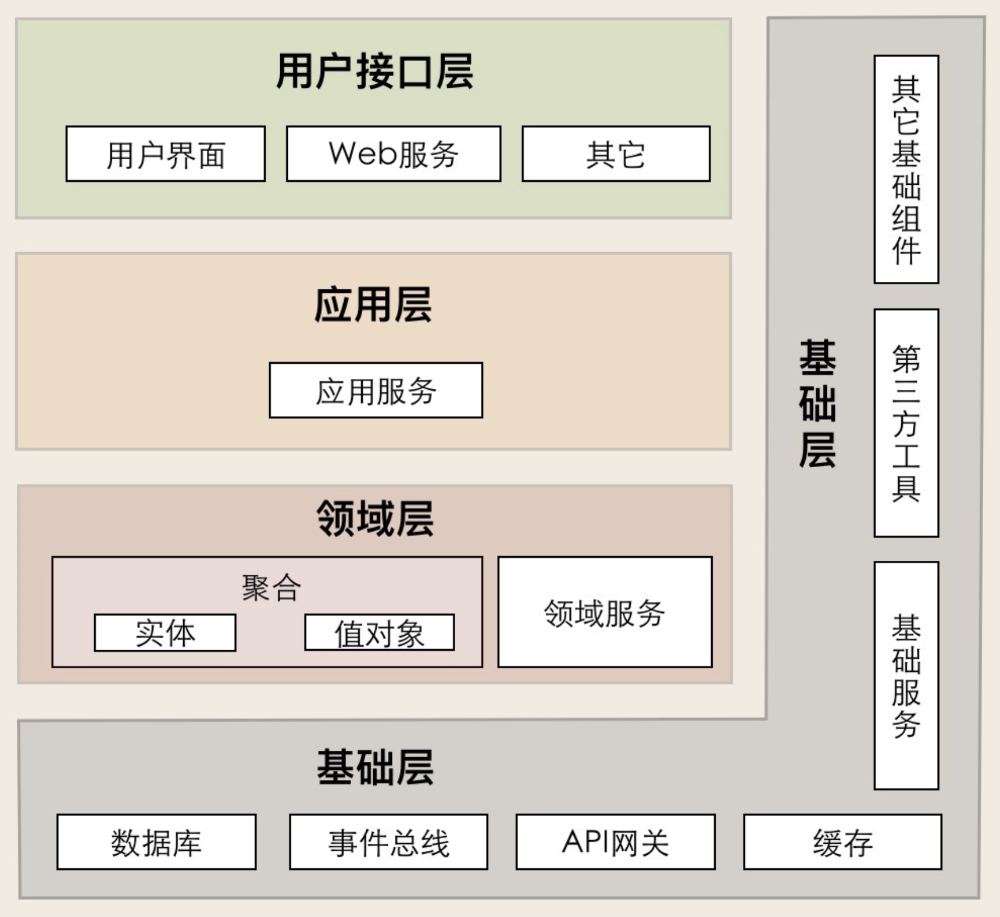
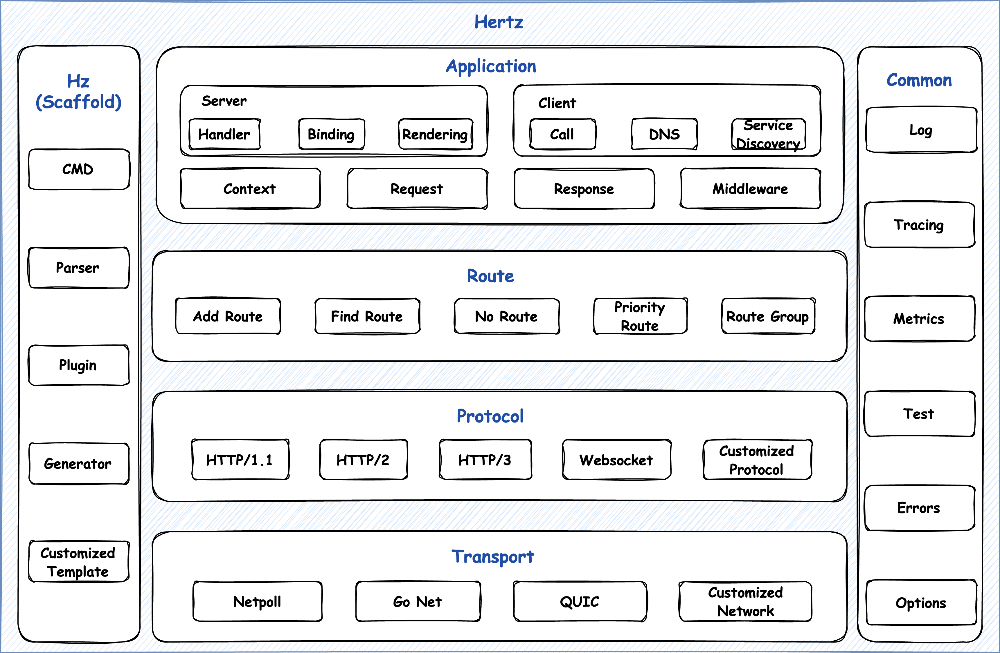

# 学习 Coze Studio 的代码架构

经过几天的实战和学习，我们已经全面体验了 Coze Studio 从智能体、插件、工作流到知识库的各项核心功能。今天，我们开始研究下它的源码，看看这些功能背后的实现原理。

## 项目架构

Coze Studio 的架构设计严格遵循 **领域驱动设计（DDD）** 的核心原则进行构建，我们可以看下它的整体项目结构：

```
├── backend/              # 后端服务
│   ├── api/              # API 处理器和路由
│   ├── application/      # 应用层，组合领域对象和基础设施实现
│   ├── conf/             # 配置文件
│   ├── crossdomain/      # 跨领域防腐层
│   ├── domain/           # 领域层，包含核心业务逻辑
│   ├── infra/            # 基础设施实现层
│   ├── pkg/              # 无外部依赖的工具方法
│   └── types/            # 类型定义
├── common/               # 公共组件
├── docker/               # Docker 配置
├── frontend/             # 前端应用
│   ├── apps/             # 应用程序
│   ├── config/           # 配置文件
│   ├── infra/            # 基础设施
│   └── packages/         # 包
├── idl/                  # 接口定义语言文件
```

我们主要关注 `backend` 目录下的内容，从子目录的名称可以很明显看出是 DDD 的分层架构：

* **API 层（`api`）**：实现 HTTP 端点，使用 Hertz 服务器处理请求和响应，包含中间件组件；
* **应用层（`application`）**：​组合各种领域对象和基础设施实现，提供 API 服务；
* **领域层（`domain`）**：包含核心业务逻辑，定义领域实体和值对象，实现业务规则和工作流；
* **跨领域防腐层（`crossdomain`）**：​定义跨领域接口，防止领域间直接依赖；
* **基础设施层（`infra`）**：又分为契约层和实现层；**契约层（`contract`）** ​定义所有外部依赖的接口，作为领域逻辑和基础设施之间的边界，包括存储系统、缓存机制、消息队列、配置管理等接口；**实现层（`impl`）** 为契约层定义的接口提供具体的实现；
* **工具包（`pkg`）**：无外部依赖的工具方法，可以被任何层直接使用；

## 领域驱动设计

**领域驱动设计（Domain-Driven Design，简称 DDD）** 是一种针对复杂业务系统的软件开发方法论，它的核心思想是 **以业务领域为中心**，软件的设计和实现都围绕业务领域的核心概念、规则和流程展开，而非单纯技术架构。通过抽象业务领域中的实体、关系和规则，构建 **领域模型（Domain Model）**，并将模型映射为代码，使代码既能反映业务逻辑，又能被业务人员理解。

Eric Evans 在 2004 年出版了《领域驱动设计》一书，提出了经典的 DDD 4 层架构：



我们可以在 `backend/domain` 目录下找到 Coze Studio 的所有领域模型：

```
├── agent           # 智能体，只有单智能体
├── app             # 应用
├── connector       # 连接器，Chat SDK 或 API
├── conversation    # 会话
├── datacopy        # 数据复制任务
├── knowledge       # 知识库
├── memory          # 记忆，包括数据库和变量
├── openauth        # 认证
├── permission      # 权限
├── plugin          # 插件和工具
├── prompt          # 提示词
├── search          # 搜索
├── shortcutcmd     # 快捷指令
├── template        # 模板
├── upload          # 一些默认图标的常量
├── user            # 用户
└── workflow        # 工作流
```

这里除了领域模型，还定义了对应的实体、值对象、聚合和领域服务等核心领域对象：

* **实体（Entity）**：有唯一标识、状态可变的对象，其身份比属性更重要；
* **值对象（Value Object）**：无唯一标识、不可变的对象，由属性定义（属性相同则视为相等）；
* **聚合（Aggregate）**：一组紧密关联的实体和值对象的集合，通过 **聚合根（Aggregate Root）** 对外暴露接口，保证数据一致性；
* **领域服务（Domain Service）**：封装跨实体/聚合的业务逻辑，无法归属到单个实体时使用；
* **领域事件（Domain Event）**：领域中发生的重要事件，用于解耦跨上下文的业务流程；
* **仓储（Repository）**：封装数据持久化逻辑，为领域模型提供数据访问接口（屏蔽数据库细节）；
* **限界上下文（Bounded Context）**：领域模型的边界，每个上下文内有独立的模型和通用语言，上下文间通过接口通信；限界上下文可作为微服务拆分的依据，每个微服务对应一个或多个限界上下文，降低服务间耦合；

在 DDD 开发中，往往还会引入了一个跨领域防腐层（Anti-Corruption Layer，简称 ACL），它通过隔离领域间的直接依赖，防止领域间出现耦合，确保各领域的独立性。Coze Studio 也使用了该设计模式，将跨领域模型定义在 `backend/crossdomain` 目录下：

```
├── contract
│   ├── crossagent
│   ├── crossagentrun
│   ├── crossconnector
│   ├── crossconversation
│   ├── crossdatabase
│   ├── crossdatacopy
│   ├── crossknowledge
│   ├── crossmessage
│   ├── crossplugin
│   ├── crosssearch
│   ├── crossuser
│   ├── crossvariables
│   └── crossworkflow
├── impl
│   ├── ...
└── workflow
    ├── ...
```

跨领域其实就是对不同领域之间的调用增加了一层适配层，比如会话领域中的 `agentrun` 在调用智能体领域时，不是直接调用 `agent`，而是调用防腐层 `crossagent`，这样做的好处是当智能体领域发生变化时，会话领域可以不受影响。

## 基础设施层

当领域模型构建完成后，接着就可以实现基础设施层，包括实现具体的数据库持久化逻辑，集成外部服务 API 和基础设施，实现消息队列的事件发布和订阅机制等；我们可以在 `backend/infra` 目录下看到这些，一般将基础设施层分为契约层和实现层，因为大多数基础设施都有多种不同的实现：

```
├── contract
│   ├── cache         # 缓存，默认基于 Redis 实现
│   ├── chatmodel     # 对话模型，比如 OpenAI、ARK、DeepSeek 等
│   ├── coderunner    # 代码执行器，比如 Python、JavaScript 等
│   ├── document      # 文档相关，包括文档解析、文档检索、重排序、图片理解、OCR、NL2SQL 等
│   ├── dynconf       # 动态配置，比如 Zookeeper、Etcd、Nacos 等
│   ├── embedding     # 嵌入模型，包括 OpenAI、ARK 和 HTTP 三种实现
│   ├── es            # Elasticsearch 增删改查，针对不同的 ES 版本有不同的实现
│   ├── eventbus      # 事件总线，包括 Kafka、NSQ、RMQ 等实现
│   ├── idgen         # ID 生成器
│   ├── imagex        # 火山引擎的 veImageX 服务
│   ├── messages2query # 问题改写
│   ├── modelmgr       # 模型管理器
│   ├── orm            # 对象关系映射，默认使用 GORM 框架
│   ├── rdb            # 关系型数据库，默认使用 MySQL 数据库
│   ├── sqlparser      # SQL 解析器
│   ├── sse            # 服务器发送事件，默认使用 Hertz 的 SSE 实现
│   └── storage        # 存储服务，比如 Minio、S3、TOS 等
└── impl
    ├── 同契约层
```

## 接口层实现

领域层的上面是应用层和接口层。应用层通过组合领域对象和基础设施，实现具体的业务用例；接口层则将具体的业务功能包装成 HTTP 接口，供前端或 SDK 调用。

Coze Studio 使用字节自家开源的 [Hertz](https://github.com/cloudwego/hertz) 框架来实现接口层。这是一个使用 Golang 编写的 HTTP 框架，具有高易用性、高性能、高扩展性等特点，它的设计参考了 [fasthttp](https://github.com/valyala/fasthttp)、[gin](https://github.com/gin-gonic/gin)、[echo](https://github.com/labstack/echo) 等开源框架，并结合字节内部的需求，目前在字节内部已被广泛使用。

Hertz 包括服务端和客户端，提供了路由、多协议、多网络库的支持，内置常用中间件，并集成了日志、监控、服务注册发现等三方扩展，框架图如下所示：



为了更好地理解 Coze Studio 的代码，我们不妨快速熟悉下 Hertz 的使用。首先，创建 `hertz_demo` 文件夹，然后进入该目录，创建 `main.go` 文件，内容如下：

```go
package main

import (
  "context"

  "github.com/cloudwego/hertz/pkg/app"
  "github.com/cloudwego/hertz/pkg/app/server"
  "github.com/cloudwego/hertz/pkg/common/utils"
  "github.com/cloudwego/hertz/pkg/protocol/consts"
)

func main() {
  h := server.Default(server.WithHostPorts(":9999"))

  h.GET("/ping", func(ctx context.Context, c *app.RequestContext) {
    c.JSON(consts.StatusOK, utils.H{"message": "pong"})
  })

  h.Spin()
}
```

使用 `go mod init` 命令生成 `go.mod` 文件：

```
$ go mod init hertz_demo
```

再使用 `go mod tidy` 命令整理并拉取依赖：

```
$ go mod tidy
```

最后使用 `go run` 启动服务：

```
$ go run hertz_demo
```

如果看到类似下面这样的日志，则说明服务已启动成功：

```
2025/08/05 07:12:36.758686 engine.go:681: [Debug] HERTZ: Method=GET    absolutePath=/ping --> handlerName=main.main.func1 (num=2 handlers)
2025/08/05 07:12:36.759819 engine.go:417: [Info] HERTZ: Using network library=netpoll
2025/08/05 07:12:36.760315 transport.go:149: [Info] HERTZ: HTTP server listening on address=[::]:9999
```

使用 `curl` 对接口进行测试：

```
$ curl http://localhost:9999/ping
{"message":"pong"}
```

这样一个简单的基于 Hertz 的 Web 服务就开发好了，如果想对 Hertz 做深入学习，可参考官方文档：

* https://www.cloudwego.io/zh/docs/hertz/getting-started/

## `hz` 代码生成

在上面的演示中，我们创建并编写 `main.go` 文件是从零开始的，其实，Hertz 还提供了一个 `hz` 命令行工具，可以快速生成 Hertz 项目的脚手架。

在安装 `hz` 之前，首先确保 `GOPATH` 环境变量已经被正确的定义，并且将 `$GOPATH/bin` 添加到 `PATH` 环境变量之中：

```sh
export GOPATH=$HOME/go
export PATH=$GOPATH/bin:$PATH
```

然后就可以通过下面的命令安装 `hz`：

```
$ go install github.com/cloudwego/hertz/cmd/hz@latest
```

运行 `hz -v` 验证是否安装成功：

```
$ hz -v
hz version v0.9.7
```

如果能正常显示版本号，则说明 `hz` 已成功安装。接下来，我们使用 `hz` 来生成一个 Hertz 项目。首先，创建 `hz_demo` 文件夹，然后进入该目录，执行如下命令：

```
$ hz new -module hz_demo
```

该命令会生成如下目录结构：

```
├── biz
│   ├── handler
│   │   └── ping.go
│   └── router
│       └── register.go
├── build.sh
├── go.mod
├── main.go
├── router.go
├── router_gen.go
└── script
    └── bootstrap.sh
```

仔细对比 Coze Studio 的 `backend` 目录结构，可以发现两者几无二致，基本上可以确定，Coze Studio 的 `backend` 模块也是使用 `hz` 自动生成的。

接着安装依赖：

```
$ go mod tidy
```

并启动服务：

```
$ go run hz_demo
```

## 接口定义语言

`hz` 的另一大特点是，它可以基于 **接口定义语言（Interface Definition Language，简称 IDL）** 生成 Hertz 项目的脚手架。IDL 是一种中立的、跨语言的规范，用于描述软件组件之间的接口（如数据结构、函数、服务定义等），它不依赖于特定编程语言，而是通过统一的语法定义接口契约，再由工具生成不同语言的代码（如 C++、Java、Python、Golang 等），在分布式系统中，不同服务可能使用不同语言开发，通过 IDL 可确保数据格式和交互方式一致。

Thrift 和 Protobuf 是两种主流的 IDL 实现，均用于跨语言数据序列化和服务通信，广泛应用于分布式系统：

* [Thrift](https://thrift.apache.org/) 是由 Facebook 开发的开源 IDL 框架，后捐给 Apache 基金会，支持数据序列化和 RPC 服务开发；
* [Protobuf](https://protobuf.dev/) 是 Google 开发的开源 IDL 框架，专注于高效的数据序列化，常与 gRPC 配合实现 RPC 通信；

`hz` 对 Thrift 和 Protobuf 两种 IDL 都提供了支持，但是在使用之前，需要安装相应的编译器：[thriftgo](https://github.com/cloudwego/thriftgo) 或 [protoc](https://github.com/protocolbuffers/protobuf/releases)，这里以 Thrift 为例，使用下面的命令安装 thriftgo 编译器：

```
$ GO111MODULE=on go install github.com/cloudwego/thriftgo@latest
```

然后我们创建一个新目录 `idl_demo`，并新建一个 `idl/hello.thrift` 文件：

```
// idl/hello.thrift
namespace go hello.example

struct HelloReq {
  1: string Name (api.query="name"); // 添加 api 注解为方便进行参数绑定
}

struct HelloResp {
  1: string RespBody;
}

service HelloService {
  HelloResp HelloMethod(1: HelloReq request) (api.get="/hello");
}
```

这个文件声明了 `hello.example` 命名空间，并定义了 `HelloReq` 和 `HelloResp` 两个结构体，分别对应 `HelloService` 服务中 `HelloMethod` 接口的请求和响应，同时还定义了该接口为 GET 请求，地址为 `/hello`。

再通过下面的命令生成项目脚手架：

```
$ hz new -module idl_demo \
    -idl idl/hello.thrift \
    -handler_dir api/handler \
    -router_dir api/router \
    -model_dir api/model
```

其中 `-handler_dir`、`-router_dir` 和 `-model_dir` 用于将对应的目录生成到 `api` 目录下，而不是默认的 `biz` 目录，这和 Coze Studio 的代码做法一致。新生成的目录结构如下：

```
├── api
│   ├── handler
│   │   ├── hello
│   │   │   └── example
│   │   │       └── hello_service.go
│   │   └── ping.go
│   ├── model
│   │   └── hello
│   │       └── example
│   │           └── hello.go
│   └── router
│       ├── hello
│       │   └── example
│       │       ├── hello.go
│       │       └── middleware.go
│       └── register.go
├── build.sh
├── go.mod
├── idl
│   └── hello.thrift
├── main.go
├── router.go
├── router_gen.go
└── script
    └── bootstrap.sh
```

`HelloService` 服务的实现位于 `api/handler` 目录下，`hello/example` 对应 idl 文件中的命名空间，我们可以打开 `hello_service.go` 对其进行编辑：

```go
// HelloMethod .
// @router /hello [GET]
func HelloMethod(ctx context.Context, c *app.RequestContext) {
  var err error
  var req example.HelloReq
  err = c.BindAndValidate(&req)
  if err != nil {
    c.String(consts.StatusBadRequest, err.Error())
    return
  }

  resp := new(example.HelloResp)
  resp.RespBody = "hello, " + req.Name  // <-- 新增代码
  c.JSON(consts.StatusOK, resp)
}
```

接着和上面一样，安装依赖，启动服务：

```
$ go mod tidy
$ go run hz_demo
```

使用 `curl` 验证通过 IDL 定义的 `/hello` 接口是否能正常调用：

```
$ curl "http://localhost:9999/hello?name=zhangsan"
{"RespBody":"hello, zhangsan"}
```

Coze Studio 的源码中有一个 `idl` 目录，里面包含大量的 Thrift 文件，定义了平台所有接口和结构体，`backend/api` 目录下的 `handler`、`router` 和 `model` 就是基于这些 IDL 通过 `hz` 自动生成的。

## 小结

今天，我们对 Coze Studio 的代码架构做了一番研究。首先学习了其基于领域驱动设计（DDD）的后端实现，掌握了领域层、跨领域防腐层、基础设施层等概念；然后通过实践 Hertz 框架、`hz` 命令行工具以及接口定义语言（IDL），理解了其 API 层的构建方式。通过今天的学习，相信大家对 Cozs Studio 的代码全貌有了一个直观的了解，在阅读 Coze Studio 源码时不至于迷路。

接下来，我们就深入到具体的业务实现里，看看它的智能体、插件、工作流、知识库以及记忆等核心功能是如何实现的。
