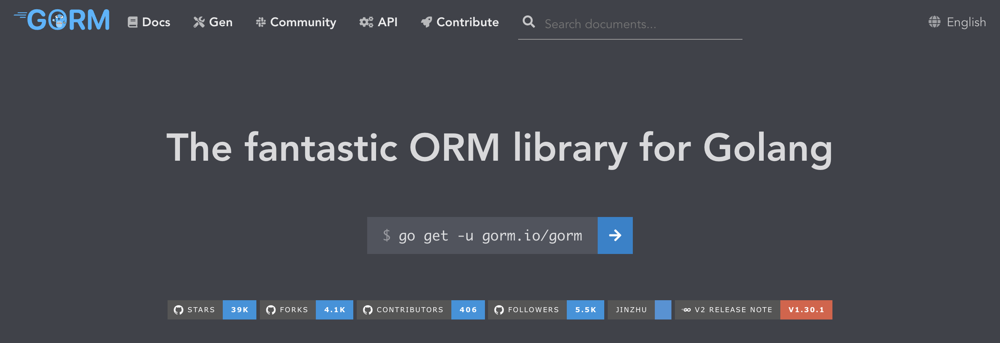
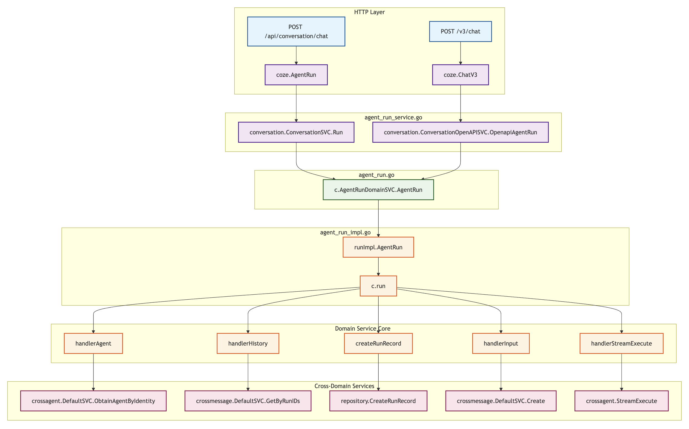

# 学习 Coze Studio 的智能体会话接口

前面我们已经学习了 Coze Studio 的代码架构，对项目整体有了一个大致的了解。今天，我们将深入智能体执行的核心，研究下用户在和智能体对话时，后端服务是如何处理会话请求的。

## 接口层实现

我们首先来看下智能体会话的接口层实现。正如上一篇所述，Coze Studio 中的接口均通过 IDL 定义，位于 `idl/conversation/agentrun_service.thrift` 文件：

```
service AgentRunService {
  run.AgentRunResponse AgentRun(1: run.AgentRunRequest request) (
    api.post='/api/conversation/chat', 
    api.category="conversation", 
    api.gen_path= "agent_run"
  )
  run.ChatV3Response ChatV3(1: run.ChatV3Request request)(
    api.post = "/v3/chat",
    api.category="chat",
    api.tag="openapi",
    api.gen_path="chat"
  )
}
```

这里还有一个 `/v3/chat` 接口，它是正式发布的智能体对外的 API 接口，其实现和 `/api/conversation/chat` 基本一致，这里不作过多介绍。

然后使用 `hz` 工具将 IDL 自动生成 API 处理器，位于 `backend/api/handler/coze/agent_run_service.go` 文件：

```go
// @router /api/conversation/chat [POST]
func AgentRun(ctx context.Context, c *app.RequestContext) {
	
  // 绑定并校验入参
  var req run.AgentRunRequest
  c.BindAndValidate(&req)
  
  // 新建 SSE 发送器
  sseSender := sseImpl.NewSSESender(sse.NewStream(c))
  c.SetStatusCode(http.StatusOK)
  c.Response.Header.Set("X-Accel-Buffering", "no")

  // 调用 conversation 应用服务
  conversation.ConversationSVC.Run(ctx, sseSender, &req)
}
```

API 接口层没有什么复杂的逻辑，主要是绑定并校验入参，然后调用应用层。

这里值得一提是 `X-Accel-Buffering` 响应头的使用，这是一个特殊的 HTTP 响应头，主要用于控制反向代理（如 Nginx）的缓冲行为，当它的值被设置为 `no` 时，表示告诉代理服务器不要对当前响应进行缓冲。如果没有这个设置，Nginx 等代理可能会缓冲响应内容直到缓冲区填满或响应完成，这会导致客户端无法实时获取数据，产生延迟感。这个设置通常用于需要 **流式传输** 的场景，比如：实时日志输出、大型文件下载、SSE 服务器推送等。

## 应用层实现

接着再来看下应用层的实现，位于 `backend/application/conversation/agent_run.go` 文件：

```go
func (c *ConversationApplicationService) Run(ctx context.Context, sseSender *sseImpl.SSenderImpl, ar *run.AgentRunRequest) error {

  // 从当前会话中获取用户 ID
  userID := ctxutil.MustGetUIDFromCtx(ctx)

  // 如果 RegenMessageID > 0 说明是重新生成，将对应的运行记录和消息删除
  if ar.RegenMessageID != nil && ptr.From(ar.RegenMessageID) > 0 {
    msgMeta, err := c.MessageDomainSVC.GetByID(ctx, ptr.From(ar.RegenMessageID))
    if msgMeta != nil {
      err = c.AgentRunDomainSVC.Delete(ctx, []int64{msgMeta.RunID})
      delErr := c.MessageDomainSVC.Delete(ctx, &msgEntity.DeleteMeta{
        RunIDs: []int64{msgMeta.RunID},
      })
    }
  }

  // 查询 Agent 信息
  agentInfo, caErr := c.checkAgent(ctx, ar)

  // 获取当前会话，如果不存在，则创建新会话
  conversationData, ccErr := c.checkConversation(ctx, ar, userID)

  // 获取快捷指令
  var shortcutCmd *cmdEntity.ShortcutCmd
  if ar.GetShortcutCmdID() > 0 {
    cmdID := ar.GetShortcutCmdID()
    cmdMeta, err := c.ShortcutDomainSVC.GetByCmdID(ctx, cmdID, 0)
    shortcutCmd = cmdMeta
  }

  // 构造智能体运行参数
  arr, err := c.buildAgentRunRequest(ctx, ar, userID, agentInfo.SpaceID, conversationData, shortcutCmd)
  
  // 调用 agent_run 领域服务
  streamer, err := c.AgentRunDomainSVC.AgentRun(ctx, arr)
  
  // 从 streamer 拉取消息，根据消息类型构建对应的响应体，通过 sseSender 发送出去，实现流式输出
  c.pullStream(ctx, sseSender, streamer, ar)
  return nil
}
```

为了方便表述，我对原代码的顺序做了一些调整，主要包括三大块逻辑：

1. **处理用户的重新生成请求**：一般来说只会在最后一轮对话上出现重新生成按钮，实现逻辑就是将对应的运行记录和消息删除，然后继续正常的会话即可；
2. **构造智能体运行参数**：查询必要的信息，包括 Agent 信息、会话信息、快捷指令等，构造智能体运行参数；
3. **运行智能体**：调用 `agent_run` 领域服务，并通过 SSE 实现流式输出；

从代码可以看出，应用层整合了多个领域层服务，这里的每一个领域基本上都对应一个数据库表：

* 消息领域服务（`MessageDomainSVC`）：对应数据库中的 `message` 表，一条消息代表用户的一次提问或助手的一次回答，一次工具调用或一次工具响应；
* 智能体运行领域服务（`AgentRunDomainSVC`）：对应 `run_record` 表，代表一次用户和助手之间的所有交互，一条运行记录包含多条消息；
* 单智能体领域服务（`SingleAgentDomainSVC`）：对应 `single_agent_draft` 表，代表我们创建的智能体；
* 会话领域服务（`ConversationDomainSVC`）：对应 `conversation` 表，当你和智能体第一次交互时会自动创建一个会话，后续的交互都在这个会话下，一个会话包含多条运行记录；
* 快捷指令领域服务（`ShortcutDomainSVC`）：对应 `shortcut_command` 表，开启快捷指令后会在对话输入框上方出现快捷输入按钮，方便用户快速发起预设对话；快捷指令和正常的流程有些区别，因此需要特殊处理；

Coze Studio 使用 [GORM](https://gorm.io/index.html) 访问数据库，这是一个功能强大的 Go 语言 ORM（对象关系映射）库，它简化了 Go 程序与数据库的交互，提供了优雅的 API 和丰富的功能：



感兴趣的同学可以在每个领域的 `internal/dal` 下找到 `model` 和 `query` 两个目录，这些都是通过 [gorm.io/gen](https://gorm.io/gen/) 自动生成的，包含对数据库表的增删改查代码：

```
backend/domain/agent/singleagent/internal/dal
├── model
│   ├── single_agent_draft.gen.go
│   ├── single_agent_publish.gen.go
│   └── single_agent_version.gen.go
├── query
│   ├── gen.go
│   ├── single_agent_draft.gen.go
│   ├── single_agent_publish.gen.go
│   └── single_agent_version.gen.go
```

## 领域层实现

上面的 `Run()` 方法中，最核心的一句是调用领域层的 `AgentRun()` 方法，其实现位于 `backend/domain/conversation/agentrun/service/agent_run_impl.go` 文件中，如下：

```go
func (c *runImpl) AgentRun(ctx context.Context, arm *entity.AgentRunMeta) (*schema.StreamReader[*entity.AgentRunResponse], error) {

  // 新建一个容量 20 的双向管道
  sr, sw := schema.Pipe[*entity.AgentRunResponse](20)

  // 将 StreamWriter 传入 c.run 方法
  safego.Go(ctx, func() {
    defer sw.Close()
    _ = c.run(ctx, sw, rtDependence)
  })
  // 将 StreamReader 返回上层，供应用层读取
  return sr, nil
}
```

这里的逻辑比较简单，主要是通过 `schema.Pipe` 创建一个双向管道，用于上层读取消息和下层写入消息，然后使用 `safego.Go` 调用 `c.run()` 方法。`safego.Go` 是对原生的 `go` 的一层包装，它的主要作用是创建一个 goroutine 来执行传入的函数，并在 goroutine 中添加了错误恢复机制，确保在 goroutine 中发生的 panic 会被捕获和处理，而不会导致整个程序崩溃：

```go
func Go(ctx context.Context, fn func()) {
  go func() {
    defer goutil.Recovery(ctx)

    fn()
  }()
}
```

调用的 `c.run()` 方法如下：

```go
func (c *runImpl) run(ctx context.Context, sw *schema.StreamWriter[*entity.AgentRunResponse], rtDependence *runtimeDependence) (err error) {

  // 获取智能体信息
  agentInfo, err := c.handlerAgent(ctx, rtDependence)
  rtDependence.agentInfo = agentInfo
  
  // 获取最近 N 轮历史对话
  history, err := c.handlerHistory(ctx, rtDependence)
  
  // 创建一条新的运行记录 `run_record`
  runRecord, err := c.createRunRecord(ctx, sw, rtDependence)
  rtDependence.runID = runRecord.ID

  // 创建一条新的用户消息 `message`
  input, err := c.handlerInput(ctx, sw, rtDependence)
  rtDependence.questionMsgID = input.ID
  
  // 流式执行智能体
  err = c.handlerStreamExecute(ctx, sw, history, input, rtDependence)
  return
}
```

这里仍然是一系列数据库的操作，包括查询智能体信息、获取历史对话、创建运行记录、创建用户消息等，不过需要注意的是，这些基本上都是对其他领域的操作，Coze Studio 在这里引入了跨领域防腐层，防止领域之间的直接依赖。至此，整个对话接口的流程图如下所示：



到这里，终于走到了智能体会话接口的最末端，通过调用 `crossagent` 跨领域服务，执行逻辑从 `agent_run` 领域进入 `single_agent` 领域，正式开始执行智能体。

## 小结

今天，我们学习了 Coze Studio 智能体会话接口的完整后端处理流程，其代码严格遵循 DDD 的分层原则，从接口层、到应用层、到领域层、最后通过跨领域防腐层，将最终的执行任务交给了 `single_agent` 领域。至此，准备工作已经就绪，接下来，我们将进入 `single_agent` 领域，揭开智能体内部执行逻辑的神秘面纱。
