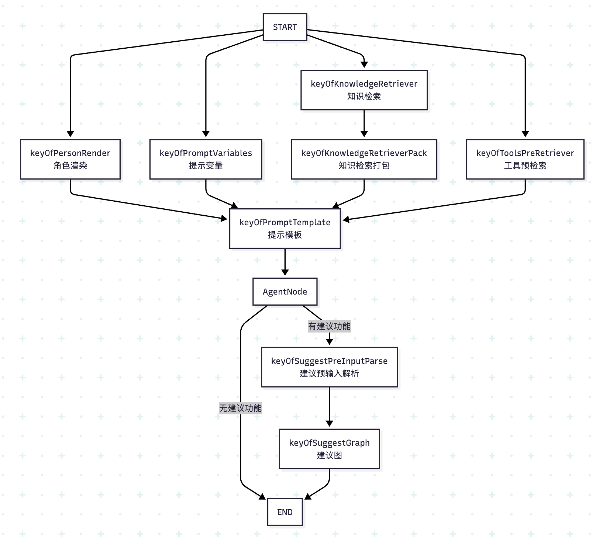
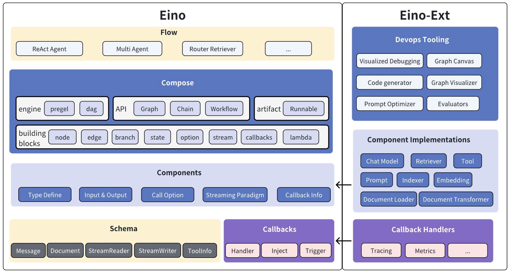
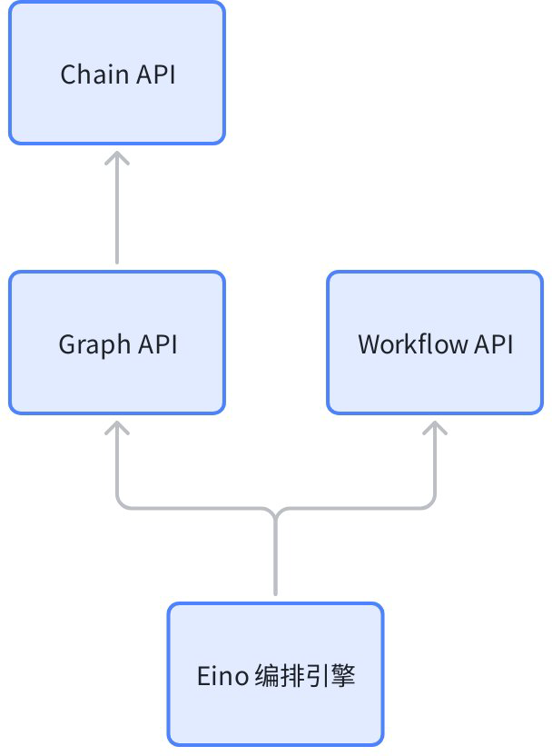
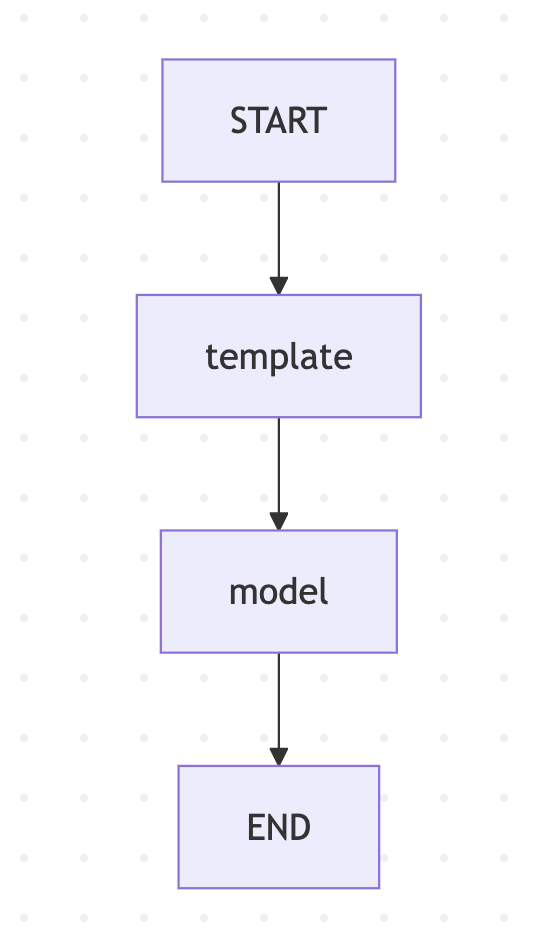

# 学习 Coze Studio 的智能体执行逻辑

我们昨天学习了 Coze Studio 智能体会话接口的完整后端处理流程，从接口层、到应用层、到领域层、最后通过跨领域防腐层，将最终的执行任务交给了 `single_agent` 领域。今天我们将继续这个过程，深入研究下智能体的执行逻辑。

## 智能体执行

智能体执行的逻辑代码位于 `backend/domain/agent/singleagent/service/single_agent_impl.go` 文件：

```go
func (s *singleAgentImpl) StreamExecute(ctx context.Context, req *entity.ExecuteRequest) (events *schema.StreamReader[*entity.AgentEvent], err error) {

  // 获取智能体信息
  ae, err := s.ObtainAgentByIdentity(ctx, req.Identity)
  
    // 构建智能体图
  conf := &agentflow.Config{
    Agent:        ae,
    UserID:       req.UserID,
    Identity:     req.Identity,
    ModelMgr:     s.ModelMgr,
    ModelFactory: s.ModelFactory,
    CPStore:      s.CPStore,
  }
  rn, err := agentflow.BuildAgent(ctx, conf)
  
  // 执行智能体图
  exeReq := &agentflow.AgentRequest{
    UserID:   req.UserID,
    Input:    req.Input,
    History:  req.History,
    Identity: req.Identity,
    ResumeInfo:   req.ResumeInfo,
    PreCallTools: req.PreCallTools,
  }
  return rn.StreamExecute(ctx, rn.PreHandlerReq(ctx, exeReq))
}
```

首先根据配置信息构建智能体图，这里引入了 **图（Graph）** 这个新概念，Coze Studio 通过 [Eino](https://github.com/cloudwego/eino) 智能体框架，将智能体编排成一个有向图，构建的大体流程如下：

```go
func BuildAgent(ctx context.Context, conf *Config) (r *AgentRunner, err error) {

  // 初始化节点...

  // 创建一个新图
  g := compose.NewGraph[*AgentRequest, *schema.Message](
    compose.WithGenLocalState(func(ctx context.Context) (state *AgentState) {
      return &AgentState{}
    }))

  // 向图中添加节点...
  // 连接节点之间的边...
  
  // 图编译
  runner, err := g.Compile(ctx, opts...)

  // 返回图
  return &AgentRunner{
        runner: runner,
    }, nil
}
```

这个智能体图比较复杂，方法中充斥着大量节点初始化以及向图中添加节点和边的代码，此处做了省略，暂时只要关注 `compose.NewGraph()` 以及 `g.Compile()` 两行代码，这是使用 Eino 创建并编译智能体的常见方式，构建完成的智能体图如下所示：



这个图结构体现了完整的智能体处理流水线，从输入预处理到最终响应生成：

- 并行初始化：从开始节点同时触发 4 个输入处理节点，并行处理提高效率；
- 汇聚处理：所有预处理结果汇聚到提示模板节点；
- 条件分支：根据是否有工具选择不同的 Agent 处理方式，如果有工具，使用 ReAct Agent，否则直接调大模型；
- 问题建议：根据配置决定是否启用建议功能；

最后，完成图的编译后，在 `StreamExecute()` 方法中通过 `runner.Stream()` 流式调用它：

```go
func (r *AgentRunner) StreamExecute(ctx context.Context, req *AgentRequest) (sr *schema.StreamReader[*entity.AgentEvent], err error) {

  // 回调处理器
  hdl, sr, sw := newReplyCallback(ctx, executeID.String())

  go func() {

    // 注册回调
    var composeOpts []compose.Option
    composeOpts = append(composeOpts, compose.WithCallbacks(hdl))
    _ = compose.RegisterSerializableType[*AgentState]("agent_state")

    // 流式运行图
    _, _ = r.runner.Stream(ctx, req, composeOpts...)
  }()

  return sr, nil
}
```

可以看出，智能体执行的核心就是这个图的构建和执行，在我们深入细节之前，先来快速了解下字节开源的 Eino 智能体框架。

## 了解 Eino 智能体框架

目前已经有很多智能体框架了，比如 LangGraph、LlamaIndex、Agno 等，但这些基本上都是 Python 语言开发的。Eino 是字节开源的一款使用 Go 语言开发的智能体框架，其主要特点是强类型，易维护，高可靠。

Eino 遵循模块化设计，架构图如下：



主要分为六大模块：

* **Schema**：提供 Eino 最基础的一些结构与方法定义，比如 `Message`、`Document`、`StreamReader` 和 `StreamWriter` 等；
* [**Components**](https://www.cloudwego.io/zh/docs/eino/core_modules/components/)：组件是 Eino 应用的基本构成元素，比如 `ChatModel`、`ChatTemplate`、`Tool`、`Lambda` 等，它们功能各异，但都遵循统一的接口规范，[Eino Ext](https://github.com/cloudwego/eino-ext) 为每种组件提供默认的实现；
* [**Compose**](https://www.cloudwego.io/zh/docs/eino/core_modules/chain_and_graph_orchestration/)：对多个组件进行流程编排，支持复杂的图（`Graph`）、简单的链（`Chain`）以及支持字段映射的工作流（`Workflow`），实现复杂的业务逻辑；
* [**Callbacks**](https://www.cloudwego.io/zh/docs/eino/ecosystem_integration/callbacks/)：为智能体的运行提供切面机制，通过不同的触发时机，可实现日志、跟踪、监控等功能，内置集成了 [Langfuse](https://langfuse.com/docs/get-started)、[APMPlus](https://www.volcengine.com/docs/6431/69092)、[CozeLoop](https://github.com/coze-dev/coze-loop) 等平台；
* [**Flow**](https://www.cloudwego.io/zh/docs/eino/core_modules/flow_integration_components/)：大模型应用是存在通用场景和模式的，Eino 将这些场景进行抽象，提供了一些可以帮助开发者快速构建大模型应用的模版，比如 ReAct 智能体、多智能体、多查询检索等；
* [**Devops Tools**](https://www.cloudwego.io/zh/docs/eino/core_modules/devops/)：Eino 提供了一套开发工具链，通过 Eino Dev 插件进行可视化 `Graph` 搭建和代码生成，以及对其进行可视化调试；

Eino 不仅仅是一款智能体框架，更准确的说，它应该是一款大模型应用开发框架，通过这些模块，开发者可快速开发出满足自己业务需求的大模型应用。

## 学习 Eino 组件

大模型应用开发有三种主要的应用模式：

* **直接对话模式**：处理用户输入并生成相应回答；
* **知识处理模式**：对文本文档进行语义化处理、存储和检索；
* **工具调用模式**：基于上下文做出决策并调用相应工具；

Eino 从这些模式中提取出一些常用的能力，并将这些能力抽象为可复用的 **组件（Components）**，这些组件功能各异，大致可以分为下面几大类，Eino 为每种组件都提供了多种不同的实现：

* 对话处理类组件
    * 提示词模板（`ChatTemplate`）：有 Default 和 MCP 两种实现，默认实现支持 [FString](https://github.com/slongfield/pyfmt)、[GoTemplate](https://pkg.go.dev/text/template) 和 [Jinja2](github.com/nikolalohinski/gonja) 等变量语法，[MCP 实现](https://www.cloudwego.io/zh/docs/eino/ecosystem_integration/chat_template/chat_template_mcp/) 支持加载 MCP Server 中定义的 Prompt 资源；
    * 大模型对话（`ChatModel`）：支持 OpenAI、DeepSeek、Qwen、Claude、Gemini、Ollama、火山引擎、百度千帆平台等；
* 文本语义处理类组件
    * 加载文档（`Document Loader`）：支持从本地文件、Web URL 和 AWS S3 存储桶中加载文档，一般和 Document Parser 结合使用；
    * 解析文档（`Document Parser`）：支持解析 TXT、HTML、DOCX、XLSX、PDF 等格式的文件；
    * 处理文档（`Document Transformer`）：分为 Splitter 和 Reranker 两种，Splitter 支持 Markdown 分割器、HTML 分割器、递归分割器、语义分割器等，Reranker 支持基于得分的重排序；
    * 文本语义化（`Embedding`）：支持 OpenAI、Ollama、火山引擎、百度千帆平台、阿里云百炼平台 DashScope、腾讯云混元等；
    * 索引存储（`Indexer`）：一般配合 Embedding 一起使用，也可以使用分词索引，支持 Elasticsearch 8.x、Milvus 2.x、Redis Stack 以及火山引擎 VikingDB 等；
    * 文本召回（`Retriever`）：从 Indexer 中检索内容，同样支持 Elasticsearch 8.x、Milvus 2.x、Redis Stack 以及火山引擎 VikingDB 等，同时还支持检索火山知识库和 Dify 知识库；
* 决策执行类组件
    * 调用工具（`ToolsNode`）：用户可基于接口规范实现自己的工具，Eino 也提供了几个内置的工具，比如 Bing 搜索、Google 搜索、DuckDuckGo 搜索、SearXNG 搜索、维基百科搜索、浏览器使用、命令行工具、HTTP 请求、Sequential Thinking 以及 MCP 工具；
* 用户自定义组件
    * 自定义代码逻辑（`Lambda`）：允许用户在工作流中嵌入自定义的函数逻辑；

这里以大模型组件为例，带大家了解下 Eino 组件的用法。下面是一个简单的调用示例：

```go
package main

import (
  "context"
  "os"

  "github.com/cloudwego/eino-ext/components/model/openai"
  "github.com/cloudwego/eino/schema"
)

func main() {

  ctx := context.Background()

  // 初始化大模型
  model, _ := openai.NewChatModel(ctx, &openai.ChatModelConfig{
    BaseURL: os.Getenv("OPENAI_BASE_URL"),
    APIKey:  os.Getenv("OPENAI_API_KEY"),
    Model:   "gpt-4o",
  })

  // 准备消息
  messages := []*schema.Message{
    schema.SystemMessage("你是一个翻译专家，擅长中文和英文之间的互译。"),
    schema.UserMessage("你好，世界！"),
  }

  // 生成回复
  response, _ := model.Generate(ctx, messages)
  println(response.Content)
}
```

我们首先通过 `openai.NewChatModel` 创建了一个 `ChatModel` 组件，它的接口定义如下：

```go
type BaseChatModel interface {
  Generate(ctx context.Context, input []*schema.Message, opts ...Option) (*schema.Message, error)
  Stream(ctx context.Context, input []*schema.Message, opts ...Option) (
    *schema.StreamReader[*schema.Message], error)
}
```

它有 `Generate` 和 `Stream` 两个方法，可以看出，组件输入是消息数组（`[]*schema.Message`），输出是消息（`*schema.Message`），这里使用 `Generate` 生成一次性回复，也可以使用 `Stream` 流式输出：

```go
  // 流式读取消息
  reader, _ := model.Stream(ctx, messages)
  defer reader.Close()
  for {
    chunk, err := reader.Recv()
    if err != nil {
      break
    }
    print(chunk.Content)
  }
```

“组件优先” 是 Eino 的一大设计原则，每个组件都是一个职责划分比较清晰且功能单一的模块，都可以独立使用，其他组件的用法和上面的大模型组件基本类似。我们要特别注意每个组件的输入和输出类型，这在后面编排时非常有用。

## 使用 Eino 进行 Graph 编排

组件只能提供原子能力，在一个大模型应用中，还需要根据场景化的业务逻辑，对这些原子能力进行组合和串联，这就是 **编排（Compose）**。Eino 支持三种编排方式：**图（Graph）**、**链（Chain）** 和 **工作流（Workflow）**，三者之间的关系如下：



其中，链最简单，可以认为是简单的有向无环图，它是基于图实现的；工作流也是无环图，和图的区别在于，它提供了字段级别映射能力，节点的输入可以由任意前驱节点的任意输出字段组合而成；在 Coze Studio 中，智能体是通过 Graph API 实现的，工作流是通过 Workflow API 实现的。

回顾上面 Coze Studio 构建智能体图时所看到的 `compose.NewGraph()` 以及 `g.Compile()` 两行代码，其实就是 Graph API。下面通过一个简单的例子快速掌握如何使用 Eino 进行 Graph 编排：

```go
package main

import (
  "context"
  "os"

  "github.com/cloudwego/eino-ext/components/model/openai"
  "github.com/cloudwego/eino/components/prompt"
  "github.com/cloudwego/eino/compose"
  "github.com/cloudwego/eino/schema"
)

func main() {

  ctx := context.Background()

  // 初始化大模型
  model, _ := openai.NewChatModel(ctx, &openai.ChatModelConfig{
    BaseURL: os.Getenv("OPENAI_BASE_URL"),
    APIKey:  os.Getenv("OPENAI_API_KEY"),
    Model:   "gpt-4o",
  })

  // 创建模板，使用 FString 格式
  template := prompt.FromMessages(schema.FString,
    // 系统消息模板
    schema.SystemMessage("你是一个翻译专家，擅长{from}和{to}之间的互译，如果用户输入的是{from}将其翻译成{to}，如果用户输入的是{to}将其翻译成{from}"),
    // 用户消息模板
    schema.UserMessage("用户输入: {question}"),
  )

  // 构造图
  graph := compose.NewGraph[map[string]any, *schema.Message]()

  _ = graph.AddChatTemplateNode("template", template)
  _ = graph.AddChatModelNode("model", model)

  _ = graph.AddEdge(compose.START, "template")
  _ = graph.AddEdge("template", "model")
  _ = graph.AddEdge("model", compose.END)

  result, err := graph.Compile(ctx)
  if err != nil {
    panic(err)
  }

  // 调用图
  output, _ := result.Invoke(ctx, map[string]any{
    "from":     "中文",
    "to":       "法语",
    "question": "你好，世界！",
  })
  println(output.Content)
}
```

我们首先通过 `openai.NewChatModel` 创建了一个 `ChatModel` 组件，再通过 `prompt.FromMessages` 创建了一个 `ChatTemplate` 组件，然后使用 Graph API 将这两个组件连起来，构造成一个简单的图，如下：



> 这个图非常简单，实际上是一个链，感兴趣的同学也可以使用 Chain API 来实现它。

在编排图时，我们需要特别注意每个组件的输入和输出类型，比如：

* `ChatTemplate` 的入参是 `map[string]any`，出参是 `[]*schema.Message`
* `ChatModel` 的入参是 `[]*schema.Message`，出参是 `ChatModel`

`ChatTemplate` 的出参刚好可以对上 `ChatModel` 的入参，因此两个组件可以连起来，如果组件之间的参数不一致，需要在中间插入 `Lambda` 组件自定义参数转换，如果不匹配，在 `Compile` 编译时就会报错；此外，图的入参就是第一个节点的入参，图的出参就是最后一个节点的出参，使用 `compose.NewGraph` 创建图时需要明确的指定图的入参和出参类型，比如这里的入参为 `map[string]any`，出参为 `*schema.Message`，在调用 `Invoke` 时传入适当的参数类型。

关于编排的更多细节，可以参考官方的文档：

* https://www.cloudwego.io/zh/docs/eino/core_modules/chain_and_graph_orchestration/

## 未完待续

本文我们顺着 Coze Studio 的代码，从智能体的执行入口 `StreamExecute` 开始，了解了其核心是基于 Eino 框架构建的一个智能体图。为了更好地理解这个图，我们快速学习了 Eino 框架的核心概念，包括其模块化设计、丰富的组件生态以及强大的编排能力。最后，通过一个简单的例子，我们掌握了如何使用 Eino 的组件和 Graph API 构建一个基本的大模型应用。

本文对智能体的图构建流程只是粗略带过，在下一篇文章中，我们将回头深入分析 Coze Studio 中那个复杂的智能体图，详细拆解其中的每一个节点和逻辑分支，彻底搞懂其运行细节。
