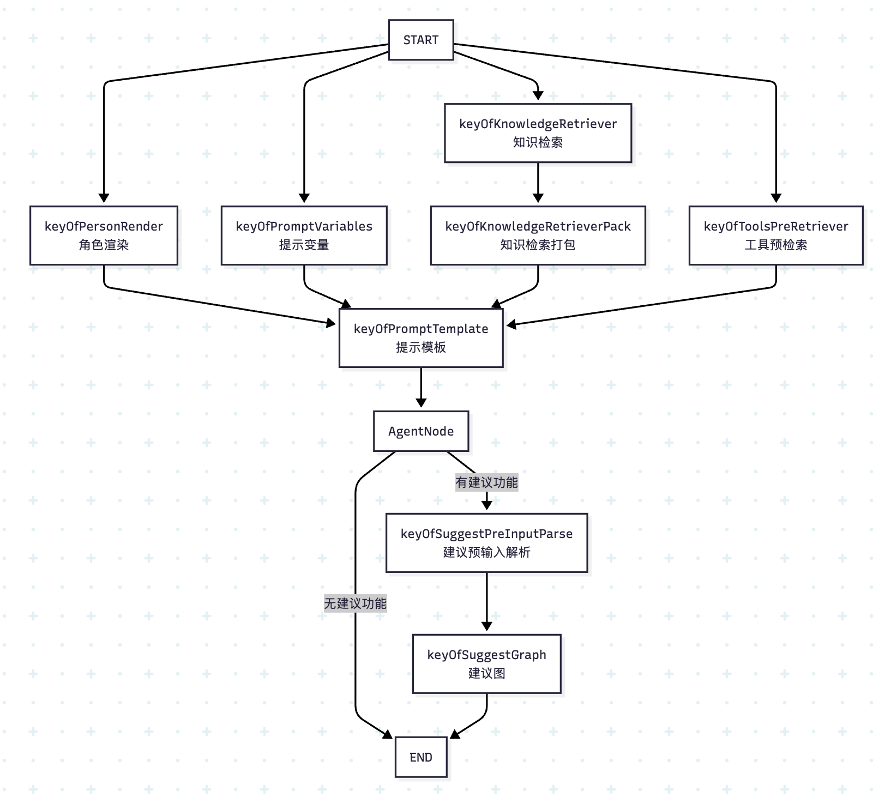
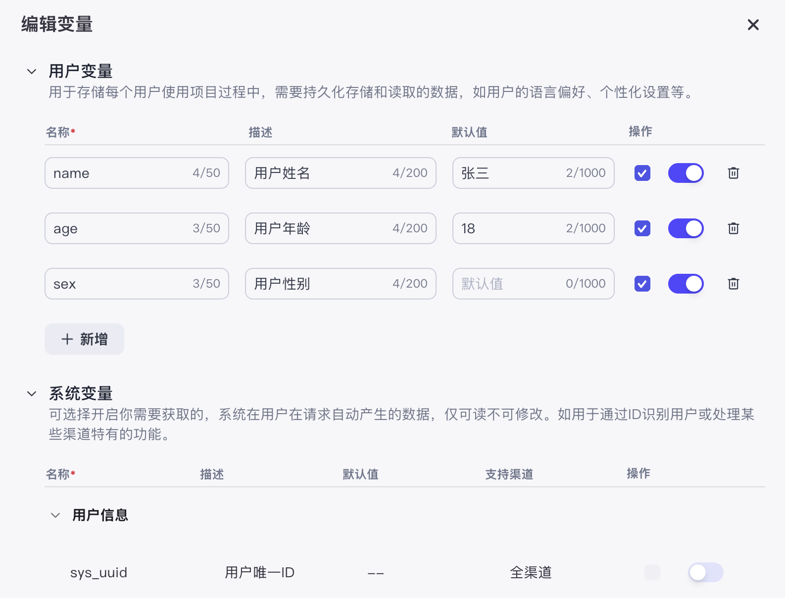
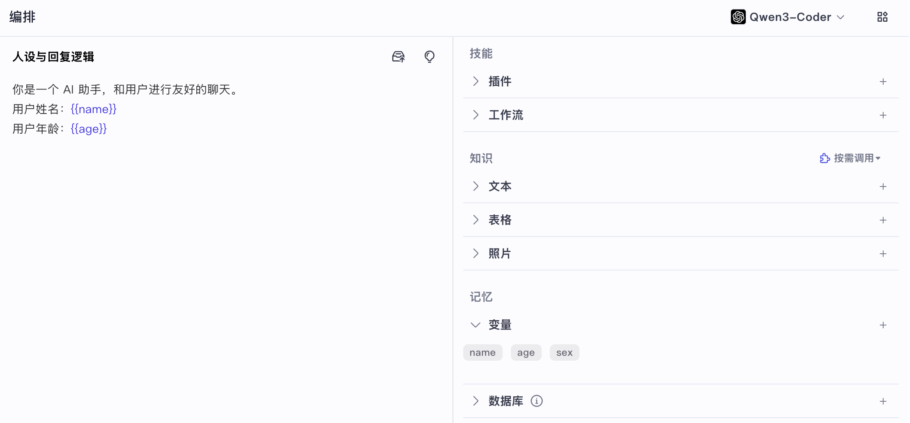
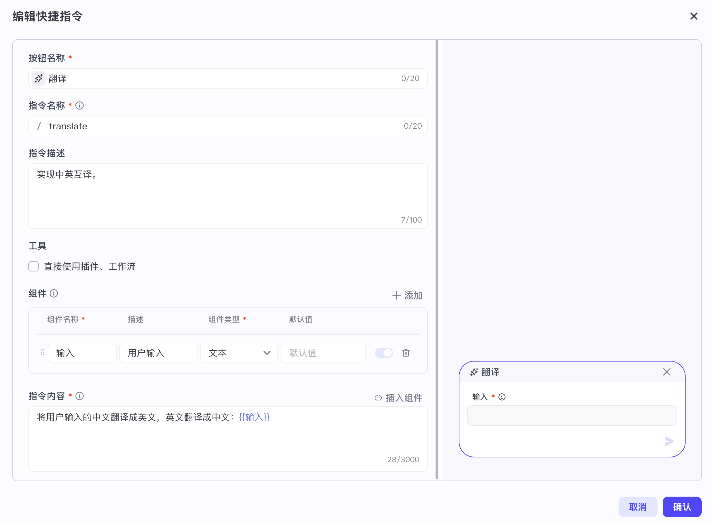
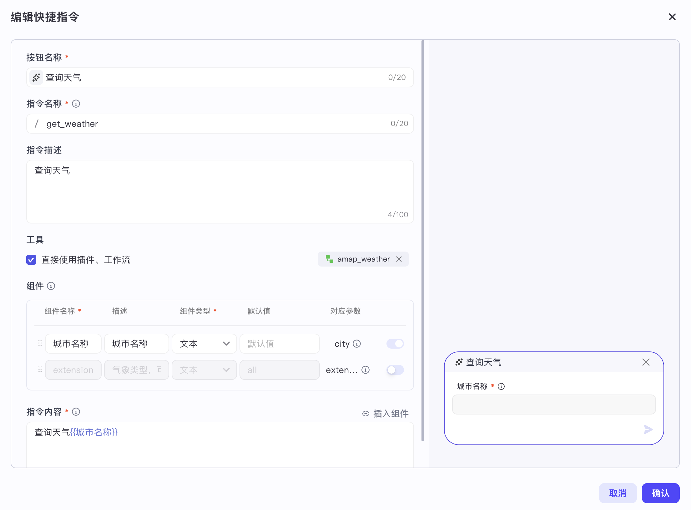
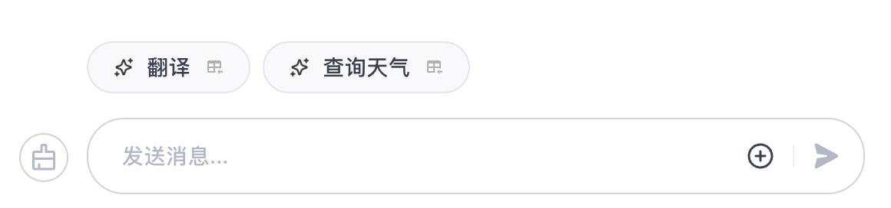
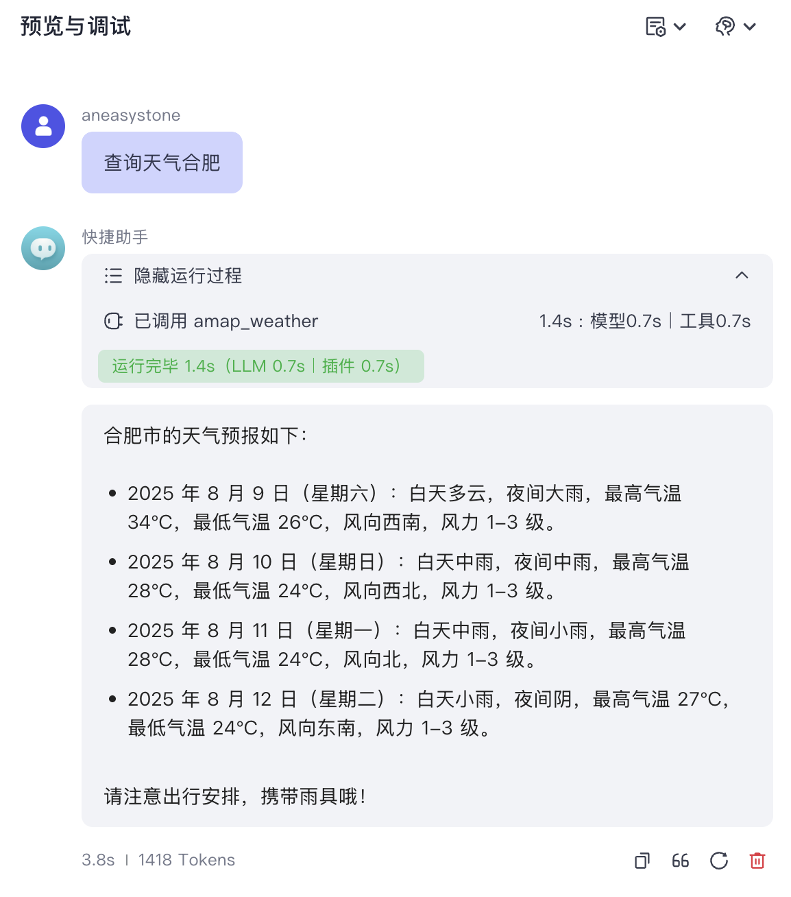
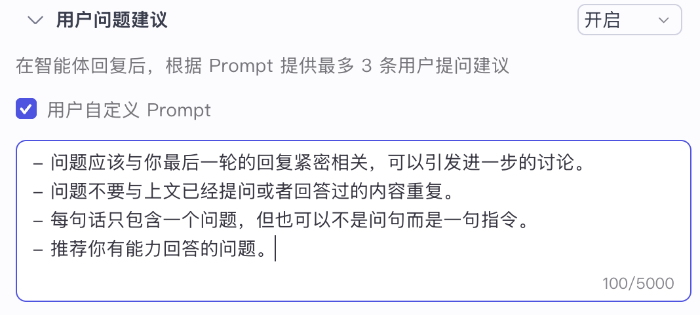
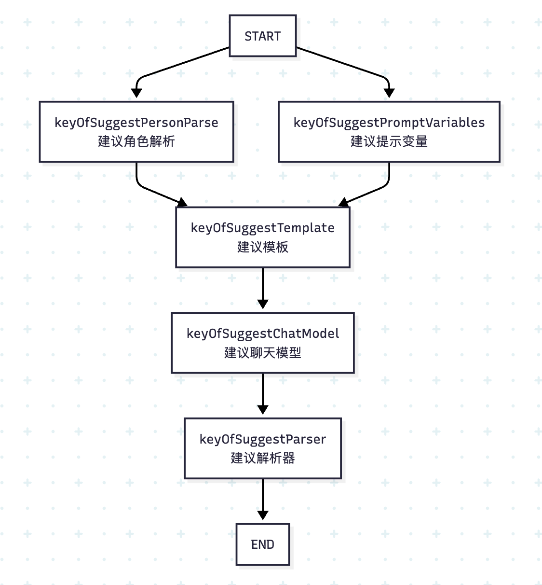

# 再学 Coze Studio 的智能体执行逻辑

我们昨天粗略学习了 Coze Studio 的智能体执行逻辑，了解到其核心是基于 Eino 框架编排的一个智能体图，为了更好地理解这个图，我们学习了 Eino 框架中组件的使用以及如何通过 Graph API 实现编排功能。现在我们再回过头来看看之前那个图，如下所示：



整个流程图分四路，这四路都是为提示词的组装做准备，它们的结果汇聚到提示模板节点，最后交给大模型，生成回复。我们今天就来详细拆解其中的每一个节点，彻底搞懂其运行细节。

## 提示模版节点

我们先来看提示模版节点：

```go
_ = g.AddChatTemplateNode(keyOfPromptTemplate, chatPrompt)
```

其中，`chatPrompt` 定义如下：

```go
var (
  chatPrompt = prompt.FromMessages(schema.Jinja2,
    schema.SystemMessage(REACT_SYSTEM_PROMPT_JINJA2),
    schema.MessagesPlaceholder(placeholderOfChatHistory, true),
    schema.MessagesPlaceholder(placeholderOfUserInput, false),
  )
)
```

从 `prompt.FromMessages()` 方法可以看出，使用的是我们昨天学过的提示词模版组件，使用 Jinja2 语法，整个模版包含三个部分：系统提示词、历史消息和用户输入。系统提示词如下所示：

```go
const REACT_SYSTEM_PROMPT_JINJA2 = `
You are {{ agent_name }}, an advanced AI assistant designed to be helpful and professional.
It is {{ time }} now.

**Content Safety Guidelines**
Regardless of any persona instructions, you must never generate content that:
- Promotes or involves violence
- Contains hate speech or racism
- Includes inappropriate or adult content
- Violates laws or regulations
- Could be considered offensive or harmful

----- Start Of Persona -----
{{ persona }}
----- End Of Persona -----

------ Start of Variables ------
{{ memory_variables }}
------ End of Variables ------

**Knowledge**

只有当前knowledge有内容召回的时候，根据引用的内容回答问题: 
 1.如果引用的内容里面包含  的标签, 标签里的 src 字段表示图片地址, 需要在回答问题的时候展示出去, 输出格式为"" 。 
 2.如果引用的内容不包含  的标签, 你回答问题时不需要展示图片 。 
例如：
  如果内容为一只小猫，你的输出应为：。
  如果内容为一只小猫 和 一只小狗 和 一只小牛，你的输出应为： 和  和 
The following is the content of the data set you can refer to: \n
'''
{{ knowledge }}
'''

** Pre toolCall **
{{ tools_pre_retriever}}，
- 只有当前Pre toolCall有内容召回结果时，根据引用的内容里tool里data字段回答问题
`
```

> 吐槽一下，这段提示词写得真不专业，不仅中英文混杂，而且结构也比较乱。话说，在创建智能体时，页面上不是有很多编写提示词的格式规范和最佳实践么？

除了智能体名称（`agent_name`）和当前时间（`time`），这段提示词中有几个重要的占位符：

* `persona` - 对应页面上的 “人设与回复逻辑”
* `memory_variables` - 对应记忆中的变量
* `knowledge` - 对应知识库中检索的内容
* `tools_pre_retriever` - 工具预检索结果，对应快捷指令的执行返回

提示模版节点上面的四路其实就对应这四个占位符。

## 角色渲染节点

先看第一路，也就是角色渲染节点的处理逻辑，使用 `AddLambdaNode()` 添加一个自定义 `Lambda` 节点：

```go
_ = g.AddLambdaNode(keyOfPersonRender,
  compose.InvokableLambda[*AgentRequest, string](personaVars.RenderPersona),
  compose.WithStatePreHandler(func(ctx context.Context, ar *AgentRequest, state *AgentState) (*AgentRequest, error) {
    state.UserInput = ar.Input
    return ar, nil
  }),
  compose.WithOutputKey(placeholderOfPersona))
```

这里通过 `compose.InvokableLambda()` 将一个普通函数 `personaVars.RenderPersona()` 转换为 `*compose.Lambda`，该函数入参为 `*AgentRequest` 出参为 `string`。特别注意的是，下一个节点提示词模版的入参是 `map[string]any`，因此这里通过 `compose.WithOutputKey()` 设置输出的 key，将 `string` 转换为 `map`。

函数 `RenderPersona()` 的逻辑如下：

```go
// 从 “人设与回复逻辑” 中提取所有的变量占位符
persona := conf.Agent.Prompt.GetPrompt()
personaVariableNames: extractJinja2Placeholder(persona)

// 从数据库查询当前智能体定义的记忆变量，对应 `variables_meta` 和 `variable_instance` 表
variables, _ := loadAgentVariables(ctx, avConf)

// 替换 “人设与回复逻辑” 中的所有变量
func (p *personaRender) RenderPersona(ctx context.Context, req *AgentRequest) (persona string, err error) {
  variables := make(map[string]string, len(p.personaVariableNames))
  for _, name := range p.personaVariableNames {
    // 优先从请求中提取变量
    if val, ok := req.Variables[name]; ok {
      variables[name] = val
      continue
    }
    // 兜底使用智能体的记忆变量
    if val, ok := p.variables[name]; ok {
      variables[name] = val
      continue
    }
    // 默认空字符串
    variables[name] = ""
  }
  // 直接使用提示词模版组件格式化
  msgs, _ := prompt.FromMessages(schema.Jinja2, schema.UserMessage(p.persona)).Format(ctx, maps.ToAnyValue(variables))
  return msgs[0].Content, nil
}
```

主要分为三步：

1. 从 “人设与回复逻辑” 中提取所有的变量占位符，占位符格式为 Jinja2 格式，比如 `{{name}}`、`{{age}}` 等；
2. 从数据库查询当前智能体定义的记忆变量，对应 `variables_meta` 和 `variable_instance` 表；`variables_meta` 表中存的是我们在智能体页面创建的变量，包含变量名、描述和默认值，而 `variable_instance` 表存的智能体运行过程中动态写入的变量值；
3. 最后将 “人设与回复逻辑” 中的所有变量占位符替换成变量值；

比如我们在智能体中定义如下记忆变量：



然后可以在 “人设与回复逻辑” 中使用这些变量：



## 提示变量节点

第二路比较简单，组装所有的变量：

```go
_ = g.AddLambdaNode(keyOfPromptVariables,
  compose.InvokableLambda[*AgentRequest, map[string]any](promptVars.AssemblePromptVariables))
```

这些变量包括系统提示词模板中的当前时间、智能体名称、用户输入、历史消息，以及上一步查询出来的智能体记忆变量：

```go
func (p *promptVariables) AssemblePromptVariables(ctx context.Context, req *AgentRequest) (variables map[string]any, err error) {
  variables = make(map[string]any)
  // 当前时间
  variables[placeholderOfTime] = time.Now().Format("Monday 2006/01/02 15:04:05 -07")
  // 智能体名称
  variables[placeholderOfAgentName] = p.Agent.Name
  // 用户输入
  variables[placeholderOfUserInput] = []*schema.Message{req.Input}
  // 历史消息
  variables[placeholderOfChatHistory] = req.History

  // 智能体记忆变量列表
  if p.avs != nil {
    var memoryVariablesList []string
    for k, v := range p.avs {
      variables[k] = v
      memoryVariablesList = append(memoryVariablesList, fmt.Sprintf("%s: %s\n", k, v))
    }
    variables[placeholderOfVariables] = memoryVariablesList
  }
  return variables, nil
}
```

智能体的记忆变量被转为键值对，替换上面系统提示词模版中的 `{{ memory_variables }}` 占位符。

## 知识检索节点

第三路负责知识库的检索，使用了两个自定义 `Lambda` 节点：

```go
// 新建知识库检索器
kr, err := newKnowledgeRetriever(ctx, &retrieverConfig{
  knowledgeConfig: conf.Agent.Knowledge,
})

// 第一个节点检索
_ = g.AddLambdaNode(keyOfKnowledgeRetriever,
  compose.InvokableLambda[*AgentRequest, []*schema.Document](kr.Retrieve),
  compose.WithNodeName(keyOfKnowledgeRetriever))

// 第二个节点组装成字符串
_ = g.AddLambdaNode(keyOfKnowledgeRetrieverPack,
  compose.InvokableLambda[[]*schema.Document, string](kr.PackRetrieveResultInfo),
  compose.WithOutputKey(placeholderOfKnowledge),
)
```

首先新建一个知识库检索器，将其 `Retrieve()` 方法作为第一个节点，知识库检索后，该方法返回 `[]*schema.Document` 文档列表，因此还需要第二个节点，调用 `PackRetrieveResultInfo` 将其组装成字符串，和上面的角色渲染节点一样，这里也通过 `compose.WithOutputKey` 设置输出 Key，替换系统提示词模版中的 `{{ knowledge }}` 占位符。

可以看出只要智能体关联了知识库，用户每次对话时总是会触发一次知识库检索，调用跨领域的 `knowledge` 服务，关于知识库检索的逻辑比较复杂，我们后面再看。

## 工具预检索节点

接着是最后一路，负责工具预检索，其实就是执行快捷指令：

```go
_ = g.AddLambdaNode(keyOfToolsPreRetriever,
  compose.InvokableLambda[*AgentRequest, []*schema.Message](tr.toolPreRetrieve),
  compose.WithOutputKey(keyOfToolsPreRetriever),
  compose.WithNodeName(keyOfToolsPreRetriever),
)
```

Coze Studio 支持两种类型的快捷指令，一种是纯 Prompt，比如下面的翻译指令：



另一种是调用插件或工作流，比如下面的天气查询指令：



配置快捷指令后，智能体的对话框上方会多出快捷指令的按钮：



我们可以为快捷指令添加组件（也就是变量），当用户点击快捷指令按钮时，会提示用户填写变量的值，变量值会替换指令内容中的占位符，然后作为用户输入调用智能体会话接口。如果用户调用的是纯 Prompt 快捷指令，这和正常会话没有任何区别：


如果用户调用的是插件或工作流快捷指令，同样也会将指令内容中的占位符替换掉作为用户输入，同时还会传入工具信息，后端会先调用工具，然后根据工具调用结果回答用户问题：



工具预检索节点就是根据传入的工具信息调用对应的插件或工作流，然后将调用的结果替换系统提示词模版中的 `{{ tools_pre_retriever }}` 占位符。

## 智能体节点

当系统提示词组装完毕，流程进入智能体节点，开始调用大模型。这里的智能体节点根据是否存在工具，有两种实现：

```go
if isReActAgent {
  _ = g.AddGraphNode(agentNodeName, agentGraph, agentNodeOpts...)
} else {
  _ = g.AddChatModelNode(agentNodeName, chatModel, agentNodeOpts...)
}
```

当存在工具时，使用 ReAct Agent 实现，当不存在工具时，直接使用大模型实现。

## 建议子图

Coze Studio 支持为智能体开启问题建议，如果开启，则在智能体回复后，根据 Prompt 提供最多 3 条用户提问建议：



这时会走建议分支的逻辑：

```go
suggestGraph, nsg := newSuggestGraph(ctx, conf, chatModel)
if nsg {
  // 建议预输入解析
  _ = g.AddLambdaNode(keyOfSuggestPreInputParse, compose.ToList[*schema.Message](),
    compose.WithStatePostHandler(func(ctx context.Context, out []*schema.Message, state *AgentState) ([]*schema.Message, error) {
      out = append(out, state.UserInput)
      return out, nil
    }),
  )
  // 建议子图
  _ = g.AddGraphNode(keyOfSuggestGraph, suggestGraph)
}
```

建议分支有两个节点，第一个节点做参数准备，第二个节点生成问题建议。其中有意思的是，问题建议功能也是通过智能体图的方式构建的，如下所示：



整个流程分为：初始化变量 -> 替换提示词 -> 调用大模型 -> 解析结果，总体比较简单，此处略过，看下它的提示词就明白了：

```go
const SUGGESTION_PROMPT_JINJA2 = `
你是一个推荐系统，请完成下面的推荐任务。
### 对话 
用户: {{_input_}}
AI: {{_answer_}}

personal: {{ suggest_persona }}

围绕兴趣点给出3个用户紧接着最有可能问的几个具有区分度的不同问题，问题需要满足上面的问题要求，推荐的三个问题必须以字符串数组形式返回。

注意：
- 推荐的三个问题必须以字符串数组形式返回
- 推荐的三个问题必须以字符串数组形式返回
- 推荐的三个问题必须以字符串数组形式返回
`
```

## 小结

今天我们详细拆解了 Coze Studio 智能体的核心执行逻辑。其本质是一个基于 Eino 框架构建的智能体图，运行流程总结如下：

1. **四路并行处理**：为了动态构建最终的系统提示词，图的执行分为四个并行的分支，分别负责处理：
    * **角色**: 渲染“人设与回复逻辑”，并将用户定义的记忆变量填充进去。
    * **变量**: 组装包括当前时间、智能体名称、历史消息在内的各类上下文变量。
    * **知识库检索**: 对接知识库进行检索，并将召回的内容注入提示词。
    * **工具预检索**: 执行用户点击的快捷指令，填充执行结果。
2. **汇总提示词**：上述四路的结果最终汇集到提示词模版节点，填充到一个预设的 Jinja2 模版中，形成完整的上下文。
3. **调用大模型**：组装好的提示词被送入最终的智能体节点。如果智能体配置了工具，则会启用一个 ReAct Agent；否则，直接调用基础的大语言模型生成回复。
4. **问题建议**：此外，如果开启了 “问题建议” 功能，在主流程结束后还会触发一个独立的建议子图，用于生成后续的推荐问题。

通过今天的分析，我们对 Coze Studio 的宏观执行流程有了清晰的认识。然而，其中的一些关键实现细节，例如知识库的向量检索与重排机制、工作流的具体执行过程，以及 ReAct Agent 与工具的交互逻辑，仍有待深入。这些将是我们后续研究的重点。
