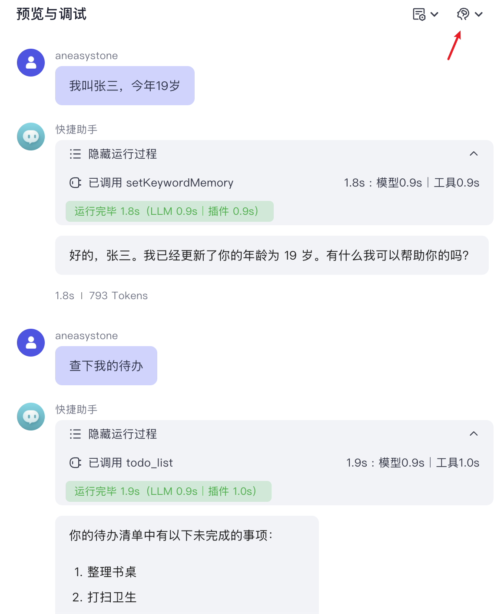

# 学习 Coze Studio 的工具使用

昨天，我们详细拆解了 Coze Studio 智能体的核心执行逻辑，了解到其本质是一个基于 Eino 框架构建的智能体图。在分析的最后我们提到，其中的一些关键实现细节，例如 ReAct Agent 与工具的交互逻辑，仍有待深入。今天，我们就来填上这个坑，学习下 Coze Studio 是如何实现工具调用的。

我们知道，Eino 提供了很多可复用的原子组件，通过 Graph API 可以对其进行编排，实现出复杂的业务逻辑。不过有些业务逻辑存在一定的通用性，Eino 将这些场景进行抽象，提供了一些构建大模型应用的模式，被称为 [**Flow**](https://www.cloudwego.io/zh/docs/eino/core_modules/flow_integration_components/)。目前 Eino 提供了两种常用的 Agent 模式：

* [ReAct Agent](https://www.cloudwego.io/zh/docs/eino/core_modules/flow_integration_components/react_agent_manual)
* [Multi Agent](https://www.cloudwego.io/zh/docs/eino/core_modules/flow_integration_components/multi_agent_hosting)

除此之外还提供了一些常用的召回策略，比如 `MultiQueryRetriever` 和 `ParentIndexer` 等。

## ReAct Agent

我们今天主要关注 ReAct Agent 部分。ReAct 这个词出自 Shunyu Yao 等人的这篇论文 《ReAct: Synergizing Reasoning and Acting in Language Models》，它是由 `Reason` 和 `Act` 两个词组合而成，表示一种将 **推理** 和 **行动** 与大模型相结合的通用范式：


传统的 `Reason Only` 型应用（如 [Chain-of-Thought Prompting](https://www.promptingguide.ai/techniques/cot)）具备很强的语言能力，擅长通用文本的逻辑推断，但由于不会和外部环境交互，因此它的认知非常受限；而传统的 `Act Only` 型应用（如 [WebGPT](https://openai.com/research/webgpt)、[SayCan](https://say-can.github.io/)、[ACT-1](https://www.adept.ai/blog/act-1)）能和外界进行交互，解决某类特定问题，但它的行为逻辑较简单，不具备通用的推理能力。

ReAct 的思想，旨在将这两种应用的优势结合起来。针对一个复杂问题，首先使用大模型的推理能力制定出解决该问题的行动计划，这好比人的大脑，可以对问题进行分析思考；然后使用行动能力与外部源（例如知识库或环境）进行交互，以获取额外信息，这好比人的五官和手脚，可以感知世界，并执行动作；大模型对行动的结果进行跟踪，并不断地更新行动计划，直到问题被解决。

通过这种模式，我们能基于大模型构建更为强大的 AI 应用，可以阅读原始论文了解更多关于 ReAct 的信息：

* https://react-lm.github.io/

## 回顾 Function Call 原理

原始的 ReAct 论文是通过 **提示工程（Prompt Engineering）** 实现的。后来，OpenAI 对 GPT 模型进行了一项重大更新，推出了 [Function Call](https://openai.com/blog/function-calling-and-other-api-updates) 功能，在 Chat Completions API 中添加了函数调用能力，这一功能推出后，迅速风靡世界，开发者可以通过 API 的方式实现类似于 ChatGPT 插件的数据交互能力，将大模型集成到自己的业务和应用中。随后，越来越多的大模型也都开始支持 Function Call 功能，目前已经成为大模型调用工具的事实规范。

简单来说，Function Call 就是在调用大模型时提供几个工具选项，大模型判断用户的问题是否需要调用某个工具。如果不需要则直接回复，这和传统的调用没有区别；如果需要调用则返回合适的工具和对应的参数给用户，用户拿到后调用对应的工具，再将调用结果送给大模型，最后，大模型根据工具的调用结果来回答用户的问题。[OpenAI 官方文档](https://platform.openai.com/docs/guides/function-calling) 中有一张详细的流程图：


其中要注意的是，第二次调用大模型时，可能仍然会返回 `tool_calls` 响应，这时可以循环处理。

## 定义 Eino 工具

了解了 ReAct Agent 的原理后，接下来，我们再来看下 Eino 中 ReAct Agent 的用法。为了让大模型能调用我们的工具，我们需要使用 Eino 提供的 `ToolsNode` 组件，该组件提供了三个层次的接口：

```go
// 基础工具接口，提供工具信息，包括工具名称、描述和参数等
type BaseTool interface {
  Info(ctx context.Context) (*schema.ToolInfo, error)
}

// 可调用的工具接口，支持同步调用
type InvokableTool interface {
  BaseTool
  InvokableRun(ctx context.Context, argumentsInJSON string, opts ...Option) (string, error)
}

// 支持流式输出的工具接口
type StreamableTool interface {
  BaseTool
  StreamableRun(ctx context.Context, argumentsInJSON string, opts ...Option) (*schema.StreamReader[string], error)
}
```

在 Eino 中，`BaseTool` 接口要求任何一个工具都要实现 `Info()` 接口返回工具信息，包括工具名称、描述和参数等。而根据一个工具被调用后的返回结构是否是流式的，可以分为 `InvokableTool` 和 `StreamableTool`，两个接口实现其一即可。

下面是我写的一个简单示例，通过 `Info()` 和 `InvokableRun()` 方法实现了天气查询工具：

```go
type ToolGetWeather struct {
}

type ToolGetWeatherParam struct {
  City string `json:"city"`
  Date string `json:"date"`
}

func (t *ToolGetWeather) Info(ctx context.Context) (*schema.ToolInfo, error) {
  return &schema.ToolInfo{
    Name: "get_weather",
    Desc: "查询天气",
    ParamsOneOf: schema.NewParamsOneOfByParams(map[string]*schema.ParameterInfo{
      "city": {
        Type:     "string",
        Desc:     "城市名称",
        Required: true,
      },
      "date": {
        Type:     "string",
        Desc:     "日期",
        Required: true,
      },
    }),
  }, nil
}

func (t *ToolGetWeather) InvokableRun(ctx context.Context, argumentsInJSON string, opts ...tool.Option) (string, error) {

  // 解析参数
  p := &ToolGetWeatherParam{}
  err := json.Unmarshal([]byte(argumentsInJSON), p)
  if err != nil {
    return "", err
  }

  res := p.City + p.Date + "天气晴，气温30摄氏度"
  return res, nil
}
```

这里有两点值得注意：

1. 在 `Info()` 函数中，我们使用了工具方法 `schema.NewParamsOneOfByParams()` 返回工具参数信息，这个方法生成 `params map[string]*ParameterInfo` 类型的参数约束；其实，Eino 还支持 [OpenAPI](https://github.com/OAI/OpenAPI-Specification) 定义的 JSON Schema 方式，返回 `*openapi3.Schema` 类型的参数约束；
2. `InvokableRun()` 的入参和出参都是字符串，需要开发者自行处理参数的反序列化和序列化。

除此之外，Eino 还提供了多种定义工具的方式：

* 使用 `NewTool()` 或 `InferTool()` 方法将本地函数转为工具；
* 使用 Eino Ext 中提供的内置工具，比如 Bing 搜索、Google 搜索、DuckDuckGo 搜索、SearXNG 搜索、维基百科搜索、浏览器使用、命令行工具、HTTP 请求、Sequential Thinking 等；
* 使用 MCP 工具；

具体内容可参考 Eino 如何创建工具的文档：

* https://www.cloudwego.io/zh/docs/eino/core_modules/components/tools_node_guide/how_to_create_a_tool/

## 创建 ReAct Agent

定义工具之后，我们就可以通过 `react.NewAgent()` 创建一个 ReAct Agent 并自动调用工具了：

```go
func main() {

  ctx := context.Background()

  // 初始化大模型
  model, _ := openai.NewChatModel(ctx, &openai.ChatModelConfig{
    BaseURL: os.Getenv("OPENAI_BASE_URL"),
    APIKey:  os.Getenv("OPENAI_API_KEY"),
    Model:   "gpt-4o",
  })

  // 初始化工具
  toolGetWeather := &ToolGetWeather{}

  // ReAct 智能体
  agent, _ := react.NewAgent(ctx, &react.AgentConfig{
    ToolCallingModel: model,
    ToolsConfig: compose.ToolsNodeConfig{
      Tools: []tool.BaseTool{toolGetWeather},
    },
  })

  r, _ := agent.Generate(ctx, []*schema.Message{
    {
      Role:    schema.User,
      Content: "北京明天的天气怎么样？",
    },
  })
  println(r.Content)
}
```

这里的代码非常简单，Agent 的调用和 Graph 的调用基本类似，也提供了 `Generate()` 非流式 和 `Stream()` 流式调用两种方式。另外，Agent 还提供了 `ExportGraph()` 方法可以将 ReAct Agent 内部的图导出来，作为子图嵌在其他图中运行。Coze Studio 就使用了这种方式：

```go
// 如果工具数量大于 0，则使用 ReAct Agent
var isReActAgent bool
if len(agentTools) > 0 {
    isReActAgent = true
}

// 构建 ReAct Agent 子图并导出
if isReActAgent {
  agent, _ := react.NewAgent(ctx, &react.AgentConfig{
    ToolCallingModel: chatModel,
    ToolsConfig: compose.ToolsNodeConfig{
      Tools: agentTools,
    },
    ToolReturnDirectly: toolsReturnDirectly,
    ModelNodeName:      keyOfReActAgentChatModel,
    ToolsNodeName:      keyOfReActAgentToolsNode,
  })
  
  agentGraph, agentNodeOpts = agent.ExportGraph()
  agentNodeName = keyOfReActAgent
} else {
  agentNodeName = keyOfLLM
}

// 添加 ReAct Agent 或 Chat Model 作为智能体节点
if isReActAgent {
  _ = g.AddGraphNode(agentNodeName, agentGraph, agentNodeOpts...)
} else {
  _ = g.AddChatModelNode(agentNodeName, chatModel, agentNodeOpts...)
}
```

相比于我们上面的示例代码，Coze Studio 创建 ReAct Agent 时多了一个 `ToolReturnDirectly` 参数，不知道大家还记不记得我们之前在实战工作流时讲过，工作流的结束节点有两种返回方式：

* **返回变量**：工作流运行结束后会以 JSON 格式输出所有返回参数，智能体在对话中触发工作流后，会自动总结 JSON 格式的内容，并以自然语言回复用户；
* **返回文本**：工作流运行结束后，智能体将直接使用指定的内容回复对话；

`ToolReturnDirectly` 是一个字典，里面包含的就是 **返回文本** 类型的工作流名字。

```go
func newWorkflowTools(ctx context.Context, conf *workflowConfig) ([]workflow.ToolFromWorkflow, map[string]struct{}, error) {
  
  // 查询所有工作流，作为工具
  workflowTools, _ := crossworkflow.DefaultSVC().WorkflowAsModelTool(ctx, policies)

  // 找出所有 TerminatePlan == UseAnswerContent 的工作流，也就是 返回文本 类型的
  toolsReturnDirectly := make(map[string]struct{})
  for _, workflowTool := range workflowTools {
    if workflowTool.TerminatePlan() == vo.UseAnswerContent {
      toolInfo, _ := workflowTool.Info(ctx)
      toolsReturnDirectly[toolInfo.Name] = struct{}{}
    }
  }

  return workflowTools, toolsReturnDirectly, err
}
```

感兴趣的朋友可以看下 Eino 的源码，可以发现 ReAct Agent 其实也是基于 Graph API 实现的，只是这个图稍微复杂点，里面增加了分支、循环以及直接输出等逻辑：


## Coze Studio 的工具列表

最后，我们再来看下 Coze Studio 构建工具列表的逻辑：

```go
agentTools := make([]tool.BaseTool, 0, len(pluginTools)+len(wfTools)+len(dbTools)+len(avTools))
// 插件工具
agentTools = append(agentTools, pluginTools)
// 工作流工具
agentTools = append(agentTools, wfTools)
// 数据库工具
agentTools = append(agentTools, dbTools)
// 变量工具
agentTools = append(agentTools, avTools)
```

可以发现，除了 **插件工具** 和 **工作流工具**，这里还有两个特别的工具：

* **数据库工具**：当智能体里添加了数据库时自动出现的工具，工具名称对应用户创建的数据表名，工具参数为 `sql` 语句，每个数据表对应一个数据库工具；
* **变量工具**：当智能体里添加了用户变量时自动出现的工具，工具名称固定为 `setKeywordMemory`，工具参数为 `key` 和 `value`，所有变量共用这个工具；

下面是我创建的 `todo_list` 数据库对应的工具 Schema：

```json
{
  "name": "todo_list",
  "description": "Mysql query tool. Table name is 'todo_list'. This table's desc is 待办清单.\n\nTable structure:\n- item (text): 待办事项\n- status (number): 状态，0 为待完成，1 为已完成\n\nUse SQL to query this table. You can write SQL statements directly to operate.",
  "parameters": {
    "properties": {
      "sql": {
        "description": "SQL query to execute against the database. You can use standard SQL syntax like SELECT",
        "type": "string"
      }
    },
    "required": [
      "sql"
    ],
    "type": "object"
  }
}
```

下面是变量工具的 Schema：

```json
{
  "name": "setKeywordMemory",
  "description": "\n## Skills Conditions\n1. When the user's intention is to set a variable and the user provides the variable to be set, call the tool.\n2. If the user wants to set a variable but does not provide the variable, do not call the tool.\n3. If the user's intention is not to set a variable, do not call the tool.\n\n## Constraints\n- Only make decisions regarding tool invocation based on the user's intention and input related to variable setting.\n- Do not call the tool in any other situation not meeting the above conditions.\n",
  "parameters": {
    "properties": {
      "data": {
        "items": {
          "properties": {
            "keyword": {
              "description": "the keyword of memory variable",
              "type": "string"
            },
            "value": {
              "description": "the value of memory variable",
              "type": "string"
            }
          },
          "required": [
            "keyword",
            "value"
          ],
          "type": "object"
        },
        "type": "array"
      }
    },
    "required": [
      "data"
    ],
    "type": "object"
  }
}
```

这两个都属于记忆工具，当用户的问题需要查询或更新记忆时，就会自动调用这些工具：



点击右上角的大脑图标，也可以查看记忆中的内容。

## 小结

今天我们深入探讨了 Coze Studio 实现工具调用的底层逻辑。其核心是利用了 Eino 框架提供的 **ReAct Agent**，它遵循 **ReAct（推理+行动）** 的思想，通过大模型的 **Function Call** 能力，将强大的推理能力与和外部世界交互的行动能力相结合，从而解决复杂的任务。

我们学习了如何在 Eino 中通过实现 `BaseTool`、`InvokableTool` 等标准接口来定义一个工具，并将其提供给 ReAct Agent 使用。一个关键的设计是，Coze Studio 会将创建好的 ReAct Agent 作为一个子图，动态地嵌入到智能体的整体执行图中，这种设计非常灵活且强大。

最后，我们分析了 Coze Studio 为智能体自动装配的四种工具：插件、工作流、数据库工具和变量工具。通过结合这些工具，Coze Studio 得以实现出功能强大、场景通用的智能体。
