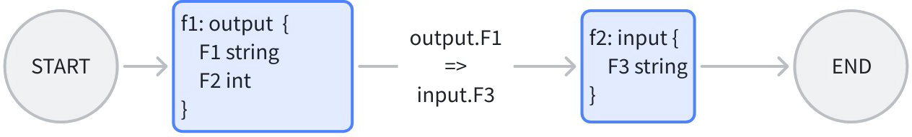
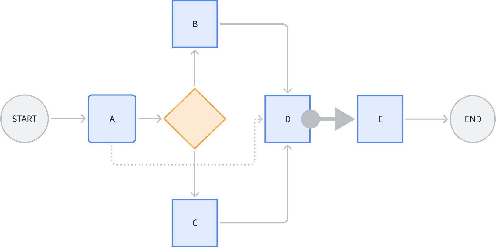
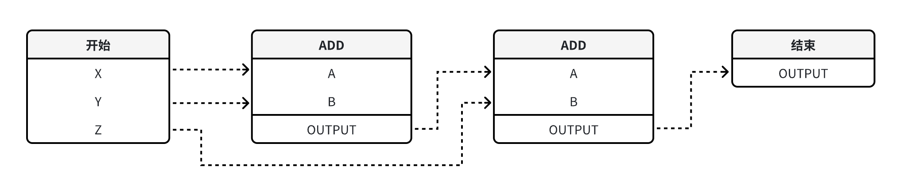
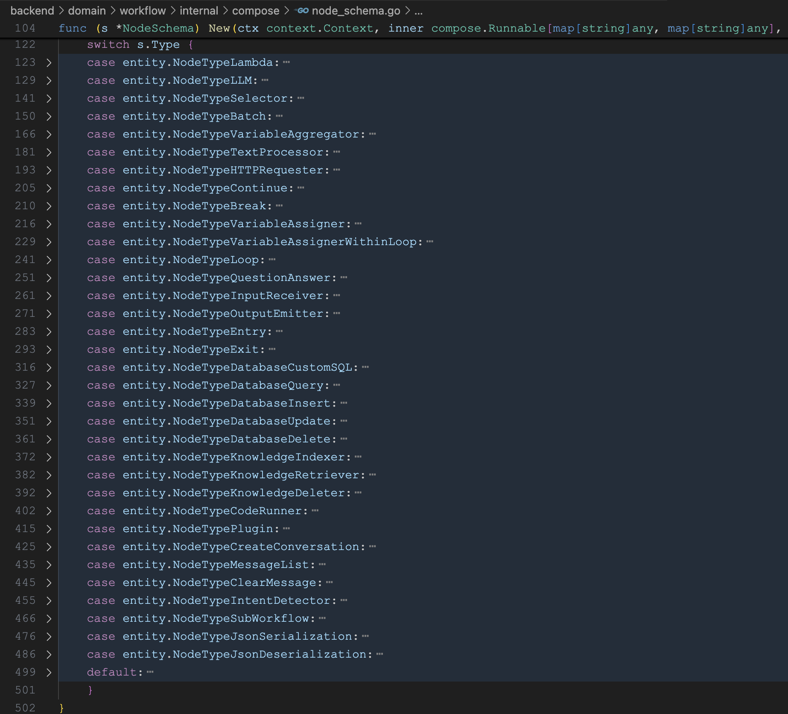
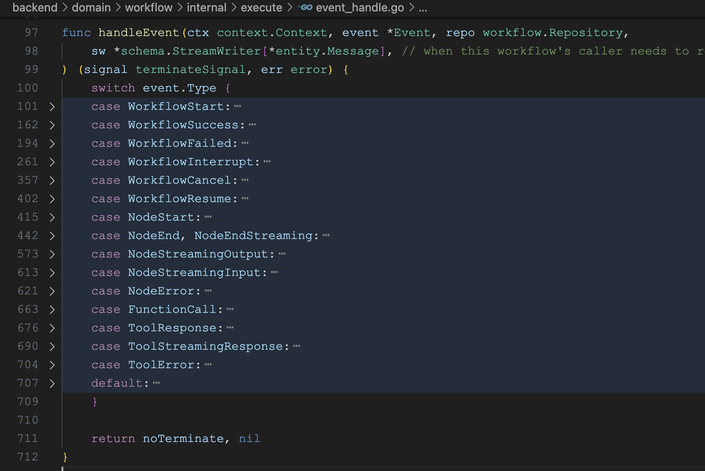
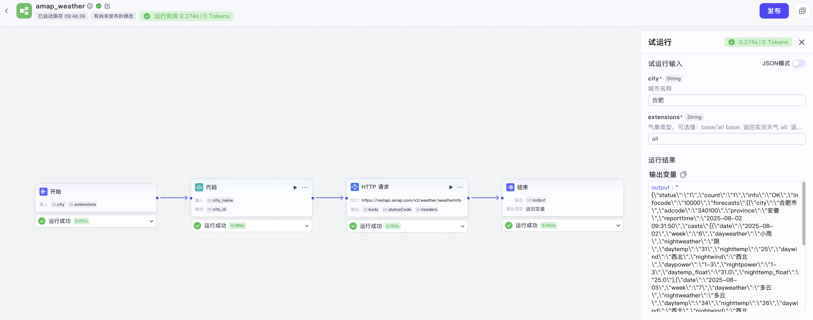

# 学习 Coze Studio 的工作流执行逻辑

今天，我们来学习下 Coze Studio 中工作流的执行逻辑。我们知道，Eino 框架支持以 **编排（Compose）** 的方式对各种原子组件进行组合和串联，并且它支持 **图（Graph）**、**链（Chain）** 和 **工作流（Workflow）** 三种编排方式。其中，链基于图实现，是最简单的；工作流和图处于同一级别，他们之间的区别在于，工作流提供了字段级别的映射能力以及控制流与数据流分离等特性。在 Coze Studio 中，智能体是通过 Graph API 实现的，工作流是通过 Workflow API 实现的。

## 工作流 vs. 图

工作流和图的区别在于，它提供了字段级别的映射能力，节点的输入可以由任意前驱节点的任意输出字段组合而成。比如下面这个例子：



假设 f1 和 f2 是两个现有的业务函数，f1 的输出为 F1 和 F2，而 f2 的输入为 F3，很显然两者并不匹配，如果使用 Graph API 编排，由于类型对齐的要求，我们有两种做法：

1. 定义一个公共结构体，将 f1 的输出类型和 f2 的输入类型改成这个公共结构体。不仅有开发成本，而且对业务逻辑造成了入侵；
2. 将 f1 的输出类型和 f2 的输入类型都改成 `map`。丢失了强类型对齐的特性。

这时就可以使用 Workflow API 编排，将 f1 的输出字段 F1 直接映射到 f2 的输入字段 F3，同时保留 f1 和 f2 的原始函数签名。每个节点由业务场景决定输入输出，不需要考虑谁给我输入，以及谁用我的输出。

工作流的另一个特点是控制流与数据流分离，看下面这个场景：



节点 D 同时引用了 A、B、C 的某些输出字段。其中 A->D 的这条虚线，是单纯的 **数据流**，不传递 **控制** 信息，即 A 执行完成与否，不决定 D 是否开始执行。

节点 D 到 E 之间的粗箭头，代表节点 E 不引用节点 D 的任何输出，是单纯的 **控制流**，不传递 **数据**，即 D 执行完成与否，决定 E 是否开始执行，但是 D 的输出不影响 E 的输入。

图中其他的线，是控制流与数据流合一的。

需要注意的是，**数据流能传递的前提，是一定有一条控制流存在**，比如 A->D 的数据流，依赖 A->branch->B->D 或者 A->branch->C->D 的控制流存在。即数据流只能引用前驱节点的输出。

## 学习 Workflow API

下面我们通过一个简单例子，演示下 Workflow API 的基本用法。假设我们现在有一个现成的业务函数 `add()`，实现 `A` 和 `B` 两个整数的相加：

```go
type AddParam struct {
  A int
  B int
}

func add(ctx context.Context, param AddParam) (int, error) {
  return param.A + param.B, nil
}
```

我们要使用这个函数，编排出一个任务链，实现 `X+Y+Z` 三个整数的加法：

```go
type Request struct {
  X int
  Y int
  Z int
}
```

示例代码如下：

```go
func main() {

  // 创建工作流
  wf := compose.NewWorkflow[Request, int]()

  // 第一个 add 节点
  wf.AddLambdaNode("add1", compose.InvokableLambda(add)).
    AddInput(
      compose.START,
      compose.MapFields("X", "A"),
      compose.MapFields("Y", "B"),
    )

  // 第二个 add 节点
  wf.AddLambdaNode("add2", compose.InvokableLambda(add)).
    AddInput(compose.START, compose.MapFields("Z", "A")).
    AddInput("add1", compose.ToField("B"))

  wf.End().AddInput("add2")

  // 编译工作流
  run, err := wf.Compile(context.Background())
  if err != nil {
    panic(err)
  }

  // 调用工作流
  result, _ := run.Invoke(context.Background(), Request{
    X: 1,
    Y: 2,
    Z: 3,
  })
  println(result)
}
```

Workflow API 和 Graph API 的语法类似，整个编排流程还是很清晰的：

1. 使用 `compose.NewWorkflow()` 创建工作流，和 `compose.NewGraph()` 基本一致；
2. 使用 `AddLambdaNode()` 将用户自定义函数添加为工作流节点，除此之外，之前学习过的 Eino 组件都可以作为节点，比如 `AddChatModelNode()` 和 `AddToolsNode()` 等；
3. 使用 `compose.InvokableLambda()` 将一个普通函数转为为 `Lambda` 节点所需的 `*compose.Lambda` 类型；函数的入参必须是 `ctx context.Context, input I`，出参必须是 `output O, err error`；
4. 使用 `AddInput()` 为节点添加输入字段映射，可以从任意多个前驱节点的输出中引用任意多个字段，可以链式连续调用；字段映射有多种不同的场景：
    * 顶层字段到顶层字段：`MapFields(string, string)`，非常简单的一对一映射，比如上面 `add1` 节点的 `X->A` 和 `Y->B` 的映射；
    * 全部输出到顶层字段：`ToField(string)`，比如上面 `add2` 节点的 `B` 参数，直接引用 `add1` 的完整输出；
    * 顶层字段到全部输入：`FromField(string)`
    * 嵌套字段到嵌套字段：`MapFieldPaths(FieldPath, FieldPath)`，只要上游或下游有一方是嵌套的，就需要用；
    * 全部输出到嵌套字段：`ToFieldPath(FieldPath)`
    * 嵌套字段到全部输入：`FromFieldPath(FieldPath)`
    * 全部输出到全部输入：直接使用 `AddInput()`，不需要传字段映射，比如上面的结束节点；

工作流如下图所示：



关于 Workflow API 还有一些高级技巧，比如实现只有数据流没有控制流或者只有控制流没有数据流的场景、在工作流中使用分支、使用静态值等，感兴趣的同学可以参考官方的文档：

* https://www.cloudwego.io/zh/docs/eino/core_modules/chain_and_graph_orchestration/workflow_orchestration_framework/

## 工作流的试运行接口

接下来，我们大致过一遍 Coze Studio 工作流的运行流程，当用户在页面点击 “试运行” 按钮时，触发接口 `/api/workflow_api/test_run`，其代码入口位于 `backend/api/handler/coze/workflow_service.go` 文件：

```go
// @router /api/workflow_api/test_run [POST]
func WorkFlowTestRun(ctx context.Context, c *app.RequestContext) {
  
  // 绑定参数
  var req workflow.WorkFlowTestRunRequest
  err = c.BindAndValidate(&req)

  // 调用 workflow 应用层
  resp, err := appworkflow.SVC.TestRun(ctx, &req)
  
  c.JSON(consts.StatusOK, resp)
}
```

直接调用 workflow 应用层的 `TestRun()` 方法：

```go
func (w *ApplicationService) TestRun(ctx context.Context, req *workflow.WorkFlowTestRunRequest) (_ *workflow.WorkFlowTestRunResponse, err error) {

  // 构造执行配置，调用 workflow 领域层
  exeCfg := vo.ExecuteConfig{
    ID:           mustParseInt64(req.GetWorkflowID()),
    From:         vo.FromDraft,
    // ...
  }
  exeID, err := GetWorkflowDomainSVC().AsyncExecute(ctx, exeCfg, maps.ToAnyValue(req.Input))
  
  // 返回异步执行的 ID
  return &workflow.WorkFlowTestRunResponse{
    Data: &workflow.WorkFlowTestRunData{
      WorkflowID: req.WorkflowID,
      ExecuteID:  fmt.Sprintf("%d", exeID),
    },
  }, nil
}
```

接着再调用 workflow 领域层的 `AsyncExecute()` 方法：

```go
func (i *impl) AsyncExecute(ctx context.Context, config vo.ExecuteConfig, input map[string]any) (int64, error) {
  
  // 查询工作流
  wfEntity, err = i.Get(ctx, &vo.GetPolicy{...})

  // Canvas 前端画布
  c := &vo.Canvas{}
  sonic.UnmarshalString(wfEntity.Canvas, c)

  // 将 Canvas 转换为 Workflow Schema
  workflowSC, err := adaptor.CanvasToWorkflowSchema(ctx, c)

  // 创建工作流
  //  1. 使用 Eino 的 `NewWorkflow()` 创建工作流
  //  2. 获取所有复合节点并添加到工作流
  //  3. 添加普通节点，根据节点类型，封装不同的节点
  wf, err := compose.NewWorkflow(ctx, workflowSC, wfOpts...)

  // 将输入转换为工作流的入参
  convertedInput, ws, err := nodes.ConvertInputs(ctx, input, wf.Inputs(), cOpts...)
  inStr, err := sonic.MarshalString(input)
  
  // 工作流运行准备工作：
  //  1. 生成 executeID 并创建执行记录
  //  2. 处理中断执行、恢复执行等逻辑
  //  3. 使用 Eino 的 Callbacks 机制为工作流和节点注入回调
  //  4. 创建一个 goroutine 处理回调事件，更新工作流或节点执行状态
  cancelCtx, executeID, opts, _, err := compose.NewWorkflowRunner(wfEntity.GetBasic(), workflowSC, config,
    compose.WithInput(inStr)).Prepare(ctx)

  // 异步执行工作流
  wf.AsyncRun(cancelCtx, convertedInput, opts...)

  // 返回 executeID
  return executeID, nil
}
```

这里省略了不少无关代码，整体逻辑还是比较复杂的，大致可分为四步：

第一步，**结构转换**：将前端画布的 Canvas 结构转换为后端工作流的 Workflow Schema 结构；处理父节点和子节点的层次关系，支持嵌套的子工作流（如循环、批处理节点）；

第二步，**创建工作流**：使用 Eino 的 `NewWorkflow()` 创建工作流，然后根据节点类型，通过 `NodeSchema.New()` 向工作流中添加对应的节点实例，每个节点类型都有专门的实现包，参考 `backend/domain/workflow/internal/compose/node_schema.go` 文件：



说实话，这里的实现有点 low，让我感到有点意外，所有的节点实现全部都是写死的逻辑，没什么扩展性，如果要新增一个节点类型，就得在这里加一个 `case` 分支。

第三步，**工作流预处理**：使用 Eino 的 Callbacks 机制为工作流和节点注入回调，同时创建一个 goroutine 监听回调事件，包括工作流开始、结束、出错、节点开始、结束等等：



将工作流或节点的执行状态更新到 `workflow_execution` 和 `node_execution` 数据表中。另外，它会通过 Redis 生成一个全局唯一的 executeID 并创建执行记录。

第四步，**异步执行**：对工作流进行异步执行，并返回上一步生成的 executeID，调用方可以拿着这个 executeID 查询执行进度。

> 其实，Coze Studio 中的工作流有多种执行方式，除了这里的 `AsyncExecute` 异步执行之外，还支持 `SyncExecute` 同步执行，`StreamExecute` 流式执行，`AsyncExecuteNode` 单节点执行等。另外，Coze Studio 的工作流还支持中断，比如遇到问答节点、输入节点、或需要鉴权的工具节点时，这时会等待用户反馈，反馈后可以通过 `AsyncResume` 或 `StreamResume` 从断点处恢复执行。

## 小结

今天，我们学习了 Coze Studio 工作流的执行原理。我们首先研究了 Eino 框架提供的 Workflow API，并将其与 Graph API 进行了对比，重点理解了其强大的字段映射能力以及控制流与数据流分离的特性。

接着，我们通过分析工作流 “试运行” 功能的后端源码，详细拆解了其完整的执行流程。该流程可分为四步：首先将前端画布的 Canvas 结构转换为 Eino 可识别的 Workflow Schema，然后基于 Schema 动态创建工作流实例，接着通过回调机制注入事件监听以追踪执行状态，最后异步触发整个工作流的运行。

前端调用 “试运行” 接口后，紧接着会轮询 `/api/workflow_api/get_process` 接口，获取工作流的执行进度，包括每个节点的入参和出参，如下所示：



这个接口就比较简单了，就是查询 `workflow_execution` 和 `node_execution` 数据表，获取工作流或节点的执行状态，感兴趣的朋友可以自行研究。
