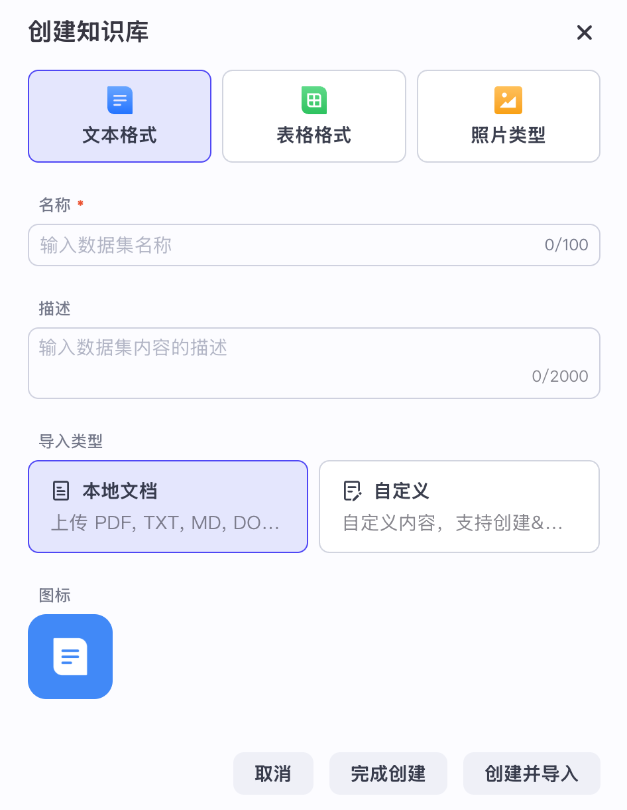
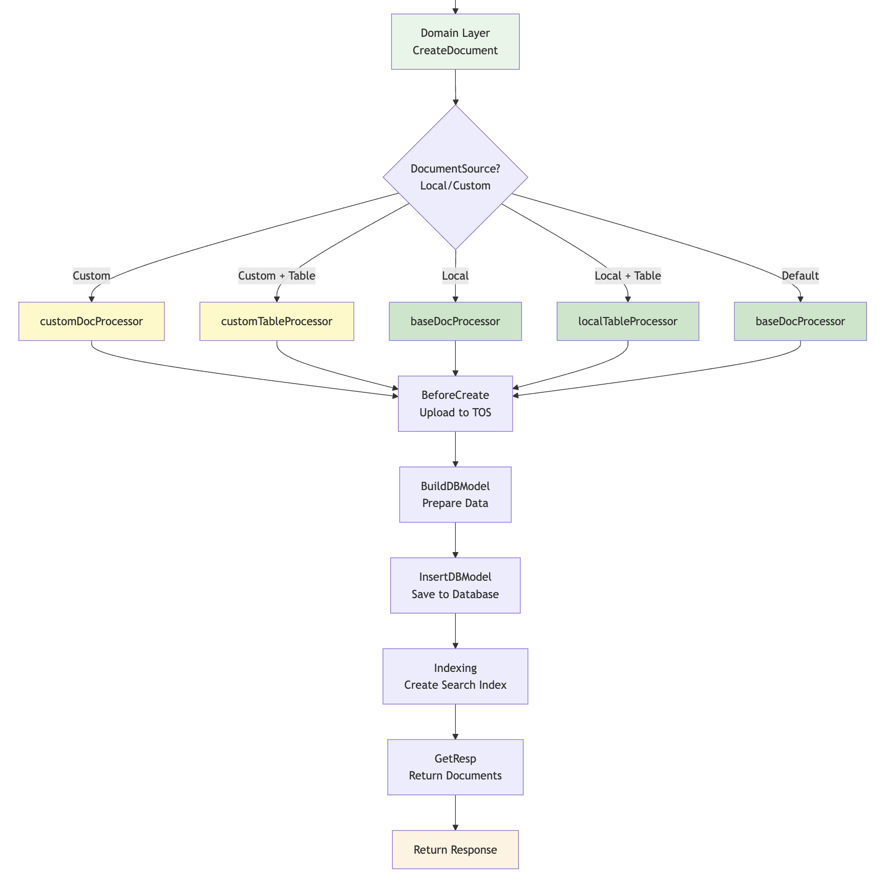
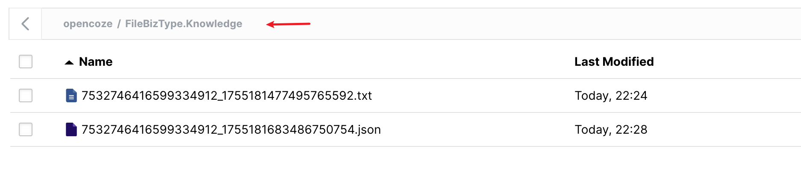
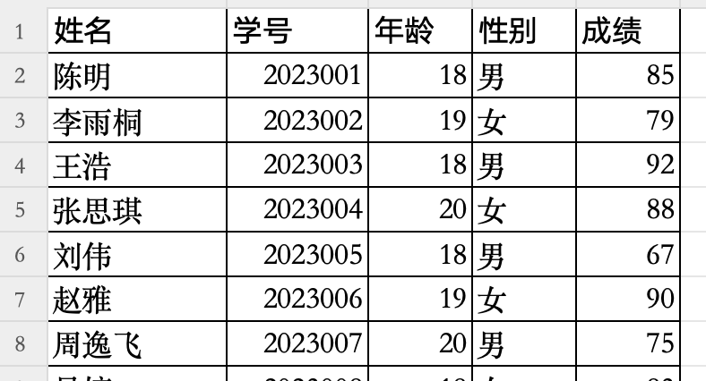
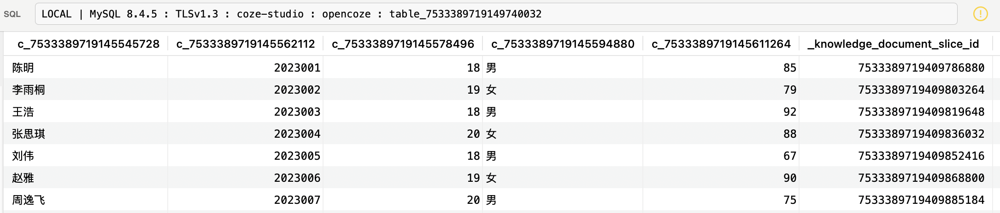

# 学习 Coze Studio 的知识库入库逻辑

经过前面几天的学习，我们已经深入探讨了 Coze Studio 的智能体、插件、工作流等核心功能的实现原理。今天，我们将继续探索 Coze Studio 的知识库功能，学习当我们在前端页面上点击 “创建知识库” 并上传文档时，后端服务是如何处理这些入库请求的。

## 知识库创建接口

我们知道，创建知识库是构建 RAG 应用的第一步，Coze Studio 支持 **文本**、**表格** 和 **图片** 三种不同类型的知识库：



这三种知识库的创建流程基本类似，都分为两步：

1. 输入名称、描述、图标和导入类型，点击 “完成创建” 或 “创建并导入”，这一步调用 `/api/knowledge/create` 接口，创建的知识库实例对应 `knowledge` 数据表；
2. 上传文档、表格或图片，对知识库进行设置，预览，然后开始对文档进行处理，这一步调用 `/api/knowledge/document/create` 接口，上传的文档对应 `knowledge_document` 数据表；

下面我们着重看下第二个接口的实现逻辑，接口层代码位于 `backend/api/handler/coze/knowledge_service.go` 文件：

```go
// @router /api/knowledge/document/create [POST]
func CreateDocument(ctx context.Context, c *app.RequestContext) {

  // 绑定入参
  var req dataset.CreateDocumentRequest
  err = c.BindAndValidate(&req)

  // 调用 knowledge 应用层
  resp := new(dataset.CreateDocumentResponse)
  resp, err = application.KnowledgeSVC.CreateDocument(ctx, &req)
  c.JSON(consts.StatusOK, resp)
}
```

然后，调用 knowledge 应用层：

```go
func (k *KnowledgeApplicationService) CreateDocument(ctx context.Context, req *dataset.CreateDocumentRequest) (*dataset.CreateDocumentResponse, error) {

  // 调用 knowledge 领域层
  resp := dataset.NewCreateDocumentResponse()
  createResp, err := k.DomainSVC.CreateDocument(ctx, &service.CreateDocumentRequest{
    Documents: documents,
  })
  return resp, nil
}
```

紧接着，做一些参数的转换，再调用 knowledge 领域层，这里是文档处理的核心：

```go
func (k *knowledgeSVC) CreateDocument(ctx context.Context, request *CreateDocumentRequest) (response *CreateDocumentResponse, err error) {

  // 根据不同的知识库类型，创建对应的文档处理器
  docProcessor := impl.NewDocProcessor(ctx, &impl.DocProcessorConfig{
    ...
  })

  // 1. 前置的动作，上传 tos 等
  err = docProcessor.BeforeCreate()
  // 2. 构建 落库
  err = docProcessor.BuildDBModel()
  // 3. 插入数据库
  err = docProcessor.InsertDBModel()
  // 4. 发起索引任务
  err = docProcessor.Indexing()
  // 5. 返回处理后的文档信息
  docs := docProcessor.GetResp()
  return &CreateDocumentResponse{
    Documents: docs,
  }, nil
}
```

## 文档处理器

Coze Studio 使用工厂模式根据文档来源和类型创建不同的文档处理器：

- **customDocProcessor**: 自定义内容 + 非表格类型
- **customTableProcessor**: 自定义内容 + 表格类型
- **baseDocProcessor**: 本地文件 + 非表格类型 或 默认
- **localTableProcessor**: 本地文件 + 表格类型

其中，本地文件指的是用户上传文件，自定义内容指的是手动录入文档内容。所有处理器都实现相同的接口：`BeforeCreate` → `BuildDBModel` → `InsertDBModel` → `Indexing` → `GetResp`，流程图如下：



## 前置动作

前置动作 `BeforeCreate` 是文档创建流程中的第一个步骤，主要是对自定义内容和表格进行处理，比如在 `customDocProcessor` 中，将用户输入的文本内容上传到对象存储：

```go
func (c *customDocProcessor) BeforeCreate() error {
  for i := range c.Documents {
    // 文件扩展名
    c.Documents[i].FileExtension = getFormatType(c.Documents[i].Type)
    // 根据当前时间为文档生成唯一的存储路径
    uri := getTosUri(c.UserID, string(c.Documents[i].FileExtension))
    // 把用户直接输入的文本内容持久化到存储系统
    _ := c.storage.PutObject(c.ctx, uri, []byte(c.Documents[i].RawContent))
    c.Documents[i].URI = uri
  }
  return nil
}
```

其中文件扩展名只支持 `.txt` 和 `.json` 两种，分别对应文本知识库和表格知识库：

```go
func getFormatType(tp knowledge.DocumentType) parser.FileExtension {
  docType := parser.FileExtensionTXT
  if tp == knowledge.DocumentTypeTable {
    docType = parser.FileExtensionJSON
  }
  return docType
}
```

生成的文件位于 `FileBizType.Knowledge` 目录下，文件名由用户 ID 和当前时间组成：

```go
func getTosUri(userID int64, fileType string) string {
  fileName := fmt.Sprintf("FileBizType.Knowledge/%d_%d.%s", userID, time.Now().UnixNano(), fileType)
  return fileName
}
```

可以在 Minio 的 `opencoze` 桶下找到对应的文件：



## 构建数据模型

第二步 `BuildDBModel` 比较简单，构建文档的数据模型，为后面插入 `knowledge_document` 数据表做准备。这里有两点提一下：

1. 文档 ID 使用 `idgen.GenMultiIDs()` 批量生成，通过 Redis 实现，参考 `backend/infra/impl/idgen/idgen.go` 文件；
2. 对于表格型知识库，上传的表格文件必须具备相同的数据结构，如果往已存在的表格知识库中添加文档，也就是追加模式，这时会复用之前表格的数据结构，直接跳过插入数据表这一步；这也意味着，每个表格知识库里只会有一条文档记录，这条记录的 `table_info` 字段至关重要，参见下一节；

## 插入数据

第三步 `InsertDBModel` 将上一步构建好的文档记录批量插入到 `knowledge_document` 数据表中：

```go
func (p *baseDocProcessor) InsertDBModel() (err error) {
  
  // 如果是表格知识库，且不是追加模式
  // 说明是首次创建，使用 CREATE TABLE 创建一个数据表
  if !isTableAppend(p.Documents) {
    err = p.createTable()
  }

  // 开启事务
  tx, err := p.knowledgeRepo.InitTx()
  
  defer func() {
    if err != nil {
      // 出错时回滚
      tx.Rollback()
    } else {
      // 正常时提交
      tx.Commit()
    }
  }()

  // 批量插入文档记录
  err = p.documentRepo.CreateWithTx(ctx, tx, p.docModels)
  
  // 更新知识库时间
  err = p.knowledgeRepo.UpdateWithTx(ctx, tx, p.Documents[0].KnowledgeID, map[string]interface{}{
    "updated_at": time.Now().UnixMilli(),
  })
  return nil
}
```

这里的逻辑也有两点值得提一下：

1. 支持批量插入多条文档记录，使用数据库事务，确保一批数据全部插入成功或失败；
2. 对于表格知识库，首次插入文档时，除了会新建一条 `knowledge_document` 记录，还会根据 Excel 的列结构动态地创建一个数据表；

比如下面这个 Excel 文件，包含五列：



查看新建的 `knowledge_document` 记录，有一个 `table_info` 字段，内容如下：

```json
{
  "columns": [
    {
      "ID": 7533389719145545728,
      "Name": "姓名",
      "Type": 1,
      "Indexing": true,
      "Sequence": 0,
      "Description": ""
    },
    {
      "ID": 7533389719145562112,
      "Name": "学号",
      "Type": 2,
      "Indexing": false,
      "Sequence": 1,
      "Description": ""
    },
    {
      "ID": 7533389719145578496,
      "Name": "年龄",
      "Type": 2,
      "Indexing": false,
      "Sequence": 2,
      "Description": ""
    },
    {
      "ID": 7533389719145594880,
      "Name": "性别",
      "Type": 1,
      "Indexing": false,
      "Sequence": 3,
      "Description": ""
    },
    {
      "ID": 7533389719145611264,
      "Name": "成绩",
      "Type": 2,
      "Indexing": false,
      "Sequence": 4,
      "Description": ""
    },
    {
      "ID": 7533389719145627648,
      "Name": "_knowledge_document_slice_id",
      "Type": 2,
      "Indexing": false,
      "Sequence": -1,
      "Description": "主键ID"
    }
  ],
  "table_desc": "",
  "virtual_table_name": "学生信息",
  "physical_table_name": "table_7533389719149740032"
}
```

这里的 `physical_table_name` 就是对应创建的数据表，注意表里的列名都变成了 ID 格式：



后面在查询表格知识库时，实际上就是在查询这个表。

## 计算索引

经过前面的几步，我们完成了自定义内容的处理、知识库和文档的插入、数据表的创建等等，不过这些都还只是开胃小菜，接下来开始才是重头戏。在索引计算 `Indexing` 中，我们通过 MQ 发送 `IndexDocuments` 事件，开启异步处理文件：

```go
func (p *baseDocProcessor) Indexing() error {

  // 创建 IndexDocuments 事件
  event := events.NewIndexDocumentsEvent(p.Documents[0].KnowledgeID, p.Documents)
  body, err := sonic.Marshal(event)
  
  // 通过 MQ 发送事件
  err = p.producer.Send(p.ctx, body)
  return nil
}
```

Coze Studio 支持多种 MQ 实现：

* Kafka - 使用 [IBM/sarama](https://github.com/IBM/sarama) 库发送和消费消息；
* NSQ - 使用 [nsqio/go-nsq](https://github.com/nsqio/go-nsq) 库发送和消费消息；
* RocketMQ - 使用 [apache/rocketmq-client-go](https://github.com/apache/rocketmq-client-go) 库发送和消费消息；

事件 `IndexDocuments` 发送之后，再通过 `GetResp` 返回创建文档的响应，整个文档上传的接口就结束了。

## 未完待续

今天，我们简单过了一遍 Coze Studio 知识库创建和文档上传的后端逻辑。整个过程从用户上传文档触发 `CreateDocument` 接口开始，在完成文档元信息入库后，通过发送 `IndexDocuments` 事件，将耗时的文档处理转为异步执行任务。尽管文档上传的接口结束了，但是这只是 Coze Studio 文档处理流程的冰山一角，我们明天将继续研读 Coze Studio 关于文档处理流程的代码。
