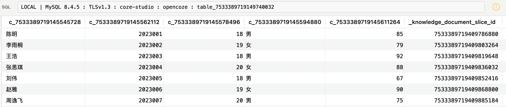
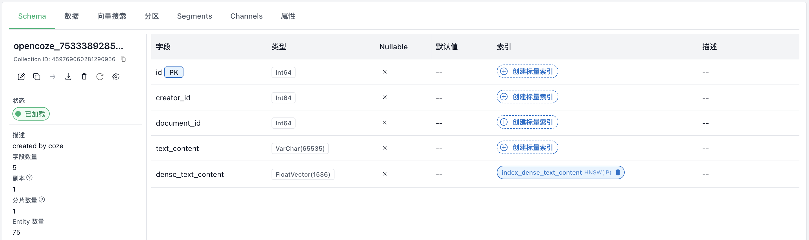
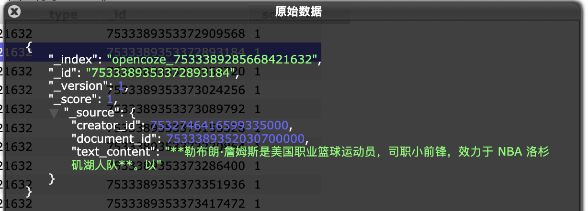

# 学习 Coze Studio 的知识库入库逻辑（续）

书接上文，当用户在知识库上传文档、表格或图片，然后对知识库进行设置和确认后，Coze Studio 通过发送 `IndexDocuments` 事件开始了文档的异步处理。这个事件被发送到消息队列后，由 `knowledge` 领域的事件处理器消费，我们今天就来看下这块的逻辑。

## 事件处理器

事件处理器的代码位于 `backend/domain/knowledge/service/event_handle.go` 文件，这是一个 `switch` 结构，负责分发知识库相关的各类事件，比如批量文档处理（`IndexDocuments`）、单个文档处理（`IndexDocument`）、修改文档分片（`IndexSlice`）、删除知识库数据（`DeleteKnowledgeData`）、文档预览（`DocumentReview`）等：

```go
func (k *knowledgeSVC) HandleMessage(ctx context.Context, msg *eventbus.Message) (err error) {

  event := &entity.Event{}
  err = sonic.Unmarshal(msg.Body, event)

  // 事件处理器
  switch event.Type {
  case entity.EventTypeIndexDocuments:
    // 批量文档处理
    k.indexDocuments(ctx, event)
  case entity.EventTypeIndexDocument:
    // 单个文档处理
    k.indexDocument(ctx, event)
  case entity.EventTypeIndexSlice:
    // 修改文档分片
    k.indexSlice(ctx, event)
  case entity.EventTypeDeleteKnowledgeData:
    // 删除知识库数据
    k.deleteKnowledgeDataEventHandler(ctx, event)
  case entity.EventTypeDocumentReview:
    // 文档预览
    k.documentReviewEventHandler(ctx, event)
  }
  return nil
}
```

其中批量文档处理（`IndexDocuments`）事件的逻辑很简单，就是遍历所有文档，为每个文档单独发送一个单文档处理（`IndexDocument`）事件。

## 文档处理流程

单文档处理（`IndexDocument`）事件的代码位于 `indexDocument()` 函数，这个处理函数是整个知识库入库流程的核心，其执行流程可分为以下几个关键步骤：

1. **状态检查与清理**：
    * 首先检查知识库和文档是否处于可写入状态，防止并发操作导致数据不一致；
    * 如果不是追加模式，会先清除该文档在数据库（`knowledge_document_slice` 表）和向量数据库中的旧数据；
2. **解析与分片**：
    * 将文档状态设置为分片中（`Chunking`）；
    * 从对象存储（TOS）下载文档的原始文件；
    * 根据文档类型（文本、图片、表格）获取对应的解析器（Parser），对文件内容进行解析和分片，生成一系列文档分片（`schema.Document`）；
3. **数据持久化**：
    * 为每个文档分片生成唯一的 ID；
    * 将文档分片批量存入 `knowledge_document_slice` 数据表中；
    * 对于表格类型，还会将解析出的结构化数据行插入到之前动态创建的物理数据表中；
4. **向量化与索引**：
    * 将持久化后的文档分片转换为向量数据库要求的格式；
    * 调用 `searchstore` 的 `Store` 方法，将文档分片进行向量化，并存入 Milvus 等向量数据库中。这个过程会根据文档 ID 进行分区（Partition），便于后续的高效检索和管理；
5. **状态更新**：
    * 所有文档分片成功存入向量数据库后，将其在 `knowledge_document_slice` 表中的状态更新为 `Done`；
    * 最后，将 `knowledge_document` 表中对应文档的状态更新为 `Enable`，表示该文档已处理完成并可供检索；

接下来，我们详细看看每一步的实现逻辑。

## 状态检查与清理

```go
// 检查知识库和文档状态
if valid, err := k.isWritableKnowledgeAndDocument(ctx, doc.KnowledgeID, doc.ID); err != nil {
  return err
} else if !valid {
  return errorx.New(errno.ErrKnowledgeNonRetryableCode, ...)
}

// 清除旧数据
collectionName := getCollectionName(doc.KnowledgeID)
if !doc.IsAppend {
  ids, err := k.sliceRepo.GetDocumentSliceIDs(ctx, []int64{doc.ID})
  if len(ids) > 0 {
    // 删除分片记录
    err = k.sliceRepo.DeleteByDocument(ctx, doc.ID)
    for _, manager := range k.searchStoreManagers {
      // 删除 search store 中的数据
      s, err := manager.GetSearchStore(ctx, collectionName)
      s.Delete(ctx, slices.Transform(event.SliceIDs, func(id int64) string {
        return strconv.FormatInt(id, 10)
      }))
    }
  }
}
```

首先通过 `isWritableKnowledgeAndDocument()` 函数分别检查知识库和文档的状态是否可写（不是被禁用或被删除），只有两者都可写时才继续后面的流程。然后如果是非追加模式，查询当前文档在 `knowledge_document_slice` 表中是否已存在分片记录，如果存在，则删除该文档的所有分片，同时删除该文档在搜索存储中的数据。

这里的 **搜索存储（Search Store）** 是 Coze Studio 对搜索引擎的统一抽象层，为不同的数据库（Milvus、Elasticsearch、VikingDB）提供统一的操作接口，它继承 `indexer.Indexer` 和 `retriever.Retriever`，支持向量或文本的存储和索引构建，并提供基于向量或文本的相似性搜索能力。要注意的是，搜索存储要通过 Manager 的 `GetSearchStore()` 来获取，Manager 是搜索存储的管理器，负责管理搜索存储的生命周期，比如创建、删除、获取等。目前支持全文搜索和向量搜索两种 Manager 如下：

```go
var sManagers []searchstore.Manager

// es full text search
sManagers = append(sManagers, sses.NewManager(&sses.ManagerConfig{Client: c.ES}))

// vector search
mgr, err := getVectorStore(ctx)
sManagers = append(sManagers, mgr)
```

其中向量搜索根据 `VECTOR_STORE_TYPE` 环境变量可选 Milvus 或 VikingDB，默认是 Milvus 数据库。

## 解析与分片

```go
// 将文档状态设置为分片中
k.documentRepo.SetStatus(ctx, doc.ID, int32(entity.DocumentStatusChunking), "")

// 从对象存储下载文档的原始文件
bodyBytes, err := k.storage.GetObject(ctx, doc.URI)

// 根据文档类型（文本、图片、表格）获取对应的解析器
docParser, err := k.parseManager.GetParser(convert.DocumentToParseConfig(doc))

// 对文件内容进行解析和分片，生成一系列文档分片
parseResult, err := docParser.Parse(ctx, bytes.NewReader(bodyBytes), parser.WithExtraMeta(map[string]any{
  document.MetaDataKeyCreatorID: doc.CreatorID,
  document.MetaDataKeyExternalStorage: map[string]any{
    "document_id": doc.ID,
  },
}))
```

接下来，从对象存储下载文档的原始文件，然后对文件内容进行解析和分片。根据不同的文档类型，Coze Studio 提供了不同的解析器：

```go
func (m *manager) GetParser(config *parser.Config) (parser.Parser, error) {
  var pFn parseFn
  switch config.FileExtension {
  case parser.FileExtensionPDF:
    pFn = parseByPython(config, m.storage, m.ocr, goutil.GetPython3Path(), goutil.GetPythonFilePath("parse_pdf.py"))
  case parser.FileExtensionTXT:
    pFn = parseText(config)
  case parser.FileExtensionMarkdown:
    pFn = parseMarkdown(config, m.storage, m.ocr)
  case parser.FileExtensionDocx:
    pFn = parseByPython(config, m.storage, m.ocr, goutil.GetPython3Path(), goutil.GetPythonFilePath("parse_docx.py"))
  case parser.FileExtensionCSV:
    pFn = parseCSV(config)
  case parser.FileExtensionXLSX:
    pFn = parseXLSX(config)
  case parser.FileExtensionJSON:
    pFn = parseJSON(config)
  case parser.FileExtensionJsonMaps:
    pFn = parseJSONMaps(config)
  case parser.FileExtensionJPG, parser.FileExtensionJPEG, parser.FileExtensionPNG:
    pFn = parseImage(config, m.model)
  default:
    return nil, fmt.Errorf("[Parse] document type not support, type=%s", config.FileExtension)
  }
  return &p{parseFn: pFn}, nil
}
```

解析器做的比较通用，将文本、表格、图片知识库的所有配置参数混在一起，不用区分知识库是什么类型。这里对这些解析器的实现流程做个大概的总结：

* **PDF 解析器**：运行 Python 脚本 `parse_pdf.py` 从 PDF 文件中提取出文本、图片、表格等内容，主要使用的是 `pdfplumber` 库；文本内容调用 `chunkCustom` 进行分块；图片转为 base64 存储到对象存储，如果开启了 OCR 功能，还调用 OCR 接口将图片转换为文本；表格数据则转为 CSV 格式处理；
* **TXT 解析器**：直接读取文件内容，调用 `chunkCustom` 进行文本分块；
* **Markdown 解析器**：使用 [yuin/goldmark](https://github.com/yuin/goldmark) 将 Markdown 文件解析成 AST，遍历文本节点，按分隔符和块大小分块，支持自动下载图片并保存到对象存储，如果开启了 OCR 功能，也会调用 OCR 接口做文字识别；
* **Docx 解析器**：通过运行 Python 脚本 `parse_docx.py` 从 DOCX 文件中提取文本、图片和表格内容，主要使用的是 `python-docx` 库；之后的逻辑和 PDF 解析器一样；
* **CSV 解析器**：通过 `encoding/csv` 逐行读取 CSV 数据，支持自动处理 BOM 头，转换为行迭代器统一处理；
* **XLSX 解析器**：通过 [qax-os/excelize](https://github.com/qax-os/excelize) 库打开 Excel 文件，逐行读取，并自动补齐列数，转换为行迭代器统一处理；
* **JSON 解析器**：解析 JSON 数组为 map 切片，支持动态提取表头，即首个对象的 key，支持自定义列配置，转换为行迭代器统一处理；
* **图片解析器**：读取图片，转为 base64，并调用多模态大模型生成图片描述，支持手动标注模式；

可以看出，Coze Studio 对常见的文件类型都提供了很好的支持：对于 PDF 和 Word 等复杂文档，使用 Python 来处理，通过 Go 与 Python 脚本的管道通信机制；对于表格数据，都使用了行迭代器统一处理；对于图像数据，使用 OCR 进行文字识别，或调用多模态大模型生成图片描述。

> 我们之前在介绍 Eino 组件时学习过，Eino Ext 内置了一些文档处理类的组件，支持解析 TXT、HTML、DOCX、XLSX、PDF 等格式的文件。但是很显然，Go 在这方面的生态相比于 Python 来说还不够成熟，因此 Coze Studio 采用了 Go + Python 这种折中的方式。

## 数据持久化

```go
// 批量生成所有文档分片的 ID
allIDs := make([]int64, 0, len(parseResult))
for l := 0; l < len(parseResult); l += 100 {
    ids, err := k.idgen.GenMultiIDs(ctx, batchSize)
    allIDs = append(allIDs, ids...)
}

// 将 parseResult 转换为 sliceModels
sliceModels := make([]*model.KnowledgeDocumentSlice, 0, len(parseResult))
for i, src := range parseResult {
    sliceModel := &model.KnowledgeDocumentSlice{
        ID:          allIDs[i],
        KnowledgeID: doc.KnowledgeID,
        DocumentID:  doc.ID,
        Content:     parseResult[i].Content,
        // 将分片状态设置为处理中（Processing）
        Status:      int32(model.SliceStatusProcessing),
    }
    // 表格类型的分片 特殊处理
    if doc.Type == knowledge.DocumentTypeTable {
        sliceEntity, err := convertFn(src, doc.KnowledgeID, doc.ID, doc.CreatorID)
        sliceModel.Content = sliceEntity.GetSliceContent()
    }
    sliceModels = append(sliceModels, sliceModel)
}

// 批量保存文档分片
err = k.sliceRepo.BatchCreate(ctx, sliceModels)

// 保存表格类型的数据
if doc.Type == knowledge.DocumentTypeTable {
    err = k.upsertDataToTable(ctx, &doc.TableInfo, sliceEntities)
}
```

经过上一步后，我们得到了一系列的文档分片 `parseResult`，接下来的逻辑就是将其批量存入 `knowledge_document_slice` 数据表中。首先通过 `GenMultiIDs` 为每个分片生成唯一的 ID，这里使用批量生成的方式，一次生成 100 个；然后将 `parseResult` 转换为 `KnowledgeDocumentSlice` 类型，并将分片状态设置为处理中（`SliceStatusProcessing`）；最后调用 `sliceRepo.BatchCreate` 批量保存。

这里值得注意的一点是对表格数据的处理，表格按行分片，内容是一行数据的 JSON 格式，Key 为列名，Value 为单元格的值，如下：


此外，我们回顾下昨天学习文档处理器的内容：对于表格知识库，首次插入文档时，除了会新建一条 `knowledge_document` 记录，还会根据 Excel 的列结构动态地创建一个物理数据表；这里在解析完表格之后，表格的分片数据还会插入到这个物理数据表中：



## 向量化与索引

```go
// 字段列表和索引字段
fields, err := k.mapSearchFields(doc)
indexingFields := getIndexingFields(fields)

for _, manager := range k.searchStoreManagers {
  // 为每个知识库创建一个独立的集合或索引
  manager.Create(ctx, &searchstore.CreateRequest{
    CollectionName: collectionName,
    Fields:         fields,
    CollectionMeta: nil,
  })
  // 将文档分片保存到搜索存储中（Milvus、Elasticsearch、VikingDB）
  ss, err := manager.GetSearchStore(ctx, collectionName)
  _, err = ss.Store(ctx, ssDocs,
    searchstore.WithIndexerPartitionKey(fieldNameDocumentID),
    searchstore.WithPartition(strconv.FormatInt(doc.ID, 10)),
    searchstore.WithIndexingFields(indexingFields),
  )
}
```

接下来，我们还需要将文档分片保存到搜索存储（Milvus、Elasticsearch、VikingDB）中。首先，使用 Manager 的 `Create` 方法为每个知识库创建一个独立的集合，集合的名字为 `opencoze_<kb_id>`，每种搜索存储的概念不太一样，创建集合的方式也是不一样的。比如在 Milvus 中，分为创建集合、创建索引和加载集合三步，确保 Milvus 集合加载到内存中，使其可用于搜索操作：

```go
func (m *milvusManager) Create(ctx context.Context, req *searchstore.CreateRequest) error {
  // 创建集合
  if err := m.createCollection(ctx, req); err != nil {
    return fmt.Errorf("[Create] create collection failed, %w", err)
  }
  // 创建索引
  if err := m.createIndexes(ctx, req); err != nil {
    return fmt.Errorf("[Create] create indexes failed, %w", err)
  }
  // 加载集合
  if exists, err := m.loadCollection(ctx, req.CollectionName); err != nil {
    return fmt.Errorf("[Create] load collection failed, %w", err)
  } else if !exists {
    return fmt.Errorf("[Create] load collection failed, collection=%v does not exist", req.CollectionName)
  }
  return nil
}
```

> 在 Milvus 向量数据库中，[load_collection](https://milvus.io/docs/zh/load-and-release.md) 是一个非常重要的操作，其主要作用是将指定的集合（Collection）从磁盘加载到内存中，以便进行高效的向量检索和查询操作，刚创建或刚插入数据的集合需要先执行 load_collection 后才能进行查询操作。

而在 Elasticsearch 中，直接创建索引即可：

```go
func (e *esManager) Create(ctx context.Context, req *searchstore.CreateRequest) error {
  cli := e.config.Client
  index := req.CollectionName
  // 创建索引
  err = cli.CreateIndex(ctx, index, properties)
  return err
}
```

在 Milvus 中，每个知识库对应一个集合：


根据文档类型创建对应的字段和索引：



而在 Elasticsearch 中，每个知识库对应一个索引：


然后，将文档分片依次保存到搜索存储中，对于 Milvus 来说，会有一个向量列，通过 Embedding 计算：


而 Elasticsearch 则直接存储文档分片：



整个过程中规中矩，并没有多少需要特别关注的地方。其中 Embedding 我们之前介绍过，支持三种接入方式：

* **OpenAI** - 兼容 OpenAI 协议的 Embedding 接口；
* **ARK** - 火山引擎提供的 Embedding 服务，支持多种模型，如 `doubao-embedding`、`doubao-embedding-large`、`doubao-embedding-vision`、`bge-large-zh`、`bge-m3`、`bge-visualized-m3` 等；其中 `bge-m3` 比较特殊，它是唯一一个 **同时支持稠密向量和稀疏向量** 的模型，如果使用这个模型，在 Milvus 集合中不仅会创建 `dense_text_content` 稠密向量列，还会创建一个 `sparse_text_content` 稀疏向量列；
* **HTTP** - 调用本地部署的模型服务，需要满足 Coze 自己的一套 [接口协议](https://github.com/coze-dev/coze-studio/blob/main/backend/infra/impl/embedding/http/http.go)，暂不支持 Ollama 或 Xinference 协议；

## 状态更新

```go
// 将分片状态设置为已完成（Done）
err = k.sliceRepo.BatchSetStatus(ctx, allIDs, int32(model.SliceStatusDone), "")

// 将文档状态设置为启用（Enable）
err = k.documentRepo.SetStatus(ctx, doc.ID, int32(entity.DocumentStatusEnable), "")

// 更新文档的分片信息
// 1. 统计文档的分片数量
// 2. 计算文档所有分片内容的总大小
err = k.documentRepo.UpdateDocumentSliceInfo(ctx, event.Document.ID)
```

最后一步，将分片状态设置为已完成（Done），将文档状态设置为启用（Enable），同时更新文档的分片信息，包括分片数量和分片大小，对应 `knowledge_document` 表中的 `slice_count` 和 `size` 字段。

## 小结

今天我们接续昨天的内容，深入探究了 Coze Studio 知识库文档入库的异步处理全流程。整个过程由消息队列驱动，其核心逻辑总结如下：

* **事件驱动架构**：文档上传后，系统通过发送 `IndexDocuments` 事件触发异步处理流程，该事件再分发为针对单个文档的 `IndexDocument` 事件，由专门的事件处理器进行消费和处理；
* **核心处理流水线**：`indexDocument` 函数是整个流程的核心，它编排了从文档解析到最终索引完成的五个关键步骤：状态检查与清理、解析与分片、数据持久化、向量化与索引，以及最终的状态更新；
* **多格式文档解析**：系统内置了针对不同文件类型（PDF, DOCX, Markdown, 表格, 图片等）的精细化解析器。特别地，对于 PDF、DOCX 等复杂格式，结合了 Python 脚本进行处理，弥补了 Go 生态在文档解析方面的不足；
* **双重存储策略**：解析后的文档分片不仅被持久化到 MySQL 数据库（`knowledge_document_slice` 表）中，同时也被向量化并存入由 **Search Store** 抽象层管理的 Milvus 或 Elasticsearch 中，实现了元数据与向量索引的分离存储；

至此，一份用户上传的文档就完成了从解析、切片、存储到向量化的完整入库流程，可以被智能体检索和使用了。
