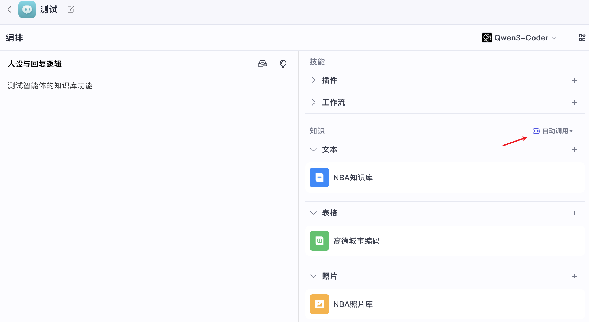
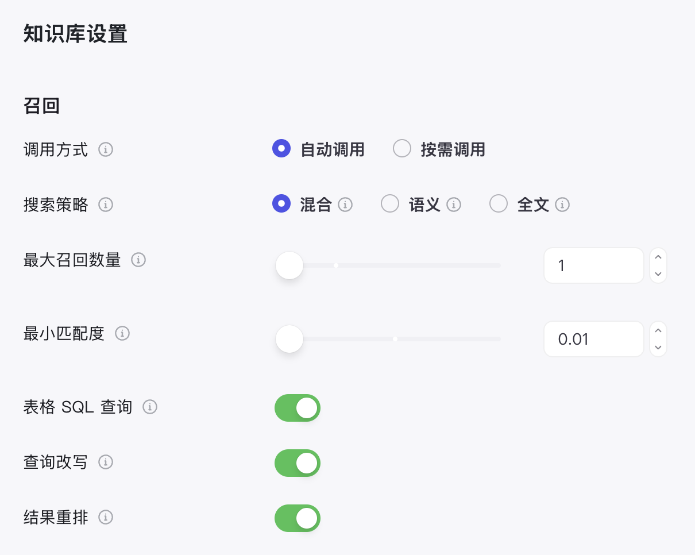
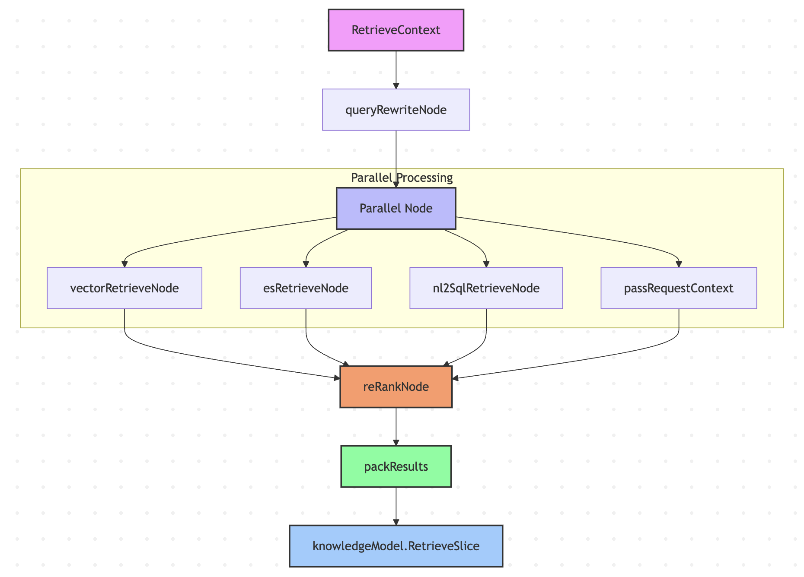
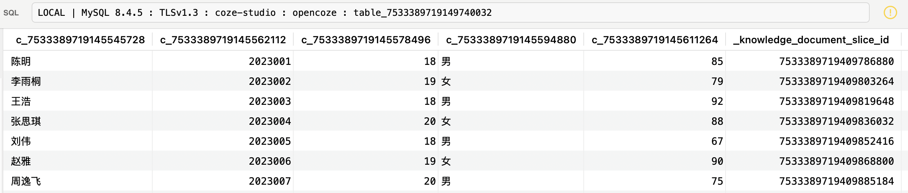

# 学习 Coze Studio 的知识库检索逻辑

经过前面几天的学习，我们已经深入探讨了 Coze Studio 从知识库的创建到文档入库的完整流程。今天，我们将继续这一探索之旅，深入研究知识库的最后一个核心环节 —— **检索（Retrieval）**，看看在 Coze Studio 中，智能体是如何从知识库中精准高效地找到与用户问题最相关的信息的。Coze Studio 在这方面设计了一套颇为完善的检索流水线，它融合了查询重写、多路并行检索（向量、全文、NL2SQL）以及重排序等多种技术。下面就让我们一起看看它背后的实现细节。

## 知识库检索配置

在 Coze Studio 中，我们可以为智能体提供特定领域的背景知识，包括文本、表格和图片，让其可以回答领域内的问题：



我们还可以对知识库进行一些配置，以便智能体更好地对知识库进行检索：



这些配置参数包括：

* **调用方式**：分为 **自动调用** 和 **按需调用** 两种，自动调用指的是每次对话时都会发起一次检索，将检索结果放置在内置的系统提示词中，而按需调用则是将知识库检索封装成一个工具供智能体调用，只有当用户问题确实需要检索知识库时才触发调用。实际上，在开源版本中暂时只支持自动调用，我们之前在学习智能体执行逻辑时已经看到了，通过 Graph API 编排出来的智能体图，知识库检索是必然执行的节点之一，而且在源码中搜索 `recallKnowledge` 工具，也找不到其他地方用到；
* **搜索策略**：分为 **语义**、**全文** 和 **混合** 三种，语义表示基于向量的文本相关性查询，推荐在需要理解语义关联度和跨语言查询的场景使用，全文表示依赖于关键词的全文搜索，推荐在搜索具有特定名称、缩写词、短语或 ID 的场景使用，混合表示结合全文检索与语义检索的优势，并对结果进行综合排序。
* **最大召回数量**：从知识库中返回给大模型的最大段落数，注意默认是 1，可以适当调大一点；
* **最小匹配度**：根据设置的匹配度选取段落返回给大模型，低于设定匹配度的内容不会被召回；
* **表格 SQL 查询**：同时将查询的自然语言转为 SQL 语句进行查询，SQL 执行结果与 RAG 召回段落一同输入给模型；该选项仅对表格知识库有效；
* **查询改写**：结合对话上下文，对用户的问题进行改写，使得改写后的查询更适合检索；
* **结果重排**：通过分析用户查询的意图，对召回结果重新排序，使得最相关的内容排在前面；

## 知识库检索流程

回顾之前学习的智能体执行逻辑，其中有一路负责知识库的检索：

```go
// 新建知识库检索器
kr, err := newKnowledgeRetriever(ctx, &retrieverConfig{
  knowledgeConfig: conf.Agent.Knowledge,
})

// 第一个节点检索
_ = g.AddLambdaNode(keyOfKnowledgeRetriever,
  compose.InvokableLambda[*AgentRequest, []*schema.Document](kr.Retrieve),
  compose.WithNodeName(keyOfKnowledgeRetriever))

// 第二个节点组装成字符串
_ = g.AddLambdaNode(keyOfKnowledgeRetrieverPack,
  compose.InvokableLambda[[]*schema.Document, string](kr.PackRetrieveResultInfo),
  compose.WithOutputKey(placeholderOfKnowledge),
)
```

首先新建一个知识库检索器，将其 `Retrieve()` 方法作为第一个节点，知识库检索后，该方法返回 `[]*schema.Document` 文档列表，因此还需要第二个节点，调用 `PackRetrieveResultInfo` 将其组装成字符串，替换系统提示词模版中的 `{{ knowledge }}` 占位符。

可以看出只要智能体关联了知识库，用户每次对话时总是会触发一次知识库检索，检索的逻辑位于 `knowledge` 领域层，如下：

```go
func (k *knowledgeSVC) Retrieve(ctx context.Context, request *RetrieveRequest) (response *RetrieveResponse, err error) {

  // 检索上下文
  retrieveContext, err := k.newRetrieveContext(ctx, request)

  // 查询重写
  rewriteNode := compose.InvokableLambda(k.queryRewriteNode)
  // 向量化召回
  vectorRetrieveNode := compose.InvokableLambda(k.vectorRetrieveNode)
  // ES召回
  EsRetrieveNode := compose.InvokableLambda(k.esRetrieveNode)
  // Nl2Sql召回
  Nl2SqlRetrieveNode := compose.InvokableLambda(k.nl2SqlRetrieveNode)
  // 用户查询透传
  passRequestContextNode := compose.InvokableLambda(k.passRequestContext)
  // 重排序
  reRankNode := compose.InvokableLambda(k.reRankNode)
  // 打包查询结果
  packResult := compose.InvokableLambda(k.packResults)

  // 多路召回
  parallelNode := compose.NewParallel().
    AddLambda("vectorRetrieveNode", vectorRetrieveNode).
    AddLambda("esRetrieveNode", EsRetrieveNode).
    AddLambda("nl2SqlRetrieveNode", Nl2SqlRetrieveNode).
    AddLambda("passRequestContext", passRequestContextNode)

  // 编排检索链
  chain := compose.NewChain[*RetrieveContext, []*knowledgeModel.RetrieveSlice]()
  r, err := chain.
    AppendLambda(rewriteNode).
    AppendParallel(parallelNode).
    AppendLambda(reRankNode).
    AppendLambda(packResult).
    Compile(ctx)
  // 调用链
  output, err := r.Invoke(ctx, retrieveContext)
  return &RetrieveResponse{
    RetrieveSlices: output,
  }, nil
}
```

可以看到，这里使用了 Eino 的编排（Compose）技术，通过 Chain API 实现了多路检索 + 重排序的知识库检索流程：



下面将依次学习下检索流程中各个节点的实现逻辑。

## 查询重写

该节点只有在启用查询重写且有聊天历史时才会执行，其作用为对用户原始查询进行改写优化，结合聊天上下文，将用户的当前查询改写成更适合检索的查询语句。查询重写的目的主要有两个：

1. **使模糊问题更明确**：比如用户的问题是 `听说最近武汉的樱花挺不错，打算下周二带家人去看看，不知道那天天气怎么样？`，需要把问题改成更明确的 `武汉下周二天气怎么样？`
2. **多轮对话中的指代消解**：比如用户先问 `合肥明天的天气怎么样？`，系统回答之后，用户接着又问 `那后天呢？`，这时要把问题改写成 `合肥后天的天气怎么样？`

其核心就一段 Prompt，位于 `backend/conf/prompt/messages_to_query_template_jinja2.json` 配置文件：

```
# 角色：
你是一名专业的查询重构工程师，擅长根据用户提供的上下文信息重写查询语句，使其更清晰、更完整，并与用户的意图相符。你应使用与用户输入相同的语言进行回复。

## 输出格式：
输出内容应为重构后的查询语句，以纯文本格式呈现。

## 示例：
示例 1：
输入：
[
  {
    "role": "user",
    "content": "世界上最大的沙漠在哪里？"
  },
  {
    "role": "assistant",
    "content": "世界上最大的沙漠是撒哈拉沙漠。"
  },
  {
    "role": "user",
    "content": "怎么去那里？"
  }
]
输出：怎么去撒哈拉沙漠？

示例 2：
输入：
[
  {
    "role": "user",
    "content": "分析当前网红欺骗公众以获取流量对当今社会的影响。"
  }
]
输出：当前网红欺骗公众以获取流量，分析这一现象对当今社会的影响。
```

值得注意的是，开启查询重写功能需要配置 AI 生成模型，可以打开 `.env` 文件，配置如下：

```sh
export BUILTIN_CM_TYPE="openai"
```

或者单独配置 M2Q 模型：

```sh
export M2Q_BUILTIN_CM_TYPE="openai"
```

由于修改的是环境变量，通过 `--force-recreate` 重启服务：

```
$ docker compose --profile '*' up -d --force-recreate --no-deps coze-server
```

## 多路检索策略

检索流程中的第二部分包含四个并行执行的子节点：

* **向量检索节点**：进行语义相似度检索，使用向量数据库，基于语义相似度查找相关文档；当搜索策略设置为纯全文搜索时跳过；
* **ES 检索节点**：进行全文文本检索，使用 Elasticsearch，基于关键词匹配查找相关文档；当搜索策略设置为纯语义搜索时跳过；
* **NL2SQL 检索节点**：专门处理表格数据的检索，将自然语言查询转换为 SQL 语句，查询结构化表格数据；只有在启用 NL2SQL 且存在表格文档时执行；
* **上下文传递节点**：传递原始请求上下文，确保后续节点能够访问完整的检索上下文信息；由于这里使用的是 Chain API，它是基于 Graph API 实现的，不支持跨节点传递参数；

这里的向量检索和 ES 检索都没什么特别的，主要看下 NL2SQL 检索的实现：

```go
func (k *knowledgeSVC) nl2SqlExec(ctx context.Context, doc *model.KnowledgeDocument, retrieveCtx *RetrieveContext, opts []nl2sql.Option) (retrieveResult []*schema.Document, err error) {
    
  // 调用大模型，将自然语言查询转换为 SQL 语句
  sql, err := k.nl2Sql.NL2SQL(ctx, retrieveCtx.ChatHistory, []*document.TableSchema{packNL2SqlRequest(doc)}, opts...)

  // 对 SQL 中表名和列名进行替换
  parsedSQL, err := sqlparser.NewSQLParser().ParseAndModifySQL(sql, replaceMap)

  // 执行 SQL
  resp, err := k.rdb.ExecuteSQL(ctx, &rdb.ExecuteSQLRequest{
    SQL: parsedSQL,
  })

  return retrieveResult, nil
}
```

第一步仍然是调用 AI 生成大模型，因此也需要配置 AI 生成模型：

```sh
export BUILTIN_CM_TYPE="openai"
```

或单独配置 NL2SQL 模型：

```sh
export NL2SQL_BUILTIN_CM_TYPE="openai"
```

其核心也是一段 Prompt，位于 `backend/conf/prompt/nl2sql_template_jinja2.json` 配置文件：

```
角色：NL2SQL顾问

目标：
将自然语言陈述转换为MySQL标准的SQL查询。遵循约束条件，且仅返回JSON格式。

格式：
- 仅JSON格式。JSON包含字段“sql”（用于生成的SQL）、字段“err_code”（用于原因类型）、字段“err_msg”（用于详细原因，最好超过10个字）
- 不要使用“```json”标记格式

技能：
- 擅长将自然语言陈述转换为MySQL标准的SQL查询。

定义：
“err_code”原因类型定义：
- 0表示已生成SQL
- 3002表示因超时无法生成SQL
- 3003表示因缺少表结构无法生成SQL
- 3005表示因某些术语不明确无法生成SQL

示例：
问：帮我实现NL2SQL。
表结构描述：CREATE TABLE `sales_records` (
  `sales_id` bigint(20) unsigned NOT NULL COMMENT '销售员ID',
  `product_id` bigint(64) COMMENT '产品ID',
  `sale_date` datetime(3) COMMENT '销售日期和时间',
  `quantity_sold` int(11) COMMENT '销售量',
  PRIMARY KEY (`sales_id`)
) ENGINE=InnoDB DEFAULT CHARSET=utf8mb4 COMMENT='销售记录表';
SQL需求的自然语言描述：查询上月的销量总额第一名的销售员和他的销售总额
答：{
  "sql":"SELECT sales_id, SUM(quantity_sold) AS total_sales FROM sales_records WHERE MONTH(sale_date) = MONTH(CURRENT_DATE - INTERVAL 1 MONTH) AND YEAR(sale_date) = YEAR(CURRENT_DATE - INTERVAL 1 MONTH) GROUP BY sales_id ORDER BY total_sales DESC LIMIT 1",
  "err_code":0,
  "err_msg":"SQL查询生成成功"
}
```

值得一提的是，给大模型的表名和列名是原始的名称：

```sql
SELECT 成绩 FROM 学生信息 WHERE 姓名 = '胡阳';
```

而我们之前学习表格知识库入库逻辑时提到过，Coze Studio 会动态生成一个表名和列名，都是 ID 格式，如下：



因此还需要将大模型生成的 SQL 语句中的表名和列名做一个替换，这里使用的是 TiDB 的 [SQL Parser](https://github.com/pingcap/tidb/tree/master/pkg/parser) 对 SQL 语句进行解析和替换，如果有类似需求的话，可以参考下这块的逻辑。

## 重排序

多路召回后，为了使得和用户查询最相关的内容排在前面，我们还需要对召回结果重新排序。Coze Studio 提供了两种重排序实现：

* **RRF 实现**：基于倒序排名融合算法，通过计算每个文档在各个检索结果中的排名来综合评分；
* **VikingDB 实现**：调用火山引擎的重排序 API 接口；

不过看代码当前只使用了 RRF 重排序，RRF 全称为 **Reciprocal Rank Fusion（倒数排名融合）**，是滑铁卢大学和谷歌合作开发的一种算法，它可以将具有不同相关性指标的多个结果集组合成单个结果集，感兴趣的同学可以看下它的论文：

* https://plg.uwaterloo.ca/~gvcormac/cormacksigir09-rrf.pdf

其中最关键的部分就是下面这个公式：


其中，D 表示文档集，R 是从 1 到 |D| 的排列，k 是一个常量，默认值为 60，r(d) 表示文档在某个检索结果中的排名。从 RRF 分数的计算中，我们可以看出，RRF 不依赖于每次检索分配的绝对分数，而是依赖于相对排名，这使得它非常适合组合来自可能具有不同分数尺度或分布的查询结果。

## 小结

今天，我们学习了 Coze Studio 知识库检索的完整流程，通过 Eino 框架编排出一套包含查询重写、多路并行检索以及结果重排的检索流水线。其核心技术点可总结如下：

* **查询重写**：利用大模型结合对话上下文，对用户的原始问题进行优化和消歧，生成更适合机器检索的查询语句；
* **多路并行检索**：同时发起向量、全文和 NL2SQL 三种检索方式，最大化地召回相关信息，并通过并行处理提升检索效率；
* **结果重排**：采用先进的 RRF 算法，对来自不同检索通路的结果进行智能融合与排序，确保最相关的内容能够优先呈现给大模型；

至此，我们对 Coze Studio 的学习之旅也要告一段落了。从快速上手、基本功能实战，到深入后端源码，我们系统地剖析了其智能体、插件、工作流、知识库等核心模块的设计与实现。希望这一系列的文章能帮助大家对 Coze Studio 有一个全面而深入的理解，并为大家利用其构建自己的 AI 应用提供有价值的参考。
