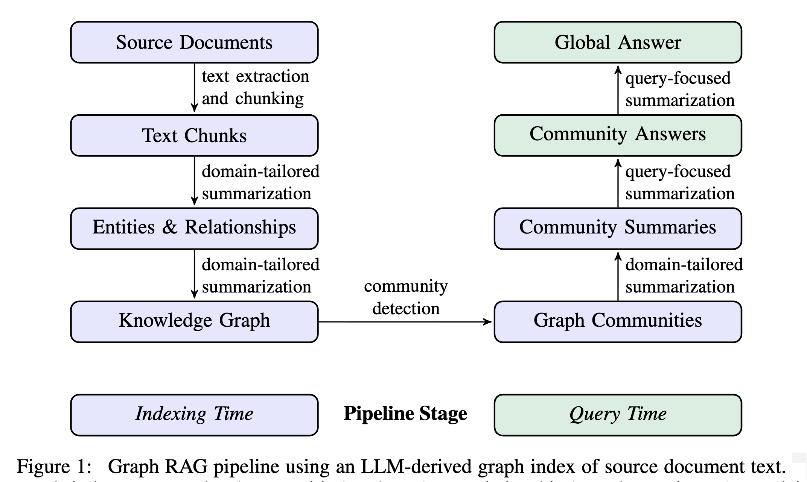
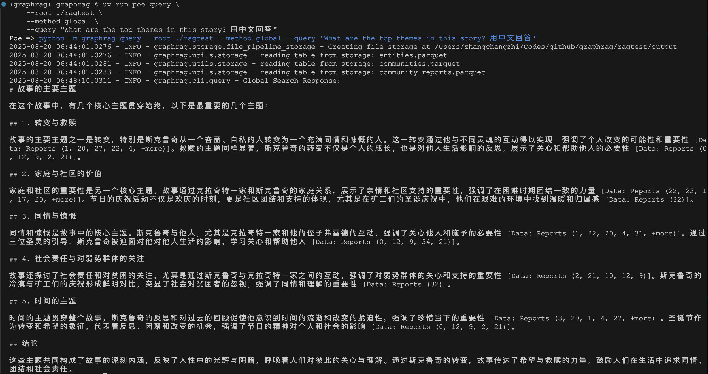
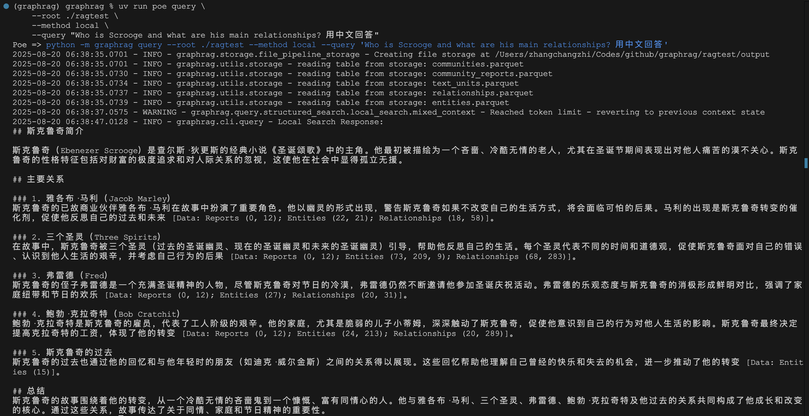

# GraphRAG 快速入门

在我们之前的学习过程中，曾简单介绍过 RAGFlow 的一个高级特性 —— 提取知识图谱。通过运用 GraphRAG 和 LightRAG 技术，RAGFlow 可以从实体、关系的提取到子图的构建和合并，再到实体消歧和社区报告的生成，形成完整的知识图谱。因此，这种方法在处理涉及复杂关系与多个实体的文档时，尤其是在多跳问答场景中，表现得尤为卓越。

最早关于 GraphRAG 的概念实际上可以追溯到去年微软研究院发表的论文《From Local to Global: A Graph RAG Approach to Query-Focused Summarization》中：

* https://arxiv.org/abs/2404.16130

随后，微软开源了 GraphRAG 项目，在 RAG 领域又掀起了一波新的浪潮：

* https://github.com/microsoft/graphrag

传统的 RAG 技术通常依赖于基于向量相似度来检索原始文本块，然而，当面对需要整合离散信息以解答的复杂问题时，这种方法往往表现得力不从心。GraphRAG 则采取了一种创新的路径，首先利用大型语言模型从非结构化文本数据中提取出实体和关系，并据此构建一个知识图谱。接着，依托图谱的拓扑结构进行社区发现，对每个社区进行逐层总结，最终形成一个分层且结构化的知识网络。在进行查询时，GraphRAG 利用这一知识网络来强化信息检索，从而为模型提供更具启发性的上下文，以回答那些需要深度推理和全局视角的问题。

## 核心概念

GraphRAG 的流程主要分为 **索引（Indexing）** 和 **查询（Querying）** 两个阶段：

* **索引（Indexing）**：这是 GraphRAG 的数据处理阶段，它将非结构化文本转化为结构化知识。主要步骤包括：
    * **文本分块**：将长文档切分成小的文本单元（TextUnit）；
    * **图谱提取**：利用大模型从文本单元中提取出实体（Entities）和关系（Relationships），构建知识图谱；
    * **社区发现**：使用 Leiden 等算法对图谱进行层次化社区聚类；
    * **社区总结**：利用大模型为每个层级的社区生成摘要报告；
* **查询（Querying）**：这是 GraphRAG 的数据检索与问答阶段，利用构建好的知识图谱和摘要来回答问题。比较常见的查询方式有：
    * **全局搜索（Global Search）**：利用社区摘要，通过 Map-Reduce 的方式对整个数据集进行归纳总结，回答宏观问题；
    * **本地搜索（Local Search）**：当问题涉及特定实体时，从该实体出发，在知识图谱中向外扩展，聚合其邻近的实体、关系以及相关的原始文本块，为大模型提供精准的局部上下文；

以下是 GraphRAG 的整个流水线示意图：



今天，我们就来快速上手体验一下 GraphRAG 的基本使用。

## 安装

GraphRAG 是一个 Python 库，可以通过 pip 轻松安装：

```
$ pip install graphrag
```

也可以通过源码进行安装，这里我采用这种方法，这样可以一边体验 GraphRAG 一边研究它的源码。首先克隆代码仓库：

```
$ git clone https://github.com/microsoft/graphrag.git
```

进入项目目录：

```
$ cd graphrag
```

使用 uv 创建 Python 虚拟环境：

```
$ uv venv --python 3.10
$ source .venv/bin/activate
```

安装 Python 依赖：

```
$ uv sync --extra dev
```

[uv](https://docs.astral.sh/uv/) 是一个极速的 Python 包和项目管理工具，`uv sync` 是它的一个命令，用于更新项目的环境，确保项目环境中的依赖与 `uv.lock` 文件一致。

## 快速上手

下面，我们就按照官方文档的步骤，通过一个完整的端到端示例，来体验 GraphRAG 的基本使用。首先，我们创建一个测试目录：

```
$ mkdir -p ./ragtest/input
```

该目录用于存放原始文档，GraphRAG 支持 txt、json 和 csv 三种格式的文档。

官网给的文档示例是查尔斯・狄更斯（Charles Dickens）创作的一部著名小说《圣诞颂歌》，讲述吝啬鬼斯克鲁奇（Scrooge）在圣诞节前夜经历的奇妙故事，通过三个幽灵的拜访，他的自私和冷酷逐渐崩塌，人性中的同情、仁慈、爱心及喜悦被唤醒，从此成为了一个乐善好施的人。我们可以从 [古腾堡计划](https://www.gutenberg.org/) 下载这本书：

```
$ curl https://www.gutenberg.org/cache/epub/24022/pg24022.txt -o ./ragtest/input/book.txt
```

> 古腾堡计划是一个致力于创建和分发免费电子书的志愿者项目，它提供了大量版权已过期的经典文学作品，可以在上面找到很多免费的图书。

接着，使用 `init` 命令初始化 GraphRAG 工作空间：

```
$ uv run poe init --root ./ragtest
```

其中 `poe` 是 [Poe The Poet](https://poethepoet.natn.io/index.html) 的简称，它是一个任务运行器工具，允许在 `pyproject.toml` 中定义和运行各种任务（类似 `npm scripts` 或 `Makefile`）。通过 poe 可以简化常见操作，如运行测试、启动服务、构建项目等。

如果你是通过 `pip` 安装的，可以直接使用 `graphrag` 命令：

```
$ graphrag init --root ./ragtest
```

该命令会在 `./ragtest` 目录下创建两个核心配置文件以及一些提示词文件：

* `.env`：用于存放环境变量，主要是 API Key；
* `settings.yaml`：GraphRAG 的主配置文件，包含了数据输入、模型配置、工作流等所有设置；
* `prompts`：运行过程中使用的一些提示词，用户可以对其进行微调；

GraphRAG 的核心流程严重依赖大模型，因此我们需要配置模型服务。打开刚刚生成的 `.env` 文件，将其中的 `GRAPHRAG_API_KEY` 替换成你自己的 OpenAI API Key：

```sh
GRAPHRAG_API_KEY="sk-..."
```

如果你使用的是 OpenAI 兼容接口，除了 API Key，还需要在 `settings.yaml` 文件中配置 `api_base` 参数；如果你使用的是 Azure OpenAI，可能还需要配置 `api_version` 和 `deployment_name` 等参数：

```yaml
models:
  default_chat_model:
    type: openai_chat # or azure_openai_chat
    api_base: ${GRAPHRAG_API_BASE}  # set this in the generated .env file
    # api_version: 2024-05-01-preview
    auth_type: api_key # or azure_managed_identity
    api_key: ${GRAPHRAG_API_KEY}    # set this in the generated .env file
    model: gpt-4o-mini
    # deployment_name: <azure_model_deployment_name>
  default_embedding_model:
    type: openai_embedding # or azure_openai_embedding
    api_base: ${GRAPHRAG_API_BASE}
    auth_type: api_key # or azure_managed_identity
    api_key: ${GRAPHRAG_API_KEY}
    model: text-embedding-3-small
    # deployment_name: <azure_model_deployment_name>
```

配置完成后，我们就可以开始构建索引了：

```
$ uv run poe index --root ./ragtest
```

这个过程会花费一些时间，具体取决于你的数据大小和模型性能。GraphRAG 会在后台执行一系列复杂的流程，包括：文本分块、实体与关系提取、图谱构建、社区发现、社区报告生成等。执行成功后，你会在 `./ragtest/output` 目录下看到一系列 Parquet 格式的结果文件，这些就是我们构建好的知识图谱数据：

```
$ tree ./ragtest/output
├── communities.parquet        # 社区表
├── community_reports.parquet  # 社区报告
├── context.json
├── documents.parquet          # 文档表
├── embeddings.community.full_content.parquet
├── embeddings.entity.description.parquet
├── embeddings.text_unit.text.parquet
├── entities.parquet           # 实体表
├── graph.graphml              # 知识图谱
├── lancedb                    # 向量数据库
│   ├── default-community-full_content.lance
│   ├── default-entity-description.lance
│   └── default-text_unit-text.lance
├── relationships.parquet      # 关系表
├── stats.json
└── text_units.parquet         # 文本单元
```

> GraphRAG 使用 Parquet 存储数据，这是一种列式存储的二进制文件格式，专为高效存储和处理大规模结构化数据而设计，广泛用于大数据处理和分析场景。另外，LanceDB 是一个为机器学习优化的向量数据库，使用 Apache Arrow 格式存储。GraphRAG 使用它来存储文本嵌入向量，用于相似性搜索。

索引构建完成后，我们就可以通过 `query` 命令来查询，GraphRAG 支持多种查询模式，我们来体验下最常用的两种。

* **全局搜索（Global Search）**：适用于需要对整个数据集进行宏观理解和总结的问题：

```
$ uv run poe query \
    --root ./ragtest \
    --method global \
    --query "What are the top themes in this story? 用中文回答"
```



* **本地搜索（Local Search）**：适用于查询关于特定实体的具体信息：

```
$ uv run poe query \
    --root ./ragtest \
    --method local \
    --query "Who is Scrooge and what are his main relationships? 用中文回答"
```



## 小结

今天，我们初步探索了 GraphRAG，通过动手实践，体验了其从安装、配置到索引构建和查询的完整流程。GraphRAG 通过将非结构化文本转化成结构化的知识图谱，提供了一种创新的 RAG 范式。这种方法不仅提高了复杂问题的解决能力，还为多跳问答和深度推理提供了强有力的支持。

当然，GraphRAG 的功能远不止于此，它还支持更高级的功能，如提示词自动调优、自定义工作流、图可视化等。

我们后面将结合其源码，继续探索 GraphRAG 的强大能力和实现原理。
