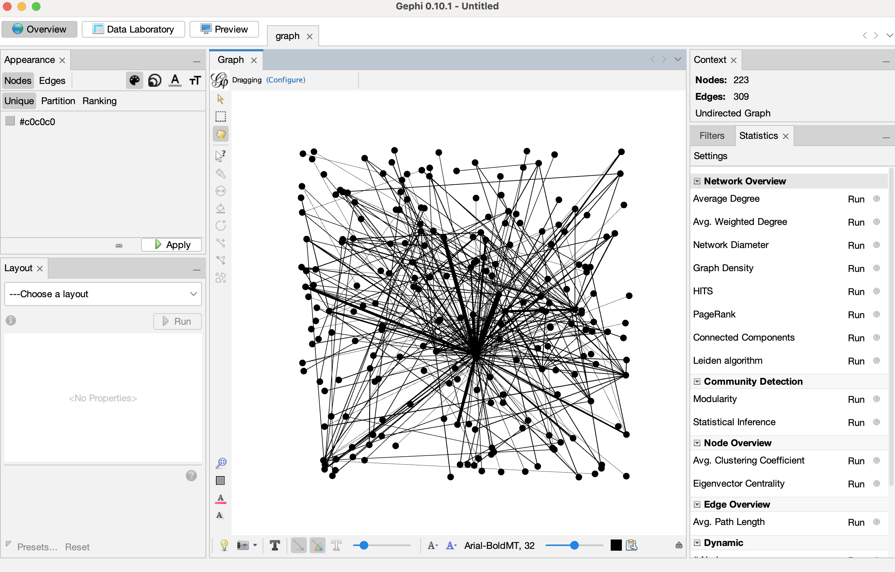

# 可视化探索 GraphRAG 的知识图谱

昨天，我们通过一个端到端的示例，快速体验了 GraphRAG 从数据索引到查询的完整流程。我们知道，GraphRAG 的核心是将非结构化文本转化为结构化的知识图谱。然而，单纯查看 Parquet 格式的输出文件很难直观地理解图谱的结构。今天，我们将学习如何将这个知识图谱可视化，从而更清晰地洞察数据中的实体、关系和社区结构。

## 准备工作

在我们昨天的 `ragtest` 示例中，`uv run poe index` 命令已经为我们生成了一系列 Parquet 文件，还有一个图描述文件 `graph.graphml`，包含了图谱的节点和边信息。为了生成这个文件，在构建索引之前，其实我对 `settings.yaml` 配置文件做了一点小小的修改，启用了 graphml 快照选项：

```yaml
snapshots:
  graphml: true
```

为了支持其他可视化工具，还可以启用下面这些额外参数：

```yaml
embed_graph:
  enabled: true  # 生成节点的 node2vec 嵌入
umap:
  enabled: true  # 生成 UMAP 嵌入，为实体提供 x/y 位置坐标
```

运行索引命令后，确保在 `output` 目录下能找到关键的 `graph.graphml` 文件，这是许多可视化工具支持的标准文件格式。

## GraphML 文件格式

GraphML (Graph Markup Language) 是一种基于 XML 的通用图形描述格式，旨在表示结构化的图形数据，包括节点、边及其属性关系。它支持多种图类型，如有向图、无向图和混合图，并允许用户自定义属性，比如节点的权重和边的类型。GraphML 提供了一种灵活、可扩展的格式，在图论、网络分析和数据可视化等领域有着广泛的应用。

GraphML 文件以 XML 声明开头，核心标签嵌套关系如下：

```xml
<?xml version="1.0" encoding="UTF-8"?>
<graphml xmlns="http://graphml.graphdrawing.org/xmlns">
  <!-- 1. 属性定义（key）：声明图形元素的属性类型 -->
  <key id="weight" for="edge" attr.name="weight" attr.type="double"/>
  <key id="label" for="node" attr.name="label" attr.type="string"/>
  
  <!-- 2. 图形定义（graph）：包含节点和边 -->
  <graph id="example" edgedefault="directed">
    <!-- 节点（node） -->
    <node id="n1">
      <data key="label">Node 1</data>
    </node>
    <node id="n2">
      <data key="label">Node 2</data>
    </node>
    
    <!-- 边（edge） -->
    <edge id="e1" source="n1" target="n2">
      <data key="weight">3.5</data>
    </edge>
  </graph>
</graphml>
```

整个文件结构包含：

* 根标签 `<graphml>`，必须包含 `xmlns` 命名空间声明，定义 GraphML 的语法规则；
* 属性定义 `<key>`，用于预先声明图形元素（节点、边、图形本身）的属性，包括属性名称和数据类型，类似于数据字典；`id` 为属性的唯一标识，后续可通过 `key` 引用；
* 图形标签 `<graph>`，表示一个具体的图形，可包含多个节点和边，`edgedefault` 为默认边类型，支持 `directed`（有向边）和 `undirected`（无向边）；
* 节点 `<node>`，表示图形中的节点，`id` 为唯一标识；
* 边 `<edge>`，表示节点间的关系，必须包含 `source`（起点）和 `target`（终点）属性；

在 Python 中，常常使用 [NetworkX](https://github.com/networkx/networkx) 库读写 GraphML 文件，GraphRAG 用的也是这个库：

```python
import networkx as nx

# 创建无向图
G = nx.Graph()

# 添加节点
nodes = [
  ("n1", {"label": "Node 1"}),
  ("n2", {"label": "Node 2"}),
]

for name, attrs in nodes:
  G.add_node(name, **attrs)

# 添加边
relationships = [
  ("n1", "n2", {"weight": 3.5}),
]

for source, target, attrs in relationships:
  G.add_edge(source, target, **attrs)

# 将图保存为 GraphML 格式
nx.write_graphml(G, "demo.graphml", encoding='utf-8')
```

## 使用 Gephi 进行可视化

[Gephi](https://gephi.org/) 是一款非常流行的开源图可视化和探索工具，非常适合用来分析 GraphRAG 生成的 GraphML 文件。


首先，从 Gephi 官网下载并安装最新版本，然后点击 “Open Graph File...” 导入 `graph.graphml` 文件，你将看到一个包含所有节点和边的基础图谱视图：



接着我们安装 Leiden Algorithm 插件，点击 `工具` → `插件`，搜索 Leiden 关键词，找到并安装该插件，这是进行社区检测的关键工具：


然后在统计面板中找到 “平均度数” 和 “Leiden 算法”，点击右侧的 “Run” 运行分析，为后续的可视化提供数据基础。运行 “Leiden 算法” 时调整配置如下：


有两点修改：

* 使用 **模块度（Modularity）** 作为 **质量函数（Quality function）**，在社区发现中，模块度是衡量社区划分质量的重要指标，其取值范围通常在 `[-1, 1]` 之间；
* 将 **分辨率（Resolution）** 设置为 1，这个值用于控制社区检测的粒度，如果 > 1 倾向于发现更小、更细粒度的社区，如果 < 1 倾向于发现更大、更粗粒度的社区，如果 = 1 则使用标准模块度优化，产生自然大小的社区；

分析结果如下：


从图中可以看出平均度数为 2.771，模块度质量为 0.602。

度数表示每个节点连接的边数，而平均度数则表示所有节点度数的平均值，2.771 意味着平均每个实体连接到约 2.8 个其他实体，这是一个相对较低的平均度数，表明知识图谱相对稀疏，实体间连接不密集，低连接度有助于形成清晰的社区边界。

另外，0.602 是一个很好的模块度值，说明算法发现了清晰、良好分离的社区。模块度并非越高越好，通常 0.3 ~ 0.7 被广泛认为是较好的社区划分范围，表明网络中的节点确实呈现出明显的 **社区内连接紧密、社区间连接稀疏** 的特征，划分结果具有较强的合理性；过高的模块度（> 0.7）可能是算法过度优化的结果，甚至可能将本应属于同一社区的节点强行拆分，导致划分结果与实际结构偏离；过低的模块度（< 0.3）通常认为社区结构不明显，划分结果质量较差。

## 高级可视化技巧

有了上面两个统计值之后，我们就可以对图进行进一步的布局和美化。

首先，使用 Leiden 算法的结果对节点进行分区着色：

* 通过外观面板选择 Nodes 然后 Partition，并点击右上角的调色板图标，从下拉菜单中选择 Cluster；
* 点击 Palette 超链接，然后 Generate，取消选中 Limit number of colors ，点击 Generate ，然后 Ok，生成不限颜色数量的调色板，让每个社区都有独特的视觉标识；
* 点击 Apply 按钮，这将根据 Leiden 发现的分区为图表着色；


然后，根据度数调整节点大小，这样可以直观地识别图谱中的关键实体和枢纽节点：

* 通过外观面板选择 Nodes 然后 Ranking，并点击右上角的 Sizing 图标，从下拉菜单中选择 Degree；
* 将最小值设置为 10，最大值设置为 50，点击 Apply 按钮；


接着，使用布局算法对节点进行智能布局优化：

* 在左下角的 Layout 标签中，选择 OpenORD 布局算法；
* 将 Liquid 和 Expansion 设置为 50，其他全部设置为 0；
* 点击 Run 进行初始排列；


* 继续使用 Force Atlas 2 进行精细调整；
* 缩放设置为 15，选中 Dissuade Hubs 和 Prevent Overlap；
* 点击 Run 运行，当图节点看起来已经稳定且位置不再发生显著变化时，按下 Stop 停止；


> OpenORD 和 Force Atlas 2 都是基于 **力引导（force-directed）** 的图布局算法，通过模拟节点之间的作用力，基于力的作用对节点位置进行调整，如节点之间的斥力大于引力时，使节点远离，反之则使节点靠近。通过不断调整节点位置，最终使力达到平衡，从而得到图的布局。

最后，在底部的工具栏中，你可以点击黑色的 “T” 图标来显示节点标签，还可以通过旁边的滑块调整标签的大小，防止重叠。

经过这些步骤，你将获得一个结构清晰、层次分明的可视化知识图谱：使用颜色区分社区，不同颜色的节点群代表不同的主题或概念领域；大小表示重要性，较大的节点通常是连接多个概念的关键实体；位置反映关系，相近的节点在语义或功能上具有更强的关联性。

你可以通过缩放、平移来探索图的细节，识别出关键的实体和社区，并理解它们之间的复杂关系。

## 使用 Unified Search 探索知识图谱

GraphRAG 内置了一个可视化的 Web 应用程序 **Unified Search App**，它为我们提供了一个全新的交互式探索体验，与静态的 Gephi 可视化不同，Unified Search 允许用户通过直观的界面进行实时查询和探索。

其主要功能包括：

* **搜索对比**: 统一界面比较不同 GraphRAG 搜索方法的结果；
* **多数据集支持**: 通过 listing.json 管理多个 GraphRAG 索引；
* **图探索**: 可视化社区报告、实体图和选定报告；
* **问题建议**: 自动分析数据集生成重要问题；

> 注意，使用 Unified Search 需要预先运行 GraphRAG 索引，且必须启用图嵌入和 UMAP 配置参数。

首先，进入 `unified-search-app` 目录，安装所需依赖：

```
$ cd unified-search-app
$ uv sync --extra dev
```

在启动 Unified Search 之前，我们还需要创建一个 `listing.json` 配置文件：

```json
[{
  "key": "ragtest-demo",
  "path": "ragtest",
  "name": "A Christmas Carol",
  "description": "Getting Started index of the novel A Christmas Carol",
  "community_level": 2
}]
```

Unified Search 支持多数据集，该配置文件包含每个数据集的名称、描述、位置等基本信息。注意 `listing.json` 文件和数据集目录处于同一级，如下：

```
- listing.json
- dataset_1
  - settings.yaml
  - .env
  - output
  - prompts
- dataset_2
  - settings.yaml
  - .env
  - output
  - prompts
- ...
```

然后通过下面的命令启动 Unified Search 应用（注意使用 `DATA_ROOT` 指定数据集根目录）：

```
$ export DATA_ROOT=/the/path/to/graphrag/
$ uv run poe start
```

这是一个使用 [Streamlit](https://github.com/streamlit/streamlit) 开发的 Web 程序，启动成功后会自动打开 `http://localhost:8501` 页面：


整个页面分为两个主面板。左侧为配置面板，提供了多项应用配置选项，该面板可被关闭：

1. **数据集**：以下拉菜单形式按顺序展示你在 `listing.json` 文件中定义的所有数据集；
2. **建议问题数量**：该选项允许用户设置生成建议问题的数量；
3. **搜索选项**：用于选择应用中启用的搜索方式，至少需要启用一种；

右侧为搜索面板，顶部显示所选数据集的常规信息，例如名称和描述。下方有一个 `Suggest some questions` 按钮和一个 `Ask a question to compare the results` 输入框，我们可以在输入框中填写待提交的问题，或者点击按钮通过全局搜索分析数据集并生成最关键的问题：


勾选问题左侧的复选框，将自动执行搜索和问答。下面有两个标签页，分别为搜索和图探索。搜索页同时展示不同搜索算法的结果，包括本地搜索、全局搜索等：


图探索页分为三个模块，社区报告列表、实体图谱和已选报告详情：


结合 Unified Search 的这些功能，我们可以对图结构进行可视化分析，通过并行对比，用户可以理解不同搜索方法的优势和适用场景。

## 小结

今天，我们学习了如何将 GraphRAG 生成的知识图谱进行可视化。使用 Gephi 软件，我们可以进行深入的拓扑分析，通过布局、着色、调整大小等一系列操作，发现知识图谱的整体结构和关键模式；而 Unified Search 则提供了动态、交互式的探索体验，让用户能够实时查询和验证假设。

通过可视化，我们不仅能更好地理解数据的内在结构，还能发现隐藏在文本背后的模式和联系，帮助你从复杂的信息网络中提取真正有价值的洞察。
