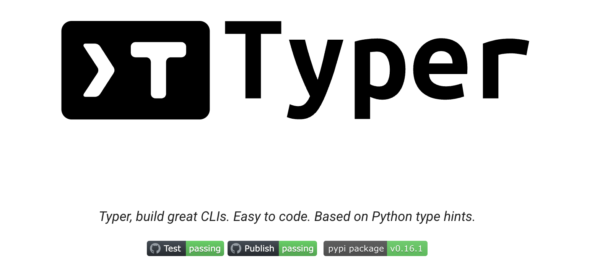
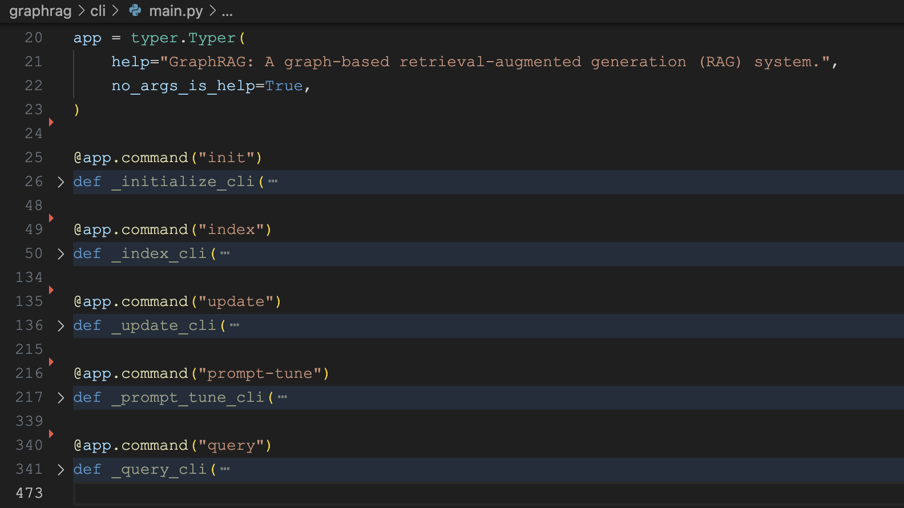
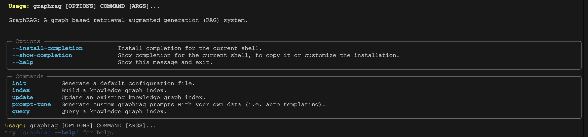

# 剖析 GraphRAG 的项目结构

经过这几天的动手实践和可视化体验，我们已经对 GraphRAG 的核心功能有了一个基本的了解。今天，我们正式开始深入研究它的源码，首先从熟悉项目结构入手，为我们后续学习其核心工作流（比如索引和查询）打下基础。

## 项目概览

使用 `tree` 命令查看 GraphRAG 项目的项目结构如下：

```
$ tree -L 1 graphrag
├── __init__.py
├── __main__.py     # 模块入口
├── api             # API 层
├── cache
├── callbacks
├── cli             # CLI 入口
├── config          # 配置管理
├── data_model      # 数据模型
├── index           # 索引系统
├── language_model  # 语言模型
├── logger
├── prompt_tune     # 提示词调优
├── prompts         # 提示词系统
├── query           # 查询系统
├── storage         # 存储抽象层
├── utils
└── vector_stores   # 向量数据库
```

其中基础模块包括：

* **API 层（`api`）**：这里提供了高层次的编程接口，是外部调用 GraphRAG 功能的主要入口，包括索引构建 API（`index.py`）、查询 API（`query.py`）和提示词调优 API（`prompt_tune.py`）三大块；
* **CLI 入口（`cli`）**：通过 Typer 装饰器定义命令，解析命令行参数并调用 API 层；
* **配置管理（`config`）**：使用 Pydantic 定义类型安全的配置模型，包括主配置、LLM 配置、向量配置、存储配置等；
* **数据模型（`data_model`）**：定义核心数据结构，包括实体、关系、社区、社区报告、文本单元、文档等；

从入口处可以看出 GraphRAG 有三大功能：索引构建、查询、提示词调优，分别位于下面这些模块中：

* **索引系统（`index`）**：这是 GraphRAG 的核心模块，负责从原始文档构建知识图谱，这里的内容也是最丰富的；比如 `input` 目录用于输入处理，支持 CSV、JSON、纯文本多种格式的文档；`workflows` 是 GraphRAG 的工作流引擎，定义了标准的数据处理工作流，使用工厂模式动态创建流水线，支持增量更新和全量重建；`operations` 目录实现了大量的工作流原子操作，包括文本处理、图谱构建、社区识别、总结分析等；下面是一些典型的工作流操作：
    - `chunk_text` - 文本分块，将长文档切分为可处理的片段；
    - `embed_text` - 文本向量化，支持多种嵌入模型；
    - `extract_graph` - 从文本提取实体和关系；
    - `build_noun_graph` - 构建名词图，识别重要概念；
    - `create_graph.py` - 创建完整的知识图谱；
    - `cluster_graph.py` - 图聚类，发现社区结构；
    - `embed_graph` - 图嵌入，支持 Node2Vec 等算法；
    - `layout_graph` - 图布局，支持 UMAP 降维可视化；
    - `summarize_communities` - 社区摘要生成；
    - `summarize_descriptions` - 实体描述摘要；
    - `extract_covariates` - 协变量提取（如声明检测）；
* **查询系统（`query`）**：为 GraphRAG 提供了多种检索策略，包括：
    * **全局搜索**：基于社区报告的高层次查询，适合回答概括性或主题性问题；使用 Map-Reduce 模式处理大规模数据；
    * **本地搜索**：基于实体和关系的细粒度查询，适合回答具体的事实性问题；混合向量检索和图遍历；
    * **漂移搜索**：基于动态选择社区查询，在查询过程中调整搜索范围，平衡查询深度和广度；
* **提示词系统（`prompts`）**：包括索引和查询所使用的所有提示词；
* **提示词调优（`prompt_tune`）**：根据具体数据领域自动生成最适合的提示词，提高知识图谱构建质量；

此外，为实现索引构建和查询，大模型和存储服务也是必不可少的：

* **语言模型抽象（`language_model`）**：提供统一的 LLM 和 Embedding 接口，主要通过 [fnllm](https://github.com/microsoft/essex-toolkit/tree/main/python/fnllm) 库实现；
* **存储抽象层（`storage`）**：提供统一的存储接口，支持多种后端，包括本地文件系统、Azure Blob、CosmosDB、内存存储等；
* **向量数据库（`vector_stores`）**：支持多种向量数据库，包括：高性能向量数据库 **LanceDB**、Azure 认知搜索服务 **Azure AI Search** 以及 Azure 的 NoSQL 数据库 **CosmosDB**；

## 技术栈分析

通过分析 `pyproject.toml` 文件，我们可以对 GraphRAG 的核心依赖和开发工作链有一个初步了解。

* 大语言模型
    - `fnllm[azure,openai]` - 统一的大语言模型接口库
    - `openai` - OpenAI 官方提供的 API 客户端
    - `tiktoken` - 一款高效的 BPE 分词库，能实现文本分词，并计算出文本对应的 token 数量
* 数据科学
    - `pandas` - 数据处理和分析
    - `numpy` - 数值计算
    - `networkx` - 图算法库，用于创建、操作和研究各种图结构，支持图的遍历、最短路径查找等多种图算法实现
    - `graspologic` - 图统计和机器学习，提供了图数据的统计分析方法和基于图的机器学习模型，助力从图结构数据中挖掘有价值的信息
    - `umap-learn` - 降维算法库，基于 UMAP 算法，能将高维数据映射到低维空间，同时保留数据的局部和全局结构，便于数据可视化和后续分析
* 向量存储
    - `lancedb` - 高性能的向量数据库，具备高效的向量存储和检索能力
    - `azure-search-documents` - Azure 搜索服务的客户端库
* 配置和 CLI
    - `pydantic` - 数据验证和配置管理，基于类型提示进行数据验证，能确保数据的完整性和正确性，同时便于配置信息的管理和解析
    - `typer` - 现代化的 CLI 框架，基于 Python 的类型提示构建，让开发者能快速、简洁地创建功能丰富的命令行工具
    - `pyyaml` - 用于处理 YAML 格式配置文件
* 代码质量
    - `ruff` - 现代化的 Python 代码检查和格式化工具
    - `pyright` - 由微软开发的 Python 类型检查器
* 测试框架
    - `pytest` - 测试框架
    - `pytest-asyncio` - 提供异步测试支持
    - `coverage` - 用于代码覆盖率分析
* 文档和发布
    - `mkdocs-material` - 现代化的文档站点生成工具，基于 MkDocs 构建
    - `semversioner` - 用于语义化版本管理的工具，帮助开发者规范地管理项目的版本号，记录版本变更信息，简化版本发布流程

## 命令行入口

GraphRAG 是一个命令行程序，正如我们在入门篇里所体验的，使用 `uv run poe init` 命令初始化工作空间：

```
$ uv run poe init --root ./ragtest
```

其中 `poe` 是 [Poe The Poet](https://poethepoet.natn.io/index.html) 的简称，它是一个任务管理工具，允许在 `pyproject.toml` 中定义和运行各种任务：

```
[project]
name = "graphrag"

[tool.poe.tasks]
...
index = "python -m graphrag index"
update = "python -m graphrag update"
init = "python -m graphrag init"
query = "python -m graphrag query"
prompt_tune = "python -m graphrag prompt-tune"
```

可以看出 `poe` 命令实际上是通过 `python -m` 执行的：

```
$ python -m graphrag init
```

包括 `init` 在内，GraphRAG 一共支持 5 个不同的子命令：

- `graphrag init` - 初始化项目配置
- `graphrag index` - 构建知识图谱索引  
- `graphrag query` - 执行查询操作
- `graphrag update` - 增量更新索引
- `graphrag prompt-tune` - 提示词调优

GraphRAG 采用了标准的 Python 包结构，`__main__.py` 文件是模块的入口：

```python
from graphrag.cli.main import app

app(prog_name="graphrag")
```

这个文件允许用户通过 `python -m graphrag` 直接运行包，为开发和测试提供便利。

另外，如果你是通过 `pip install` 安装的，还可以直接运行 `graphrag` 命令：

```
$ graphrag init --root ./ragtest
```

要实现这一点，其秘密在于 `pyproject.toml` 文件中的下面这行配置：

```
[project.scripts]
graphrag = "graphrag.cli.main:app"
```

这里的 `[project.scripts]` 用于定义脚本入口，当执行 `pip install` 后，会在 Python 环境的 `bin` 目录下生成一个可执行文件，我们不妨看下这个文件内容：

```python
# -*- coding: utf-8 -*-
import sys
from graphrag.cli.main import app
if __name__ == "__main__":
  if sys.argv[0].endswith("-script.pyw"):
    sys.argv[0] = sys.argv[0][:-11]
  elif sys.argv[0].endswith(".exe"):
    sys.argv[0] = sys.argv[0][:-4]
  sys.exit(app())
```

这个文件根据 `[project.scripts]` 定义，导入 `graphrag.cli.main` 包下的 `app` 方法并执行，因此我们可以直接运行 `graphrag` 命令。

## 命令行实现

GraphRAG 命令行是基于 [Typer](https://typer.tiangolo.com/) 库开发的，这是一个现代化的 Python CLI 库，基于类型提示构建命令行应用程序。



它的核心特点如下：

* **类型驱动**：基于 Python 类型提示自动生成 CLI 接口
* **易用性**：简洁的 API，最少的样板代码
* **自动化**：自动生成帮助文档、参数验证和错误处理
* **现代化**：支持 Python 3.6+ 的现代特性
* **高级功能**：子命令组织、回调函数、进度条、颜色输出、确认提示等

通过寥寥几行代码，我们就可以使用 `Typer` 开发一个命令行程序：

```python
import typer

app = typer.Typer()

@app.command()
def hello(name: str):
  print(f"Hello {name}")

if __name__ == "__main__":
  app()
```

再回到 GraphRAG 的代码，当我们执行 `python -m` 或 `graphrag` 命令时，实际上调用的是 `__main__.py` 或 `bin/graphrag` 文件，它们都是指向 `graphrag.cli.main` 包下的 `app` 方法：



从这里可以看到，GraphRAG 基于 `Typer` 实现了多个选项和子命令的功能：



我们以 `graphrag index` 为例看下命令的调用链：

1. **入口点**：`__main__.py` 或 `bin/graphrag` → `graphrag.cli.main:app`
2. **CLI 解析**：`cli/main.py` → `@app.command("index")` 装饰器
3. **配置加载**：`cli/index.py` → `index_cli()` 函数
4. **API 调用**：`api.build_index()` 函数

## 小结

至此，我们对 GraphRAG 的项目结构有了大致的了解，并对 `graphrag` 命令行的运行原理有了一定的认识。接下来，我们将顺着 `graphrag index` 的调用链，展开聊聊 GraphRAG 索引构建的具体逻辑。
