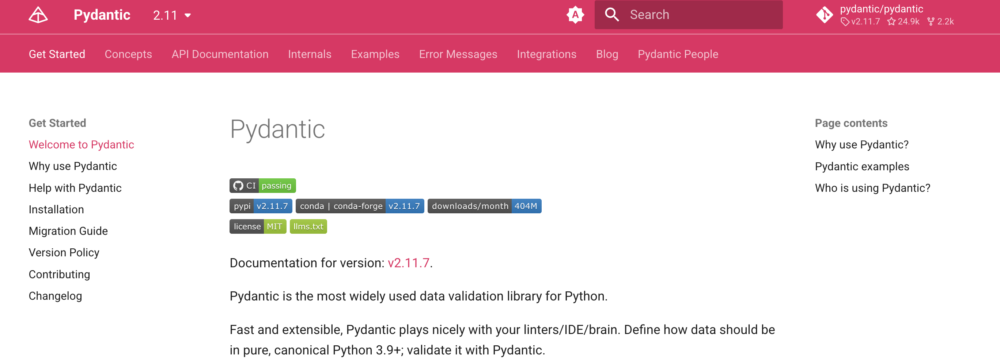
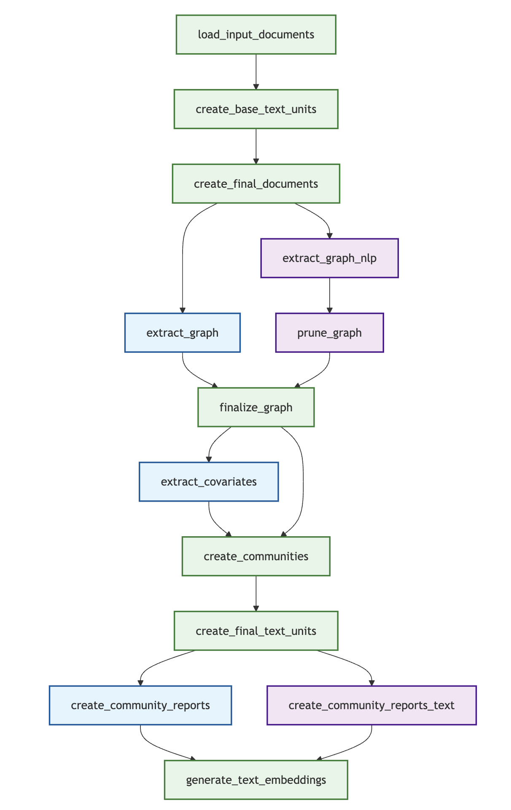

# GraphRAG 索引构建概述

经过前面对 GraphRAG 项目结构的深入了解，我们已经掌握了它的整体架构和技术栈。今天我们将顺着 `graphrag index` 命令的调用链，深入探索 GraphRAG 索引构建的核心流程，包括命令行入口、配置加载机制、工作流引擎，以及不同索引方法的实现细节。

## 命令行入口

当我们执行 `graphrag index` 命令时，整个调用过程如下：

1. **入口点**：`__main__.py` 或 `bin/graphrag` → `graphrag.cli.main:app`
2. **CLI 解析**：`cli/main.py` → `@app.command("index")` 装饰器
3. **配置加载**：`cli/index.py` → `index_cli()` 函数
4. **API 调用**：`api.build_index()` 函数

其中，前两步我们昨天已经学习过了：`__main__.py` 的作用是让 GraphRAG  能以包的方式运行，`pyproject.toml` 文件中的 `[project.scripts]` 配置让 GraphRAG 能以可执行文件的方式运行，运行的入口都是 `graphrag.cli.main` 包的 `app` 方法；该方法基于 [Typer](https://typer.tiangolo.com/) 这个现代化的 Python CLI 库实现，通过 `@app.command` 装饰器，定义了 GraphRAG 的 5 个子命令，`index` 就是其中之一。

跟随调用链，我们接着看一下 `cli/index.py` 文件中 `index_cli()` 函数的实现：

```python
def index_cli(root_dir: Path, method: IndexingMethod, ...):
  # 配置加载
  config = load_config(root_dir, config_filepath, cli_overrides)
  # 索引构建
  _run_index(config=config, method=method, ...)
```

这里我们可以看到两个关键步骤：

1. **配置加载**：调用 `load_config()` 函数加载并合并配置，支持通过命令行参数覆盖配置文件中的设置
2. **索引执行**：调用 `_run_index()` 执行实际的索引构建

## 配置加载

配置加载是 GraphRAG 的核心功能之一，位于 `config/load_config.py` 文件中，其实现如下：

```python
def load_config(
  root_dir: Path,
  config_filepath: Path | None = None,
  cli_overrides: dict[str, Any] | None = None,
) -> GraphRagConfig:
  # 路径规范化，确保使用绝对路径
  root = root_dir.resolve()
  # 在根目录中搜索配置文件
  config_path = _get_config_path(root, config_filepath)
  # 加载 .env 文件中的环境变量
  _load_dotenv(config_path)
  # 读取配置文件文本内容
  config_text = config_path.read_text(encoding="utf-8")
  # 解析环境变量引用
  config_text = _parse_env_variables(config_text)
  # 根据文件类型解析为字典（支持 YAML 和 JSON）
  config_extension = config_path.suffix
  config_data = _parse(config_extension, config_text)
  # 应用命令行参数覆盖
  if cli_overrides:
    _apply_overrides(config_data, cli_overrides)
  # 创建并验证最终配置对象
  return create_graphrag_config(config_data, root_dir=str(root))
```

这里的 `load_config()` 函数实现了一个完整的类型安全的配置管理流程，整体流程非常清晰：

1. **路径规范化**：通过 `root_dir.resolve()` 确保使用绝对路径，其中 `root_dir` 是用户通过 `--root` 或 `-r` 参数指定
2. **配置发现**：如果用户指定了 `--config` 或 `-c` 参数，则使用用户自定义配置；否则在根目录中搜索默认配置文件，比如 `settings.yaml`、`settings.yml` 或 `settings.json`
3. **环境变量加载**：加载 `.env` 文件中的环境变量
4. **配置读取**：读取配置文件文本内容
5. **环境变量替换**：解析配置文件中环境变量引用，比如 `${GRAPHRAG_API_KEY}` 等
6. **格式解析**：根据文件类型将配置解析为字典，支持 YAML 和 JSON 两种方式
7. **覆盖应用**：应用命令行参数覆盖，比如 `--output` 或 `-o` 参数会覆盖 `output.base_dir` 配置
8. **对象创建**：创建并验证最终的 `GraphRagConfig` 配置对象，使用 Pydantic 保证类型安全

这里有几个点比较有意思，可以展开介绍一下。

### 环境变量支持

GraphRAG 支持在配置文件中注入环境变量，这是使用 Python 的 `Template` 类实现的：

```python
def _parse_env_variables(text: str) -> str:
  return Template(text).substitute(os.environ)
```

用户可以在配置文件中使用 `${VAR_NAME}` 格式引用环境变量：

```yaml
models:
  default_chat_model:
    type: openai_chat
    api_base: ${GRAPHRAG_API_BASE}
    auth_type: api_key
    api_key: ${GRAPHRAG_API_KEY}
    model: gpt-4o-mini
```

### 点号分隔覆盖机制

配置覆盖支持点号分隔的嵌套路径，比如当用户设置 `--output` 或 `-o` 参数时，会覆盖下面三个配置：

```python
cli_overrides = {}
if output_dir:
  cli_overrides["output.base_dir"] = str(output_dir)
  cli_overrides["reporting.base_dir"] = str(output_dir)
  cli_overrides["update_index_output.base_dir"] = str(output_dir)
```

这种点号分隔的路径语法允许精确覆盖嵌套配置项，为用户提供了灵活的配置管理能力，这块的实现比较通用，有类似需求的话，可以参考下 `_apply_overrides()` 的函数实现。

### 使用 Pydantic 创建配置

在配置加载的最后，通过 `create_graphrag_config()` 函数创建最终的 `GraphRagConfig` 配置对象：

```python
def create_graphrag_config(
  values: dict[str, Any] | None = None,
  root_dir: str | None = None,
) -> GraphRagConfig:

  values = values or {}
  if root_dir:
    root_path = Path(root_dir).resolve()
    values["root_dir"] = str(root_path)
  return GraphRagConfig(**values)
```

这里使用了 Pydantic 库，其中 `GraphRagConfig` 类被定义为一个 Pydantic 模型，我们直接将 `values` 字典展开（两个星号 `**` 用于解包字典）变成一个类型安全的配置对象。Pydantic 不仅能保证类型安全，还支持自定义参数验证，我们下面重点介绍一下它。

## 简单介绍 Pydantic 库

GraphRAG 使用 [Pydantic](https://pydantic.dev/) 进行配置管理，这是一个基于类型提示的数据验证库。



它的核心优势包括：

- **类型安全**：基于 Python 类型提示自动验证数据类型
- **数据转换**：自动进行数据类型转换和标准化
- **验证规则**：支持复杂的验证逻辑和自定义验证器
- **错误报告**：提供详细的验证错误信息
- **IDE 支持**：完美的代码补全和类型检查支持

下面是一个简化的例子，展示如何使用 Pydantic 和 YAML 实现类似 GraphRAG 的配置管理。首先通过 Pydantic 定义配置类：

```python
from enum import Enum
from pydantic import BaseModel, Field, field_validator

class StorageType(str, Enum):
  """存储类型枚举"""
  FILE = "file"
  AZURE_BLOB = "azure_blob"
  S3 = "s3"

class DatabaseConfig(BaseModel):
  """数据库配置模型"""
  host: str = Field(default="localhost", description="数据库主机")
  port: int = Field(default=5432, description="数据库端口")
  username: str = Field(description="用户名")
  password: str = Field(description="密码")
  
  @field_validator("port")
  @classmethod
  def validate_port(cls, v):
    if not 1 <= v <= 65535:
      raise ValueError("端口必须在 1-65535 范围内")
    return v

class AppConfig(BaseModel):
  """主配置模型"""
  app_name: str = Field(default="MyApp", description="应用名称")
  debug: bool = Field(default=False, description="调试模式")
  storage_type: StorageType = Field(default=StorageType.FILE, description="存储类型")
  database: DatabaseConfig = Field(description="数据库配置")
  
  # 自定义验证器
  @field_validator("app_name")
  @classmethod
  def validate_app_name(cls, v):
    if not v.strip():
      raise ValueError("应用名称不能为空")
    return v.strip()
```

然后创建一个配置文件 `config.yaml` 内容如下：

```yaml
app_name: "Demo"
debug: true
storage_type: "file"
database:
  host: "localhost"
  port: 5432
  username: "admin"
  password: "secret"
```

接着我们就可以从 YAML 文件加载配置，并将其转换为强类型的配置对象：

```python
import yaml
from pathlib import Path

def load_config_from_yaml(yaml_path: Path) -> AppConfig:
  """从 YAML 文件加载配置"""
  with open(yaml_path, 'r', encoding='utf-8') as f:
    config_data = yaml.safe_load(f)
  # Pydantic 自动验证和转换
  return AppConfig(**config_data)

# 使用示例
config_file = Path("config.yaml")
config = load_config_from_yaml(config_file)
print(f"应用名称: {config.app_name}")
print(f"数据库配置: {config.database.host}:{config.database.port}")
```

运行结果如下：

```
应用名称: Demo
数据库配置: localhost:5432
```

这个例子展示了 Pydantic 的核心特性，包括类型声明、默认值、验证器和自动数据转换等。

## 工作流引擎

配置加载之后，GraphRAG 调用 `_run_index()` 执行实际的索引构建，而它则是调用 API 层的 `build_index()` 函数：

```python
async def build_index(
  config: GraphRagConfig,
  method: IndexingMethod | str = IndexingMethod.Standard,
  is_update_run: bool = False,
  ...
) -> list[PipelineRunResult]:
  
  outputs: list[PipelineRunResult] = []
  # 根据 method 创建对应的工作流管道
  method = _get_method(method, is_update_run)
  pipeline = PipelineFactory.create_pipeline(config, method)
  # 依次运行管道中的每个工作流
  async for output in run_pipeline(pipeline, config, is_update_run=is_update_run, additional_context=additional_context):
    outputs.append(output)
    logger.info("Workflow %s completed successfully", output.workflow)
  return outputs
```

GraphRAG 的索引构建采用了灵活的管道架构，其中 `PipelineFactory` 采用工厂设计模式，负责管理和创建处理工作流和管道：

```python
class PipelineFactory:
  """工作流管道工厂类"""
  
  workflows: ClassVar[dict[str, WorkflowFunction]] = {}
  pipelines: ClassVar[dict[str, list[str]]] = {}
  
  @classmethod
  def register(cls, name: str, workflow: WorkflowFunction):
    """注册自定义工作流函数"""
    cls.workflows[name] = workflow

  @classmethod
  def register_all(cls, workflows: dict[str, WorkflowFunction]):
    """批量注册自定义工作流函数"""
    for name, workflow in workflows.items():
      cls.register(name, workflow)
  
  @classmethod
  def register_pipeline(cls, name: str, workflows: list[str]):
    """注册自定义管道，一个管道包含多个工作流函数"""
    cls.pipelines[name] = workflows

  @classmethod
  def create_pipeline(cls, config: GraphRagConfig, method: IndexingMethod) -> Pipeline:
    """根据 method 创建管道"""
    workflows = config.workflows or cls.pipelines.get(method, [])
    return Pipeline([(name, cls.workflows[name]) for name in workflows])
```

这里涉及 GraphRAG 中的两个核心概念：**工作流（Workflow）** 和 **管道（Pipeline）**。工作流是一个个独立的模块，比如加载文档、文本分片、提取图谱等等，程序启动时会自动注册所有内置的工作流函数：

```python
PipelineFactory.register_all({
  "load_input_documents": run_load_input_documents,
  "create_base_text_units": run_create_base_text_units,
  "extract_graph": run_extract_graph,
  "create_communities": run_create_communities,
  # ...
})
```

而管道则是由多个工作流串起来的一个集合，系统预定义了四个管道：

```python
PipelineFactory.register_pipeline(
  IndexingMethod.Standard, ["load_input_documents", *_standard_workflows]
)
PipelineFactory.register_pipeline(
  IndexingMethod.Fast, ["load_input_documents", *_fast_workflows]
)
PipelineFactory.register_pipeline(
  IndexingMethod.StandardUpdate, ["load_update_documents", *_standard_workflows, *_update_workflows],
)
PipelineFactory.register_pipeline(
  IndexingMethod.FastUpdate, ["load_update_documents", *_fast_workflows, *_update_workflows],
)
```

分别对应四种不同的构建索引的方法，当我们执行 `graphrag index` 命令时，可以通过 `--method` 或 `-m` 参数指定：

```
# 标准方法
$ graphrag index --root ./ragtest --method standard

# 快速方法
$ graphrag index --root ./ragtest --method fast

# 标准方法（用于更新）
$ graphrag index --root ./ragtest --method standard-update

# 快速方法（用于更新）
$ graphrag index --root ./ragtest --method fast-update
```

GraphRAG 通过 `create_pipeline()` 方法，根据 `method` 找到对应的管道，然后依次运行管道中的每个工作流函数。

## 索引构建方法

上面提到 GraphRAG 内置了四种索引构建方法，每种都有其特定的适用场景：

| 索引方法 | 速度 | 质量 | 适用场景 | 主要特点 |
|---------|------|------|----------|----------|
| **Standard** | 慢 | 高 | 首次索引，追求高质量 | 全 LLM 驱动的图构建 |
| **Fast** | 快 | 中 | 快速原型，大数据集 | NLP + LLM 混合方式 |
| **StandardUpdate** | 中 | 高 | 增量更新，保持高质量 | 标准方法 + 增量更新 |
| **FastUpdate** | 快 | 中 | 频繁更新，快速处理 | 快速方法 + 增量更新 |

其中后两个 Update 方法是在前两个方法的基础上增加了增量更新的能力，能够在不重新构建整个索引的情况下，处理新增或修改的文档，大大提高了增量处理的效率。我们这里主要关注 `Standard` 和 `Fast` 这两个方法，它们的主要差异点在于：

* Standard 方法的 LLM 驱动流程
    - `extract_graph`：使用大语言模型从文本中提取实体和关系
    - `extract_covariates`：使用 LLM 提取声明和协变量信息
    - `create_community_reports`：基于图上下文生成高质量社区报告
* Fast 方法的混合流程
    - `extract_graph_nlp`：使用传统 NLP 技术（如 spaCy）进行实体识别
    - `prune_graph`：对提取的实体进行过滤和清理
    - `create_community_reports_text`：基于文本单元上下文生成报告（更快但质量稍低）

下图展示了两种方法的工作流执行顺序：



蓝色为 Standard 方法使用的工作流，红色为 Fast 方法使用的工作流，绿色为二者共用的工作流。

## 小结

我们今天学习了当执行 `graphrag index` 命令时的整个调用过程，主要内容包括：

1. **命令行入口**：详细分析了从 `graphrag index` 命令到核心逻辑的完整调用链；
2. **配置加载**：深入解读了 `load_config()` 函数的实现，包括环境变量支持和点号分隔覆盖机制；
3. **Pydantic 介绍**：通过一个简单的示例演示如何使用 Pydantic 和 YAML 实现类似 GraphRAG 的配置管理；
4. **工作流引擎**：学习 `PipelineFactory` 的设计模式和工作流注册机制；
5. **索引构建方法**：对比了四种不同的索引构建方法及其适用场景，通过 Mermaid 图表展示了索引构建的完整处理流程；

在下一篇文章中，我们将深入索引构建的具体流程，先从文档处理阶段开始，详细分析 GraphRAG 如何从各种格式的原始文档中提取和预处理文本数据，为后续的知识提取做好准备。
